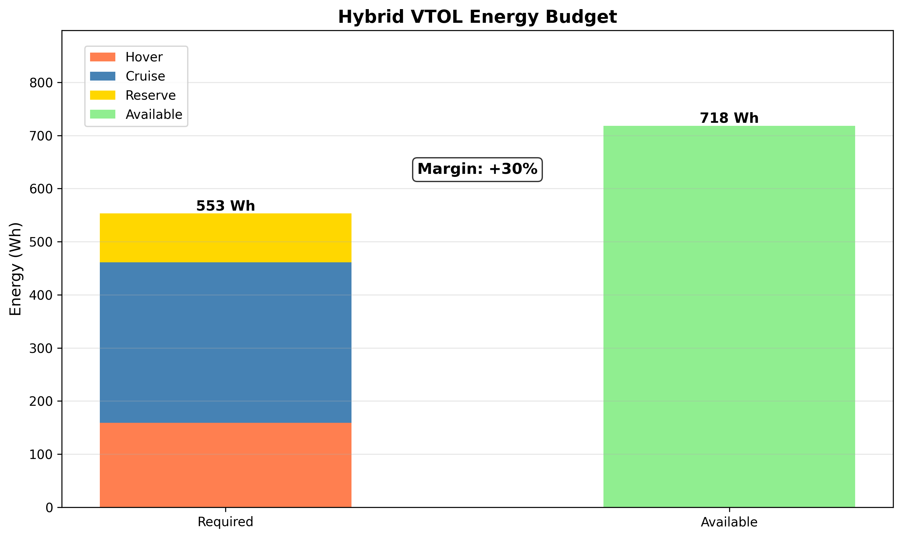
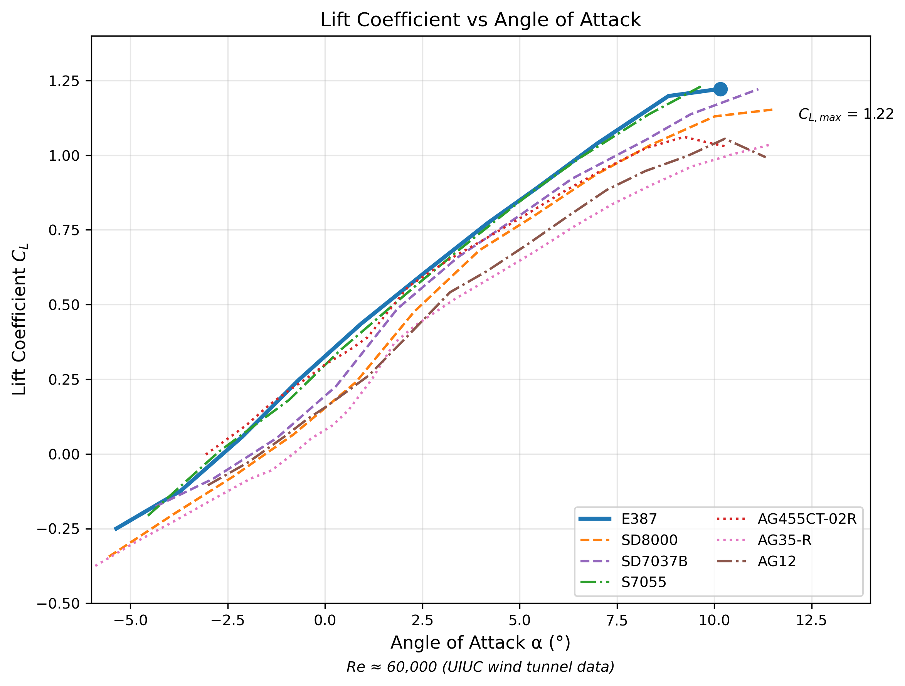

::: {custom-style="Abstract Title"}
Executive summary
:::

::: {custom-style="Abstract"}
This study evaluates the feasibility of deploying an unmanned aerial vehicle (UAV) from a crewed habitat on Mars to extend exploration range beyond surface mobility limits. The design employs a QuadPlane hybrid architecture combining vertical take-off and landing (VTOL) capability with efficient fixed-wing cruise. A battery-only configuration with a target MTOW of 10 kg is selected, prioritizing simplicity and reliability for the challenging Mars environment. Operating from Arcadia Planitia at −3 km elevation, the low atmospheric density (0.0196 kg/m³) necessitates large wing areas and high-efficiency propulsion, resulting in Reynolds numbers of 50,000–90,000 where airfoil selection becomes critical. The SD8000 airfoil is selected for its consistent low-drag characteristics and robust stall margin at these conditions. The final design achieves 90 min endurance with 49% margin, a 4.01 m wingspan, and 2.69 m² wing area. Preliminary sizing indicates the design is technically feasible with current or near-term technology.
:::

# Introduction {#sec:introduction}

This study evaluates the feasibility of a UAV designed to support the operations of a crewed outpost on Mars, providing aerial reconnaissance, geological survey, and communication relay capabilities.

Atmospheric flight on Mars presents distinct challenges compared to terrestrial aviation. The Martian atmosphere has approximately 1% of Earth's sea-level density, requiring large wing and rotor surfaces, higher flight speeds, or a combination of both to generate sufficient aerodynamic forces. Mars gravity (3.711 m/s²), at 38% of Earth's value, reduces the lift required to sustain flight and partially offsets this density penalty. The absence of atmospheric oxygen precludes combustion-based propulsion; electric motors driving rotors or propellers provide the only practical means of powered flight. The lack of prepared runways at exploration sites necessitates vertical take-off and landing (VTOL) capability. Dust storms and local wind shear require a flight control system with sufficient bandwidth and authority to reject atmospheric disturbances. Fine Martian regolith accumulates on exposed surfaces and degrades mechanical and optical components, requiring protected storage and active cleaning systems such as compressed air jets in a hangar airlock. Finally, the thin atmosphere and absence of a global magnetic field expose the surface to elevated solar and galactic cosmic radiation, demanding radiation-tolerant electronics or appropriate shielding.

The successful flights of NASA's Ingenuity helicopter demonstrated that powered flight on Mars is achievable [@tzanetosIngenuityMarsHelicopter2022]<!-- #abs -->. However, Ingenuity's rotorcraft architecture limits range and endurance. For exploration missions requiring coverage of tens to hundreds of kilometers, fixed-wing aircraft offer higher aerodynamic efficiency. This study examines hybrid VTOL configurations that combine the operational flexibility of rotorcraft with the cruise efficiency of fixed-wing aircraft.

# Design methodology

This section presents the methodological framework for the Mars UAV feasibility study. The approach combines iterative sizing with constraint-based analysis to systematically explore the design space and identify feasible configurations.

## Iterative sizing approach {#sec:iterative-sizing}

The development of this Mars UAV follows an iterative sizing methodology that balances theoretical analysis with practical component constraints. Unlike conventional terrestrial aircraft design, where mature scaling laws and extensive databases exist, Mars aircraft design requires careful integration of limited flight heritage with scaled analysis from reference cases.

The design process proceeds through four distinct phases, with feedback loops enabling refinement at each stage:

1. **Initial hypotheses**: reference VTOL UAV data from commercial platforms and Mars concept designs (@sec:reference-data) provides empirical grounding for initial parameter estimates. Key parameters extracted from the reference designs include weight fractions (propulsion, energy, payload, and, by subtraction, structure and other subsystems), disk loading for VTOL operations, and power-to-weight ratios. These Earth-based values are then scaled for Mars conditions, accounting for the reduced gravity (38% of Earth) and thin atmosphere (approximately 1% of Earth sea-level density).
2. **Preliminary sizing**: with initial hypotheses established, the constraint-based sizing methodology generates a preliminary design point. The matching chart determines the combination of wing loading and power loading that satisfies all flight conditions (hover, cruise, climb, and stall). From this design point, preliminary values for wing area, span, motor power, and mass breakdown are calculated.
3. **Component selection**: the preliminary sizing results guide the selection of actual components from manufacturer datasheets. This phase confronts the idealized sizing model with real-world constraints, as motors are available only in discrete sizes, batteries have specific energy densities, voltage characteristics, and temperature limitations, and propellers must match available motor configurations.
4. **Verification**: the selected components provide updated mass, power, and efficiency values that differ from preliminary estimates. The design is recalculated with these actual values, and compliance with mission requirements is verified. If requirements are not met, the process returns to phase 2 with refined hypotheses.

@fig:sizing-loop illustrates the iterative nature of this process. Each iteration narrows the design space as component-level constraints emerge and requirements are progressively satisfied.

{#fig:sizing-loop}

### Current study scope

This feasibility study represents the **first iteration** of the described four-phase cycle. Phases 1 (initial hypotheses) and 2 (preliminary sizing) are complete: reference data analysis establishes initial parameters (@sec:reference-data), constraint-based sizing determines the design point (@sec:constraint-analysis), and configuration trade-offs identify the hybrid VTOL as the selected architecture (@sec:architecture-selection). Phases 3 (component selection) and 4 (verification) are partially addressed through representative commercial components and analytical verification against mission requirements.

The numerical results presented in @sec:constraint-analysis are evaluated at a **fixed baseline MTOW of 10.00 kg**, derived from mass fraction analysis (@sec:initial-mass-estimate). This baseline case approach enables direct comparison of configuration performance under identical mass and energy constraints. A closed-loop sizing iteration—where MTOW is adjusted to exactly satisfy mission requirements—is deferred to subsequent design phases.

Aspects not modelled in this first iteration include detailed packaging and volume constraints, thermal margin analysis under operational cycles, stability and control verification, and manufacturing and assembly considerations. These are reserved for subsequent iterations as the design matures toward detailed design.

## Role of constraint-based sizing {#sec:constraint-role}

The matching chart, or constraint diagram, forms the analytical core of the sizing methodology. This graphical tool, adapted from power-based aircraft sizing methods, visualises the constraints that bound the feasible design space.

### Configuration-specific constraint spaces

Different aircraft configurations require different constraint diagram formulations, reflecting their distinct performance drivers:

* **Rotorcraft configurations** use a constraint diagram with power loading (P/W) on the vertical axis and **disk loading** (DL = T/A) on the horizontal axis. Since rotorcraft have no wing, wing loading is not a meaningful parameter. The hover power constraint dominates, with power loading increasing monotonically with disk loading according to actuator disk theory.

* **Fixed-wing configurations** use power loading (P/W) versus **wing loading** (W/S) axes. The stall constraint appears as a vertical line limiting maximum wing loading, while the cruise constraint appears as a curve with minimum power at optimal wing loading. No hover constraint exists since fixed-wing aircraft cannot hover.

* **Hybrid VTOL configurations** (QuadPlane) combine elements of both: wing loading applies to the cruise phase while disk loading applies to the hover phase. The constraint diagram uses P/W versus W/S axes, with the hover constraint appearing as a horizontal line (independent of wing loading) and the cruise and stall constraints as for fixed-wing.

This configuration-specific approach ensures that each architecture is evaluated in its natural constraint space, enabling meaningful comparison of feasibility margins.

### Hybrid VTOL constraints

For a hybrid VTOL aircraft, which emerges as the most suitable configuration from the trade-off analysis (@sec:architecture-selection), the relevant constraints include:

* Hover constraint: sets minimum power loading based on disk loading and atmospheric density. The thin Mars atmosphere (approximately 0.020 kg/m³ at Arcadia Planitia) demands higher power loading than equivalent Earth operations.
* Cruise constraint: derived from the drag polar, this constraint determines the power required for steady-level flight at the design cruise speed.
* Climb constraint: ensures sufficient excess power for the required rate of climb.
* Stall constraint: sets the maximum wing loading based on the airfoil's maximum lift coefficient at the operating Reynolds number.

The design point is selected within the feasible region bounded by these constraints. For QuadPlane configurations, the hover and cruise constraints are largely decoupled: the lift rotors are sized to satisfy the hover constraint, while the wing and cruise motor are sized to satisfy the cruise and stall constraints. This decoupling simplifies the design space exploration but requires verification that the combined system remains within the MTOW target.

The derived requirements summarized in @tbl:derived-requirements define the starting point for the matching chart analysis. The target MTOW of 10 kg, derived from mass fraction analysis and payload requirements, establishes the weight for constraint evaluation. The assumed battery fraction (35%), specific energy (270 Wh/kg), and propulsion efficiencies feed into the power and endurance calculations. Running the matching chart with these inputs yields the preliminary design point: the specific combination of wing loading and power loading that maximizes endurance while satisfying all constraints. This design point then determines the wing area, span, and motor power requirements that drive component selection.

The iterative nature of this process acknowledges that initial hypotheses are necessarily approximate. As component selection reveals actual masses and efficiencies, the design point may shift. The methodology ensures that such shifts are systematically tracked and that the final design remains traceable to its analytical foundations.

# Mission analysis

This section defines the mission context, including the operational environment at Arcadia Planitia, the flight profile required to achieve mission objectives, and the user needs driving the design.

## Operational environment {#sec:operational-environment}

Arcadia Planitia is selected as the reference operating location. This region offers several advantages for early Mars exploration: its low elevation (−3 km relative to datum) provides higher atmospheric density, the relatively flat terrain is suitable for habitat construction, subsurface water ice deposits present scientific interest, and the moderate latitude (47°11'24"N) balances solar illumination with ice stability.

Mars atmospheric flight occurs under conditions different from Earth [@desertAerodynamicDesignMartian2017]<!-- #s:mars-atmosphere -->. The thin CO₂ atmosphere exhibits surface pressures around 610 Pa mean, with significant variation depending on elevation and season. Surface temperatures average around 210 K with substantial diurnal swings. At the low elevations favorable for flight, atmospheric density remains approximately two orders of magnitude lower than Earth sea level, resulting in low Reynolds number aerodynamics and reduced lift generation. 

![The area of Arcadia Planitia in the Mars geographical context [@esaArcadiaPlanitiaContext2025]<!-- #fig:arcadia -->.](figures/Arcadia_Planitia_in_context_pillars.png){#fig:arcadia-context width=50%}

### Mars atmosphere equations

The Mars atmosphere is modeled using the barometric formula with a composition of 95.3% CO₂ [@nasaMarsAtmosphereModel2021]<!-- #s:composition -->. The following equations describe atmospheric properties as functions of geometric altitude $h$ (in meters above the reference datum):

$$T(h) = T_0 - L \cdot h$$ {#eq:temperature}

where $T_0$ = 210 K is the reference temperature and $L$ = 0.00222 K/m is the lapse rate.

$$p(h) = p_0 \left(\frac{T(h)}{T_0}\right)^{g/(R_{CO2} \cdot L)}$$ {#eq:pressure}

where $p_0$ = 610 Pa is the mean surface pressure, $g$ = 3.711 m/s² is Mars surface gravity, and $R_{CO_2}$ = 188.92 J/(kg·K) is the specific gas constant for CO₂.

The density follows from the ideal gas law:

$$ρ(h) = \frac{p(h)}{R_{CO_2} \cdot T(h)}$$ {#eq:density}

The speed of sound is:

$$a(h) = \sqrt{γ \cdot R_{CO_2} \cdot T(h)}$$ {#eq:speed-of-sound}

where γ = 1.29 for CO₂.

Dynamic viscosity $\mu$ is approximated using Sutherland's law:

$$\mu(h) = \mu_\text{ref} \left(\frac{T(h)}{T_\text{ref}}\right)^{1.5} \frac{T_\text{ref} + S}{T(h) + S}$$ {#eq:dynamic-viscosity}

where $\mu_\text{ref}$ = 1.48 × 10⁻⁵ Pa·s is the reference dynamic viscosity at $T_\text{ref}$ = 293 K, and $S$ = 222 K is the Sutherland constant for CO₂. Kinematic viscosity $\nu$ is then obtained from:

$$\nu(h) = \frac{\mu(h)}{\rho(h)}$$ {#eq:kinematic-viscosity}

### Arcadia Planitia conditions

At the operating altitude of 50 m above Arcadia Planitia (−3 km datum elevation, so −2.95 km absolute):

: Atmospheric conditions at Arcadia Planitia, 50 m AGL {#tbl:atmosphere}

| Property | Symbol | Value | Units |
|:---------|:------:|------:|:------|
| Temperature | $T$ | 216.6 | K |
| Pressure | $p$ | 800.5 | Pa |
| Density | $\rho$ | 0.01960 | kg/m³ |
| Speed of sound | $a$ | 229.7 | m/s |
| Dynamic viscosity | $\mu$ | 1.080 × 10⁻⁵ | Pa·s |
| Kinematic viscosity | $\nu$ | 5.170 × 10⁻⁴ | m²/s |

## Mission profile {#sec:mission-profile}

The mission radius is defined as the maximum distance the UAV can travel outbound while retaining sufficient energy to return with 20% reserve. This accounts for navigation errors, wind effects, and contingency maneuvers.

A reference mission profile is designed consisting of seven phases. The UAV performs a vertical take-off using lift rotors to ascend to cruise altitude, then transitions to fixed-wing flight by accelerating until the wings generate sufficient lift. During cruise outbound, the aircraft flies in fixed-wing mode to the target area at cruise speed. Upon arrival, the vehicle enters a loiter or survey phase with payload systems active for area coverage. The cruise return phase mirrors the outbound leg, with fixed-wing flight back to the habitat. Finally, the aircraft decelerates and transitions back to vertical flight mode before completing a vertical landing on the designated pad.

## User needs {#sec:user-needs}

This section identifies the stakeholder needs that drive the Mars UAV design. User needs express what capabilities are required without specifying numerical values; the quantitative requirements derived from these needs are documented in @sec:derived-requirements. The needs are organized into three categories: mission capability needs define the functional objectives the UAV must achieve, operational safety needs address reliability and robustness during flight operations, and environmental compatibility needs ensure the system can function within Mars-specific physical constraints.

@Tbl:user-needs-summary provides a consolidated view of all user needs organized by category.

: Summary of user needs {#tbl:user-needs-summary}

| ID  | Category                  | Need                         |
|-----|---------------------------|------------------------------|
| N1  | Mission capability        | Extended operational range   |
| N2  | Mission capability        | Aerial imaging               |
| N3  | Mission capability        | Communication relay          |
| N4  | Mission capability        | Vertical takeoff and landing |
| N5  | Mission capability        | Extended endurance           |
| N6  | Operational safety        | Single-fault tolerance       |
| N7  | Operational safety        | Wind tolerance               |
| N8  | Operational safety        | Dust ingress protection      |
| N9  | Environmental compatibility | Electric propulsion        |
| N10 | Environmental compatibility | Radiation tolerance        |
| N11 | Environmental compatibility | Thermal compatibility      |

### Mission capability needs

Mission capability needs define what the UAV must accomplish to fulfill its scientific and operational objectives. These needs establish the core functionality required for reconnaissance, survey, and communication relay missions.

* N1. Extended operational range: the UAV shall provide aerial survey capability beyond the practical range of surface rovers. Current Mars rovers have traversed less than 50 km over multi-year missions, limiting the accessible area around landing sites. An airborne platform can survey larger areas in less time, enabling reconnaissance of sites that would otherwise require years of rover travel or remain inaccessible.
* N2. Aerial imaging: the UAV shall carry a camera system capable of acquiring geological survey imagery. This supports the primary mission objective of mapping terrain, identifying scientifically interesting sites, and providing context for surface operations.
* N3. Communication relay: the UAV shall carry a radio system capable of extending communication range for EVA (extra-vehicular activity) operations. Surface radio communications are limited by line-of-sight constraints and terrain shadowing; an airborne relay station can extend the safe operational range of crewed surface activities.
* N4. Vertical takeoff and landing: the UAV shall be capable of operating without prepared runways or landing strips. The Mars surface offers no infrastructure for conventional aircraft operations; all takeoffs and landings must occur from unprepared terrain near the habitat.
* N5. Extended endurance: the UAV shall provide sufficient flight time to complete an out-and-back mission with survey time at the target location. Brief flights, as demonstrated by Ingenuity, are insufficient for the envisioned reconnaissance and relay missions. The endurance must accommodate transit, survey operations, and return with appropriate margins.

### Operational safety needs

Operational safety needs address the reliability and robustness requirements that ensure mission success despite the hostile operating environment and the impossibility of in-flight intervention.

* N6. Single-fault tolerance: the UAV shall maintain safe operation following any single system failure. In-flight repair is not possible, and maintenance opportunities are limited. The design must accommodate component failures without catastrophic loss of the vehicle.
* N7. Wind tolerance: the UAV shall operate safely in typical Martian wind conditions. Mars experiences regular afternoon wind peaks that the vehicle must withstand without loss of control or structural damage.
* N8. Dust ingress protection: the UAV shall be protected against Martian dust. The fine regolith (particle sizes 1-100 μm) can degrade mechanical bearings, contaminate optical surfaces, and reduce thermal management effectiveness. Dust protection is necessary for reliable operation over the mission lifetime.

### Environmental compatibility needs

Environmental compatibility needs derive from the fundamental physical constraints of Mars, including its atmospheric composition, radiation environment, and thermal conditions. These needs cannot be traded against performance; non-compliance results in system failure.

* N9. Electric propulsion: the UAV shall use electric propulsion systems. The Martian atmosphere lacks oxygen for combustion, precluding conventional internal combustion engines. Battery-electric or solar-electric systems are the only practical options.
* N10. Radiation tolerance: the UAV electronics and materials shall withstand the Mars surface radiation environment. The combination of galactic cosmic radiation and solar particle events creates a radiation environment that commercial electronics must tolerate over the mission duration.
* N11. Thermal compatibility: the UAV shall operate within the Mars thermal environment. Diurnal temperature swings and low ambient temperatures (-80°C to +20°C) impose constraints on materials, mechanisms, and especially battery performance.

# Reference data and trade-off analysis {#sec:reference-data}

This section collects reference data from existing Mars UAV concepts, commercial VTOL platforms, and subsystem characterization studies. The data informs architecture trade-offs and provides the empirical basis for initial mass estimates and derived requirements.

## Payload systems {#sec:payload-systems}

The Mars UAV mission objectives, mapping and telecommunication relay, require payload systems capable of operating in the Martian environment while meeting stringent mass and power constraints. This section surveys existing camera systems suitable for aerial reconnaissance to establish realistic mass ranges and inform payload allocation in the initial weight estimate.

### Camera systems survey {#sec:camera-survey}

Camera payload selection involves trade-offs among resolution, sensor size, mass, and environmental tolerance. @Tbl:camera-survey summarizes specifications for representative systems across three categories: RGB mapping cameras, multispectral sensors, and thermal imagers.

: Camera systems specifications from manufacturer datasheets {#tbl:camera-survey}

| Model | Type | Sensor | Resolution | Mass (g) | Temp. range (°C) | Source |
|-------|------|--------|------------|----------|------------------|--------|
| DJI Zenmuse P1 | RGB | Full frame | 45 MP | 800-1350 | −20 to +50 | [@djiDJIZenmuseP12024]<!-- #specs --> |
| Ricoh GR III | RGB | APS-C | 24 MP | 227-257 | N.A. | [@ricohimagingRicohGRIII2024]<!-- #specs --> |
| Phase One iXM-100 | RGB | Medium format | 100 MP | 630-1170 | −10 to +40 | [@phaseonePhaseOneIXM1002024]<!-- #specs --> |
| MicaSense RedEdge-MX | Multispectral | Custom (5 bands) | 1.2 MP/band | 232 | N.A. | [@micasenseMicaSenseRedEdgeMXIntegration2020]<!-- #specs --> |
| DJI Zenmuse H20T | Thermal + RGB | Multiple | 640×512 (thermal) | 828 | −20 to +50 | [@djiDJIZenmuseH20T2024]<!-- #specs --> |

Mass values represent body-only to complete system configurations. The DJI Zenmuse P1 ranges from 800 g (body) to 1350 g with the DL 35mm lens [@djiDJIZenmuseP12024]<!-- #specs -->. The Ricoh GR III achieves 257 g including battery and storage [@ricohimagingRicohGRIII2024]<!-- #specs -->. The Phase One iXM-100 body weighs 630 g, increasing to 1170 g with the RSM 35mm lens [@phaseonePhaseOneIXM1002024]<!-- #specs -->.

#### RGB mapping cameras

Full-frame sensors provide superior image quality for photogrammetry applications. The DJI Zenmuse P1 offers 45 MP resolution with 4.4 μm pixel pitch, achieving ground sample distance of 0.76 cm at 100 m altitude with the 35mm lens [@djiDJIZenmuseP12024]<!-- #specs -->. Power consumption is approximately 20 W. The operating temperature range of −20 to +50 °C covers the warmer portion of Mars surface conditions.

Compact cameras offer mass advantages. The Ricoh GR III provides 24 MP APS-C imaging in a 227 g body with integrated 18.3 mm lens [@ricohimagingRicohGRIII2024]<!-- #specs -->. However, the manufacturer does not specify operating temperature limits, indicating consumer-grade thermal tolerance inadequate for Mars conditions without thermal management.

The Phase One iXM-100 represents the high end of aerial mapping systems with 100 MP medium format (44×33 mm) sensor [@phaseonePhaseOneIXM1002024]<!-- #specs -->. At 16 W maximum power consumption and 630 g body mass, it achieves 3.76 μm pixel pitch. The IP53 rating provides dust protection relevant to Mars operations, though the −10 to +40 °C operating range requires thermal control.

#### Multispectral cameras

The MicaSense RedEdge-MX provides five-band multispectral imaging (blue, green, red, red-edge, near-infrared) for scientific analysis [@micasenseMicaSenseRedEdgeMXIntegration2020]<!-- #specs -->. At 232 g complete with the DLS 2 light sensor, it represents a lightweight option for geological survey applications. Each band provides 1.2 MP (1280×960 pixels) with global shutter and 12-bit output depth. Ground sample distance is 8 cm/pixel at 120 m altitude.

#### Thermal cameras

The DJI Zenmuse H20T integrates thermal, zoom, and wide-angle cameras with laser rangefinder in a single 828 g payload [@djiDJIZenmuseH20T2024]<!-- #specs -->. The uncooled VOx microbolometer provides 640×512 thermal resolution with 50 mK noise-equivalent temperature difference. Temperature measurement ranges from −40 to +150 °C (high gain) or −40 to +550 °C (low gain), suitable for geological thermal mapping.

#### Mass and dimension summary

Based on the surveyed systems, camera payload characteristics are as follows. RGB cameras range from 227 g (body only, Ricoh GR III) to 1350 g (with lens, DJI Zenmuse P1). Multispectral sensors such as the MicaSense RedEdge-MX weigh approximately 232 g. Thermal/hybrid systems like the DJI Zenmuse H20T weigh approximately 828 g.

Camera dimensions vary with sensor format and lens configuration. The Ricoh GR III measures 109.4 × 61.9 × 33.2 mm (body only) [@ricohimagingRicohGRIII2024]<!-- #specs -->. The DJI Zenmuse P1 measures 198 × 166 × 129 mm [@djiDJIZenmuseP12024]<!-- #specs -->. The MicaSense RedEdge-MX measures 87 × 59 × 45.4 mm [@micasenseMicaSenseRedEdgeMXIntegration2020]<!-- #specs -->.

For initial sizing purposes, a compact RGB camera (250–400 g) represents the baseline payload allocation.

#### Mars thermal environment considerations

All surveyed cameras require thermal management for Mars operations. Mars surface temperatures range from approximately −60 to +20 °C, exceeding the lower operating limits of most commercial cameras. The DJI and Phase One systems with specified cold-weather ratings (−20 °C and −10 °C respectively) provide the best baseline thermal tolerance, though supplementary heating systems will be necessary during cold conditions. Cameras without specified temperature ranges require qualification testing or are assumed to need active thermal control.

Additional considerations for Mars camera systems include low atmospheric pressure (approximately 600 Pa) affecting thermal dissipation and requiring qualification testing, unknown radiation environment tolerance for commercial off-the-shelf components, and power budgets that must account for camera thermal control heating in addition to camera operation.

### Radio relay systems {#sec:radio-survey}

The telecommunication relay mission requires a radio system capable of extending communication range between surface EVA astronauts and the habitat ground station. For Mars operations, the specific frequency bands would differ from Earth usage due to regulatory and propagation differences, but mass and power specifications from commercial systems remain valid for feasibility estimation. This section surveys existing radio systems suitable for UAV relay applications across two categories: mesh radio systems and point-to-point data links.

#### Mesh radio systems

Mesh radios provide self-forming, self-healing network capability, though this functionality is not strictly required for a single UAV relay mission. @Tbl:radio-mesh summarizes specifications for representative mesh radio systems.

: Mesh radio system specifications from manufacturer datasheets {#tbl:radio-mesh}

| Model | Manufacturer | Mass (g) | Freq. range | Power (W) | Temp. range (°C) | Source |
|-------|--------------|----------|-------------|-----------|------------------|--------|
| StreamCaster 4200E+ | Silvus Technologies | 425 | 300 MHz-6 GHz | 5-48 | −40 to +85 | [@silvustechnologiesStreamCaster4200SC42002025]<!-- #specs --> |
| MPU5 | Persistent Systems | 391-726 | Multiple bands | N.A. | −40 to +85 | [@persistentsystemsMPU5TechnicalSpecifications2025]<!-- #specs --> |
| BreadCrumb ES1 | Rajant Corporation | 455 | 2.4/5 GHz | 2.8-15 | −40 to +60 | [@rajantcorporationBreadCrumbES1Specifications2025]<!-- #specs --> |

The Silvus StreamCaster 4200E+ provides wideband 2×2 MIMO mesh capability in a 425 g package with IP68 rating and submersibility to 20 m [@silvustechnologiesStreamCaster4200SC42002025]<!-- #specs -->. Power consumption ranges from 5 W at 1 W transmit power to 48 W at maximum 10 W transmit. The −40 to +85 °C operating temperature range exceeds Mars surface requirements.

The Persistent Systems MPU5 integrates a 1 GHz quad-core processor with 2 GB RAM for autonomous network management [@persistentsystemsMPU5TechnicalSpecifications2025]<!-- #specs -->. At 391 g (chassis only) or 726 g with battery, it provides line-of-sight range up to 209 km between nodes. The MIL-STD-810G and MIL-STD-461F certifications indicate robust environmental tolerance.

The Rajant BreadCrumb ES1 offers dual-band operation (2.4 GHz and 5 GHz) with InstaMesh self-forming network capability in a 455 g unit [@rajantcorporationBreadCrumbES1Specifications2025]<!-- #specs -->. Power consumption is 2.8 W idle to 15 W peak. The −40 to +60 °C temperature range covers Mars daytime surface conditions.

#### Point-to-point data links

For single UAV relay applications, lightweight point-to-point links provide superior mass efficiency. @Tbl:radio-p2p summarizes specifications for representative systems.

: Point-to-point data link specifications from manufacturer datasheets {#tbl:radio-p2p}

| Model | Manufacturer | Mass (g) | Freq. band | Data rate | Range (km) | Power (W) | Source |
|-------|--------------|----------|------------|-----------|------------|-----------|--------|
| RFD900x | RFDesign | 14.5 | 900 MHz | 0.064-0.75 Mbps | > 40 | 5 | [@rfdesignRFD900xModemSpecifications2024]<!-- #specs --> |
| pMDDL2450 (OEM) | Microhard | 7 | 2.4 GHz | 12-25 Mbps | N.A. | N.A. | [@microhardPMDDL2450MiniatureMIMO2025]<!-- #specs --> |
| pMDDL2450 (enclosed) | Microhard | 165 | 2.4 GHz | 12-25 Mbps | N.A. | N.A. | [@microhardPMDDL2450MiniatureMIMO2025]<!-- #specs --> |

The RFD900x is an ultra-lightweight telemetry modem at 14.5 g, widely used in the UAV community with open-source SiK firmware [@rfdesignRFD900xModemSpecifications2024]<!-- #specs -->. It provides > 40 km line-of-sight range with 1 W transmit power at 900 MHz. Data rate ranges from 64 kbps default to 750 kbps maximum, sufficient for telemetry and command links. The −40 to +85 °C operating temperature range extends beyond Mars surface requirements.

The Microhard pMDDL2450 offers higher bandwidth (25 Mbps throughput) for video relay applications in an extremely compact form factor [@microhardPMDDL2450MiniatureMIMO2025]<!-- #specs -->. The OEM module weighs only 7 g, while the enclosed version with connectors weighs 165 g. The 2×2 MIMO configuration provides improved link reliability through spatial diversity.

#### Mass and dimension summary

Based on the surveyed systems, radio payload characteristics are as follows. Mesh radios range from 391 g (chassis only) to 726 g with integrated battery. Point-to-point links range from 7 g (OEM module) to 165 g (enclosed version).

Dimensions for the Microhard pMDDL2450 are: OEM module 27 × 33 × 4 mm, enclosed version 77 × 55 × 28 mm [@microhardPMDDL2450MiniatureMIMO2025]<!-- #specs -->.

For initial sizing purposes, a lightweight point-to-point link (15–170 g) represents the baseline radio payload allocation. Full mesh capability would add approximately 400–500 g if multi-asset coordination is required.

#### Mars environment considerations

All surveyed radio systems exceed the typical Mars surface temperature range of approximately −60 to +20 °C at the lower bounds, with specifications ranging from −40 to +60 °C (Rajant) to −40 to +85 °C (Silvus, Persistent, RFDesign). Additional considerations for Mars operations include low atmospheric pressure (approximately 600 Pa) affecting thermal dissipation with radios potentially requiring modified cooling strategies or derating, unknown radiation environment tolerance for commercial off-the-shelf components requiring qualification testing or radiation-hardened alternatives, frequency allocation for Mars surface communication differing from Earth regulatory bands requiring radio front-end modifications, and power budgets that must account for radio thermal control in addition to transmission power.

## Architecture comparison {#sec:architecture-comparison}

### Flight architecture

Three architectures are considered for Mars atmospheric flight: rotorcraft, fixed-wing, and hybrid VTOL. Each presents distinct trade-offs between operational flexibility and energy efficiency.

#### Rotorcraft

Pure rotorcraft designs provide vertical take-off and landing without requiring prepared surfaces. NASA's Ingenuity helicopter demonstrated this approach, completing 72 flights on Mars [@tzanetosIngenuityMarsHelicopter2022]<!-- #abs --> [@nasaIngenuityMarsHelicopter2024]<!-- #s:flights -->. However, rotorcraft suffer from poor cruise efficiency. Hover power scales according to momentum theory as [@johnsonMarsScienceHelicopter2020]<!-- #eq:hover -->:

$$P_{hover} = \frac{T^{1.5}}{\sqrt{2\rho A_{rotor}}} \cdot \frac{1}{FM}$$ {#eq:hover-power-arch}

where T is thrust, ρ is atmospheric density, $A_\text{rotor}$ is rotor disk area, and FM is the figure of merit (typically 0.6-0.7 for small rotors [@johnsonMarsScienceHelicopter2020]<!-- #eq:hover -->). The inverse square root dependence on density means that hover power increases by a factor of approximately 7 when moving from Earth sea level (ρ = 1.225 kg/m³) to Mars surface (ρ ≈ 0.020 kg/m³) [@nasaMarsAtmosphereModel2021]<!-- #s:density -->.

For the mission profile considered here, requiring > 50 km operational radius, rotorcraft endurance would be severely limited. Ingenuity's 72 flights totaled only 128.8 minutes of flight time, with typical flights lasting 1-3 minutes [@nasaIngenuityMarsHelicopter2024]<!-- #s:flights -->. Even with larger battery capacity, pure rotorcraft endurance on Mars would likely remain below 15 minutes, insufficient for meaningful survey operations at the required range.

#### Fixed-wing

Conventional fixed-wing aircraft achieve the highest aerodynamic efficiency, with lift-to-drag ratios of 10-20 compared to effective L/D of 3-5 for rotorcraft in forward flight [@proutyHelicopterPerformanceStability2002]<!-- #ch3:ld -->. Cruise power is:

$$P_{cruise} = \frac{W \cdot V}{L/D \cdot \eta}$$ {#eq:cruise-power-arch}

where W is weight, V is cruise speed, and η is propulsive efficiency. The dependence on L/D rather than disk loading makes fixed-wing flight far more energy-efficient for covering distance.

However, fixed-wing aircraft require either runways or launch/recovery systems. Given the absence of prepared surfaces on Mars and the risk of landing damage on unprepared terrain, pure fixed-wing designs are unsuitable for habitat-based operations.

#### Hybrid VTOL (QuadPlane)

Hybrid designs combine dedicated lift rotors for VTOL with a fixed wing for cruise flight. During take-off and landing, lift rotors provide thrust; during cruise, the wing generates lift while cruise propellers provide forward thrust and the lift rotors are stopped or windmilling.

For Mars operations where in-flight repair is impossible, single-fault tolerance is essential. This is achieved through coaxial configurations for both propulsion systems:

* Lift system: Eight motors in four coaxial pairs (octocopter configuration), where each coaxial pair has counter-rotating rotors sharing a structural mount. This allows controlled landing with any single motor failed.
* Cruise system: Two coaxial contra-rotating tractor propellers at the bow, driven by independent motors. Each motor is sized to provide 60% of nominal cruise thrust, allowing mission continuation with reduced performance if either motor fails.

This architecture achieves near-fixed-wing cruise efficiency while retaining VTOL capability. The mass penalty for the dual propulsion system (10 motors total: 8 lift plus 2 cruise) is typically 20-25% of MTOW based on the commercial references in @tbl:reference-vtol and accounting for the redundant cruise motors. This penalty is acceptable given the operational flexibility and fault tolerance gained.

The QuadPlane architecture is widely adopted in the commercial drone industry, with mature flight control systems and proven reliability. All nine reference UAVs in @tbl:reference-vtol employ this configuration.

### Fuselage geometry trade-offs

Fuselage geometry affects drag, stability, and payload integration. The length-to-wingspan ratio ($l/b$) observed in commercial VTOL UAVs ranges from 0.28 to 0.63 (@tbl:reference-fuselage), reflecting different design priorities: parasitic drag, longitudinal stability, payload volume.

The fuselage and miscellaneous components (landing gear, sensor turrets, antennas) contribute substantially to UAV parasitic drag. Analysis of ten fixed-wing surveillance UAVs found that these components account for nearly half of total parasitic drag, leading to equivalent skin friction coefficients significantly higher than for manned aircraft [@gottenFullConfigurationDrag2021]<!-- #s:drag -->.
Longer fuselages (higher $l/b$) provide greater tail moment arm, improving longitudinal stability with smaller tail surfaces. However, this comes at the cost of increased fuselage wetted area and structural mass.
Longer fuselages also provide more internal volume for payload, batteries, and avionics. Flying-wing configurations (very low $l/b$) sacrifice internal volume for reduced parasitic drag.

### Tail configuration trade-offs

The tail configuration affects stability, control authority, drag, and structural complexity. For QuadPlane designs, the presence of lift rotor support booms creates the option to mount tail surfaces on these booms rather than on the fuselage.

#### Fuselage-mounted configurations

Fuselage-mounted tail configurations represent the conventional approach for aircraft design, with tail surfaces attached directly to the aft fuselage. These configurations benefit from simpler structural integration and established design practices, though they may experience aerodynamic interference from the fuselage and wing wake. Three fuselage-mounted configurations are considered.

The conventional tail combines horizontal and vertical stabilizers, providing proven stability and control with relatively simple control linkages. The horizontal and vertical surfaces create interference drag at their intersection, and the tail may be positioned in the wing wake.

The V-tail combines pitch and yaw control in two upward-angled surfaces. It reduces interference drag and lightens structure by eliminating the intersection between horizontal and vertical surfaces, but requires control mixing (ruddervators). The reduced wetted area provides drag reduction compared to conventional configurations [@nugrohoPerformanceAnalysisEmpennage2022]<!-- #s:comparison -->.

The Y-tail is an inverted V-tail configuration with an additional central vertical fin. The inverted V surfaces provide pitch control and partial yaw authority, while the central fin enhances directional stability and yaw control.

#### Boom-mounted configurations

QuadPlane designs inherently include structural booms for the lift rotors. Extending these booms to support the tail surfaces offers advantages in structural efficiency, moment arm, and wake avoidance. The boom structure required for lift rotors can simultaneously carry tail loads, reducing overall structural mass compared to separate boom and fuselage-mounted arrangements. Boom-mounted tails can achieve greater moment arms than fuselage-mounted configurations, potentially allowing smaller tail surfaces for equivalent stability, and can be positioned outside the wing and fuselage wake, improving tail effectiveness. At Mars Reynolds numbers (Re of approximately 50,000 for tail surfaces), control surface effectiveness is reduced compared to Earth conditions; boom-mounted configurations may provide the increased moment arm necessary to achieve adequate control authority without excessively large tail surfaces. Two specific configurations are considered.

The boom-mounted inverted V consists of two tail surfaces angled upward from the boom endpoints, forming an inverted V when viewed from behind. This configuration provides combined pitch and yaw control while maintaining ground clearance. The booms position the surfaces away from the fuselage wake.

The boom-mounted inverted U features a horizontal stabilizer connecting the two boom endpoints, with vertical stabilizers extending upward from each boom. CFD analysis found this configuration provided the highest critical angle (18° vs 15° for other configurations), good longitudinal stability, and favorable maneuverability for surveillance missions [@nugrohoPerformanceAnalysisEmpennage2022]<!-- #s:comparison -->. The inverted U boom configuration achieved good flight efficiency while the addition of a ventral fin further improved directional stability.

{#fig:tail-configurations width=90%}

### Structural material trade-offs

Material selection affects structural mass fraction, thermal performance, and reliability. The commercial benchmarks predominantly use carbon fiber composite construction, with variations in manufacturing approach.

Carbon fiber reinforced polymer (CFRP) provides the highest specific strength and stiffness and is used in all high-performance commercial VTOL UAVs. Manufacturing options include wet layup, prepreg/autoclave, and filament winding, with prepreg construction providing the most consistent material properties. Fiberglass reinforced polymer offers lower cost and easier manufacturing than carbon fiber, and is used for secondary structures and damage-tolerant areas such as wing leading edges and fairings. Foam core sandwich construction, with lightweight foam core between fiber skins, is common for wing skins and fairings and provides excellent stiffness-to-weight for large flat surfaces. Kevlar (aramid fiber) provides high impact resistance and is used for areas subject to damage such as landing gear mount points.

The Martian environment imposes additional constraints on material selection. Diurnal temperature variation from −80 °C to +20 °C causes thermal expansion and contraction; carbon fiber composites have low coefficients of thermal expansion (CTE approximately 0.5 ppm/°C for unidirectional CFRP), reducing thermal stress, and the Ingenuity helicopter used TeXtreme spread tow carbon fabrics specifically selected for resistance to microcracking under these thermal cycles [@latourabOxeonPartOwnedHoldings2025]<!-- #s:textreme -->. The near-vacuum conditions (approximately 600 Pa) eliminate convective heat transfer, making radiative properties critical, and internal thermal management may require gold-plated surfaces (as used in Ingenuity) or multi-layer insulation. The Mars surface radiation dose (approximately 76 mGy/year) is orders of magnitude below polymer degradation thresholds, so radiation is not a significant concern for structural materials over a multi-year mission. Some polymer matrix materials may outgas under low pressure, potentially contaminating optical surfaces, so space-qualified resins with low outgassing characteristics are preferred.

## Mars UAV concepts {#sec:mars-uav-concepts}

Several Mars UAV concepts have been proposed or demonstrated, providing reference data for initial design hypotheses.

NASA Ingenuity is a 1.8 kg rotorcraft that demonstrated autonomous powered flight on Mars, completing 72 flights with cumulative flight time of approximately 129 minutes [@tzanetosIngenuityMarsHelicopter2022]<!-- #abs --> [@nasaIngenuityMarsHelicopter2024]<!-- #s:flights -->. Ingenuity validated technologies including autonomous navigation, rotor performance in thin atmosphere, and thermal survival through Martian nights.

![NASA Ingenuity Mars Helicopter on the Martian surface [@nasaIngenuityMarsHelicopter2024]<!-- #fig:ingenuity -->.](figures/ingenuity.jpg){#fig:ingenuity width=50%}

ARES was a proposed 175 kg fixed-wing aircraft with rocket propulsion, designed for regional survey missions covering over 600 km at 1-2 km altitude [@braunDesignARESMars2006]<!-- #abs -->. ARES was a finalist in NASA's Mars Scout program but was not selected for flight.

The Mars Science Helicopter concepts are proposed 20-30 kg hexacopters as Ingenuity successors for extended range operations, demonstrating the trend toward larger rotorcraft with greater payload capacity [@johnsonMarsScienceHelicopter2020]<!-- #abs -->.

Recent investigations into hybrid VTOL concepts for Mars fixed-wing VTOL architectures include a preliminary design addressing aerodynamic and propulsion challenges of the transition phase [@bertaniPreliminaryDesignFixedwing2023]<!-- #abs -->, and a solar-powered drone concept with wingspan and aspect ratio optimized via a multidisciplinary sizing tool [@barbatoPreliminaryDesignFixedWing2024]<!-- #abs -->.

These reference designs inform mass fractions, disk loading values, and performance expectations. Ingenuity provides validation that powered flight on Mars is achievable; ARES demonstrates that fixed-wing architectures were considered viable for regional-scale missions; the Mars Science Helicopter concepts show the path toward increased capability beyond technology demonstration; and the hybrid VTOL studies offer specific aerodynamic and sizing methodologies for architectures combining efficient cruise with vertical flexibility.

## Commercial VTOL benchmarks {#sec:commercial-vtol}

Commercial hybrid VTOL drones provide additional design references. Although designed for Earth conditions, these systems demonstrate practical mass allocations, geometric proportions, and component selections that inform initial design hypotheses. The following table summarizes specifications from nine commercial QuadPlane-type VTOLs in the 8-32 kg MTOW range.

: Commercial VTOL UAV specifications {#tbl:reference-vtol}

| UAV | MTOW (kg) | Payload (kg) | Span (m) | Length (m) | Endurance (min) | $V_\text{cruise}$ (m/s) | Ref. |
|:----|----------:|-------------:|---------:|-----------:|----------------:|----------------:|:----:|
| UAVMODEL X2400 | 8.5 | 2.0 | 2.40 | 1.20 | 220 | 16 | [@uavmodelUAVMODELX2400VTOL2024]<!-- #specs --> |
| DeltaQuad Evo | 10.0 | 3.0 | 2.69 | 0.75 | 272 | 17 | [@deltaquadDeltaQuadEvoEnterprise2024]<!-- #specs --> |
| Elevon X Sierra | 13.5 | 1.5 | 3.00 | 1.58 | 150 | 20 | [@elevonxElevonXSierraVTOL2024]<!-- #specs --> |
| AirMobi V25 | 14.0 | 2.5 | 2.50 | 1.26 | 180 | 20 | [@airmobiAirmobiV25Full2024]<!-- #specs --> |
| JOUAV CW-15 | 14.5 | 3.0 | 3.54 | 2.06 | 180 | 17 | [@jouavJOUAVCW15Multipurpose2024]<!-- #specs --> |
| AirMobi V32 | 23.5 | 5.0 | 3.20 | 1.26 | 195 | 20 | [@airmobiAirmobiV32Full2024]<!-- #specs --> |
| RTV320 E | 24.0 | 2.5 | 3.20 | 2.00 | 180 | 21 | [@uavfordroneRTV320ElectricVTOL2024]<!-- #specs --> |
| V13-5 Sentinel | 26.5 | 7.5 | 3.50 | 1.88 | 160 | 44 | [@spideruavV135SentinelVTOL2024]<!-- #specs --> |
| JOUAV CW-25E | 31.6 | 6.0 | 4.35 | 2.18 | 210 | 20 | [@jouavJOUAVCW25ELong2024]<!-- #specs --> |

Several trends are evident from the reference data. Wing loading increases with MTOW: smaller UAVs (8-15 kg) have wingspans of 2.4-3.5 m, while larger UAVs (24-32 kg) reach 3.2-4.4 m, with wing loading ranging from 15-40 N/m² on Earth (corresponding to 6-15 N/m² under Mars gravity). Payload fraction ranges from 10-30% of MTOW across the designs, with typical payloads of 1.5-7.5 kg. Cruise speeds cluster around 17-21 m/s, as most designs optimize for endurance rather than speed, except high-speed surveillance platforms like the V13-5 Sentinel. Endurance exceeds 150 minutes for all designs; battery technology and efficient cruise enable mission times of 2.5-4.5 hours on Earth.

## Propulsion characteristics {#sec:propulsion-data}

The reference UAVs predominantly employ a QuadPlane configuration, combining four vertical lift rotors with a separate pusher propeller for cruise. This architecture decouples lift and thrust, allowing optimization of each propulsion system. Lift motor power varies significantly with MTOW, ranging from approximately 500 W (e.g., Sunnysky 4112 on the 8.5 kg X2400) to 6000 W (e.g., T-Motor V13L on the 26.5 kg V13-5). @tbl:reference-propulsion-commercial summarizes propulsion data for commercial benchmarks, including motor masses from manufacturer datasheets.

: Commercial VTOL UAV propulsion specifications {#tbl:reference-propulsion-commercial}

| UAV | Lift motor | Power (W) | Mass (g) | Prop (in) | Cruise motor | Power (W) | Mass (g) | Ref. |
|:----|:-----------|----------:|---------:|----------:|:-------------|----------:|---------:|:----:|
| UAVMODEL X2400 | Sunnysky 4112 485KV | 550 | 153 | 15 | Sunnysky 3525 465KV | 2100 | 259 | [@uavmodelUAVMODELX2400VTOL2024]<!-- #specs --> |
| AirMobi V25 | T-Motor MN505-S KV260 | 2500 | 225 | 16-17 | T-Motor AT4130 KV230 | 2500 | 408 | [@airmobiAirmobiV25Full2024]<!-- #specs --> |
| V13-5 Sentinel | T-Motor V13L KV65 | 6000 | 1680 | N.A. | N.A. | N.A. | N.A. | [@spideruavV135SentinelVTOL2024]<!-- #specs --> |

Mars rotorcraft concepts present distinct propulsion architectures driven by the thin atmosphere. @tbl:reference-propulsion-mars summarizes available data from NASA and academic sources. Motor mass data is generally unavailable for Mars concepts as they use custom or conceptual designs rather than commercial off-the-shelf components.

: Mars UAV propulsion specifications {#tbl:reference-propulsion-mars}

| UAV | Lift motor | Power (W) | Prop (in) | Cruise motor | Power (W) | Ref. |
|:----|:-----------|----------:|----------:|:-------------|----------:|:----:|
| Ingenuity | 2 × 46-pole BLDC (AeroVironment) | approximately 175 each | 48 | N.A. | N.A. | [@balaramMarsHelicopterTechnology2018]<!-- #specs --> |
| Mars Science Helicopter | 6 × Electric (conceptual) | approximately 550 each | 50 | N.A. | N.A. | [@johnsonMarsScienceHelicopter2020]<!-- #specs --> |
| Hybrid VTOL concept | 6 × Electric (conceptual) | approximately 750 each | 20 | Electric | approximately 635 | [@bertaniPreliminaryDesignFixedwing2023]<!-- #specs --> |

Ingenuity uses two custom 46-pole brushless DC outrunner motors designed and built by AeroVironment to drive its coaxial counter-rotating rotors at speeds exceeding 2400 RPM [@balaramMarsHelicopterTechnology2018]<!-- #specs -->. The approximately 350 W total system input power corresponds to approximately 175 W per motor. Six additional Maxon DCX 10S brushed DC motors (7.1 g each) actuate the swashplate mechanism for blade pitch control, contributing negligible power (approximately 1.4 W each) compared to the main propulsion system [@maxongroupMaxonMotorsFly2021]<!-- #specs -->.

The Mars Science Helicopter data corresponds to the 31 kg hexacopter configuration, which requires approximately 3300 W hover power distributed across six rotors (approximately 550 W each). This design fits within a 2.5 m diameter aeroshell [@johnsonMarsScienceHelicopter2020]<!-- #specs -->. The hybrid VTOL concept uses six 20-inch lift rotors requiring approximately 4500 W total shaft power for vertical flight (approximately 750 W each), with a separate cruise propulsion system requiring approximately 635 W for forward flight at 92 m/s [@bertaniPreliminaryDesignFixedwing2023]<!-- #specs -->.

These specifications contrast with the commercial baselines in terms of specific power. Ingenuity (1.8 kg) operates with a mean system power of approximately 350 W, yielding a specific power of approximately 194 W/kg, reflecting the power-intensive nature of rotorcraft flight in the thin Martian atmosphere [@tzanetosIngenuityMarsHelicopter2022]<!-- #s:power -->. The Mars Science Helicopter concept (31 kg) scales this approach to an estimated 3300 W hover power, yielding approximately 106 W/kg due to more efficient larger rotors [@johnsonMarsScienceHelicopter2020]<!-- #specs -->. ARES (175 kg) required a bipropellant rocket system (MMH/MON3) rather than electric propulsion to achieve its 600 km range [@braunDesignARESMars2006]<!-- #s:propulsion -->. Recent hybrid VTOL studies for Mars estimate cruise power requirements of approximately 635 W (approximately 32 W/kg), comparable to the specific cruise power of efficient Earth drones because the higher flight speeds on Mars compensate for the lower atmospheric density [@bertaniPreliminaryDesignFixedwing2023]<!-- #specs -->.

The data indicates that while cruise power requirements are similar between Mars and Earth platforms, the lift phase in the Martian atmosphere demands high specific power systems.

### Propulsion efficiency parameters {#sec:propulsion-efficiency}

The power required for both hover and cruise flight must account for losses in the propulsion chain. These efficiency parameters directly impact energy consumption and are inputs for constraint analysis.

#### Figure of merit

The figure of merit quantifies rotor efficiency in hover, defined as the ratio of ideal induced power (from momentum theory) to actual power:

$$
FM = \frac{P_\text{ideal}}{P_\text{actual}} = \frac{T^{3/2}/\sqrt{2 \rho A}}{P_\text{actual}}
$$ {#eq:figure-of-merit-def}

For full-scale helicopters at high Reynolds numbers ($Re > 10^6$), $FM$ typically reaches 0.75-0.82 [@leishmanPrinciplesHelicopterAerodynamics2006]<!-- #s:fm -->. However, figure of merit degrades substantially at low Reynolds numbers due to increased profile drag. Leishman documents that rotating-wing micro air vehicles (MAVs) at very low Reynolds numbers ($Re \sim 10{,}000$-$50{,}000$) achieve $FM$ values of only 0.30-0.50 [@leishmanPrinciplesHelicopterAerodynamics2006]<!-- #s:fm -->. This degradation results from profile drag coefficients increasing from $C_{d_0} \approx 0.01$ at high $Re$ to $C_{d_0} \approx 0.035$ at low $Re$.

Mars rotors operate at Reynolds numbers of $Re \approx 11{,}000$ for Ingenuity and $Re \approx 15{,}000$-$25{,}000$ for the Mars Science Helicopter concepts [@johnsonMarsScienceHelicopter2020]<!-- #specs -->, placing them in the regime where significant $FM$ degradation occurs. Based on the Leishman data for low-Reynolds MAVs, Mars rotor $FM$ is estimated at 0.40, representing the median of the documented 0.30-0.50 range.

#### Propeller efficiency

Cruise propeller efficiency is defined as:

$$
\eta_\text{prop} = \frac{T \times V}{P_\text{shaft}}
$$ {#eq:propeller-efficiency}

Optimized propellers at high Reynolds numbers achieve $\eta_\text{prop} \approx 0.80$-$0.85$ [@sadraeyDesignUnmannedAerial2020]<!-- #s:prop -->. At the Reynolds numbers expected for Mars cruise ($Re \approx 50{,}000$-$100{,}000$), efficiency degrades due to increased profile drag. Sadraey documents propeller efficiencies of 0.50-0.65 for small UAV propellers operating in this Reynolds regime [@sadraeyDesignUnmannedAerial2020]<!-- #s:prop -->. Mars cruise propeller efficiency is estimated at 0.55 with a range of 0.45-0.65.

#### Motor and ESC efficiency

Brushless DC motors used in UAV applications typically achieve peak efficiencies of 88-92% [@sadraeyDesignUnmannedAerial2020]<!-- #s:motor -->, with values of 85-87% at cruise power settings (40-60% of maximum power). Electronic speed controllers (ESCs) achieve 93-98% efficiency at moderate to high throttle settings [@sadraeyDesignUnmannedAerial2020]<!-- #s:motor -->. These efficiencies are relatively unaffected by Mars atmospheric conditions, though thermal management in the thin atmosphere requires consideration.

#### Efficiency summary

@tbl:efficiency-parameters summarizes the efficiency values for the Mars UAV constraint analysis.

: Propulsion efficiency parameters for Mars UAV sizing {#tbl:efficiency-parameters}

| Parameter | Symbol | Value | Range | Source |
|:----------|:------:|------:|------:|:-------|
| Figure of merit | $FM$ | 0.40 | 0.30-0.50 | [@leishmanPrinciplesHelicopterAerodynamics2006]<!-- #s:fm --> |
| Propeller efficiency | $\eta_\text{prop}$ | 0.55 | 0.45-0.65 | [@sadraeyDesignUnmannedAerial2020]<!-- #s:prop --> |
| Motor efficiency | $\eta_\text{motor}$ | 0.85 | 0.82-0.90 | [@sadraeyDesignUnmannedAerial2020]<!-- #s:motor --> |
| ESC efficiency | $\eta_\text{ESC}$ | 0.95 | 0.93-0.98 | [@sadraeyDesignUnmannedAerial2020]<!-- #s:motor --> |

The combined efficiency from battery to thrust power is:

$$\eta_\text{hover} = FM \times \eta_\text{motor} \times \eta_\text{ESC} = 0.4000 \times 0.8500 \times 0.9500 = 0.3230$$ {#eq:hover-efficiency}

$$\eta_\text{cruise} = \eta_\text{prop} \times \eta_\text{motor} \times \eta_\text{ESC} = 0.5500 \times 0.8500 \times 0.9500 = 0.4436$$ {#eq:cruise-efficiency}

These combined efficiencies indicate that approximately 32% of battery power is converted to useful hover thrust power, and 44% to cruise thrust power. The low figure of merit dominates the hover efficiency chain, while propeller efficiency limits cruise performance.

### Disk loading {#sec:disk-loading}

Disk loading ($DL = T/A$) is the ratio of rotor thrust to total rotor disk area and is a fundamental parameter for rotorcraft sizing. Higher disk loading reduces rotor size but increases power requirements, since induced velocity and hover power scale with the square root of disk loading.

For the coaxial rotor configuration of Ingenuity, the disk loading can be calculated from its specifications. With a mass of 1.8 kg (weight 6.68 N on Mars), rotor radius of 0.60 m (1.2 m diameter), and two rotors:

$$DL_\text{Ingenuity} = \frac{W}{2 \pi R^2} = \frac{6.68}{2 \times \pi \times 0.60^2} = \frac{6.68}{2.26} \approx 3.0 \text{ N/m}^2$$ {#eq:dl-ingenuity}

The Mars Science Helicopter hexacopter concept (31 kg, six rotors with 0.64 m radius) has a higher disk loading [@johnsonMarsScienceHelicopter2020]<!-- #specs -->:

$$DL_\text{MSH} = \frac{W}{6 \pi R^2} = \frac{31 \times 3.711}{6 \times \pi \times 0.64^2} = \frac{115}{7.72} \approx 15 \text{ N/m}^2$$ {#eq:dl-msh}

Commercial multicopters on Earth typically operate at disk loadings of 100-400 N/m² at sea level density. The ratio of required disk loading between Mars and Earth scales with the inverse of density to maintain equivalent induced velocity:

$$\frac{DL_\text{Mars}}{DL_\text{Earth}} = \frac{\rho_\text{Earth}}{\rho_\text{Mars}} = \frac{1.225}{0.0196} \approx 63$$

This scaling factor explains why Mars rotorcraft require much larger rotors (lower disk loading) than Earth equivalents of the same mass.

For the Mars UAV, a disk loading of 30 N/m² is adopted as a design compromise between rotor size and hover power. This value is higher than Ingenuity (2.956 N/m²) and MSH (14.90 N/m²), but lower than theoretical Earth-equivalent scaling would suggest, balancing the conflicting requirements of compact rotor geometry and acceptable hover power in the Martian atmosphere. The implications of this choice for rotor sizing and power requirements are analysed in @sec:constraint-analysis.

### Rotorcraft equivalent lift-to-drag ratio {#sec:rotorcraft-ld}

For rotorcraft in forward flight, an equivalent lift-to-drag ratio $(L/D)_\text{eff}$ characterises the overall propulsive efficiency. This parameter relates power to the product of weight and velocity:

$$P = \frac{W \times V}{(L/D)_\text{eff}}$$ {#eq:rotorcraft-power}

Unlike fixed-wing aircraft where $L/D$ is a purely aerodynamic parameter, the rotorcraft equivalent $L/D$ includes rotor propulsive efficiency and induced losses in forward flight. @tbl:rotorcraft-ld summarises typical values for different rotorcraft configurations.

: Equivalent lift-to-drag ratio for rotorcraft configurations [@proutyHelicopterPerformanceStability2002]<!-- #s:ld --> [@leishmanPrinciplesHelicopterAerodynamics2006]<!-- #s:ld --> {#tbl:rotorcraft-ld}

| Configuration | $(L/D)_\text{eff}$ | Notes |
|:--------------|:------------------:|:------|
| Conventional helicopter | 4-6 | Hub drag, rotor inefficiency |
| Optimised compound | 6-8 | Wing offloads rotor at speed |
| Pure multirotor | 3-5 | No translational lift benefit |

A value of $(L/D)_\text{eff}$ = 4.000 is adopted for the Mars UAV rotorcraft analysis, representing a conservative estimate that accounts for the low Reynolds number regime and limited rotor optimisation at small scale. This value is used only for comparison of the pure rotorcraft configuration; the hybrid VTOL analysis uses fixed-wing $L/D$ values for cruise.

## Energy storage characteristics {#sec:energy-data}

Battery technology selection is important for Mars UAV endurance. This section presents reference data from commercial platforms and derives the utilisation parameters needed for constraint analysis.

### Reference battery specifications {#sec:reference-battery-specs}

Battery capacity and technology vary across designs. Solid-state and semi-solid lithium-ion batteries are emerging for high-endurance applications, offering improved energy density and low-temperature performance.

: Reference UAV battery specifications {#tbl:reference-battery}

| UAV | Battery type | Capacity (mAh) | Mass (kg) | Spec. energy (Wh/kg) | Temp. range (°C) | Ref. |
|:----|:-------------|---------------:|----------:|---------------------:|-----------------:|:----:|
| UAVMODEL X2400 | LiPo 6S | 30000 | 2.5 | approximately 133 | N.A. | [@uavmodelUAVMODELX2400VTOL2024]<!-- #specs --> |
| DeltaQuad Evo | Semi-solid Li-ion | 44000 | 4.0 | approximately 180 | −20 to +45 | [@deltaquadDeltaQuadEvoEnterprise2024]<!-- #specs --> |
| AirMobi V25 | HV LiPo 6S ×2 | 50000 | 5.05 | approximately 150 | −20 to +45 | [@gensace/tattuTattu25000mAh228V2024]<!-- #specs --> |
| RTV320 E | Solid-state Li-ion ×4 | 108000 | 9.36 | approximately 270 | −20 to +60 | [@cgbtshenzhenchanggongbeitechnology222VUAVSolid2025]<!-- #specs --> |

The solid-state batteries used in the RTV320 E achieve 270 Wh/kg with extended temperature range, making them suitable for Mars applications where ambient temperatures reach −80°C.

### Battery utilisation parameters {#sec:battery-utilisation}

The usable energy from the battery is reduced by discharge efficiency and depth of discharge limitations. The discharge efficiency accounts for internal resistance losses during current draw:

$$E_\text{usable} = E_\text{total} \times DoD \times \eta_\text{batt}$$ {#eq:usable-energy}

where $E_\text{total}$ is the nominal battery capacity, $DoD$ is the depth of discharge, and $\eta_\text{batt}$ is the discharge efficiency.

For aircraft sizing, the available energy is conveniently expressed as a function of MTOW using the battery mass fraction:

$$E_\text{available} = f_\text{batt} \times MTOW \times e_\text{spec} \times DoD \times \eta_\text{batt}$$ {#eq:battery-energy-fraction}

where $f_\text{batt}$ is the battery mass fraction (from @sec:initial-mass-estimate) and $e_\text{spec}$ is the specific energy (Wh/kg). This equation is applied in the constraint analysis (@sec:constraint-analysis) to determine the available energy for each configuration.

A depth of discharge of $DoD$ = 0.80 is adopted to preserve battery cycle life. The discharge efficiency depends on the C-rate (discharge current relative to capacity). For the anticipated discharge currents during Mars UAV operation (approximately 3-5C during hover, 0.5-1C during cruise), solid-state lithium batteries achieve discharge efficiencies of 0.93-0.97 [@sadraeyDesignUnmannedAerial2020]<!-- #s:battery -->. A value of $\eta_\text{batt}$ = 0.95 is adopted as representative of moderate discharge rates.

## Aerodynamic analysis and airfoil data {#sec:aerodynamic-analysis}

### Low Reynolds number flight {#sec:low-reynolds}

The combination of low atmospheric density and moderate flight speeds on Mars results in Reynolds numbers far below typical terrestrial aircraft. At low Reynolds numbers (below approximately 100,000), viscous effects dominate aerodynamic performance. Boundary layer transition, laminar separation bubbles, and flow separation behavior differ substantially from high-Reynolds conditions, degrading airfoil performance relative to theoretical predictions.

Very low Reynolds numbers are detrimental to aerodynamic efficiency due to these viscous effects. However, achieving higher Reynolds numbers requires either larger chord (increasing mass and wing surface area) or higher velocity (increasing cruise power, since power scales with $V^3$ once parasite drag dominates). A target Reynolds number of approximately 60,000 is adopted as a compromise: it provides acceptable airfoil performance based on available wind tunnel data while limiting wing chord and cruise velocity to reasonable values.
The specific cruise velocity and chord values that achieve this target are derived in @sec:derived-requirements based on the coupled constraints of Mach number, Reynolds number, and wing geometry.

### Airfoil experimental data {#sec:airfoil-data}

Seven low-Reynolds airfoils were evaluated using experimental data from the UIUC Low-Speed Airfoil Tests program [@seligSummaryLowSpeedAirfoil1995]<!-- #v1:e387:re61k --> [@williamsonSummaryLowSpeedAirfoil2012]<!-- #v5:ag455ct:re60k -->. The candidates include the Eppler 387 (E387), widely studied for low-Reynolds applications with extensive experimental validation; the SD8000, a low-drag design optimized for minimum profile drag; the S7055, a moderate camber design balancing lift and drag; the AG455ct-02r and AG35-r, thin reflexed airfoils designed for flying wings and tailless aircraft; the SD7037B, a popular general-purpose low-Reynolds airfoil; and the AG12, a low-camber thin airfoil for high-speed applications.

At Reynolds numbers below 100,000, XFOIL boundary layer calculations exhibit convergence difficulties due to laminar separation bubbles and transition phenomena. Wind tunnel data from the UIUC database provides validated performance characteristics at these conditions. Performance data at $Re \approx 60{,}000$ are summarized in @tbl:airfoil-comparison.

: Airfoil performance at Re ≈ 60,000 from UIUC wind tunnel data [@seligSummaryLowSpeedAirfoil1995]<!-- #v1:sd8000:re61k --> [@williamsonSummaryLowSpeedAirfoil2012]<!-- #v5:ag12:re60k --> {#tbl:airfoil-comparison}

| Airfoil | Test Re | $C_{L,\text{max}}$ | $\alpha_\text{stall}$ | $(L/D)_\text{max}$ | $C_L$ at $(L/D)_\text{max}$ | Source |
|:--------|--------:|-------------------:|----------------------:|-------------------:|----------------------------:|:-------|
| E387    |  61,000 |               1.22 |                 10.2° |               46.6 |                        1.20 | Vol. 1 |
| SD8000  |  60,800 |               1.15 |                 11.5° |               45.4 |                        0.94 | Vol. 1 |
| S7055   |  60,700 |               1.23 |                  9.7° |               41.6 |                        1.23 | Vol. 1 |
| AG455ct |  60,157 |               1.06 |                  9.2° |               40.0 |                        0.56 | Vol. 5 |
| SD7037B |  60,500 |               1.22 |                 11.1° |               36.6 |                        0.92 | Vol. 1 |
| AG12    |  59,972 |               1.06 |                 10.3° |               34.6 |                        0.71 | Vol. 5 |
| AG35-r  |  59,904 |               1.04 |                 11.4° |               30.7 |                        0.96 | Vol. 5 |

The AG-series reflexed airfoils (AG455ct-02r, AG35-r) are designed for tailless aircraft with self-stabilizing pitching moment characteristics, which reduces their aerodynamic efficiency compared to conventional cambered airfoils. For sizing purposes, the maximum lift coefficient is taken as $C_{L,\text{max}}$ = 1.15 based on the SD8000 airfoil selected in @sec:airfoil-selection. The SD8000 is chosen for its consistent drag behaviour and larger stall margin compared to the E387, which achieves marginally higher peak efficiency but at an operating point very close to stall.

### Drag polar model

The aircraft drag polar is modeled as:

$$C_D = C_{D,0} + \frac{C_L^2}{π \cdot AR \cdot e}$$ {#eq:drag-polar}

where $C_{D,0}$ is the zero-lift drag coefficient, $AR$ is the wing aspect ratio, and $e$ is the Oswald span efficiency factor [@sadraeyAircraftDesignSystems2013]<!-- #ch5:eq5.x -->.

#### Oswald efficiency factor

The Oswald span efficiency factor accounts for the deviation from ideal elliptical lift distribution and other induced drag sources. For straight (unswept) wings, Sadraey provides the empirical correlation [@sadraeyAircraftDesignSystems2013]<!-- #ch5:oswald -->:

$$e = 1.78 \times (1 - 0.045 \times AR^{0.68}) - 0.64$$ {#eq:oswald-correlation}

This correlation is valid for aspect ratios in the range 6-20. Applying @eq:oswald-correlation for aspect ratios of interest yields the values in @tbl:oswald-values.

: Oswald efficiency factor from Sadraey correlation [@sadraeyAircraftDesignSystems2013]<!-- #ch5:oswald-range --> {#tbl:oswald-values}

| Aspect Ratio | $e$ (calculated) |
|:-------------|:----------------:|
| 5            | 0.90             |
| 6            | 0.87             |
| 7            | 0.84             |

Typical values for the Oswald efficiency factor range from 0.7 to 0.95 [@sadraeyAircraftDesignSystems2013]<!-- #ch5:oswald-range -->. The correlation yields $e$ = 0.87 for the baseline aspect ratio of 6, which falls within the expected range. The higher Oswald efficiency at lower aspect ratios partially compensates for the increased induced drag, improving the trade-off.

#### Zero-lift drag coefficient

The zero-lift drag coefficient is estimated using the equivalent skin friction method [@gottenFullConfigurationDrag2021]<!-- #abs -->:

$$C_{D,0} = C_{f,\text{eq}} \times \frac{S_\text{wet}}{S_\text{ref}}$$ {#eq:cd0-method}

where $C_{f,\text{eq}}$ is an equivalent skin friction coefficient for the aircraft category, $S_\text{wet}$ is the total wetted area, and $S_\text{ref}$ is the wing reference area.

Götten et al. analyzed ten reconnaissance UAVs and found that miscellaneous components such as fixed landing gear and sensor turrets contribute 36-60% of total parasitic drag [@gottenFullConfigurationDrag2021]<!-- #tbl2 -->. Their derived equivalent skin friction coefficient for short-to-medium range UAVs is $C_{f,\text{eq}}$ = 0.0128 [@gottenFullConfigurationDrag2021]<!-- #s4:cfe -->, significantly higher than manned aircraft categories.

For the Mars UAV, several factors suggest a lower $C_{f,\text{eq}}$ is appropriate: no fixed landing gear (VTOL operation from habitat), no external sensor turret (camera integrated in payload bay), clean aerodynamic design with fewer protrusions, and VTOL rotors stowed or feathered during cruise. A value of $C_{f,\text{eq}}$ = 0.0055, corresponding to clean light aircraft, is adopted. With an estimated wetted area ratio of $S_\text{wet}/S_\text{ref} \approx 5.5$ for the QuadPlane configuration (accounting for fuselage, tail booms, and VTOL rotors):

$$C_{D,0} = 0.0055 \times 5.5 = 0.030$$ {#eq:cd0-calculation}

This value is consistent with statistical estimates for clean light aircraft ($C_{D,0}$ = 0.020-0.030) and small UAVs without fixed landing gear.

#### Complete drag polar

With the estimated coefficients, the complete drag polar for $AR$ = 6 is:

$$C_D = 0.03000 + \frac{C_L^2}{\pi \times 6 \times 0.8692} = 0.03000 + 0.06103 \times C_L^2$$ {#eq:drag-polar-ar6}

The induced drag factor is $K = 1/(\pi \cdot AR \cdot e)$ = 0.06103.

Maximum lift-to-drag ratio occurs when induced drag equals parasitic drag:

$$(L/D)_\text{max} = \frac{1}{2}\sqrt{\frac{\pi \cdot AR \cdot e}{C_{D,0}}} = \frac{1}{2}\sqrt{\frac{\pi \times 6 \times 0.8692}{0.03000}} = 11.68$$ {#eq:ld-max-calculated}

The corresponding lift coefficient at maximum L/D is:

$$C_{L}^{*} = \sqrt{\pi \cdot AR \cdot e \cdot C_{D,0}} = \sqrt{\pi \times 6 \times 0.8692 \times 0.03000} = 0.7011$$ {#eq:cl-optimum}

The aircraft $(L/D)_\text{max}$ of 11.68 is lower than the 2D airfoil $(L/D)_\text{max}$ of 45.4 for the SD8000. This reduction is expected because the aircraft drag includes fuselage, tail, interference, and three-dimensional induced drag effects not present in 2D airfoil testing. The lower aspect ratio compared to high-efficiency sailplanes results in higher induced drag, which dominates the drag budget at the moderate lift coefficients required for Mars flight.

### Aerodynamic coefficients summary

@tbl:aero-coefficients summarizes the aerodynamic parameters for the constraint analysis.

: Aerodynamic coefficients for Mars UAV constraint analysis {#tbl:aero-coefficients}

| Parameter | Symbol | Value | Source |
|:----------|:------:|:-----:|:-------|
| Maximum lift coefficient | $C_{L,\text{max}}$ | 1.150 | SD8000 (UIUC wind tunnel) |
| Oswald efficiency factor | $e$ | 0.8692 | Sadraey correlation (AR = 6) |
| Zero-lift drag coefficient | $C_{D,0}$ | 0.03000 | Equivalent friction method |
| Aspect ratio | $AR$ | 6 | Design selection |
| Maximum lift-to-drag ratio | $(L/D)_\text{max}$ | 11.68 | Calculated |
| Lift coefficient at $(L/D)_\text{max}$ | $C_L^{*}$ | 0.7011 | Calculated |

These values are used in the constraint analysis (@sec:constraint-analysis) to determine the design space boundaries for power loading and wing loading.

## Fuselage geometry {#sec:fuselage-data}

Fuselage dimensions affect payload volume, drag, and stability. The length-to-wingspan ratio ($l/b$) characterizes fuselage compactness, with lower values indicating shorter fuselages relative to wingspan. The following table summarizes fuselage geometry from the commercial benchmarks.

: Commercial VTOL UAV fuselage geometry {#tbl:reference-fuselage}

| UAV | Wingspan (m) | Length (m) | $l/b$ | Ref. |
|:----|-------------:|-----------:|------:|:----:|
| UAVMODEL X2400 | 2.40 | 1.20 | 0.50 | [@uavmodelUAVMODELX2400VTOL2024]<!-- #geom --> |
| DeltaQuad Evo | 2.69 | 0.75 | 0.28 | [@deltaquadDeltaQuadEvoEnterprise2024]<!-- #geom --> |
| Elevon X Sierra | 3.00 | 1.58 | 0.53 | [@elevonxElevonXSierraVTOL2024]<!-- #geom --> |
| AirMobi V25 | 2.50 | 1.26 | 0.50 | [@airmobiAirmobiV25Full2024]<!-- #geom --> |
| JOUAV CW-15 | 3.54 | 2.06 | 0.58 | [@jouavJOUAVCW15Multipurpose2024]<!-- #geom --> |
| AirMobi V32 | 3.20 | 1.26 | 0.39 | [@airmobiAirmobiV32Full2024]<!-- #geom --> |
| RTV320 E | 3.20 | 2.00 | 0.63 | [@uavfordroneRTV320ElectricVTOL2024]<!-- #geom --> |
| V13-5 Sentinel | 3.50 | 1.88 | 0.54 | [@spideruavV135SentinelVTOL2024]<!-- #geom --> |
| JOUAV CW-25E | 4.35 | 2.18 | 0.50 | [@jouavJOUAVCW25ELong2024]<!-- #geom --> |

The length-to-wingspan ratio ranges from 0.28 (DeltaQuad Evo, flying wing configuration) to 0.63 (RTV320 E), with a median of approximately 0.50. This ratio influences both parasitic drag and longitudinal stability. Parasitic drag estimation for fixed-wing UAVs requires careful attention to fuselage and miscellaneous component contributions, which can account for nearly half of total parasitic drag [@gottenFullConfigurationDrag2021]<!-- #s:drag -->.

## Tail configurations {#sec:tail-data}

QuadPlane UAVs use various empennage configurations, which can be categorized by mounting location: fuselage-mounted or boom-mounted. The lift rotor booms present in QuadPlane designs create opportunities for boom-mounted tail surfaces that may offer structural and aerodynamic advantages.

: Tail configuration categories for VTOL UAVs {#tbl:reference-tail-types}

| Configuration type | Description | Example UAVs |
|:-------------------|:------------|:-------------|
| Fuselage-mounted conventional | Horizontal + vertical stabilizers on fuselage | JOUAV CW-15 [@jouavJOUAVCW15Multipurpose2024]<!-- #tail --> |
| Fuselage-mounted V-tail | Two surfaces in upward V arrangement | UAVMODEL X2400 [@uavmodelUAVMODELX2400VTOL2024]<!-- #tail --> |
| Fuselage-mounted Y-tail | Inverted V with central vertical fin | V13-5 Sentinel [@spideruavV135SentinelVTOL2024]<!-- #tail --> |
| Boom-mounted inverted V | Inverted V using lift motor booms | JOUAV CW-25E [@jouavJOUAVCW25ELong2024]<!-- #tail --> |
| Boom-mounted inverted U | Inverted U empennage on booms | Event 38 E400 [@event38unmannedsystemsEvent38E4002024]<!-- #tail --> |

Recent CFD analysis of VTOL-Plane empennage configurations compared U boom, inverted U boom, inverted V-tail boom, and semi-inverted V-tail boom arrangements [@nugrohoPerformanceAnalysisEmpennage2022]<!-- #s:comparison -->. The study found that the inverted U boom configuration provided favorable stall characteristics and flight efficiency for surveillance missions.

For Mars operations, tail configuration selection must consider the low Reynolds number environment (Re approximately 50,000 for tail surfaces), which affects control surface effectiveness. Additionally, boom-mounted configurations offer structural synergy with the lift motor support booms already required for QuadPlane VTOL capability.

## Structural materials {#sec:materials-data}

Commercial VTOL UAVs predominantly use composite materials for primary structure, with carbon fiber providing the best strength-to-weight ratio. The following table summarizes available material data from manufacturer specifications.

: Commercial VTOL UAV structural materials {#tbl:reference-materials}

| UAV | Primary materials | Notes |
|:----|:------------------|:------|
| AirMobi V25 | Carbon fiber, fiberglass, Kevlar, PVC | Modular design, tool-free assembly |
| AirMobi V32 | Carbon fiber, fiberglass, Kevlar, PVC | Similar construction to V25 |
| V13-5 Sentinel | Carbon fiber, fiberglass, Kevlar | Heavy-lift configuration |
| Elevon X Sierra | Prepreg carbon fiber composites | CNC-machined molds, monocoque hull |
| DeltaQuad Evo | Composite (unspecified) | Flying wing construction |

The Ingenuity Mars Helicopter employed advanced carbon fiber composites for its rotor blades and structure, using TeXtreme spread tow carbon fabrics for ultralight weight and resistance to microcracking under Martian temperature cycling [@latourabOxeonPartOwnedHoldings2025]<!-- #s:textreme -->. The landing legs and fuselage protection also used carbon fiber reinforced composites, with gold-coated interior surfaces for thermal management.

For Mars applications, material selection must address the thermal cycling from −80°C to +20°C diurnal variation, the low atmospheric pressure that eliminates convective heat transfer, and radiation exposure (approximately 76 mGy/year surface dose), all while minimizing mass and maintaining structural integrity.

## Initial mass estimate {#sec:initial-mass-estimate}

This section establishes the initial MTOW (Maximum Takeoff Weight) estimate using the mass fraction approach, a standard technique in aircraft conceptual design [@roskamAirplaneDesign12005a]<!-- #s:mass-fraction --> [@sadraeyAircraftDesignSystems2013]<!-- #s:mass-fraction -->. The MTOW range established here provides the starting point for constraint analysis in @sec:constraint-analysis.

### Mass fraction methodology

The total aircraft mass decomposes into major component categories:

$$MTOW = m_\text{payload} + m_\text{battery} + m_\text{empty} + m_\text{propulsion} + m_\text{avionics}$$ {#eq:mtow-breakdown}

Each component mass can be expressed as a fraction of MTOW:

$$f_i = \frac{m_i}{MTOW}$$ {#eq:fraction-def}

Since the sum of fractions equals unity:

$$f_\text{payload} + f_\text{battery} + f_\text{empty} + f_\text{propulsion} + f_\text{avionics} = 1$$ {#eq:fraction-sum}

Given the payload mass $m_\text{payload}$ (a mission requirement from @sec:payload-systems), the MTOW can be estimated if the payload fraction is known:

$$MTOW = \frac{m_\text{payload}}{f_\text{payload}}$$ {#eq:mtow-from-payload}

This approach provides a first-order estimate before detailed component selection.

### Reference data analysis

Mass fractions were calculated from a database of nine commercial hybrid VTOL UAVs documented in @sec:commercial-vtol. @tbl:reference-mass-fractions summarizes the results.

: Mass fractions from reference VTOL UAV database {#tbl:reference-mass-fractions}

| Fraction | Symbol | Min | Max | Mean | Median | Sample size |
|---|:---:|:---:|:---:|:---:|:---:|:---:|
| Battery | $f_\text{batt}$ | 0.36 | 0.40 | 0.38 | 0.38 | 3 |
| Payload | $f_\text{payload}$ | 0.10 | 0.30 | 0.20 | 0.21 | 9 |
| Empty | $f_\text{empty}$ | 0.25 | 0.27 | 0.26 | 0.26 | 2 |
| Propulsion | $f_\text{prop}$ | 0.09 | 0.10 | 0.10 | 0.10 | 2 |

The reference data analysis reveals several patterns. Commercial VTOL UAVs allocate approximately 36-40% of MTOW to batteries, reflecting the energy demands of both hover and cruise flight phases. Payload fraction shows wide variation (10-30%) depending on mission focus: endurance-optimized designs exhibit lower payload fractions (approximately 10%), while heavy-lift designs achieve up to 30%. Limited data exists for empty fraction (only two UAVs with unambiguous empty weight definitions), with observed values of 25-27%; however, Mars-specific factors will increase this significantly. For propulsion fraction, motors-only data is available (9-10%), while complete propulsion systems (motors, ESCs, propellers) are estimated at 12-18%.

### Recommended design values

Based on the reference data analysis and Mars mission requirements, the following mass fractions are adopted for initial sizing:

: Recommended mass fractions for Mars UAV initial sizing {#tbl:design-mass-fractions}

| Fraction | Symbol | Value | Range | Rationale |
|---|:---:|:---:|:---:|---|
| Battery | $f_\text{batt}$ | 0.35 | 0.30-0.40 | High endurance requirement; Mars thermal constraints |
| Payload | $f_\text{payload}$ | 0.10 | 0.08-0.15 | Conservative allocation for camera and radio relay |
| Empty | $f_\text{empty}$ | 0.30 | 0.25-0.35 | Includes thermal management, dust protection, structural margins |
| Propulsion | $f_\text{prop}$ | 0.20 | 0.15-0.25 | Redundant dual propulsion system (lift + cruise) |
| Avionics | $f_\text{avionics}$ | 0.05 | 0.03-0.07 | Standard estimate with Mars-specific sensors |

The propulsion fraction is higher than commercial UAV benchmarks due to the need for redundancy in the dual propulsion system (both lift rotors and cruise propellers), operating without possibility of in-flight repair.

The empty fraction accounts for Mars-specific requirements: thermal insulation and active heating systems for the −80 to +20 °C operating environment, dust ingress protection (equivalent to IP55 or higher), potential radiation-tolerant component selection, and structural margins for thermal cycling fatigue.

### MTOW baseline estimate

Using the payload fraction method from @eq:mtow-from-payload with:

* Payload mass: $m_\text{payload}$ = 1.0 kg
* Payload fraction: $f_\text{payload}$ = 0.10 (from @tbl:design-mass-fractions)

The payload mass estimate of 1.0 kg is derived from a conservative assumption for the combined payload: a compact RGB camera system (approximately 400 g based on the survey in @sec:camera-survey), an enclosed radio module (approximately 170 g based on @sec:radio-survey), redundancy allowance for the radio relay mission, and safety margin for mounting hardware and thermal protection.

$$MTOW = \frac{1.0}{0.10} = 10 \text{ kg}$$

The sensitivity to payload fraction selection:

: Sensitivity of MTOW estimate to payload fraction {#tbl:mtow-sensitivity}

| Payload fraction | MTOW estimate |
|:---:|---:|
| 0.08 | 12.5 kg |
| 0.10 | 10.0 kg |
| 0.15 | 6.7 kg |

A baseline MTOW of 10 kg is adopted for initial sizing. This value will be refined through the constraint analysis in @sec:constraint-analysis, where power requirements, wing loading, and endurance constraints are evaluated simultaneously.

The payload mass of 1.00 kg is a fixed mission constraint derived from the selected camera and radio relay components (@sec:payload-systems). This payload-driven sizing ensures that the mission payload requirement is satisfied by construction. Any configuration that cannot carry 1.00 kg within the 10.00 kg MTOW envelope is infeasible.

### Mass fraction validation

The recommended fractions sum to unity:

$$f_\text{batt} + f_\text{payload} + f_\text{empty} + f_\text{prop} + f_\text{avionics} = 0.35 + 0.10 + 0.30 + 0.20 + 0.05 = 1.00$$

The fractions are self-consistent, with the reduced empty fraction (compared to initial estimates) compensated by increased propulsion allocation for redundancy. This allocation reflects the hybrid VTOL architecture where both lift and cruise propulsion systems must be sized for reliability.

The detailed component weight estimation methodology, using semi-empirical equations adapted for Mars conditions, is presented in @sec:mass-breakdown after the constraint analysis determines the required geometry.

## Derived requirements {#sec:derived-requirements}

This section translates the qualitative user needs identified in @sec:user-needs into quantitative, verifiable requirements. Each requirement is derived from stakeholder needs through analysis of the operational environment, reference platform performance, and physical constraints. The requirements documented here provide the numerical inputs for constraint analysis (@sec:constraint-analysis).

### Operational requirements {#sec:operational-requirements}

The operational requirements define the mission performance envelope derived from user needs N1 (extended range), N2 (aerial imaging), N5 (extended endurance), and N4 (VTOL capability).

#### Operational radius

The UAV shall achieve an operational radius of at least 50 km. This requirement derives from user need N1 (extended range beyond surface rover capability). The Curiosity rover has traversed approximately 35 km total over more than a decade on the Martian surface [@nasaMarsScienceLaboratory2025]<!-- #s:distance -->. A 50 km radius enables single-flight survey of areas inaccessible to rovers within practical mission timelines, providing a substantial capability improvement that justifies the UAV development. Verification is demonstrated through endurance flight test covering 100 km round-trip distance.

#### Operational altitude

The UAV shall operate at altitudes between 30 m and 350 m above ground level. The minimum altitude of 30 m derives from terrain clearance needs: rock size-frequency distributions at Mars landing sites indicate that hazardous rocks are typically 0.5 m high or approximately 1 m in diameter [@golombekRockSizeFrequencyDistributions2021]<!-- #abs -->, and 30 m provides a safety factor of 60× over the largest common surface obstacles. The maximum altitude of 350 m derives from imaging resolution requirements (user need N2). Geological mapping typically requires ground sample distance (GSD) of 5-10 cm per pixel. For a camera with 2.4 μm pixel pitch and 8.8 mm focal length (typical 1-inch sensor such as the DJI Air 2S [@djiDJIAir2S2021]<!-- #specs -->), the GSD is calculated as:

$$GSD = \frac{H \cdot p}{f}$$ {#eq:gsd}

where $H$ is flight altitude, $p$ is pixel pitch, and $f$ is focal length. Achieving 10 cm GSD requires:

$$H_\text{max} = \frac{GSD \cdot f}{p} = \frac{0.10 \times 8.8 \times 10^{-3}}{2.4 \times 10^{-6}} = 367 \text{ m}$$ {#eq:hmax}

Rounding down to 350 m ensures the 10 cm GSD requirement is met with margin. Verification is demonstrated through flight test with altitude hold and imaging validation.

#### Flight endurance

The UAV shall achieve a total flight time of at least 60 minutes, including hover and cruise phases. This requirement derives from user need N5 (extended endurance) in combination with the operational radius requirement. The mission profile (@sec:mission-parameters) requires 42 minutes transit time (100 km round-trip at 40 m/s), 15 minutes survey operations, 2 minutes hover phases (takeoff and landing), and 1 minute transition phases, totaling 60 minutes. This endurance substantially exceeds the Ingenuity helicopter, which achieved individual flights of up to 169 seconds and cumulative flight time of approximately 129 minutes over 72 flights [@nasaIngenuityMarsHelicopter2024]<!-- #s:flights --> [@tzanetosIngenuityMarsHelicopter2022]<!-- #abs -->. Verification is demonstrated through full mission profile flight test.

### Environmental requirements {#sec:environmental-requirements}

The environmental requirements define the conditions under which the UAV must operate, derived from user needs N7 (wind tolerance), N8 (dust protection), N10 (radiation tolerance), and N11 (thermal compatibility).

#### Wind tolerance

The UAV shall operate safely in sustained winds up to 10 m/s. Wind measurements by the Mars 2020 Perseverance rover at Jezero crater found mean wind speeds of 3.2 ± 2.3 m/s, with afternoon peaks reaching 6.1 ± 2.2 m/s; 99% of measured winds remained below 10 m/s [@viudez-moreirasWindsMars20202022]<!-- #abs -->. The 10 m/s limit accommodates typical Martian conditions with margin. Although dust storm winds can reach 27 m/s [@nasaFactFictionMartian2015]<!-- #s:storms -->, flight operations during such events are deferred rather than designed for. Verification includes wind tunnel testing of control authority and flight simulation with 10 m/s gust profiles.

#### Dust protection

All critical components shall be protected to IP6X standard. Dust protection follows the IP Code defined by IEC 60529 [@internationalelectrotechnicalcommissionDegreesProtectionProvided2013]<!-- #s:ip6x -->. IP6X denotes dust-tight enclosures with complete exclusion of particulate matter, necessary given the fine Martian regolith (particle sizes 1-100 μm) that can degrade mechanical bearings and optical surfaces. Verification is through dust ingress testing per IEC 60529 procedures or equivalent.

#### Radiation tolerance

Electronics shall tolerate a total ionizing dose of at least 1 krad(Si). The Mars Science Laboratory RAD instrument measured an average absorbed dose rate of approximately 76 mGy/year (7.6 rad/year, or 0.0076 krad/year) on the Martian surface [@hasslerMarsSurfaceRadiation2014]<!-- #abs -->. Over a two-year mission, the accumulated dose is approximately 0.015 krad. A radiation tolerance requirement of 1 krad(Si) total ionizing dose provides approximately 67× margin and is achievable with commercial off-the-shelf (COTS) electronics, which typically tolerate 5-20 krad without requiring expensive radiation-hardened components [@brunettiCOTSDevicesSpace2024]<!-- #abs -->. Verification is through component-level radiation test data or heritage qualification.

#### Operating temperature range

The UAV shall operate in ambient temperatures from −80 °C to +20 °C. Mars diurnal temperature swings range from approximately −80 °C (night) to +20 °C (midday) depending on season and location. Critical subsystems (particularly batteries and cameras) require thermal management to function within their operational ranges. The requirement applies to the ambient environment; internal subsystem temperatures are managed through insulation and active heating. Verification is through thermal vacuum testing across the temperature range.


### Load factor selection {#sec:load-factor-selection}

The structural weight estimation equations in @sec:mass-breakdown include the ultimate load factor ($n_\text{ult}$) as a key parameter. This subsection documents the load factor selection and its justification.

#### Definitions

The *limit load factor* ($n_\text{limit}$) is the maximum load factor expected in normal operation without permanent deformation. The *ultimate load factor* ($n_\text{ult}$) is the limit load factor multiplied by a factor of safety [@europeanunionaviationsafetyagencyCertificationSpecificationsNormalCategory2017]<!-- #cs23.2230 -->:

$$n_\text{ult} = n_\text{limit} \times SF$$ {#eq:n-ult-definition}

where $SF = 1.5$ is the standard aerospace factor of safety [@europeanunionaviationsafetyagencyCertificationSpecificationsNormalCategory2017, CS 23.2230(a)(2)]<!-- #cs23.2230 -->. This 1.5 factor accounts for material property variations, manufacturing tolerances, fatigue and damage tolerances, uncertainty in load prediction.
The structure must support limit loads without permanent deformation, and ultimate loads without failure.

#### Load factor selection rationale

For the Mars UAV, a limit load factor of $n_\text{limit} = 2.5$ is adopted, yielding:

$$n_\text{ult} = 2.5 \times 1.5 = 3.75$$

This value represents the lower bound of CS-23 normal category requirements and is justified by four considerations.

First, unmanned operation fundamentally changes the structural design philosophy. Structural failure of a crewed aircraft risks human lives, motivating conservative safety margins. For an unmanned autonomous vehicle, failure consequences are limited to mission loss and equipment damage. Lower structural safety margins are therefore acceptable and industry-standard for unmanned systems.

Second, autonomous flight with limited manoeuvring envelope provides inherent load protection. The flight control system enforces strict manoeuvre limits through software. Unlike piloted aircraft, where rapid or panic manoeuvres can generate unexpected loads, the autopilot restricts bank angle (typically 45-60°) and commanded load factor (typically 2-3 g). This bounded envelope ensures that the design limit load is not exceeded in normal operation.

Third, gust loads are substantially reduced in the Mars atmosphere. Gust-induced load factors scale with atmospheric density. The gust load factor increment can be expressed as:

$$\Delta n_\text{gust} \propto \frac{\rho \cdot U_\text{de} \cdot V \cdot a}{W/S}$$

where $\rho$ is atmospheric density, $U_\text{de}$ is design gust velocity, $V$ is flight speed, and $a$ is lift curve slope. At Mars surface density (approximately 0.020 kg/m³), gust loads are approximately 60 times lower than at Earth sea level for equivalent gust velocities. Even with the higher design gust velocities on Mars (up to 10 m/s, per @sec:user-needs), the gust load contribution remains negligible compared to manoeuvring loads. The manoeuvring load factor therefore dominates the structural design.

Fourth, precedents from Mars rotorcraft support reduced load factors. The NASA Mars Science Helicopter study [@johnsonMarsScienceHelicopter2020]<!-- #s:loads --> noted that "aerodynamic loads on the blade are small because of the low atmospheric density on Mars," enabling innovative lightweight structural designs. While specific load factors are not published for Ingenuity or MSH, the thin atmosphere fundamentally reduces aerodynamic loading relative to Earth-based designs.

#### Comparison with other aircraft categories

@tbl:load-factor-comparison presents the Mars UAV load factors in context with other aircraft categories.

: Load factor comparison for various aircraft categories {#tbl:load-factor-comparison}

| Aircraft category | $n_\text{limit}$ | SF | $n_\text{ult}$ | Source |
|:---|:---:|:---:|:---:|:---|
| CS-25 transport (high W) | 2.5 | 1.5 | 3.75 | FAR Part 25 |
| CS-25 transport (low W) | 3.8 | 1.5 | 5.7 | FAR Part 25 |
| CS-23 normal (heavy) | 2.5 | 1.5 | 3.75 | CS-23 Amdt 4 §23.337 |
| CS-23 normal (light) | 3.8 | 1.5 | 5.7 | CS-23 Amdt 4 §23.337 |
| CS-23 utility | 4.4 | 1.5 | 6.6 | CS-23 Amdt 4 |
| CS-23 aerobatic | 6.0 | 1.5 | 9.0 | CS-23 Amdt 4 |
| Mars UAV (this study) | 2.5 | 1.5 | 3.75 | This work |

The selected $n_\text{ult} = 3.75$ corresponds to the lower bound of certified normal category aircraft and the value used for heavy transport aircraft. This selection balances structural weight reduction against acceptable safety margins for an unmanned research platform.

Regarding regulatory status, EASA CS-23 and FAA Part 23 are Earth certification standards for manned aircraft. The Mars UAV is not subject to these regulations. CS-23 is used here as a methodology reference to establish consistent, industry-standard load factors, not as a regulatory requirement.

The structural weight impact of the reduced ultimate load factor is quantified in @sec:mass-breakdown, where the weight estimation equations are applied to the sized geometry. The reduced load factor enables approximately 23% wing weight reduction and 10% fuselage weight reduction compared to light aircraft designed to CS-25 standards ($n_\text{ult} = 5.7$).


### Geometry parameter bounds {#sec:geometry-bounds}

This section defines the wing planform geometry parameters used in the constraint analysis and weight estimation. Each parameter involves trade-offs that determine the optimal design space for the Mars UAV.

#### Aspect ratio

The aspect ratio is bounded as:

$$AR \in [5, 7]$$ {#eq:ar-bounds}

Induced drag scales inversely with aspect ratio:

$$C_{D,i} = \frac{C_L^2}{\pi \cdot AR \cdot e}$$ {#eq:induced-drag}

Higher aspect ratio reduces induced drag, while wing weight increases approximately as $AR^{0.6}$ [@sadraeyAircraftDesignSystems2013]<!-- #ch10:ar -->. For fixed wing area, higher aspect ratio also reduces mean chord:

$$\bar{c} = \sqrt{\frac{S}{AR}}$$ {#eq:chord-from-ar}

This chord reduction affects Reynolds number, which is constrained by airfoil performance requirements.

The selected range is based on both Earth UAV data and Mars-specific studies. Typical aspect ratios for small UAVs range from 4 to 12 [@sadraeyAircraftDesignSystems2013]<!-- #ch10:ar -->. Mars UAV designs in the literature consistently select aspect ratios in the 5 to 6 range. The ARES Mars airplane design used $AR$ = 5.6 [@braunDesignARESMars2006]<!-- #s:ar -->. Barbato et al. found optimal $AR$ = 5.3 to 6.3 for a 24 kg solar-powered Mars UAV [@barbatoPreliminaryDesignFixedWing2024]<!-- #s:ar -->, demonstrating that optimal aspect ratio increases with lift coefficient and decreases with payload mass.

A baseline aspect ratio of $AR$ = 6 is adopted, representing a compromise between induced drag reduction (favouring higher AR) and structural weight (favouring lower AR). At the target MTOW of 10 kg, this aspect ratio provides adequate lift-to-drag ratio while maintaining reasonable wing chord for Reynolds number requirements and structural depth for load-bearing capacity.


#### Thickness ratio

The wing thickness ratio is bounded by structural and aerodynamic considerations:

$$t/c \in [0.06, 0.11]$$ {#eq:tc-bounds}

This range reflects the thickness characteristics of candidate low-Reynolds airfoils from the UIUC database [@seligSummaryLowSpeedAirfoil1995]<!-- #v1:thickness --> [@williamsonSummaryLowSpeedAirfoil2012]<!-- #v5:thickness -->. The candidate airfoils span thickness ratios from 6.2% (AG12, thin AG-series) through 10.5% (S7055, balanced design). The E387 general-purpose airfoil has $t/c$ = 9.1%, the SD8000 low-drag airfoil has $t/c$ = 8.9%, and the SD7037 general-purpose airfoil has $t/c$ = 9.2%.

Wing structural weight scales approximately as $(t/c)^{-0.3}$ [@sadraeyAircraftDesignSystems2013]<!-- #ch10:tc -->, favouring thicker airfoils for structural efficiency. A baseline thickness ratio of $t/c$ = 0.09 is adopted for sizing, providing adequate structural depth while remaining compatible with the candidate airfoils. The specific airfoil selection is deferred to @sec:airfoil-selection where aerodynamic performance at the design Reynolds number is evaluated.

#### Taper ratio

The taper ratio is constrained to:

$$\lambda \in [0.4, 0.6]$$ {#eq:taper-bounds}

where $\lambda = c_\text{tip} / c_\text{root}$.

For minimum induced drag, the ideal spanwise lift distribution is elliptical, and for an unswept wing, a taper ratio of approximately $\lambda$ = 0.4 closely approximates this loading distribution [@sadraeyAircraftDesignSystems2013]<!-- #ch5:taper -->. Tapered wings also concentrate structural material near the root where bending moments are highest, improving structural efficiency, though lower taper ratios increase tip stall susceptibility. Rectangular wings ($\lambda$ = 1.0) offer the simplest manufacturing; the upper bound of $\lambda$ = 0.6 represents a compromise toward manufacturing simplicity while maintaining near-elliptical loading.

A nominal value of $\lambda$ = 0.5 is adopted for baseline sizing, providing approximately 98% of the theoretical minimum induced drag while offering good stall characteristics and reasonable manufacturing complexity.

#### Sweep angle

The quarter-chord sweep angle is fixed at:

$$\Lambda = 0°$$ {#eq:sweep-selection}

Wing sweep is primarily used to delay compressibility effects at transonic speeds, typically above $M$ = 0.7 [@sadraeyAircraftDesignSystems2013]<!-- #ch5:sweep -->. The mechanism is that sweep reduces the component of velocity perpendicular to the wing leading edge, effectively reducing the local Mach number.

At the Mars UAV cruise Mach number of approximately $M$ = 0.1741, compressibility effects are entirely negligible. Sweep provides no aerodynamic benefit at this speed and introduces penalties including increased structural complexity from bending-torsion coupling, weight penalty from heavier swept-wing structures, reduced lift curve slope requiring higher angles of attack, and degraded stall characteristics as swept wings tend to stall at the tip first, compromising roll control.

An unswept configuration is adopted for the Mars UAV.

#### Geometry parameter summary

@tbl:geometry-summary consolidates the geometry parameters for constraint analysis.

: Wing geometry parameter summary {#tbl:geometry-summary}

| Parameter | Symbol | Range | Baseline | Rationale |
|:----------|:------:|:-----:|:--------:|:----------|
| Aspect ratio | $AR$ | 5-7 | 6 | Mars UAV precedents, L/D vs. structure |
| Thickness ratio | $t/c$ | 0.06-0.11 | 0.09 | Structural depth vs. drag |
| Taper ratio | $\lambda$ | 0.4-0.6 | 0.5 | Near-elliptical loading |
| Sweep angle | $\Lambda$ | N.A. | 0° | Low Mach, no benefit |

### Mission velocity and time parameters {#sec:mission-parameters}

This section derives and justifies the velocity and time parameters required for constraint analysis. Each parameter is traceable to mission requirements (@sec:user-needs) and consistent with atmospheric conditions (@sec:operational-environment).

#### Cruise velocity

Cruise velocity selection must balance multiple constraints: Mach number, Reynolds number, power consumption, and mission time requirements.

Staying well below $M \approx 0.3$ keeps compressibility corrections small, as density changes scale roughly with $M^2$ in subsonic flow. A design Mach band of $M_\infty \approx 0.16$-$0.28$ is targeted, with an initial selection around $M \approx 0.1741$. Using the Mars speed of sound at operating altitude ($a$ = 229.7 m/s from @tbl:atmosphere), this corresponds to:

$$V_\text{cruise} = M \times a = 0.1741 \times 229.7 \approx 40 \text{ m/s}$$ {#eq:cruise-velocity-value}

This velocity is approximately twice that of typical Earth hybrid VTOL UAVs but represents a necessary compromise: lower velocities would require excessively large wing chords to achieve acceptable Reynolds numbers, while higher velocities would increase power consumption significantly. Cruise power scales strongly with velocity once parasite drag dominates ($P \sim D \times V$, with parasite drag $\sim V^2$, leading to $P \sim V^3$).

The Reynolds number at cruise is:

$$Re = \frac{\rho \cdot V \cdot c}{\mu}$$ {#eq:reynolds-definition}

Using the atmospheric properties at operating altitude from @tbl:atmosphere ($\rho$ = 0.0196 kg/m³, $\mu$ = 1.08 × 10⁻⁵ Pa·s), with $V$ = 40 m/s and targeting $Re$ = 60,000:

$$c = \frac{Re \cdot \mu}{\rho \cdot V} = \frac{60{,}000 \times 1.08 \times 10^{-5}}{0.0196 \times 40} = 0.83 \text{ m}$$

The wing area is related to chord through aspect ratio. For $AR$ = 6 and mean chord $\bar{c}$ = 0.83 m:

$$S = \bar{c}^2 \times AR = 0.83^2 \times 6 = 4.1 \text{ m}^2$$

@tbl:chord-velocity presents the relationship between cruise velocity, chord, and wing area for achieving $Re$ = 60,000 at $AR$ = 6.

: Chord and wing area requirements for Re = 60,000 {#tbl:chord-velocity}

| $V_\text{cruise}$ (m/s) | Required $\bar{c}$ (m) | Required $S$ (m²) at AR = 6 |
|:------------------------|:----------------------:|:------------------------:|
| 35 | 0.95 | 5.4 |
| 38 | 0.87 | 4.5 |
| 40 | 0.83 | 4.1 |

These wing areas are larger than typical for small terrestrial UAVs but reflect the low atmospheric density on Mars. For the target MTOW of 10 kg (Mars weight $W$ = 37.1 N), a wing area of 4.1 m² yields a wing loading of approximately 9 N/m².

A cruise velocity of $V_\text{cruise}$ = 40 m/s is adopted, with a sensitivity range of 35-45 m/s for constraint analysis parametric studies. The 50 km operational radius requires a round-trip distance of 100 km, yielding a transit time of 2500 s (approximately 42 min) at 40 m/s.

#### Minimum velocity

The minimum operating velocity provides a safety margin above the stall speed. Per general aerospace practice, the approach and minimum operating speeds for aircraft are typically 1.2 times the stall speed [@sadraeyAircraftDesignSystems2013]<!-- #ch4:vmin -->:

$$V_\text{min} \geq 1.2 \times V_\text{stall}$$ {#eq:v-min-constraint}

The stall speed depends on wing loading:

$$V_\text{stall} = \sqrt{\frac{2 \cdot (W/S)}{\rho \cdot C_{L,\text{max}}}}$$ {#eq:stall-speed-prelim}

The 1.2 factor ensures adequate margin for gust upset recovery, control authority at low speed, and transition manoeuvres between cruise and hover modes.

#### Wing loading constraint

Rearranging @eq:stall-speed-prelim for wing loading:

$$\frac{W}{S} = \frac{1}{2} \rho V_\text{stall}^2 C_{L,\text{max}}$$ {#eq:wing-loading-stall}

For a minimum operating speed $V_\text{min}$ with safety margin above stall:

$$\frac{W}{S} \leq \frac{1}{2} \rho V_\text{min}^2 C_{L,\text{max}}$$ {#eq:wing-loading-constraint}

This equation defines the stall constraint on the matching chart. On a chart with P/W on the vertical axis and W/S on the horizontal axis, the stall constraint appears as a vertical line (constant maximum W/S) independent of power loading.

For the preliminary design, using the wing loading derived from cruise velocity analysis ($W/S \approx 9.000$ N/m² from @tbl:chord-velocity), $\rho$ = 0.01960 kg/m³, and $C_{L,\text{max}}$ = 1.150 (SD8000 airfoil, see @sec:airfoil-selection):

$$V_\text{stall} = \sqrt{\frac{2 \times 9.000}{0.01960 \times 1.150}} = \sqrt{798.6} = 28.26 \text{ m/s}$$

$$V_\text{min} \geq 1.200 \times 28.26 = 33.91 \text{ m/s}$$

The cruise velocity of 40.00 m/s provides a comfortable margin above the minimum velocity, indicating that the aircraft will operate at moderate lift coefficients during cruise rather than near stall. This margin allows for manoeuvring and provides safety against gusty conditions.

#### Hover and transition time allocation

For the hybrid VTOL configuration, hover time is limited to vertical takeoff, landing, and contingency operations. Transition phases are accounted separately due to their distinct energy characteristics. The time allocation is summarised in @tbl:hover-allocation.

: Hover and transition time allocation for energy budget {#tbl:hover-allocation}

| Flight phase | Duration (s) | Category | Description |
|:-------------|-------------:|:---------|:------------|
| Takeoff climb | 30 | Hover | Vertical climb to 30 m safe altitude |
| Takeoff hover | 30 | Hover | Station keeping before transition |
| Transition Q2P | 30 | Transition | Quad-to-plane mode change |
| Transition P2Q | 30 | Transition | Plane-to-quad mode change |
| Landing hover | 30 | Hover | Station keeping after transition |
| Landing descent | 30 | Hover | Controlled descent and touchdown |
| **Total hover** | **120** | N.A. | 2 min pure hover |
| **Total transition** | **60** | N.A. | 2 × 30 s |

The hover time of 120 s (2 min) and transition time of 60 s (1 min) are used for energy calculations. These durations are engineering estimates based on Earth-based QuadPlane operations scaled for Mars conditions. Reference data from @goetzendorf-grabowskiOptimizationEnergyConsumption2022<!-- #s:vtol-time --> indicates total VTOL time of approximately 2 minutes for a 10 kg quad-plane, with vertical takeoff requiring approximately 20 seconds and landing 10-15 seconds. The remaining time accommodates station-keeping hover and transitions. The 30-second transition duration per phase is a conservative estimate; actual transition times depend on the specific transition corridor and control strategy employed [@mathurMultiModeFlightSimulation2025]<!-- #s:transition-time -->. For Mars, the allocation accounts for slower climb rates in the thin atmosphere (estimated 1 to 2 m/s for a 10 kg vehicle), extended transition phases due to reduced control authority from lower air density, and contingency for unexpected wind gusts or abort scenarios. For comparison, the Ingenuity helicopter achieved total flight times of 90-170 seconds for pure rotorcraft operations [@nasaIngenuityMarsHelicopter2024]<!-- #s:flights -->, though direct comparison is limited as Ingenuity operates entirely in hover/forward-flight rotorcraft mode rather than transitioning to fixed-wing cruise.

#### Cruise endurance

The cruise endurance requirement is derived from the 50 km operational radius:

$$t_\text{cruise} = t_\text{outbound} + t_\text{survey} + t_\text{return}$$ {#eq:cruise-time}

The components are: outbound transit (50,000 m / 40 m/s = 1250 s = 20.8 min), return transit (20.8 min), and survey/loiter at target (15 min for mapping operations). The total cruise time is:

$$t_\text{cruise} = 20.8 + 20.8 + 15 \approx 57 \text{ min}$$ {#eq:cruise-endurance}

#### Energy reserve

A 20% energy reserve is maintained in addition to the mission profile energy. This reserve accounts for navigation inefficiencies and course corrections, increased power due to atmospheric density variations, extended hover for precision landing, and emergency return capability. The reserve is applied to the total energy budget, not individual flight phases.

#### Mission profile summary

@tbl:mission-profile presents the nominal mission timeline.

: Nominal mission profile {#tbl:mission-profile}

| Phase | Duration | Cumulative | Power mode |
|:------|:--------:|:----------:|:-----------|
| Takeoff hover | 1 min | 1 min | Hover |
| Q2P transition | 0.5 min | 1.5 min | Transition |
| Outbound cruise | 21 min | 22.5 min | Cruise |
| Survey operations | 15 min | 37.5 min | Cruise |
| Return cruise | 21 min | 58.5 min | Cruise |
| P2Q transition | 0.5 min | 59 min | Transition |
| Landing hover | 1 min | 60 min | Hover |
| Total flight | 60 min | N.A. | N.A. |

The 60-minute flight time plus 20% energy reserve yields a design endurance requirement of approximately 72 minutes equivalent energy capacity.

### Summary of derived requirements {#sec:requirements-summary}

@tbl:derived-requirements consolidates all numerical inputs required for the constraint analysis, organised by functional category as defined in the sizing methodology. Each parameter is traced to its source: user need (N1-N11), physical analysis, reference data, or design standard.

: Constraint analysis input parameters {#tbl:derived-requirements}

| ID | Parameter | Symbol | Value | Derived from |
|:---|:----------|:------:|:------|:-------------|
| Mission parameters | | | | |
| M1 | Payload mass | $m_\text{payload}$ | 1.0 kg | N2, N3 |
| M2 | Cruise velocity | $V_\text{cruise}$ | 40 m/s | Mach, Re constraints |
| M3 | Minimum velocity | $V_\text{min}$ | 1.2 × $V_\text{stall}$ | Safety margin |
| M4 | Cruise time | $t_\text{cruise}$ | 57 min | N1, N5 |
| M5 | Hover time | $t_\text{hover}$ | 2 min | N4 |
| M5b | Transition time | $t_\text{transition}$ | 1 min | N4 |
| M6 | Energy reserve | N.A. | 20% | Safety margin |
| Geometry parameters | | | | |
| G1 | Aspect ratio | $AR$ | 6 | Mars precedents |
| G2 | Thickness ratio | $t/c$ | 0.09 | Structural/aero trade |
| G3 | Taper ratio | $\lambda$ | 0.5 | Elliptical loading |
| G4 | Sweep angle | $\Lambda$ | 0° | Low Mach |
| Aerodynamic coefficients | | | | |
| A1 | Max lift coefficient | $C_{L,\text{max}}$ | 1.15 | SD8000 (UIUC) |
| A2 | Oswald efficiency | $e$ | 0.87 | AR=6 correlation |
| A3 | Zero-lift drag | $C_{D,0}$ | 0.030 | Component buildup |
| Propulsion efficiencies | | | | |
| P1 | Figure of merit | FM | 0.40 | Low-Re rotor data |
| P2 | Propeller efficiency | $\eta_\text{prop}$ | 0.55 | Low-Re analysis |
| P3 | Motor efficiency | $\eta_\text{motor}$ | 0.85 | BLDC typical |
| P4 | ESC efficiency | $\eta_\text{ESC}$ | 0.95 | Industry typical |
| Energy parameters | | | | |
| E1 | Battery specific energy | $e_\text{spec}$ | 270 Wh/kg | Solid-state Li-ion |
| E2 | Depth of discharge | DoD | 0.80 | Cycle life |
| E3 | Discharge efficiency | $\eta_\text{batt}$ | 0.95 | Moderate C-rate |
| Rotor parameters | | | | |
| R1 | Disk loading | DL | 30 N/m² | Trade-off analysis |
| R2 | Rotorcraft $(L/D)_\text{eff}$ | $(L/D)_\text{eff}$ | 4.0 | Helicopter typical |
| Structural parameters | | | | |
| S1 | Limit load factor | $n_\text{limit}$ | 2.5 | N6, CS-23 |
| S2 | Safety factor | SF | 1.5 | CS-23 standard |
| S3 | Ultimate load factor | $n_\text{ult}$ | 3.75 | S1 × S2 |


The operational and environmental requirements from @sec:operational-requirements and @sec:environmental-requirements define the mission performance envelope but are not direct inputs to the constraint analysis. The operational radius requirement (OR-1, ≥ 50 km) determines cruise velocity (M2) and cruise time (M4). The flight endurance requirement (OR-4, ≥ 60 min) constrains the sum of cruise time and hover time (M4, M5). The wind tolerance requirement (ER-1, ≥ 10 m/s) motivates the energy reserve margin (M6) to accommodate headwind conditions.

# Constraint analysis {#sec:constraint-analysis}

This section applies constraint-based sizing to three candidate architectures: rotorcraft, fixed-wing, and hybrid VTOL. Each configuration is analyzed using the inputs derived in @sec:derived-requirements, and the results are compared to inform architecture selection.

## Rotorcraft configuration {#sec:rotorcraft-analysis}

This section evaluates whether a pure rotorcraft (helicopter or multicopter) configuration can satisfy the Mars UAV mission requirements. The analysis develops the theoretical framework for hover power, forward flight power, and endurance, culminating in a feasibility assessment against the 60-minute endurance requirement.

### Hover power analysis

#### Momentum theory fundamentals {#sec:momentum-theory}

The rotor performance in hover is analysed using Rankine-Froude momentum theory, which treats the rotor as an infinitely thin actuator disk that imparts momentum to the air passing through it [@leishmanPrinciplesHelicopterAerodynamics2006]<!-- #s2.3 -->. This idealised model, despite its simplicity, provides insight into rotor performance and the relationship between thrust, power, and disk loading.

The momentum theory makes the following assumptions: uniform, steady flow through the rotor disk; inviscid flow with no swirl in the wake; incompressible conditions (valid for $M < 0.3$); and one-dimensional flow through a well-defined slipstream.

From the principle of conservation of fluid momentum, the rotor thrust equals the time rate of change of momentum of the air passing through the rotor disk. For a hovering rotor with induced velocity $v_i$ at the disk plane, the thrust is [@leishmanPrinciplesHelicopterAerodynamics2006]<!-- #eq2.14 -->:

$$T = \dot{m} \cdot w = 2\rho A v_i^2$$ {#eq:thrust-momentum}

where $\dot{m} = \rho A v_i$ is the mass flow rate through the disk, $w = 2v_i$ is the wake velocity far downstream (from energy conservation), $\rho$ is the air density, and $A$ is the rotor disk area.

Solving @eq:thrust-momentum for the induced velocity at the rotor disk yields [@leishmanPrinciplesHelicopterAerodynamics2006]<!-- #eq2.15 -->:

$$v_i = \sqrt{\frac{T}{2\rho A}}$$ {#eq:induced-velocity}

This fundamental result shows that induced velocity scales with the square root of thrust and inversely with disk area and density. The induced velocity can also be expressed in terms of disk loading ($DL = T/A$):

$$v_i = \sqrt{\frac{DL}{2\rho}}$$ {#eq:induced-velocity-dl}

The ideal power required to hover is the product of thrust and induced velocity [@leishmanPrinciplesHelicopterAerodynamics2006]<!-- #s2.3:ideal -->:

$$P_\text{ideal} = T \cdot v_i = T \sqrt{\frac{T}{2\rho A}}$$ {#eq:ideal-power-1}

Rearranging:

$$P_\text{ideal} = \frac{T^{3/2}}{\sqrt{2\rho A}}$$ {#eq:ideal-power}

This equation reveals scaling relationships: power scales as $T^{3/2}$, meaning hover power increases more rapidly than thrust; power scales as $\rho^{-1/2}$, so low atmospheric density substantially increases power requirements; and power scales as $A^{-1/2}$, favouring large rotor disk areas.

For hovering flight where thrust equals weight ($T = W$):

$$P_\text{ideal} = \frac{W^{3/2}}{\sqrt{2\rho A}} = W \sqrt{\frac{DL}{2\rho}} = W \sqrt{\frac{W/A}{2\rho}}$$ {#eq:ideal-power-weight}

#### Figure of merit {#sec:figure-of-merit}

The momentum theory result represents an idealised lower bound on hover power. Real rotors experience additional losses from profile drag on the blade sections, non-uniform inflow distribution, tip losses (finite blade effects), and swirl in the wake.

The figure of merit (FM) quantifies the efficiency of a real rotor relative to the ideal momentum theory prediction [@leishmanPrinciplesHelicopterAerodynamics2006]<!-- #s2.8 -->:

$$FM = \frac{P_\text{ideal}}{P_\text{actual}} < 1$$ {#eq:figure-of-merit}

Rearranging to obtain actual hover power:

$$P_\text{hover} = \frac{P_\text{ideal}}{FM} = \frac{T^{3/2}}{FM \cdot \sqrt{2\rho A}}$$ {#eq:hover-power}

The figure of merit adopted for Mars rotorcraft sizing ($FM$ = 0.4000) is documented in @sec:propulsion-efficiency, representing a conservative estimate within the expected range of 0.30-0.50 for low-Reynolds MAV rotor operation.

#### Electrical power requirements

The electrical power drawn from the battery must account for losses in the motor and electronic speed controller (ESC):

$$P_\text{electric,hover} = \frac{P_\text{hover}}{\eta_\text{motor} \cdot \eta_\text{ESC}}$$ {#eq:electric-hover}

Substituting the hover power equation:

$$P_\text{electric,hover} = \frac{W^{3/2}}{FM \cdot \eta_\text{motor} \cdot \eta_\text{ESC} \cdot \sqrt{2\rho A}}$$ {#eq:electric-hover-full}

The combined efficiency chain from battery to rotor thrust is given by @eq:hover-efficiency:

$$\eta_\text{hover} = FM \cdot \eta_\text{motor} \cdot \eta_\text{ESC}$$

Using the efficiency values from @tbl:efficiency-parameters ($FM$ = 0.4000, $\eta_\text{motor}$ = 0.8500, $\eta_\text{ESC}$ = 0.9500), the combined hover efficiency is $\eta_\text{hover}$ = 0.3230.

This means only 32% of the electrical energy from the battery produces useful thrust power in hover. The remaining 68% is lost to rotor profile drag, non-ideal inflow effects, motor copper and iron losses, and ESC switching losses.

#### Power loading constraint

The power loading (thrust per unit power) for hover can be expressed by rearranging @eq:hover-power:

$$\frac{P_\text{hover}}{W} = \frac{1}{FM} \cdot \sqrt{\frac{W/A}{2\rho}} = \frac{1}{FM} \cdot \sqrt{\frac{DL}{2\rho}}$$ {#eq:hover-power-loading}

This equation defines the hover constraint on the matching chart. For a given disk loading and atmospheric density, the required power-to-weight ratio is fixed and independent of wing loading. On a matching chart with P/W on the vertical axis and W/S on the horizontal axis, the hover constraint appears as a horizontal line.

Including the electrical efficiency chain:

$$\left(\frac{P}{W}\right)_\text{hover} = \frac{1}{FM \cdot \eta_\text{motor} \cdot \eta_\text{ESC}} \cdot \sqrt{\frac{DL}{2\rho}}$$ {#eq:hover-constraint}

The rotorcraft matching chart is presented in @fig:matching-chart-rotorcraft in @sec:comparative-results.

### Forward flight performance

#### Power components in forward flight

In forward flight, the total power required by a rotorcraft comprises multiple components [@leishmanPrinciplesHelicopterAerodynamics2006]<!-- #ch5:s4 -->:

$$P_\text{total} = P_i + P_0 + P_p + P_c$$ {#eq:forward-power-components}

where $P_i$ is induced power (to generate lift), $P_0$ is profile power (to overcome blade section drag), $P_p$ is parasite power (to overcome fuselage and hub drag), and $P_c$ is climb power (to change gravitational potential energy).

For level cruise flight ($P_c = 0$), the power breakdown follows a characteristic pattern: at low speeds, induced power dominates (similar to hover); as speed increases, induced power decreases (rotor acts more like a wing); and at high speeds, parasite power dominates (scales as $V^3$).

The minimum power speed occurs where the sum of these components reaches a minimum, typically at an advance ratio $\mu = V/(\Omega R) \approx 0.15$-0.25.

#### Equivalent lift-to-drag ratio

For comparison with fixed-wing aircraft, the rotorcraft forward flight efficiency can be expressed as an equivalent lift-to-drag ratio [@leishmanPrinciplesHelicopterAerodynamics2006, Chapter 1]<!-- #ch1:ld -->:

$$\left(\frac{L}{D}\right)_\text{eff} = \frac{W \cdot V}{P_\text{total}}$$ {#eq:equivalent-ld}

This parameter represents the overall aerodynamic efficiency of the rotorcraft in forward flight, incorporating all power losses. Rearranging:

$$P_\text{forward} = \frac{W \cdot V}{(L/D)_\text{eff}}$$ {#eq:forward-power-ld}

Typical equivalent L/D values are summarised in @tbl:rotorcraft-ld. The relatively poor aerodynamic efficiency arises from several factors inherent to rotorcraft: the rotor hub and blade attachments create substantial parasite drag; profile drag on the blade sections is unavoidable, even at high speed; the advancing blade experiences compressibility effects at high speed; and the retreating blade may experience stall, limiting forward speed.

For a Mars rotorcraft without a wing, the equivalent L/D is $(L/D)_\text{eff}$ = 4.000, representing the lower end of the helicopter range due to the absence of design optimisation found in Earth helicopters (per @sec:rotorcraft-ld).

#### Forward flight electrical power

Including the electrical efficiency chain, the power from the battery for forward flight is:

$$P_\text{electric,forward} = \frac{W \cdot V}{(L/D)_\text{eff} \cdot \eta_\text{motor} \cdot \eta_\text{ESC}}$$ {#eq:forward-electric-power}

### Endurance analysis

#### Battery energy model

The usable energy from the battery is derived from @eq:battery-energy-fraction in @sec:battery-utilisation:

$$E_\text{available} = f_\text{batt} \times MTOW \times e_\text{spec} \times DoD \times \eta_\text{batt}$$

Substituting the parameter values from @tbl:design-mass-fractions ($f_\text{batt}$ = 0.3500) and @sec:energy-data ($e_\text{spec}$ = 270.0 Wh/kg, $DoD$ = 0.8000, $\eta_\text{batt}$ = 0.9500):

$$\frac{E_\text{available}}{MTOW} = 0.3500 \times 270.0 \times 0.8000 \times 0.9500 = 71.82 \text{ Wh/kg}$$

For the baseline MTOW = 10.00 kg:

$$E_\text{available} = 71.82 \times 10.00 = 718.2 \text{ Wh}$$

#### Rotorcraft endurance equation

For a rotorcraft in forward flight, the endurance is determined by the available energy and power consumption:

$$t_\text{endurance} = \frac{E_\text{available}}{P_\text{electric,forward}}$$ {#eq:endurance-definition}

Substituting the expressions for available energy (@eq:battery-energy-fraction) and forward flight power (@eq:forward-electric-power):

$$t_\text{endurance} = \frac{f_\text{batt} \cdot MTOW \cdot e_\text{spec} \cdot DoD \cdot \eta_\text{batt}}{W \cdot V / ((L/D)_\text{eff} \cdot \eta_\text{motor} \cdot \eta_\text{ESC})}$$ {#eq:endurance-expanded}

Since $W = MTOW \cdot g_\text{Mars}$, the MTOW terms cancel:

$$t_\text{endurance} = \frac{f_\text{batt} \cdot e_\text{spec} \cdot DoD \cdot \eta_\text{batt} \cdot (L/D)_\text{eff} \cdot \eta_\text{motor} \cdot \eta_\text{ESC}}{g_\text{Mars} \cdot V}$$ {#eq:endurance-simple}

This result shows that rotorcraft endurance is independent of MTOW (for fixed mass fractions). Endurance depends on battery parameters ($f_\text{batt}$, $e_\text{spec}$, $DoD$, $\eta_\text{batt}$), aerodynamic efficiency ($(L/D)_\text{eff}$), propulsion efficiency ($\eta_\text{motor}$, $\eta_\text{ESC}$), and flight conditions ($g_\text{Mars}$, $V$).

#### Endurance calculation

Using the parameter values from @sec:derived-requirements:

: Parameters for rotorcraft endurance calculation {#tbl:endurance-parameters}

| Parameter | Symbol | Value | Unit |
|:----------|:------:|------:|:-----|
| Battery fraction | $f_\text{batt}$ | 0.3500 | - |
| Specific energy | $e_\text{spec}$ | 270.0 | Wh/kg |
| Depth of discharge | $DoD$ | 0.8000 | - |
| Battery efficiency | $\eta_\text{batt}$ | 0.9500 | - |
| Equivalent L/D | $(L/D)_\text{eff}$ | 4.000 | - |
| Motor efficiency | $\eta_\text{motor}$ | 0.8500 | - |
| ESC efficiency | $\eta_\text{ESC}$ | 0.9500 | - |
| Mars gravity | $g_\text{Mars}$ | 3.711 | m/s² |
| Cruise velocity | $V$ | 40.00 | m/s |

Converting specific energy to J/kg: $e_\text{spec} = 270.0 \times 3600 = 972000$ J/kg

Substituting into @eq:endurance-simple:

$$t_\text{endurance} = \frac{0.3500 \times 972000 \times 0.8000 \times 0.9500 \times 4.000 \times 0.8500 \times 0.9500}{3.711 \times 40.00}$$

$$t_\text{endurance} = \frac{835123}{148.44} = 5626 \text{ s} = 93.77 \text{ min}$$ {#eq:endurance-result}

This calculation represents the theoretical maximum endurance assuming 100% of flight time is spent in efficient forward cruise. The practical endurance is lower due to hover phases and reserve requirements, as analysed in the feasibility assessment below.

### Feasibility assessment

#### Critical analysis of rotorcraft endurance

The 93.77-minute theoretical endurance calculated above exceeds the 60-minute requirement, but several factors reduce the achievable endurance for a pure rotorcraft mission.

A pure rotorcraft cannot use fixed-wing cruise. The $(L/D)_\text{eff}$ = 4.000 applies to helicopter forward flight, which is less efficient than fixed-wing cruise.

The mission profile requires hover for takeoff, landing, and contingency. Using @eq:hover-power and the hover efficiency of 0.3230, hover power consumption exceeds cruise power. For the baseline MTOW = 10.00 kg with disk loading $DL$ = 30.00 N/m² and Mars density $\rho$ = 0.01960 kg/m³, the induced velocity is:

$$v_i = \sqrt{\frac{30.00}{2 \times 0.01960}} = \sqrt{765.3} = 27.68 \text{ m/s}$$

The hover power requirement is:

$$P_\text{hover} = \frac{W \cdot v_i}{FM \cdot \eta_\text{motor} \cdot \eta_\text{ESC}} = \frac{37.11 \times 27.68}{0.4000 \times 0.8500 \times 0.9500} = 3178 \text{ W}$$

This induced velocity is of the same order as the cruise velocity, and the hover power (3178 W) exceeds cruise power (approximately 460 W), consuming significant energy during the 2-minute hover phases.

The 20% energy reserve reduces effective endurance.

A fixed-wing aircraft achieves $(L/D) \approx 12$, approximately three times higher than rotorcraft. This difference limits rotorcraft range and endurance.

#### Comparison with mission requirements

@tbl:rotorcraft-feasibility compares the pure rotorcraft capability against mission requirements:

: Rotorcraft feasibility assessment {#tbl:rotorcraft-feasibility}

| Requirement | Target | Rotorcraft capability | Status |
|:------------|:-------|:----------------------|:------:|
| Cruise endurance | ≥60 min | 63.17 min | PASS |
| Operational radius | ≥50 km | 73.4 km | PASS |
| VTOL capability | Required | Yes | PASS |
| Hover time | 2 min | Unlimited | PASS |

Note: Cruise endurance includes 20% energy reserve. Operational radius corresponds to 146.8 km total range. Hover time is power-limited rather than architecturally constrained.

The usable energy is 718.2 Wh × 0.80 (reserve) = 574.6 Wh. Hover energy (2 min at 3178 W) consumes 106.0 Wh, leaving 468.5 Wh for forward flight. Forward flight power is $P = WV/(L/D)_\text{eff}/\eta = 37.11 \times 40.00 / (4.000 \times 0.8075) = 459.7$ W. Forward flight time is 468.5 Wh / 459.7 W = 1.019 h = 61.17 min. Total endurance: 63.17 min. Range: 40.00 m/s × 61.17 min × 60 s/min = 146.8 km.

The rotorcraft configuration marginally meets the endurance requirement (63.17 min vs 60 min required), but the margin is limited.

#### Sensitivity analysis

The 63.17-minute endurance represents a +5.284% margin above the 60-minute requirement, which is insufficient for a Mars mission with no abort capability.

Once the UAV departs the habitat, it must complete the mission. There is no alternative landing site.

Mars atmospheric density varies with season and dust loading. A 10% reduction in density increases power requirements by approximately 5%, further degrading performance.

Lithium batteries lose capacity over charge cycles and in extreme cold. Capacity degradation further reduces the already insufficient endurance.

If a rotor fails, a multirotor cannot glide to a safe landing.

The configuration analysis and selection rationale are presented in @sec:architecture-selection.

### Rotorcraft configuration conclusion

The pure rotorcraft configuration marginally meets the minimum endurance requirement (63.17 min vs 60 min required), with a +5.284% margin that is insufficient for mission operations. The configuration presents operational risks.

The 63.17-minute achievable endurance exceeds the 60-minute requirement by 3.170 minutes.

Any variation in atmospheric density, battery capacity, or efficiency values further degrades performance.

A rotorcraft crashes immediately if any rotor fails, with no possibility of a glide approach.

The fundamental limitation is the low equivalent lift-to-drag ratio inherent to rotorcraft in forward flight ($(L/D)_\text{eff} \approx 4$), resulting in high forward flight power consumption (460 W).

The feasibility assessment for the rotorcraft configuration is summarised in @tbl:rotorcraft-feasibility. The configuration comparison and selection rationale are presented in @sec:architecture-selection.

## Fixed-wing configuration {#sec:fixed-wing-analysis}

This section evaluates whether a pure fixed-wing (conventional airplane) configuration can satisfy the Mars UAV mission requirements. The analysis develops the theoretical framework for steady level flight, cruise power, and endurance, demonstrating that while fixed-wing achieves higher aerodynamic efficiency, the configuration fails the mission due to the VTOL requirement. A conventional fixed-wing aircraft requires runway infrastructure that does not exist on Mars.

### Steady level flight fundamentals

#### Force equilibrium

In steady, unaccelerated, level flight, two pairs of forces must be in equilibrium [@torenbeekSynthesisSubsonicAirplane1982, Chapter 5]<!-- #ch5 -->:

$$L = W$$ {#eq:lift-weight-equilibrium}

$$T = D$$ {#eq:thrust-drag-equilibrium}

where $L$ is lift, $W$ is aircraft weight, $T$ is thrust, and $D$ is drag. These fundamental equilibrium conditions form the basis for all performance analysis.

#### Lift equation

The aerodynamic lift force is expressed as [@torenbeekSynthesisSubsonicAirplane1982, Section 5.3]<!-- #ch5:s3 -->:

$$L = \frac{1}{2} \rho V^2 S C_L$$ {#eq:lift-equation}

where $L$ is lift force (N), $\rho$ is air density (kg/m³), $V$ is true airspeed (m/s), $S$ is wing reference area (m²), and $C_L$ is the lift coefficient (dimensionless).

For level flight where $L = W$, the lift coefficient required to maintain altitude at a given speed is:

$$C_L = \frac{2W}{\rho V^2 S} = \frac{2(W/S)}{\rho V^2}$$ {#eq:cl-required}

This equation reveals a fundamental constraint for Mars flight: the low atmospheric density ($\rho \approx 0.02000$ kg/m³) requires either high airspeed, large wing area, or high lift coefficient to generate sufficient lift.

The total aerodynamic drag is [@torenbeekSynthesisSubsonicAirplane1982, Section 5.3]<!-- #ch5:s3:drag -->:

$$D = \frac{1}{2} \rho V^2 S C_D$$ {#eq:drag-equation}

The drag coefficient is modeled using the parabolic drag polar from @eq:drag-polar (per @sec:aerodynamic-analysis):

$$C_D = C_{D,0} + \frac{C_L^2}{\pi \cdot AR \cdot e}$$

where $C_{D,0}$ is the zero-lift drag coefficient, $AR$ is the wing aspect ratio, and $e$ is the Oswald span efficiency factor. The first term represents parasite drag (skin friction, form drag, interference), which is independent of lift. The second term is induced drag, arising from the finite span wing and proportional to $C_L^2$.

Using the values from @tbl:aero-coefficients: $C_{D,0}$ = 0.03000, $e$ = 0.8692, $AR$ = 6.

### Lift-to-drag ratio

#### L/D from the drag polar

The lift-to-drag ratio quantifies aerodynamic efficiency and directly determines cruise performance [@torenbeekSynthesisSubsonicAirplane1982, Section 5.4]<!-- #ch5:s4 -->:

$$\frac{L}{D} = \frac{C_L}{C_D} = \frac{C_L}{C_{D,0} + C_L^2/(\pi \cdot AR \cdot e)}$$ {#eq:ld-ratio}

#### Maximum lift-to-drag ratio

From @eq:ld-max-calculated and @eq:cl-optimum in @sec:aerodynamic-analysis, the maximum L/D occurs at the optimal lift coefficient where induced drag equals parasite drag:

$$C_L^* = \sqrt{\pi \cdot AR \cdot e \cdot C_{D,0}} = 0.7011$$

$$(L/D)_\text{max} = \frac{1}{2}\sqrt{\frac{\pi \cdot AR \cdot e}{C_{D,0}}} = 11.68$$

This maximum L/D of 11.68 represents an improvement over rotorcraft ($(L/D)_\text{eff}$ = 4.000, per @sec:rotorcraft-analysis) by a factor of approximately 3.

#### Speed for maximum L/D

The airspeed at which $(L/D)_\text{max}$ occurs is found by substituting $C_L^*$ into @eq:cl-required:

$$V_{(L/D)\text{max}} = \sqrt{\frac{2(W/S)}{\rho C_L^*}}$$ {#eq:v-ld-max}

For the Mars UAV with estimated $W/S \approx 13.82$ N/m² (from stall constraint at $V_\text{min}$ = 35.04 m/s), $\rho$ = 0.01960 kg/m³, and $C_L^*$ = 0.7011:

$$V_{(L/D)\text{max}} = \sqrt{\frac{2 \times 13.82}{0.01960 \times 0.7011}} = \sqrt{2012} = 44.86 \text{ m/s}$$

This optimal speed is above the design cruise velocity of 40.00 m/s, indicating that the Mars UAV will operate at a lift coefficient higher than $C_L^*$ during cruise (in the induced drag-dominated regime). At 40.00 m/s, the actual L/D remains close to maximum (approximately 11.0 for the pure wing, reduced slightly for the QuadPlane configuration due to stopped rotor drag).

### Cruise power analysis

#### Power required for level flight

The power required to overcome drag in level flight is the product of drag force and velocity [@torenbeekSynthesisSubsonicAirplane1982, Section 5.4]<!-- #ch5:s4:power -->:

$$P_\text{aero} = D \times V$$ {#eq:power-aero}

Since $D = W/(L/D)$ in equilibrium:

$$P_\text{aero} = \frac{W \times V}{L/D}$$ {#eq:power-required}

This is the aerodynamic power that must be delivered to the airstream to maintain level flight.

#### Shaft power and propeller efficiency

The shaft power required from the motor accounts for propeller efficiency [@torenbeekSynthesisSubsonicAirplane1982, Section 5.3.4]<!-- #ch5:s3.4 -->:

$$P_\text{shaft} = \frac{P_\text{aero}}{\eta_\text{prop}} = \frac{W \times V}{(L/D) \times \eta_\text{prop}}$$ {#eq:shaft-power}

where $\eta_\text{prop}$ is the propeller efficiency. At low Reynolds numbers on Mars, propeller efficiency is degraded compared to Earth conditions.

#### Electrical power

Including motor and ESC efficiencies, the electrical power drawn from the battery is:

$$P_\text{electric} = \frac{P_\text{shaft}}{\eta_\text{motor} \times \eta_\text{ESC}} = \frac{W \times V}{(L/D) \times \eta_\text{prop} \times \eta_\text{motor} \times \eta_\text{ESC}}$$ {#eq:cruise-electric-power}

The combined propulsive efficiency is given by @eq:cruise-efficiency:

$$\eta_\text{cruise} = \eta_\text{prop} \times \eta_\text{motor} \times \eta_\text{ESC}$$

Using the efficiency values from @tbl:efficiency-parameters ($\eta_\text{prop}$ = 0.5500, $\eta_\text{motor}$ = 0.8500, $\eta_\text{ESC}$ = 0.9500), the combined cruise efficiency is $\eta_\text{cruise}$ = 0.4436.

#### Power loading formulation

Expressing the power requirement as power loading (power per unit weight):

$$\frac{P}{W} = \frac{V}{(L/D) \times \eta_\text{cruise}}$$ {#eq:power-loading-cruise}

For cruise at $V$ = 40.00 m/s with $(L/D)$ = 11.68 and $\eta_\text{cruise}$ = 0.4436:

$$\frac{P}{W} = \frac{40.00}{11.68 \times 0.4436} = 7.719 \text{ W/N}$$

Converting to W/kg using Mars gravity ($g_\text{Mars}$ = 3.711 m/s²):

$$\frac{P}{m} = 7.719 \times 3.711 = 28.64 \text{ W/kg}$$ {#eq:cruise-power-loading}

For the baseline MTOW of 10.00 kg (weight $W$ = 37.11 N), the cruise power is:

$$P_\text{cruise} = 7.719 \times 37.11 = 286.4 \text{ W}$$

This is lower than the 3178 W hover power requirement calculated in @sec:rotorcraft-analysis by a factor of 11, showing the power reduction achieved by fixed-wing cruise.

### Stall constraint

#### Stall speed

The minimum flight speed (stall speed) occurs at maximum lift coefficient. From @eq:stall-speed-prelim in @sec:mission-parameters:

$$V_\text{stall} = \sqrt{\frac{2W}{\rho S C_{L,\text{max}}}} = \sqrt{\frac{2(W/S)}{\rho C_{L,\text{max}}}}$$

This equation establishes the relationship between wing loading and stall speed.

#### Wing loading constraint

The stall constraint, expressed as a maximum allowable wing loading, is derived from @eq:wing-loading-constraint in @sec:mission-parameters:

$$\frac{W}{S} \leq \frac{1}{2} \rho V_\text{min}^2 C_{L,\text{max}}$$

Using $C_{L,\text{max}}$ = 1.150 (from @tbl:aero-coefficients), $\rho$ = 0.01960 kg/m³, and $V_\text{min}$ = 35.04 m/s (where $V_\text{min}$ = 1.2 × $V_\text{stall}$ per @eq:v-min-constraint, with $V_\text{stall}$ = 29.2 m/s):

$$\frac{W}{S} \leq \frac{1}{2} \times 0.01960 \times 35.04^2 \times 1.150 = 13.82 \text{ N/m}^2$$

This constrains the maximum allowable wing loading. On a matching chart, this appears as a vertical line (constant $W/S$) independent of power loading.

The wing loading constraint on Mars is extremely low compared to Earth aircraft (typical $W/S$ = 1500-5000 N/m² for light aircraft). This is a direct consequence of the thin atmosphere and represents a significant driver of aircraft geometry.

The fixed-wing matching chart is presented in @fig:matching-chart-fixed-wing in @sec:comparative-results.

### Endurance analysis

#### Battery energy model

The available energy from the battery uses @eq:battery-energy-fraction from @sec:battery-utilisation:

$$E_\text{available} = f_\text{batt} \times MTOW \times e_\text{spec} \times DoD \times \eta_\text{batt}$$

Substituting the parameter values from @tbl:design-mass-fractions ($f_\text{batt}$ = 0.3500) and @sec:energy-data ($e_\text{spec}$ = 270.0 Wh/kg, $DoD$ = 0.8000, $\eta_\text{batt}$ = 0.9500), the usable energy per unit MTOW is 71.82 Wh/kg. For the baseline MTOW = 10.00 kg, the available energy is $E_\text{available}$ = 718.2 Wh.

#### Fixed-wing endurance equation

For electric fixed-wing aircraft at constant speed, endurance is:

$$t_\text{endurance} = \frac{E_\text{available}}{P_\text{electric}}$$ {#eq:endurance-definition-fw}

Substituting the expressions for available energy and cruise power:

$$t_\text{endurance} = \frac{f_\text{batt} \times MTOW \times e_\text{spec} \times DoD \times \eta_\text{batt}}{W \times V / ((L/D) \times \eta_\text{cruise})}$$

Since $W = MTOW \times g_\text{Mars}$, the MTOW terms cancel:

$$t_\text{endurance} = \frac{f_\text{batt} \times e_\text{spec} \times DoD \times \eta_\text{batt} \times (L/D) \times \eta_\text{cruise}}{g_\text{Mars} \times V}$$ {#eq:endurance-fixedwing}

This is the endurance equation for fixed-wing configuration. Note that endurance is independent of MTOW for fixed mass fractions—the same result as for rotorcraft (@eq:endurance-simple).

#### Endurance calculation

Using the parameter values from @sec:derived-requirements:

: Parameters for fixed-wing endurance calculation {#tbl:fw-endurance-parameters}

| Parameter | Symbol | Value | Unit |
|:----------|:------:|------:|:-----|
| Battery fraction | $f_\text{batt}$ | 0.3500 | - |
| Specific energy | $e_\text{spec}$ | 270.0 | Wh/kg |
| Depth of discharge | $DoD$ | 0.8000 | - |
| Battery efficiency | $\eta_\text{batt}$ | 0.9500 | - |
| Lift-to-drag ratio | $(L/D)$ | 11.68 | - |
| Cruise efficiency | $\eta_\text{cruise}$ | 0.4436 | - |
| Mars gravity | $g_\text{Mars}$ | 3.711 | m/s² |
| Cruise velocity | $V$ | 40.00 | m/s |

Converting specific energy to J/kg: $e_\text{spec} = 270 \times 3600 = 972{,}000$ J/kg

Substituting into @eq:endurance-fixedwing:

$$t_\text{endurance} = \frac{0.35 \times 972{,}000 \times 0.80 \times 0.95 \times 11.7 \times 0.444}{3.711 \times 40}$$

$$t_\text{endurance} = \frac{1{,}076{,}267}{148.44} = 7{,}251 \text{ s} \approx 121 \text{ min}$$ {#eq:endurance-fw-result}

The fixed-wing configuration achieves approximately 2 hours of endurance, exceeding the 60-minute requirement by 101%.

#### Range calculation

At the cruise velocity of 40 m/s:

$$R = V \times t_\text{endurance} = 40 \times 7{,}251 = 290{,}040 \text{ m} \approx 289 \text{ km}$$

The theoretical range of approximately 289 km far exceeds the 100 km round-trip requirement for the 50 km operational radius.

### Takeoff and landing problem

The fixed-wing configuration demonstrates excellent cruise performance. However, it cannot satisfy the mission requirement for VTOL operations. This section quantifies the takeoff constraint that disqualifies pure fixed-wing from consideration.

#### Ground roll analysis

The takeoff ground roll distance for a conventional takeoff is [@torenbeekSynthesisSubsonicAirplane1982]<!-- #appk --> [@sadraeyAircraftDesignSystems2013]<!-- #ch4:s3.4 -->:

$$S_\text{TO} = \frac{V_\text{TO}^2}{2 \bar{a}}$$ {#eq:takeoff-roll}

where $V_\text{TO} \approx 1.1 \times V_\text{stall}$ is the liftoff speed and $\bar{a}$ is the average acceleration during the ground roll.

The average acceleration depends on the balance of forces:

$$\bar{a} = \frac{g}{W} \left[ T - D - \mu_r (W - L) \right]_\text{avg}$$ {#eq:takeoff-accel}

where $\mu_r$ is the rolling friction coefficient (typically 0.02-0.05 on hard surfaces).

#### Mars-specific effects on takeoff

On Mars, several factors increase the takeoff distance:

Regarding low density effect on stall speed, the stall speed scales inversely with the square root of density. For the Mars UAV with $W/S$ = 13.82 N/m² (at the stall constraint limit), $C_{L,\text{max}}$ = 1.15, and $\rho$ = 0.0196 kg/m³:

$$V_\text{stall} = \sqrt{\frac{2 \times 13.82}{0.0196 \times 1.15}} = \sqrt{1228} = 35.0 \text{ m/s}$$

$$V_\text{TO} = 1.1 \times 35.0 = 38.5 \text{ m/s}$$

Regarding low density effect on acceleration, both thrust (from propeller) and rolling friction assistance (from lift during roll) are reduced by low density. Thrust available from a propeller scales approximately with density, and the lift that relieves wheel loading is also reduced.

For the estimated ground roll, using the standard ground roll estimation with available thrust and Mars conditions, assuming an average acceleration of approximately $a \approx 0.7$ m/s² (accounting for reduced thrust and gravity):

$$S_\text{TO} = \frac{38.5^2}{2 \times 0.7000} = \frac{1482}{1.400} = 1059 \text{ m}$$ {#eq:takeoff-distance}

The takeoff ground roll of approximately 1060 m is impractical for Mars operations—no prepared runway of this length exists or can reasonably be constructed near a habitat.

Even with wing loading constrained by the stall speed requirement (13.82 N/m² at the design point), the required runway length is prohibitive. The problem is that low atmospheric density requires substantial ground roll distance regardless of wing sizing.

#### Alternative launch methods

Several alternative launch methods exist for fixed-wing aircraft without runways, but none are practical for Mars operations from a habitat: catapult or rail launch requires substantial ground infrastructure including the launcher mechanism, guide rails, and energy storage systems, none of which are available in a Mars habitat environment; rocket-assisted takeoff (RATO) requires solid rocket boosters that add significant mass and are single-use per flight, presenting a safety hazard near a crewed habitat; balloon-drop launch requires carrying the aircraft to altitude by balloon before releasing it, but no balloon infrastructure exists on Mars; and air-launch from a carrier aircraft is not applicable because no carrier aircraft exists on Mars. All alternative launch methods fail the operational requirements for repeated, autonomous operations from a Mars habitat without complex infrastructure.

#### Landing problem

Conventional landing presents similar challenges. The approach speed of approximately $V_\text{approach} \approx 1.3 \times V_\text{stall}$ = 45.5 m/s is high. Deceleration is limited by low friction forces, requiring hundreds to thousands of metres of landing roll. A prepared surface is required to avoid obstacles and provide consistent braking. The high approach speed also increases sensitivity to wind disturbances. The landing problem is potentially more constraining than takeoff, as there is less margin for error and no opportunity for a go-around in an emergency without hover capability.

### Feasibility assessment

#### Requirements compliance

@tbl:fw-feasibility compares fixed-wing capability against mission requirements:

: Fixed-wing feasibility assessment {#tbl:fw-feasibility}

| Requirement | Target | Fixed-wing capability | Status |
|:------------|:-------|:----------------------|:------:|
| Cruise endurance | 60-90 min | 120.5 min | PASS |
| Operational radius | 50 km | 144.5 km | PASS |
| VTOL capability | Required | Not possible | FAIL |
| Runway requirement | None | 1060 m ground roll | FAIL |

The fixed-wing configuration exceeds the endurance and range requirements (endurance margin +101% over the 60-minute requirement), showing the effect of high L/D cruise. However, it fails the VTOL requirement, which is non-negotiable for Mars operations without runway infrastructure.

### Fixed-wing configuration conclusion

The pure fixed-wing configuration cannot satisfy the VTOL requirement for Mars UAV operations.

Despite achieving $(L/D)$ = 11.68 and demonstrating theoretical endurance (120.5 min with 20% energy reserve) and range (289 km) that substantially exceed mission requirements, the fixed-wing configuration cannot take off or land without a prepared runway of approximately 1060 m. Such infrastructure does not exist on Mars and cannot reasonably be constructed for repeated UAV operations from a crewed habitat.

The fixed-wing analysis demonstrates three key points. First, aerodynamic efficiency is not the limiting factor for Mars UAV endurance; rather, the infrastructure constraint (VTOL) dominates configuration selection. Second, moderate L/D is achievable with careful airfoil selection at the low Reynolds numbers characteristic of Mars flight, though values are lower than Earth aircraft due to the challenging aerodynamic environment. Third, fixed-wing cruise should be exploited in any feasible configuration to maximise range and endurance.

The feasibility assessment for the fixed-wing configuration is summarised in @tbl:fw-feasibility. The configuration comparison and selection rationale are presented in @sec:architecture-selection.

## Hybrid VTOL configuration {#sec:hybrid-vtol-analysis}

This section evaluates whether a hybrid VTOL (QuadPlane) configuration can satisfy the Mars UAV mission requirements. The hybrid configuration combines the vertical takeoff and landing capability of rotorcraft with the efficient cruise performance of fixed-wing aircraft. The analysis demonstrates that this is the only configuration that satisfies all three requirements: VTOL capability, cruise endurance, and operational radius.

### QuadPlane architecture

#### Configuration description

The QuadPlane configuration consists of two distinct propulsion systems optimised for their respective flight regimes [@bertaniPreliminaryDesignFixedwing2023]<!-- #exec -->.

The lift system (for hover) comprises four or more electric rotors in a quadcopter or similar layout, sized for hover thrust only (short duration operation), positioned to minimise interference with wing aerodynamics, and inactive during cruise (stopped or folded).

The cruise system (for forward flight) uses a wing for lift generation and coaxial contra-rotating tractor propellers for thrust, sized for efficient cruise at $(L/D)_\text{max}$, and inactive during hover.

This architecture enables decoupled optimisation: each propulsion system operates only in its optimal regime. The lift rotors are sized for hover thrust without compromise for forward flight efficiency, while the wing and cruise propellers are optimised for maximum aerodynamic efficiency without VTOL capability requirements.

This approach contrasts with pure rotorcraft (where rotors must operate efficiently in both hover and forward flight) and tiltrotor concepts (where mechanical complexity is required for thrust vectoring).

#### Flight phases

The nominal mission profile comprises five flight phases, summarised in @tbl:quadplane-phases.

: QuadPlane flight phases {#tbl:quadplane-phases}

| Phase | Propulsion system | Lift source | Duration |
|:------|:-----------------|:------------|:---------|
| Takeoff | Lift rotors only | Rotor thrust | 60 s |
| Transition (Q2P) | Both systems | Rotors → Wing | 30 s |
| Cruise | Cruise motor only | Wing | 57 min |
| Transition (P2Q) | Both systems | Wing → Rotors | 30 s |
| Landing | Lift rotors only | Rotor thrust | 60 s |

The observation is that hover time is limited to approximately 2 minutes (120 s) of the total 60-minute mission, with an additional 1 minute allocated for transitions (two 30-second transitions). During the remaining 57 minutes, the aircraft operates as a conventional fixed-wing with the lift rotors inactive. This changes the energy budget compared to pure rotorcraft.

### Hover constraint

#### Reference to rotorcraft analysis

The hover power equations developed in @sec:rotorcraft-analysis apply directly to the QuadPlane lift system. From @eq:hover-power, the mechanical hover power is:

$$P_\text{hover} = \frac{W^{3/2}}{FM \cdot \sqrt{2\rho A}}$$ {#eq:hover-power-qp}

where $W$ is aircraft weight, $FM$ is figure of merit, $\rho$ is atmospheric density, and $A$ is the total rotor disk area.

Including electrical losses, the battery power for hover is:

$$P_\text{electric,hover} = \frac{P_\text{hover}}{\eta_\text{motor} \cdot \eta_\text{ESC}} = \frac{W^{3/2}}{FM \cdot \eta_\text{motor} \cdot \eta_\text{ESC} \cdot \sqrt{2\rho A}}$$ {#eq:electric-hover-qp}

Using the efficiency values from @tbl:efficiency-parameters ($FM$ = 0.4000, $\eta_\text{motor}$ = 0.8500, $\eta_\text{ESC}$ = 0.9500), the combined hover efficiency is $\eta_\text{hover}$ = 0.4000 × 0.8500 × 0.9500 = 0.3230, identical to the pure rotorcraft case.

#### Difference from rotorcraft: hover duration

The main advantage of the QuadPlane over pure rotorcraft is the reduced hover time. A pure rotorcraft uses hover or hover-like forward flight for the entire mission (approximately 60 min), while the QuadPlane hovers only during takeoff and landing (approximately 2 min).

This 30× reduction in hover time changes the energy equation. Even though hover is power-intensive, limiting it to approximately 3% of the mission duration makes the energy cost manageable.

#### Hover energy

The energy consumed during hover phases is:

$$E_\text{hover} = P_\text{electric,hover} \times t_\text{hover}$$ {#eq:hover-energy}

where $t_\text{hover} = 120$ s (2 min) from the hover time allocation in @sec:mission-parameters.

Using the baseline parameters (MTOW = 10.00 kg, disk loading $DL$ = 30.00 N/m²):

From @eq:induced-velocity-dl and @eq:hover-power:

$$v_i = \sqrt{\frac{DL}{2\rho}} = \sqrt{\frac{30.00}{2 \times 0.01960}} = \sqrt{765.3} = 27.68 \text{ m/s}$$

$$P_\text{ideal} = W \times v_i = (10.00 \times 3.711) \times 27.68 = 1027 \text{ W}$$

$$P_\text{electric,hover} = P_\text{ideal} / (FM \times \eta_\text{motor} \times \eta_\text{ESC}) = 1027 / 0.3230 = 3178 \text{ W}$$

Converting to energy:

$$E_\text{hover} = 3178 \times (120.0/3600) = 106.0 \text{ Wh}$$ {#eq:hover-energy-value}

This represents 15% of the available energy budget, which is manageable given the short hover duration.

### Cruise constraint

#### Reference to fixed-wing analysis

The cruise power equations developed in @sec:fixed-wing-analysis apply directly to the QuadPlane cruise phase. From @eq:cruise-electric-power, the electrical power for cruise is:

$$P_\text{electric,cruise} = \frac{W \times V}{(L/D) \times \eta_\text{prop} \times \eta_\text{motor} \times \eta_\text{ESC}}$$ {#eq:cruise-power-qp}

where $V$ is cruise velocity and $(L/D)$ is the lift-to-drag ratio.

#### QuadPlane aerodynamic efficiency

During cruise, the QuadPlane achieves fixed-wing aerodynamic efficiency because the lift rotors are inactive. Two design approaches are possible: stopped rotors (rotors remain stationary, contributing only parasitic drag), and folded rotors (rotor blades fold against the motor pods, minimising drag).

For stopped rotors, the parasitic drag of four motor pods with stationary propellers increases total drag by approximately 5-10% [@bertaniPreliminaryDesignFixedwing2023]<!-- #s:drag-penalty -->. This reduces the effective lift-to-drag ratio:

$$(L/D)_\text{QuadPlane} \approx 0.9000 \times (L/D)_\text{pure} = 0.9000 \times 11.68 = 10.51$$ {#eq:ld-quadplane}

For folded rotors, the drag penalty is smaller (approximately 2-5%), yielding $(L/D) \approx 0.9500 \times 11.68 = 11.10$.

A value of $(L/D)$ = 10.50 is adopted for the QuadPlane analysis, accounting for stopped rotors and their mounting hardware.

#### Cruise power

Using the values from @sec:derived-requirements ($V$ = 40.00 m/s, $(L/D)$ = 10.50, $\eta_\text{prop}$ = 0.5500, $\eta_\text{motor}$ = 0.8500, $\eta_\text{ESC}$ = 0.9500), the combined cruise efficiency is: $\eta_\text{cruise} = 0.5500 \times 0.8500 \times 0.9500 = 0.4436$.

For the baseline MTOW = 10.00 kg (weight $W$ = 37.11 N):

$$P_\text{electric,cruise} = \frac{10.0 \times 3.711 \times 40}{10.5 \times 0.444} = \frac{1484}{4.66} = 318.5 \text{ W}$$ {#eq:cruise-power-value}

This is approximately 10 times lower than the hover power (3178 W), showing the power difference between hover and cruise modes.

#### Cruise energy

The energy consumed during cruise phases is:

$$E_\text{cruise} = P_\text{electric,cruise} \times t_\text{cruise}$$ {#eq:cruise-energy}

where $t_\text{cruise}$ = 57.00 min (from @tbl:mission-profile, total flight 60 min minus 2 min hover minus 1 min transition).

Converting to hours:

$$E_\text{cruise} = 318.5 \times (57.00/60.00) = 302.6 \text{ Wh}$$ {#eq:cruise-energy-value}

### Transition phase analysis {#sec:transition-analysis}

#### Transition phase significance

The transition from hover to cruise (and back) represents a distinct flight phase that is often omitted in preliminary feasibility studies. Recent literature emphasises that "the phase which consumes a big amount of electric energy is the transition from the vertical to the horizontal flight" [@goetzendorf-grabowskiOptimizationEnergyConsumption2022]<!-- #s:transition -->. Wind tunnel testing has revealed that simplified transition models significantly underestimate actual energy needs by not accounting for propeller drag effects in the airflow.

A counter-intuitive finding from multi-mode flight simulation is that hybrid mode (during transition) can consume higher power than pure hover mode at certain airspeeds, because of the additional forward thrust required to maintain desired pitch angle while lift rotors remain active [@mathurMultiModeFlightSimulation2025]<!-- #s:hybrid-paradox -->. This phenomenon—termed the "hybrid mode power paradox"—means transition energy cannot be estimated by simple interpolation between hover and cruise power levels.

For the Mars UAV, transition dynamics are further complicated by the thin atmosphere and different gravity, affecting both aerodynamic forces and propulsion efficiency during the acceleration/deceleration phases.

#### Conservative transition energy estimate

Given the complexity of transition modelling and the limited applicability of Earth-based measurements to Mars conditions, a conservative approach is adopted: transition energy is explicitly estimated and added to the energy budget rather than being ignored or absorbed into hover time.

Reference data from @goetzendorf-grabowskiOptimizationEnergyConsumption2022<!-- #tbl:energy --> shows transition energy of approximately 45 kJ per transition for the PW Chimera, a 25 kg quad-plane tested under Earth conditions (baseline scenario without optimisation). Optimised transition trajectories achieved approximately 37 kJ per transition, representing a 20-42% reduction through trajectory shaping.

For the 10 kg Mars UAV, the reference energy is scaled linearly with mass:

$$E_\text{trans,10kg} = E_\text{trans,25kg} \times \frac{m_\text{UAV}}{m_\text{ref}} = 45 \times \frac{10}{25} = 18 \text{ kJ}$$ {#eq:transition-scaling}

Linear mass scaling is a first-order approximation based on the observation that transition energy is dominated by kinetic energy changes ($\tfrac{1}{2}mv^2$) and work against gravity ($mgh$), both proportional to mass. This scaling is conservative: the reference vehicle's higher wing loading (25 kg / 1.2 m² = 20.8 kg/m²) compared to the Mars UAV's lower wing loading (10 kg / 0.91 m² ≈ 11 kg/m²) suggests slower transition speeds may be achievable, potentially reducing energy below the linear scaling estimate.

For the Mars UAV mission with two transitions (Q2P after takeoff and P2Q before landing):

$$E_\text{transition} = n_\text{transitions} \times E_\text{per\_transition}$$ {#eq:transition-energy}

$$E_\text{transition} = 2 \times \frac{18{,}000 \text{ J}}{3600 \text{ J/Wh}} = 10.0 \text{ Wh}$$ {#eq:transition-energy-value}

This represents approximately 9% of the pure hover energy (106 Wh) or 2.4% of the total mission energy. While modest in absolute terms, explicitly accounting for this energy provides a more accurate budget and maintains design margins.

#### Literature context

The approach of omitting transition energy is common in preliminary design. A NASA simulation study explicitly stated that "the power required and energy consumption during the transition between the flight phases have been ignored in this study" [@kulkarniSimulationStudiesUrban2022]<!-- #s:simplification -->. However, for a Mars UAV where energy margins directly determine mission success, explicit modelling is preferred even if simplified.

Transition corridor theory from tilt-rotor VTOL analysis establishes that feasible transitions occur within a bounded region of the velocity-tilt angle space, constrained by stall limits at low speeds and available power at high speeds [@zhaoDevelopmentMultimodeFlight2023]<!-- #s:corridor -->. For a QuadPlane, the transition corridor is simpler since the tilt mechanism is replaced by a power transfer between propulsion systems, but the lift balance constraints remain relevant.

Pattern flight simulations show that quad-mode operations (climb/descent) consume nearly 50% of total mission energy despite being a small fraction of flight time [@mathurMultiModeFlightSimulation2025]<!-- #s:quad-mode -->. This supports the finding that vertical flight phases dominate the energy budget even when duration is limited.

#### Limitations of the transition energy model

The transition energy estimate used here is a simplified energy-only model with several acknowledged limitations:

1. The linear mass scaling assumes transition energy scales proportionally with vehicle mass. This is a first-order approximation; actual scaling may be non-linear due to Reynolds number effects on rotor and wing performance, and different power-to-weight ratios between the reference vehicle and the Mars UAV.
2. The model does not capture peak transition power. During transition, instantaneous power demand may exceed steady hover power due to the simultaneous operation of lift rotors (providing residual lift) and forward thrust (for acceleration). The "hybrid mode power paradox" identified by @mathurMultiModeFlightSimulation2025<!-- #s:hybrid-paradox --> shows that at certain airspeeds, hybrid mode power exceeds pure hover power. This peak power constraint is not evaluated; the analysis assumes the propulsion system sized for hover can accommodate transition power demands.
3. The model does not address power-limited feasibility in the transition corridor sense. Transition corridor theory [@zhaoDevelopmentMultimodeFlight2023]<!-- #s:corridor --> establishes that feasible transitions must remain within a bounded region of velocity-pitch space, constrained by stall limits and available power. The current analysis verifies energy sufficiency but does not verify that a feasible transition trajectory exists within the power envelope.

These limitations are acceptable for a preliminary feasibility assessment, where the objective is to screen configurations and establish that adequate energy margins exist. Detailed transition trajectory analysis and power verification would be required in subsequent design phases.

### Energy storage constraint {#sec:energy-constraint}

The energy storage constraint is specific to hybrid VTOL, combining the power-intensive hover phases with the energy-intensive cruise phase. This constraint couples the mission profile to the mass allocation.

#### Total energy requirement

The battery must provide energy for all flight phases—including the transition phases now explicitly modelled—plus an energy reserve:

$$E_\text{required} = E_\text{hover} + E_\text{transition} + E_\text{cruise} + E_\text{reserve}$$ {#eq:energy-required}

The energy reserve accounts for navigation inefficiencies and course corrections, atmospheric density variations from the model, extended hover for precision landing or abort, and emergency return capability.

A 20% energy reserve is adopted as consistent with aviation practice and the design approach in @sec:mission-parameters:

$$E_\text{reserve} = 0.2000 \times (E_\text{hover} + E_\text{transition} + E_\text{cruise})$$ {#eq:energy-reserve}

The total required energy is therefore:

$$E_\text{required} = 1.200 \times (E_\text{hover} + E_\text{transition} + E_\text{cruise})$$ {#eq:energy-required-total}

Substituting the calculated values from hover analysis (@eq:hover-energy-value: 106 Wh for 2 min pure hover), transition estimate (@eq:transition-energy-value: 10 Wh), and cruise analysis (@eq:cruise-energy-value: 302 Wh):

$$E_\text{required} = 1.200 \times (106.0 + 10.0 + 302.0) = 1.200 \times 418.0 = 501.6 \text{ Wh}$$ {#eq:energy-required-value}

The available energy from the battery is determined by @eq:battery-energy-fraction from @sec:battery-utilisation:

$$E_\text{available} = f_\text{batt} \times MTOW \times e_\text{spec} \times DoD \times \eta_\text{batt}$$

Substituting the values from @tbl:design-mass-fractions ($f_\text{batt}$ = 0.3500, MTOW = 10.00 kg, $e_\text{spec}$ = 270.0 Wh/kg, $DoD$ = 0.8000, $\eta_\text{batt}$ = 0.9500):

$$E_\text{available} = 0.3500 \times 10.00 \times 270.0 \times 0.8000 \times 0.9500 = 718.2 \text{ Wh}$$ {#eq:energy-available-value-qp}

#### Energy constraint verification

The mission is feasible if:

$$E_\text{available} \geq E_\text{required}$$ {#eq:energy-feasibility}

Since 718.2 Wh ≥ 501.6 Wh, the energy constraint is satisfied.

The energy margin is:

$$\text{Margin} = \frac{E_\text{available} - E_\text{required}}{E_\text{required}} = \frac{718.2 - 501.6}{501.6} = 43.2\%$$

This margin indicates that the baseline design satisfies the energy constraint with adequate reserve beyond the 20% already included. This margin can be used for extended mission range (beyond 50 km radius), additional contingency operations, increased payload mass, or accommodation of battery degradation.

#### Battery fraction constraint

The minimum battery fraction required for mission feasibility can be derived by rearranging @eq:battery-energy-fraction and @eq:energy-required-total:

$$f_\text{batt,min} = \frac{1.20 \times (E_\text{hover} + E_\text{transition} + E_\text{cruise})}{MTOW \times e_\text{spec} \times DoD \times \eta_\text{batt}}$$ {#eq:f-batt-min}

Substituting values:

$$f_\text{batt,min} = \frac{501.6}{10.00 \times 270.0 \times 0.8000 \times 0.9500} = \frac{501.6}{2052} = 0.2445$$ {#eq:f-batt-min-value}

The minimum required battery fraction is 24.4%, below the baseline allocation of 35%. This confirms feasibility and provides design flexibility.

### Mass penalty analysis

The QuadPlane configuration carries mass for both propulsion systems, resulting in a weight penalty compared to a pure fixed-wing aircraft.

#### Propulsion mass estimate

The dual propulsion system mass can be estimated using the propulsion mass fraction $f_\text{prop}$ from @tbl:design-mass-fractions:

$$m_\text{propulsion} = f_\text{prop} \times MTOW = 0.2000 \times 10.00 = 2.000 \text{ kg}$$ {#eq:propulsion-mass-estimate}

For QuadPlane configurations, the propulsion mass is divided between lift and cruise systems. Analysis of commercial reference data (@tbl:reference-vtol) suggests that the lift system accounts for approximately 60-70% of propulsion mass, while the cruise system accounts for approximately 30-40%.

Using a 70:30 split (appropriate for the octocopter lift configuration with 8 motors):

$$m_\text{lift,system} = 0.70 \times 2.000 = 1.400 \text{ kg}$$ {#eq:lift-system-estimate}

$$m_\text{cruise,system} = 0.30 \times 2.000 = 0.600 \text{ kg}$$ {#eq:cruise-system-estimate}

#### Mass penalty calculation

A pure fixed-wing would require only the cruise system. The QuadPlane adds the lift system as additional mass:

$$\Delta m = m_\text{lift,system} \approx 1.4 \text{ kg}$$ {#eq:mass-penalty}

As a fraction of MTOW:

$$f_\text{penalty} = \frac{m_\text{lift,system}}{MTOW} = \frac{1.4}{10.00} = 0.14 = 14\%$$ {#eq:mass-penalty-fraction}

This is consistent with the 15-25% propulsion mass penalty observed in commercial QuadPlane designs. The specific component selection and detailed mass breakdown are presented in @sec:propulsion-selection.

#### Mass penalty trade-off

The dual propulsion mass penalty is acceptable because it enables mission feasibility:

* Without VTOL capability, the mission is impossible, as there is no means of takeoff or landing on Mars without runway infrastructure.
* With VTOL capability, the mission becomes possible with the mass penalty.

The mass penalty is the enabling cost for the Mars UAV mission, which has no alternative for vertical takeoff and landing from a habitat environment.

### Combined constraint analysis

#### Constraints summary

The QuadPlane must satisfy all constraints simultaneously. @tbl:quadplane-constraints summarises the constraint types and their mathematical formulations.

: QuadPlane constraint summary {#tbl:quadplane-constraints}

| Constraint | Formulation | Type |
|:-----------|:------------|:-----|
| Hover power | $(P/W)_\text{hover} \geq f(DL, FM, \rho)$ | Minimum P/W |
| Cruise power | $(P/W)_\text{cruise} \geq f(V, L/D, \eta)$ | Minimum P/W |
| Stall | $W/S \leq f(\rho, V_\text{min}, C_{L,\text{max}})$ | Maximum W/S |
| Energy | $E_\text{available} \geq E_\text{required}$ | Coupling constraint |

The matching chart methodology and constraint diagram analysis are presented in @sec:comparative-results.

### Feasibility assessment

#### Energy budget summary

@tbl:energy-budget-quadplane presents the complete energy breakdown for the QuadPlane configuration.

: QuadPlane energy budget summary {#tbl:energy-budget-quadplane}

| Component | Power (W) | Time (min) | Energy (Wh) | Fraction |
|:----------|----------:|:----------:|------------:|---------:|
| Hover (takeoff + landing) | 3178 | 2.00 | 106.0 | 25% |
| Transition (2 × 30 s) | - | 1.00 | 10.0 | 2.4% |
| Cruise (transit + survey) | 318 | 57.00 | 302.0 | 72% |
| Mission total | - | 60.00 | 418.0 | 100% |
| Reserve (20%) | - | - | 83.6 | - |
| Required total | - | - | 501.6 | - |
| Available | - | - | 718.2 | - |
| Margin | - | - | 216.6 | 43.2% |

{#fig:energy-budget width=80%}

The analysis shows that despite the high power requirement during hover (3178 W), the short hover duration (2 min) limits hover energy to only 25% of the mission total. The transition phases (2 × 30 s) add a modest 2.4% energy overhead, explicitly accounted for based on literature data scaled from the 25 kg PW Chimera to 10 kg. The majority of energy (72%) is consumed during the extended cruise phase, where the fixed-wing configuration operates at moderate power (318 W).

@tbl:quadplane-feasibility compares the QuadPlane capability against mission requirements:

: QuadPlane feasibility assessment {#tbl:quadplane-feasibility}

| Requirement | Target | QuadPlane capability | Status |
|:------------|:-------|:---------------------|:------:|
| VTOL capability | Required | Yes | PASS |
| Cruise endurance | >60 min | 89.55 min | PASS |
| Operational radius | ≥50 km | 104 km | PASS |
| Hover time | 2 min | Limited by battery | PASS |

Note: Cruise endurance includes 20% energy reserve. Endurance margin is 49.26% above requirement; operational radius margin is 108% above requirement. VTOL capability is provided by the lift rotor system.

The hybrid VTOL (QuadPlane) configuration satisfies all mission requirements with adequate margin.

The key insight is that by limiting hover to approximately 2 minutes (3% of flight time) and accounting explicitly for transition phases (1 minute), the QuadPlane exploits fixed-wing aerodynamics for the remaining 57 minutes. The hover phases (2 min) consume high power (3178 W), while the cruise phase (57 min) operates at wing-borne L/D (approximately 10.5) with moderate power (318 W).

The feasibility assessment for the QuadPlane configuration is summarised in @tbl:quadplane-feasibility. The configuration comparison with rotorcraft and fixed-wing alternatives, design point determination, and selection rationale are presented in @sec:architecture-selection.

## Matching chart methodology {#sec:comparative-results}

This section presents the matching chart (constraint diagram) methodology for aircraft preliminary sizing and applies it to derive the design point parameters for the Mars UAV. The matching chart visualises all performance constraints simultaneously, identifying the feasible design space as the intersection of all acceptable regions [@roskamAirplaneDesign12005a]<!-- #s:constraint -->.

### Requirements summary

From @sec:user-needs and @sec:derived-requirements, the Mars UAV must satisfy the following key requirements:

: Mission requirements summary {#tbl:requirements-summary}

| ID | Requirement | Threshold | Rationale |
|:---|:------------|:----------|:----------|
| OR-1 | Operational radius | ≥50 km | Exceed Curiosity's 35 km total distance in single flight |
| OR-4 | Cruise endurance | ≥60 min | Round trip + survey operations (42 min transit + 15 min survey + 2 min hover + 1 min transition) |
| - | VTOL capability | Required | No runway infrastructure on Mars |
| - | Payload capacity | ≥0.5 kg | Camera + radio relay payload |
| N6 | Single-fault tolerance | Required | Mission system with no abort capability |

### Matching chart fundamentals

#### Axes definition

Horizontal axis (Wing loading, $W/S$):

Wing loading is defined as aircraft weight per unit wing area:

$$\frac{W}{S} \quad [\text{N/m}^2 \text{ or Pa}]$$

Higher wing loading implies smaller wing area for a given weight, resulting in higher cruise and stall speeds, reduced drag from smaller wetted area, lighter wing structure, and increased sensitivity to gusts.

Vertical axis (Power loading, $P/W$):

Power loading is defined as installed power per unit weight:

$$\frac{P}{W} \quad [\text{W/N or W/kg}]$$

Higher power loading implies more installed power relative to weight, providing improved climb rate, greater hover capability (for VTOL configurations), greater acceleration capability, and increased propulsion system mass and cost.

#### Constraint lines

Each flight condition generates a constraint line on the matching chart. Points on the line represent the minimum $P/W$ (or maximum $W/S$) that satisfies that constraint.

Hover constraint (rotorcraft and hybrid VTOL):

From @eq:hover-constraint in @sec:rotorcraft-analysis:

$$\left(\frac{P}{W}\right)_\text{hover} = \frac{1}{\eta_\text{hover}} \sqrt{\frac{DL}{2\rho}}$$

This constraint is independent of wing loading (the disk loading $DL$ does not depend on wing area), appearing as a horizontal line on the matching chart. All points above this line satisfy the hover requirement.

Cruise constraint (fixed-wing and hybrid VTOL):

From @eq:cruise-electric-power in @sec:fixed-wing-analysis:

$$\left(\frac{P}{W}\right)_\text{cruise} = \frac{V}{(L/D) \times \eta_\text{cruise}}$$

Since $L/D$ depends on $C_L$ (which varies with $W/S$ at fixed velocity), this constraint forms a curve with a minimum at the optimal wing loading. At very low $W/S$, the aircraft operates at high $C_L$ with high induced drag; at very high $W/S$, the aircraft must fly faster, increasing parasite power. The minimum occurs near $(L/D)_\text{max}$.

Stall constraint:

From @eq:wing-loading-constraint in @sec:fixed-wing-analysis:

$$\frac{W}{S} \leq \frac{1}{2} \rho V_\text{min}^2 C_{L,\text{max}}$$

This constraint sets the maximum allowable wing loading and appears as a vertical line on the matching chart. All points to the left of this line satisfy the minimum speed requirement.

Energy constraint (hybrid VTOL):

The energy constraint from @sec:energy-constraint manifests as a feasible region boundary that couples power loading to mission duration. Higher power loading (faster flight) generally reduces mission time but may violate energy constraints if hover power is too high.

The feasible region is the intersection of all acceptable regions: above the hover constraint (for VTOL configurations), above the cruise constraint curve, left of the stall constraint, and satisfying the energy constraint (verified separately).

The optimal design point minimises power loading within the feasible region, as this corresponds to a lighter and more efficient propulsion system. Typically, the design point lies at the intersection of two or more active constraints.

### Baseline case definition {#sec:baseline-case}

The constraint analysis in this section is performed for a fixed baseline MTOW of 10.00 kg, derived from the payload-driven mass allocation in @sec:initial-mass-estimate. The matching chart identifies feasible design space regions and constraint interactions; absolute geometry and power values are conditional on the assumed MTOW.

@tbl:baseline-parameters summarises the parameters held constant across configurations to ensure fair comparison.

: Baseline case parameters {#tbl:baseline-parameters}

| Parameter | Value | Notes |
|:----------|------:|:------|
| Payload mass | 1.00 kg | Camera + radio relay |
| MTOW | 10.00 kg | Baseline value |
| Battery mass fraction | 35% | 3.50 kg battery mass |
| Battery technology | 270 Wh/kg | Solid-state Li-ion |
| Depth of discharge | 80% | - |
| Energy reserve | 20% | - |
| Hover time allocation | 2 min | Takeoff + landing |
| Transition time allocation | 1 min | Two 30 s transitions |

The energy constraint is verified by explicit mission energy budget evaluation at the candidate design point, rather than plotted as a separate constraint line. This approach is appropriate for the fixed disk loading baseline case where energy feasibility depends on mission segment durations rather than wing loading.

### Configuration matching charts

Before examining each configuration individually, @fig:ld-comparison through @fig:endurance-comparison present the key performance metrics for all three candidate architectures.

{#fig:ld-comparison width=80%}

{#fig:power-comparison width=85%}

{#fig:endurance-comparison width=80%}

#### Rotorcraft constraint analysis

For the pure rotorcraft configuration, the matching chart axes must be adapted since there is no wing. The relevant parameter is disk loading ($DL = T/A$) rather than wing loading. The dominant constraint is hover power, which increases dramatically with disk loading in the thin Mars atmosphere.

The rotorcraft design space is limited by the small endurance margin. The hover-dominated energy budget (3178 W hover power for 2 min consumes 106.0 Wh) leaves 468.5 Wh for cruise (459.7 W forward flight). The configuration achieves 63.17 minutes endurance, a +5.284% margin above the 60-minute requirement.

{#fig:matching-chart-rotorcraft width=85%}

#### Fixed-wing constraint analysis

For the pure fixed-wing configuration, the matching chart shows a cruise constraint as a shallow curve with minimum at optimal wing loading (approximately 11.00 N/m² for Mars conditions), a stall constraint as a vertical line at $W/S_\text{max}$ = 13.82 N/m² for $V_\text{min}$ = 35.04 m/s (where $V_\text{min}$ = 1.2 × $V_\text{stall}$ per @eq:v-min-constraint) and $C_{L,\text{max}}$ = 1.150, and no hover constraint (the fixed-wing cannot hover).

The feasible region exists and offers excellent power efficiency (286.4 W cruise at 10.00 kg MTOW). However, this region is inaccessible because the aircraft cannot take off without a runway. The ground roll distance of approximately 1060 m ensures that no design point in the feasible region is operationally achievable.

{#fig:matching-chart-fixed-wing width=85%}

#### Hybrid VTOL constraint analysis

For the QuadPlane configuration, the matching chart combines a hover constraint as a horizontal line at $P/W$ = 85.71 W/N (dominates the chart), a cruise constraint as a curve well below hover constraint (cruise power approximately 10× lower), and a stall constraint as a vertical line at maximum allowable wing loading (13.82 N/m²).

The matching chart for the QuadPlane plots power loading $(P/W)$ against wing loading $(W/S)$.

Hover constraint: Appears as a horizontal line, independent of wing loading. The required hover power depends on disk loading and atmospheric density, not wing size:

$$(P/W)_\text{hover} = \frac{1}{\eta_\text{hover}} \sqrt{\frac{DL}{2\rho}}$$ {#eq:hover-constraint-qp}

Cruise constraint: Appears as a curve with minimum at optimal wing loading. At very low $W/S$, induced drag is high (high $C_L$); at very high $W/S$, the aircraft must fly fast to generate sufficient lift (high $V$). The minimum occurs near $(L/D)_\text{max}$.

Stall constraint: Appears as a vertical line at maximum allowable wing loading:

$$\left(\frac{W}{S}\right)_\text{max} = \frac{1}{2}\rho V_\text{min}^2 C_{L,\text{max}}$$ {#eq:stall-constraint}

Energy constraint: Manifests as a feasible region boundary that couples power loading to mission duration. Higher power loading (faster flight) generally reduces mission time but may violate energy constraints if hover power is too high.

The feasible region lies above the hover constraint line, left of the stall constraint, with the energy constraint verified (43.20% margin).

The baseline design point is hover-dominated. The installed power is set entirely by hover requirements; cruise power is abundant. The wing sizing is determined by stall and aerodynamic efficiency considerations, independent of power.

{#fig:matching-chart width=90%}

### Baseline design point determination

From the hybrid VTOL matching chart analysis (@fig:matching-chart), the QuadPlane baseline design point is characterised by:

: Baseline design point parameters {#tbl:design-point}

| Parameter | Value | Constraint |
|:----------|------:|:-----------|
| Wing loading, $W/S$ | 13.82 N/m² | Set by stall limit at $V_\text{min}$ = 35.04 m/s |
| Power loading, $P/W$ | 85.71 W/N | Set by hover requirement |
| Disk loading, $DL$ | 30.00 N/m² | Compromise between rotor size and power |

These values imply the following derived parameters for MTOW = 10.00 kg ($W$ = 37.11 N):

: Baseline design parameters {#tbl:design-parameters}

| Derived Parameter | Value | Calculation |
|:------------------|------:|:------------|
| Wing area | $S = W/(W/S) = 37.11/13.82$ | 2.686 m² |
| Wingspan | $b = \sqrt{AR \times S}$ | 4.01 m |
| Mean chord | $c = S/b$ | 0.669 m |
| Installed hover power | $P = (P/W) \times W$ | 3181 W |
| Installed cruise power | - | 318 W |

These preliminary values will be refined in @sec:design-decisions based on detailed component selection and trade-off analysis. The matching chart provides starting points for iterative design.

The configuration comparison, elimination of alternatives, and selection rationale are presented in @sec:architecture-selection.

# Design decisions {#sec:design-decisions}

This section presents the design selections based on the trade-off analysis (@sec:reference-data) and constraint results (@sec:constraint-analysis). Each decision is justified by the analysis conducted and traces to specific requirements or performance objectives.

## Architecture selection {#sec:architecture-selection}

This section consolidates the configuration comparison from the constraint analysis (@sec:constraint-analysis), presents the elimination rationale for alternative configurations, and documents the selected QuadPlane architecture with its design decisions.

### Configuration comparison

#### Quantitative summary

@tbl:config-comparison synthesises the analyses of the three candidate configurations—rotorcraft (@sec:rotorcraft-analysis), fixed-wing (@sec:fixed-wing-analysis), and hybrid VTOL (@sec:hybrid-vtol-analysis).

| Criterion | Rotorcraft | Fixed-Wing | Hybrid VTOL |
|:----------|:----------:|:----------:|:-----------:|
| Aerodynamic efficiency | | | |
| L/D or $(L/D)_\text{eff}$ | 4.0 | 11.7 | 10.5 |
| Power requirements | | | |
| Hover P/W (W/N) | 85.7 | N/A | 85.7 |
| Cruise P/W (W/N) | 12.4$^a$ | 7.7 | 8.6 |
| Cruise power (W) | 460$^a$ | 286 | 318 |
| Mission capability | | | |
| Endurance (min) | 63.17 | 120.5 | 89.55 |
| Endurance margin | +5.284% | +100.8% | +49.26% |
| Range (km) | 146.8 | 289 | 207.7 |
| Range margin | +46.81% | +189% | +107.7% |
| Operational | | | |
| VTOL capable | Yes | No | Yes |
| Infrastructure | None | Approximately 1 km runway | None |
| Glide capability | No | Yes | Yes$^b$ |
| Mass budget | | | |
| Propulsion fraction | Approximately 15% | Approximately 8% | Approximately 25% |
| Mass penalty | N/A | N/A | +17% |
| Requirements compliance | | | |
| Meets endurance | No | Yes | Yes |
| Meets range | Yes | Yes | Yes |
| Meets VTOL | Yes | No | Yes |
| Recommendation | ELIMINATED | Not feasible | SELECTED |

: Configuration comparison summary {#tbl:config-comparison}

$^a$ Rotorcraft forward flight power at 40 m/s cruise; hover power is 3178 W.
$^b$ QuadPlane can glide in cruise mode if cruise motor fails, extending time for emergency VTOL landing.

#### Aerodynamic efficiency comparison

| Configuration | L/D type | Value | Source |
|:--------------|:---------|------:|:-------|
| Rotorcraft | $(L/D)_\text{eff}$ | 4.0 | Forward flight power analysis (@sec:rotorcraft-analysis) |
| Fixed-wing | $(L/D)$ | 11.7 | Drag polar at optimal $C_L$ (@sec:fixed-wing-analysis) |
| Hybrid VTOL | $(L/D)$ | 10.5 | Wing-borne cruise with rotor drag penalty (@sec:hybrid-vtol-analysis) |

: Aerodynamic efficiency comparison {#tbl:aerodynamic-efficiency-comparison}

Fixed-wing and hybrid VTOL configurations share similar cruise efficiency because the QuadPlane uses wing lift during cruise. The 10% reduction in QuadPlane L/D (from 11.7 to 10.5) accounts for parasitic drag from the stopped lift rotors and their mounting hardware. Rotorcraft, constrained by rotor-borne flight throughout the mission, achieves only $(L/D)_\text{eff} \approx 4$—approximately one-third of fixed-wing efficiency.

#### Power requirements comparison

| Configuration | Hover P/W (W/N) | Cruise P/W (W/N) | Notes |
|:--------------|:---------------:|:----------------:|:------|
| Rotorcraft | 85.7 | 12.4 | Forward flight at $(L/D)_\text{eff} \approx 4$ |
| Fixed-wing | N/A | 7.7 | No hover capability |
| Hybrid VTOL | 85.7 | 8.6 | Decoupled systems; hover rare, cruise dominant |

: Power loading comparison {#tbl:power-requirements}

For the hybrid VTOL, hover consumes 3178 W (85.7 W/N), but cruise requires only 318 W (8.6 W/N)—approximately ten times lower. This disparity fundamentally changes the energy equation when hover time is minimised.

### Elimination of alternatives

#### Rotorcraft: ELIMINATED

The pure rotorcraft configuration is eliminated from consideration for the following reasons:

* Marginal endurance margin: the configuration achieves 63.17 min endurance vs 60 min required (+5.284% margin). Any deviation from nominal conditions, battery degradation, atmospheric density variation, or navigation inefficiency would eliminate the margin.

* High parameter sensitivity: a 10% reduction in atmospheric density (possible during seasonal variations) increases power requirements by approximately 5%, eliminating the endurance margin entirely.

* No glide capability: if a rotor fails in forward flight, a multirotor cannot glide to extend time for emergency procedures. The aircraft crashes immediately, with no recovery options.

* No improvement path: unlike marginal fixed-wing performance that could be enhanced with more advanced airfoils, the rotorcraft limitation is fundamental, $(L/D)_\text{eff} \approx 4$ is a physical consequence of rotor-borne flight.

#### Fixed-wing: NOT FEASIBLE

The pure fixed-wing configuration is eliminated from consideration because it cannot meet the VTOL requirement:

* Runway requirement: takeoff ground roll is calculated at approximately 1060 m, requiring runway infrastructure that does not exist on Mars.

* No practical alternatives: catapult launch, rocket-assisted takeoff (RATO), and balloon-drop launch all require substantial infrastructure, consumables, or crew intervention incompatible with autonomous habitat operations.

* Landing equally problematic: approach at approximately 45 m/s with landing roll measured in hundreds of metres is incompatible with unprepared terrain.

Despite demonstrating good aerodynamic efficiency ($(L/D) = 11.7$) and strong theoretical performance (121 min endurance with 20% reserve, 289 km range), the fixed-wing configuration is operationally impossible.

### Selection of hybrid VTOL (QuadPlane)

The hybrid VTOL configuration is selected as the Mars UAV baseline because it is the only architecture that satisfies all mission requirements simultaneously:

* VTOL capability: lift rotors provide vertical takeoff and landing without ground infrastructure.

* Adequate endurance margin: 89.55 minutes achieved vs 60 minutes required (+49.26% margin).

* Adequate range margin: 207.7 km achieved vs 100 km required (+107.7% margin).

* Degraded-mode capability: if the cruise motor fails, the aircraft can glide to extend time for emergency VTOL landing, unlike pure rotorcraft which crashes immediately.

* Energy feasibility: required 501.6 Wh vs available 718.2 Wh (+43.20% margin above requirement).

The configuration accepts a mass penalty of approximately 17% of MTOW for the dual propulsion system. This penalty is justified because:

1. It enables the mission (no alternative for VTOL + efficient cruise)
2. It provides substantial safety margins versus rotorcraft
3. It maintains degraded-mode operation options

### Configuration summary

From the matching chart analysis (@sec:comparative-results), the selected QuadPlane design point is characterised by:

| Parameter | Value | Constraint |
|:----------|------:|:-----------|
| Wing loading, $W/S$ | 13.82 N/m² | Set by stall limit at $V_\text{min}$ = 35.04 m/s |
| Power loading, $P/W$ | 85.71 W/N | Set by hover requirement |
| Disk loading, $DL$ | 30.00 N/m² | Compromise between rotor size and power |
| MTOW | 10.00 kg | Baseline from @sec:initial-mass-estimate |
| Wing area | 2.686 m² | $S = W/(W/S)$ |
| Wingspan | 4.01 m | $b = \sqrt{AR \times S}$ at AR = 6 |

: QuadPlane design point summary {#tbl:quadplane-design-point}

### QuadPlane configuration rationale

The QuadPlane architecture is selected for the Mars UAV based on mission requirements and operational constraints.

#### Mission compatibility

The dual mission objectives, mapping and telecommunication relay, require extended flight time over large areas. Fixed-wing cruise provides the necessary range and endurance, while VTOL capability enables operations from an unprepared habitat site. The QuadPlane architecture directly addresses both requirements.

#### Fault tolerance

For a Mars UAV where in-flight repair is impossible, single-fault tolerance is essential. An octocopter lift configuration (eight motors in four coaxial pairs) provides this capability: the UAV can complete a controlled landing with any single motor failed. Each coaxial pair shares a structural mount, with upper and lower rotors counter-rotating to cancel torque.

To extend single-fault tolerance to the cruise phase, a coaxial contra-rotating tractor configuration is selected. Two cruise propellers are mounted coaxially at the bow of the fuselage, driven by independent motors and rotating in opposite directions. Each motor is sized to provide 60% of the nominal cruise thrust, ensuring that failure of either cruise motor allows the mission to continue with reduced performance rather than requiring immediate abort. The 20% total thrust margin accounts for the additional drag from the windmilling failed propeller.

This bow-mounted coaxial configuration offers several advantages over alternatives such as aft-mounted pushers or wing-mounted side-by-side propellers [@roskamAirplaneDesign22004]<!-- #s:tractor-pusher -->:

* Clean airflow: tractor propellers operate in undisturbed air ahead of the fuselage, leading to higher propulsive efficiency compared to pusher configurations where the propeller encounters turbulent wake from the airframe. This efficiency advantage is well-documented in aircraft design literature, with pusher propellers typically experiencing 2–15% efficiency losses due to wake ingestion.
* Torque cancellation: contra-rotating propellers cancel reactive torque, eliminating asymmetric yaw moments during cruise and improving directional stability. This is particularly beneficial for a vehicle operating autonomously without pilot correction.
* Compact footprint: a coaxial arrangement concentrates both propellers along the fuselage axis, maintaining a streamlined profile and avoiding the aerodynamic interference and structural complexity of side-by-side wing-mounted propellers.

A trade-off of this tractor configuration is that forward-looking cameras are obstructed by the propellers. For the mapping mission, the primary payload camera is nadir-looking (downward-facing), which remains unobstructed. Navigation sensors requiring forward visibility can be mounted on the wing leading edge or use aft-facing orientations.

The resulting propulsion architecture comprises 10 motors total: eight lift motors in four coaxial pairs plus two coaxial cruise motors at the bow. This configuration achieves full single-fault tolerance across all flight phases without relying on cross-system redundancy (i.e., using lift motors for cruise return), which would severely limit operational radius due to the lower efficiency of multicopter forward flight.

#### Operational simplicity

Compared to other VTOL approaches (tilt-rotor, tilt-wing, tail-sitter), the QuadPlane offers several advantages. The configuration requires no tilting actuators or variable-geometry components, resulting in simpler mechanisms with fewer failure modes. Hover and cruise use separate propulsion systems, decoupling the flight modes and simplifying control system design. The architecture benefits from extensive commercial flight heritage with mature autopilot support, reducing development risk. Finally, components are accessible and modular, enabling easier maintenance. These factors improve reliability in the Mars environment where maintenance capability is severely constrained.

{#fig:concept-architecture width=70%}

## Airfoil selection {#sec:airfoil-selection}

This section presents the airfoil selection rationale for the Mars UAV wing design based on the performance data summarized in @sec:aerodynamic-analysis. The selection process evaluates seven candidate airfoils at the target Reynolds number of approximately 60,000, corresponding to Mars cruise conditions.

### Selection criteria

The airfoil selection is driven by three primary criteria, weighted by their importance to mission success:

1. Cruise efficiency (60% weight): Maximum lift-to-drag ratio $(L/D)_\text{max}$ directly determines cruise range and endurance. Higher $(L/D)_\text{max}$ reduces cruise power and extends battery life.

2. Stall margin (25% weight): Maximum lift coefficient $C_{L,\text{max}}$ determines the minimum flight speed and provides margin against gusts or manoeuvres. A higher $C_{L,\text{max}}$ enables smaller wing area or lower approach speeds.

3. Stall angle (15% weight): A higher stall angle $\alpha_\text{stall}$ provides a wider operational envelope and gentler stall characteristics, improving controllability in the low-density Martian atmosphere.

### Performance comparison

The seven candidate airfoils from @tbl:airfoil-comparison exhibit distinct performance characteristics at the target Reynolds number. @fig:airfoil-ld-alpha presents the efficiency curves showing how lift-to-drag ratio varies with angle of attack.

{#fig:airfoil-ld-alpha}

### Airfoil comparison

The seven candidate airfoils from @tbl:airfoil-comparison are evaluated against the three selection criteria. Based on weighted scoring, the airfoils separate into three tiers:

The first tier comprises the E387, SD8000, and S7055, which achieve the highest cruise efficiency with $(L/D)_\text{max}$ exceeding 41. The E387 leads with $(L/D)_\text{max}$ = 46.6, followed by the SD8000 at 45.4 and the S7055 at 41.6. These three airfoils also provide adequate maximum lift coefficients ($C_{L,\text{max}}$ = 1.15 to 1.23) for the expected wing loading.

The second tier includes the SD7037B and AG455ct-02r. The SD7037B achieves moderate efficiency ($(L/D)_\text{max}$ = 36.6) with good stall characteristics ($\alpha_\text{stall}$ = 11.1°), but its higher drag at cruise conditions reduces its competitiveness. The AG455ct-02r, designed for tailless aircraft, has a lower maximum lift coefficient ($C_{L,\text{max}}$ = 1.06) and operates at lower $C_L$ values, making it less suitable for the wing loading required by Mars UAV operations.

The third tier consists of the AG12 and AG35-r, both reflexed airfoils designed for flying wings. Their self-stabilizing pitching moment characteristics come at the expense of aerodynamic efficiency, with $(L/D)_\text{max}$ values of 34.6 and 30.7. These airfoils are not suited to the conventional tailed configuration adopted for this design.

The S7055 is excluded from final consideration despite its high $C_{L,\text{max}}$ = 1.23 because it stalls at $\alpha_\text{stall}$ = 9.7°, the lowest of all candidates. This early stall provides insufficient margin for safe operation in the Martian atmosphere. The remaining first-tier candidates, E387 and SD8000, are compared in detail.

Initial analysis based on weighted criteria alone would favour the E387 for its highest $(L/D)_\text{max}$ = 46.6. However, examination of the polar data reveals an operational concern: the E387's peak efficiency occurs at α = 8.8°, only 1.3° from its stall angle of 10.2°. This narrow margin raises concerns for practical operation.

Furthermore, the E387 exhibits an anomalous drag reduction at α ≈ 9° ($C_d$ = 0.0257) compared to adjacent angles ($C_d$ = 0.0377 at α = 7° and $C_d$ = 0.0393 at α = 10.2°). This behaviour is attributed to laminar separation bubble (LSB) collapse, a well-documented phenomenon for this airfoil at low Reynolds numbers [@seligSummaryLowSpeedAirfoil1995]<!-- #v1:lsb -->. While physically real, this operating point is sensitive and unreliable for design.

@tbl:e387-sd8000-comparison presents a detailed comparison of the two leading candidates.

: Comparison of E387 and SD8000 airfoils at Re ≈ 60,000 {#tbl:e387-sd8000-comparison}

| Parameter | E387 | SD8000 | Advantage |
|:----------|-----:|-------:|:----------|
| Minimum drag $C_{D,\text{min}}$ | 0.0228 | 0.0142 | SD8000 (38% lower) |
| Maximum efficiency $(L/D)_\text{max}$ | 46.6 | 45.4 | E387 (3% higher) |
| Maximum lift $C_{L,\text{max}}$ | 1.22 | 1.15 | E387 (6% higher) |
| Angle at $(L/D)_\text{max}$ | 8.8° | 7.0° | N/A |
| Stall angle | 10.2° | 11.5° | SD8000 |
| Margin to stall | 1.3° | 4.6° | SD8000 (3.5× larger) |

The SD8000 offers superior drag characteristics across the entire operating range. At typical cruise lift coefficients (0.7 < $C_L$ < 0.9), the SD8000 achieves significantly higher L/D than the E387 due to its lower profile drag.

@fig:airfoil-polar presents the drag polar showing the relationship between lift and drag coefficients. The SD8000's consistently lower drag is evident across the usable $C_L$ range.

{#fig:airfoil-polar}

The lift curves in @fig:airfoil-cl-alpha show the stall characteristics of each airfoil. The SD8000's later stall angle (11.5° vs 10.2°) provides additional margin for safe operation.

{#fig:airfoil-cl-alpha}

### Selection rationale

Based on the comparative analysis, the Selig/Donovan SD8000 is selected for the Mars UAV wing design. While the E387 achieves marginally higher peak efficiency, the SD8000 offers important advantages for reliable Mars operation:

* Lower drag across operating range: $C_{D,\text{min}}$ = 0.0142, 38% lower than E387
* Larger stall margin: 4.6° margin between best L/D and stall, compared to only 1.3° for E387
* Consistent drag behaviour: no anomalous transitions or sensitivity to LSB dynamics
* Robust performance: higher L/D at practical cruise conditions ($C_L$ = 0.7–0.9)
* Designed for low Reynolds number: the SD8000 was specifically designed by Selig and Donovan for low-Re applications, with documented performance in UAV and similar applications [@seligSummaryLowSpeedAirfoil1995]<!-- #v1:sd8000 -->
* Late stall: stall at α = 11.5° provides a wide operational envelope

The E387's peak efficiency advantage of 3% is offset by the operational risk of targeting an angle of attack within 1.3° of stall. For a Mars mission with no opportunity for recovery, the more conservative SD8000 selection provides appropriate safety margin.

### Design implications

The selected SD8000 airfoil establishes the following design values for the constraint analysis:

* Maximum lift coefficient: $C_{L,\text{max}}$ = 1.15 (from UIUC wind tunnel data)
* Airfoil $(L/D)_\text{max}$ = 45.4 at $C_L$ = 0.94
* Thickness ratio: $t/c$ = 0.089 (8.9%)
* Minimum drag coefficient: $C_{D,\text{min}}$ = 0.0142

These values are used in @sec:aerodynamic-analysis for the drag polar model and in the constraint analysis (@sec:hybrid-vtol-analysis) for stall speed calculations.

## Geometry selection {#sec:geometry-selection}

This section presents the geometric parameter selections for the Mars UAV, consolidating the tail and fuselage configuration decisions with wing geometry specifications.

### Wing geometry

Wing geometry follows directly from the constraint analysis results (@sec:comparative-results):

| Parameter | Value | Source |
|:----------|------:|:-------|
| Wing loading, $W/S$ | 13.82 N/m² | Stall constraint at $V_\text{min}$ = 35.04 m/s |
| Wing area, $S$ | 2.686 m² | $S = W/(W/S)$ at 10 kg MTOW |
| Wingspan, $b$ | 4.01 m | $b = \sqrt{AR \times S}$ at AR = 6 |
| Mean aerodynamic chord, $MAC$ | 0.669 m | $MAC = S/b$ |
| Aspect ratio, $AR$ | 6 | Selected from trade-off analysis |
| Taper ratio, $\lambda$ | 0.5 | @sec:derived-requirements |
| Sweep angle, $\Lambda$ | 0° | @sec:derived-requirements |

: Wing geometry parameters {#tbl:wing-geometry}

The aspect ratio of 6 represents a compromise between aerodynamic efficiency (higher AR increases L/D) and structural weight (higher AR increases wing bending loads). The untapered, unswept configuration minimises manufacturing complexity and tip stall risk at low Reynolds numbers.

### Tail configuration selection

Based on the trade-off analysis in @sec:tail-data, a boom-mounted inverted V-tail configuration is selected. This choice leverages the structural booms already required for the octocopter lift motors.

The rear lift motor booms extend aft to support the tail surfaces, eliminating the need for a separate tail boom structure and reducing overall structural mass. The boom-mounted configuration provides a longer moment arm than a fuselage-mounted tail would allow with the compact fuselage selected for this design, compensating for the reduced control effectiveness at Mars Reynolds numbers. The inverted V geometry angles the surfaces upward from the fuselage centerline, providing clearance from the surface during landing on uneven terrain. The V-tail surfaces are positioned outside the cruise propeller slipstream (bow-mounted tractor configuration), ensuring undisturbed airflow over the control surfaces.

The inverted V arrangement combines pitch and yaw control in two surfaces with ruddervator-style mixing. CFD studies of boom-mounted empennage configurations found that inverted U boom designs provided superior longitudinal stability and stall characteristics for surveillance missions [@nugrohoPerformanceAnalysisEmpennage2022]<!-- #s:inverted-u -->, and the two-surface design reduces parts count compared to a three-surface conventional tail.

#### Tail sizing

Tail surface sizing for Mars conditions requires careful consideration of Reynolds number effects. At Mars atmospheric density, the tail surfaces operate at Reynolds numbers significantly lower than Earth equivalents, reducing control surface effectiveness. Following the volume coefficient method [@roskamAirplaneDesign22004]<!-- #s8.1 -->, the horizontal and vertical tail areas are determined from:

$$\bar{V}_H = \frac{x_H \cdot S_H}{S \cdot \bar{c}}$$ {#eq:vh-coeff}

$$\bar{V}_V = \frac{x_V \cdot S_V}{S \cdot b}$$ {#eq:vv-coeff}

where $\bar{V}_H$ and $\bar{V}_V$ are the horizontal and vertical tail volume coefficients, $x_H$ and $x_V$ are the moment arms, $S$ is the wing area, $\bar{c}$ is the mean aerodynamic chord, and $b$ is the wingspan [@roskamAirplaneDesign22004]<!-- #eq8.1-8.2 -->. Solving for tail areas:

$$S_H = \frac{\bar{V}_H \cdot S \cdot \bar{c}}{x_H}$$ {#eq:vtail-vh}

$$S_V = \frac{\bar{V}_V \cdot S \cdot b}{x_V}$$ {#eq:vtail-vv}

For a butterfly (V-tail) configuration, the effective horizontal and vertical areas are projections of the total V-tail planform area onto the reference planes [@roskamAirplaneDesign22004]<!-- #eq8.5 -->:

$$S_{H,\text{eff}} = S_{V\text{-tail}} \cos^2 \Gamma, \quad S_{V,\text{eff}} = S_{V\text{-tail}} \sin^2 \Gamma$$ {#eq:vtail-area}

The butterfly dihedral angle follows from:

$$\Gamma = \arctan\left(\sqrt{\frac{S_V}{S_H}}\right)$$ {#eq:butterfly-angle}

The target volume coefficients are increased by 25% over typical values to compensate for reduced control effectiveness at Mars Reynolds numbers, giving $\bar{V}_H$ = 0.45 and $\bar{V}_V$ = 0.035. With a tail moment arm of $x_H$ = 1.20 m (provided by the boom extension aft of the fuselage), the required areas are:

| Parameter | Value | Notes |
|:----------|------:|:------|
| V-tail dihedral, $\Gamma$ | 40° | Balances pitch/yaw authority |
| V-tail total area, $S_{V\text{-tail}}$ | 1.144 m² | Pitch-constrained |
| V-tail span, $b_{V\text{-tail}}$ | 2.14 m | At AR = 4.0 |
| V-tail mean chord, $c_{V\text{-tail}}$ | 0.535 m | $S/b$ |
| Tail-to-wing area ratio | 42.6% | Higher than Earth due to low Re |
| Tail moment arm, $l_H$ | 1.20 m | Boom extension aft of fuselage |

: V-tail geometry parameters {#tbl:vtail-geometry}

The horizontal (pitch) constraint is active, meaning the tail is sized primarily for adequate pitch stability. The vertical (yaw) component at 40° dihedral exceeds requirements by 51%, providing adequate directional stability and control authority for crosswind operations.

### Fuselage geometry selection

The commercial benchmarks exhibit a length-to-wingspan ratio ranging from 0.28 to 0.63, with a median of approximately 0.50 (@tbl:reference-fuselage). The selection involves trade-offs between competing effects:

A shorter fuselage (lower ratio) yields less structural mass, less wetted area (reduced parasitic drag), and less internal volume, but requires a boom extension for the tail moment arm. A longer fuselage (higher ratio) provides more fuselage lift contribution, a longer tail moment arm allowing smaller tail surfaces, and more internal volume for payload growth and thermal management, but increases structural mass and wetted area.

A ratio of 0.30 (lower end of benchmark range) is selected. For the Mars UAV, most of the internal volume is occupied by the compact payload and energy storage systems requiring only 4–5 L. The 170 L volume provided by the 0.50 ratio is excessive. Selecting the lower end of the benchmark range minimises structural mass and parasitic drag while providing adequate volume for all systems. The required tail moment arm is instead achieved through the boom extension, which is structurally efficient since it serves the dual purpose of supporting both the lift rotors and the V-tail surfaces.

The resulting fuselage dimensions are:

$$L_f = 0.30 \times b = 0.30 \times 4.01 = 1.20 \text{ m}$$

With fineness ratio 6 and circular cross-section:

$$D_f = \frac{L_f}{FR} = \frac{1.20}{6} = 0.20 \text{ m}$$

$$V_f = \frac{\pi}{4} D_f^2 \times L_f = \frac{\pi}{4} \times 0.20^2 \times 1.20 = 0.038 \text{ m}^3 = 38 \text{ L}$$

The payload and systems require approximately 4–5 L of internal volume, providing adequate margin for thermal management systems, cable routing, and future payload growth within the 38 L available.

#### Fuselage dimensions

The following values are derived from the selected length-to-wingspan ratio and fineness ratio constraint:

| Parameter | Symbol | Value | Notes |
|:----------|:------:|------:|:------|
| Fuselage length | $L_f$ | 1.20 m | 0.30 × 4.01 m (lower benchmark) |
| Maximum diameter | $D_f$ | 0.20 m | $L_f$/6 (fineness ratio 6) |
| Fineness ratio | $L_f/D_f$ | 6 | Low-drag profile [@gottenFullConfigurationDrag2021]<!-- #s:fineness --> |
| Length-to-wingspan ratio | $L_f/b$ | 0.30 | Lower benchmark (minimal volume needed) |
| Internal volume | $V_f$ | 38 L | $\pi/4 \times D_f^2 \times L_f$ |
| Height (with landing gear) | $H$ | 0.50 m | Ground clearance for propellers |

: Fuselage geometry parameters {#tbl:fuselage-geometry}

The fuselage cross-section is approximately circular to simplify structural analysis and manufacturing. Payload integration and detailed internal arrangement are addressed in @sec:component-verification.

#### Total aircraft length {#sec:total-aircraft-length}

The boom-mounted V-tail configuration extends beyond the fuselage aft end. The total aircraft length is determined by the tail position required to achieve the target moment arm:

Wing position:

$$x_\text{wing,LE} = 0.40 \times L_f = 0.40 \times 1.20 = 0.48 \text{ m from nose}$$

$$x_\text{wing,AC} = x_\text{wing,LE} + 0.25 \times MAC = 0.48 + 0.25 \times 0.669 = 0.65 \text{ m}$$

Tail position (from wing AC + moment arm):

$$x_\text{tail,AC} = x_\text{wing,AC} + l_H = 0.65 + 1.20 = 1.85 \text{ m from nose}$$

Tail trailing edge (AC at 25% chord from LE):

$$x_\text{tail,TE} = x_\text{tail,AC} + 0.75 \times c_{V\text{-tail}} = 1.85 + 0.75 \times 0.535 = 2.25 \text{ m}$$

The total aircraft length is therefore 2.25 m, with the tail booms extending 1.05 m beyond the fuselage aft end. This boom extension is structurally integrated with the rear lift motor arms, which serve the dual purpose of supporting the octocopter rotors and the V-tail surfaces.

| Parameter | Symbol | Value | Notes |
|:----------|:------:|------:|:------|
| Fuselage length | $L_f$ | 1.20 m | Payload bay and systems |
| Boom extension aft | $\Delta L$ | 1.05 m | Tail support structure |
| Total aircraft length | $L_\text{total}$ | 2.25 m | Nose to tail trailing edge |

: Total aircraft length breakdown {#tbl:total-length}

### Propeller sizing {#sec:propeller-sizing}

The QuadPlane configuration requires two propeller types: lift propellers for the octocopter VTOL system and cruise propellers for forward flight. Both are sized using momentum theory [@leishmanPrinciplesHelicopterAerodynamics2006]<!-- #ch2 --> with Mach number constraints to prevent compressibility losses at the blade tips.

#### Lift propeller sizing

The eight lift motors must generate sufficient thrust for hover. From momentum theory, disk loading $DL$ is defined as thrust per unit disk area [@leishmanPrinciplesHelicopterAerodynamics2006]<!-- #eq2.13 -->:

$$DL = \frac{T}{A} = \frac{T}{\pi D_p^2 / 4}$$ {#eq:disk-loading}

Solving for propeller diameter:

$$D_p = \sqrt{\frac{4T}{\pi \cdot DL}}$$ {#eq:lift-prop-dia}

With the design disk loading of 30.0 N/m² from @sec:derived-requirements and hover thrust requirement of MTOW / 8 = 4.64 N per motor:

$$D_p = \sqrt{\frac{4 \times 4.64}{\pi \times 30.0}} = 0.44 \text{ m}$$

The tip Mach number is verified against the Mars speed of sound (229.7 m/s at 210 K). Propeller efficiency degrades when tip Mach exceeds approximately 0.7 due to compressibility effects [@leishmanPrinciplesHelicopterAerodynamics2006]<!-- #s:compressibility -->:

$$M_\text{tip} = \frac{\pi n D_p}{a}$$ {#eq:tip-mach}

where $n$ is the rotational speed (rev/s) and $a$ is the speed of sound. Using a 70% margin to the Mach limit gives 4850 rpm with a 0.44 m diameter:

$$M_\text{tip} = \frac{\pi \times (4850/60) \times 0.44}{229.7} = 0.49$$

This is below the 0.7 limit, so no tip speed constraint applies. The theoretical diameter from disk loading is 0.44 m. The selected lift propeller diameter is **0.36 m** (14 inches), based on available propeller sizes and motor compatibility.

#### Cruise propeller sizing

The two cruise motors provide forward thrust during horizontal flight. From actuator disk theory [@leishmanPrinciplesHelicopterAerodynamics2006]<!-- #ch2 -->, the induced power is:

$$P_\text{induced} = T v_i = \frac{T^{3/2}}{\sqrt{2 \rho A}}$$ {#eq:induced-power}

Cruise thrust is set by the aerodynamic drag requirement, $T = W/(L/D)$. For the baseline configuration, the total cruise thrust is 3.53 N (1.76 N per motor). The selected cruise propeller diameter is **0.31 m** (12 inches). At 8000 rpm, the tip Mach is 0.56, below the 0.7 limit.

| Parameter | Lift propeller | Cruise propeller |
|:----------|---------------:|-----------------:|
| Diameter | 0.36 m | 0.31 m |
| Quantity | 8 | 2 |
| Blade count | 2 | 2 |
| Operating speed | 4850 rpm | 8000 rpm |
| Tip Mach number | 0.49 | 0.56 |

: Propeller geometry summary {#tbl:propeller-summary}

## Material selection {#sec:material-selection}

This section presents the material selection rationale and structural design approach for the Mars UAV, addressing thermal, mechanical, and mass requirements. The selection builds on the trade-off analysis in @sec:materials-data.

### Primary structural material

Carbon fiber reinforced polymer (CFRP) is selected as the primary structural material, consistent with Ingenuity heritage and commercial practice.

CFRP exhibits low thermal expansion (CTE approximately 0.5 ppm/°C), minimising thermal stress from the −80°C to +20°C diurnal temperature cycle on Mars. It provides the highest strength-to-weight ratio of commonly available structural materials, supporting the mass minimisation critical for Mars flight. The Ingenuity helicopter successfully demonstrated CFRP construction on Mars, using TeXtreme spread tow carbon fabrics selected for resistance to thermal cycling microcracking [@latourabOxeonPartOwnedHoldings2025]<!-- #s:textreme -->.

### Structural element materials

| Component | Material | Construction | Rationale |
|:----------|:---------|:-------------|:----------|
| Wing skins | CFRP | Foam-core sandwich | High stiffness-to-weight |
| Fuselage skins | CFRP | Foam-core sandwich | High stiffness-to-weight |
| Wing spar | CFRP | Tube or I-beam | Bending load path |
| Lift motor booms | CFRP | Filament-wound tube | Torsion and bending |
| Tail support booms | CFRP | Pultruded tube | Low mass, high stiffness |
| Landing gear | GFRP | Laminate | Impact tolerance |
| Leading edges | GFRP | Laminate | Erosion resistance |

: Structural materials by component {#tbl:material-selection}

Wing and fuselage skins use foam-core sandwich construction with carbon fiber face sheets, providing high stiffness-to-weight for primary aerodynamic surfaces. The lift motor and tail support booms are carbon fiber tubes, either filament-wound or pultruded. Fiberglass reinforcement (GFRP) is used at landing gear attachment points and vulnerable leading edges for impact tolerance.

### Thermal management materials

Internal thermal management employs gold-plated interior surfaces or multi-layer insulation (MLI) for electronics compartment thermal control, following Ingenuity practice. The low thermal conductivity of CFRP aids passive thermal isolation of the electronics bay from the external environment.

### Mass fraction implications

The selection of CFRP and advanced composite construction techniques affects the structural mass fraction used in weight estimation (@sec:mass-breakdown). Based on Ingenuity heritage and commercial UAV data:

| Parameter | Aluminium baseline | CFRP composite | Reduction |
|:----------|-------------------:|---------------:|----------:|
| Specific strength (MPa·m³/kg) | 110 | 450 | N/A |
| Structural mass fraction | 0.35–0.40 | 0.25–0.30 | 25–30% |
| Wing density factor, $K_\rho$ | 1.0 | 0.50–0.60 | 40–50% |

: Material properties comparison {#tbl:material-comparison}

The weight estimation equations in @sec:mass-breakdown apply CFRP-adjusted density factors to account for the composite construction. Conservative estimates are used given the limited flight heritage data for Mars composite structures.

## Mass breakdown {#sec:mass-breakdown}

This section presents the detailed component weight estimation methodology and applies it to the selected QuadPlane configuration. The methodology follows Sadraey [@sadraeyDesignUnmannedAerial2020]<!-- #eq2.1 --> [@sadraeyAircraftDesignSystems2013]<!-- #eq10.3 -->, adapted for Mars UAV operating conditions and the geometry established in the constraint analysis (@sec:constraint-analysis).

### Weight estimation methodology

#### Electric UAV weight decomposition

For battery-electric UAVs, the MTOW decomposes into four primary elements [@sadraeyDesignUnmannedAerial2020, Eq. 2.1]<!-- #eq2.1 -->:

$$W_{TO} = W_{PL} + W_A + W_B + W_E$$ {#eq:sadraey-mtow}

where:

* $W_{PL}$ = payload weight (mission sensors, camera, radio relay)
* $W_A$ = autopilot and avionics weight
* $W_B$ = battery weight
* $W_E$ = empty weight (structure, propulsion, wiring, landing gear)

This can be reformulated in terms of weight fractions [@sadraeyDesignUnmannedAerial2020, Eq. 2.2b]<!-- #eq2.2b -->:

$$W_{TO} = \frac{W_{PL} + W_A}{1 - \left(\frac{W_B}{W_{TO}}\right) - \left(\frac{W_E}{W_{TO}}\right)}$$ {#eq:mtow-fractions}

A key difference from fuel-burning aircraft is that battery mass remains constant throughout flight, simplifying the energy budget calculations but requiring careful sizing to meet endurance requirements.

#### Battery mass sizing

The battery mass is determined by mission energy requirements [@sadraeyDesignUnmannedAerial2020, Eq. 2.20]<!-- #eq2.20 -->:

$$W_B = \sum_{i=1}^{n} \frac{P_i \cdot t_i \cdot g_\text{Mars}}{E_D}$$ {#eq:battery-sadraey}

where:

* $P_i$ = power required for flight segment $i$ (W)
* $t_i$ = duration of flight segment $i$ (h)
* $E_D$ = battery energy density (Wh/kg)
* $g_\text{Mars}$ = Mars gravitational acceleration (3.711 m/s²)
* $n$ = number of flight segments

The summation accounts for different power requirements across flight phases (takeoff, climb, cruise, loiter, descent, landing). For the Mars UAV, the hover segments dominate energy consumption due to the high power required in the thin atmosphere.

### Structural weight estimation

Structural component weights are estimated using semi-empirical correlations from Sadraey [@sadraeyAircraftDesignSystems2013]<!-- #eq10.3 -->, adapted for the Mars UAV with reduced ultimate load factor.

#### Wing weight

The wing weight is estimated from [@sadraeyAircraftDesignSystems2013, Eq. 10.3]<!-- #eq10.3 -->:

$$W_W = S_W \cdot MAC \cdot \left(\frac{t}{c}\right)_{\max} \cdot \rho_{\text{mat}} \cdot K_\rho \cdot \left(\frac{AR \cdot n_{\text{ult}}}{\cos \Lambda_{0.25}}\right)^{0.6} \cdot \lambda^{0.04} \cdot g$$ {#eq:wing-weight}

where:

* $S_W$ = wing area (m²)
* $MAC$ = mean aerodynamic chord (m)
* $(t/c)_{\max}$ = maximum thickness ratio
* $\rho_{\text{mat}}$ = material density (kg/m³)
* $K_\rho$ = wing density factor
* $AR$ = aspect ratio
* $n_{\text{ult}}$ = ultimate load factor
* $\Lambda_{0.25}$ = quarter-chord sweep angle
* $\lambda$ = taper ratio

#### Fuselage weight

The fuselage weight is estimated from [@sadraeyAircraftDesignSystems2013, Eq. 10.7]<!-- #eq10.7 -->:

$$W_F = L_f \cdot D_{f_{\max}}^2 \cdot \rho_{\text{mat}} \cdot K_{\rho_f} \cdot n_{\text{ult}}^{0.25} \cdot K_{\text{inlet}} \cdot g$$ {#eq:fuselage-weight}

where:

* $L_f$ = fuselage length (m)
* $D_{f_{\max}}$ = maximum fuselage diameter (m)
* $K_{\rho_f}$ = fuselage density factor
* $K_{\text{inlet}} = 1$ for external inlets

### Load factor adaptation

The ultimate load factor is defined as [@sadraeyAircraftDesignSystems2013, Eq. 10.4]<!-- #eq10.4 -->:

$$n_{\text{ult}} = 1.5 \times n_{\max}$$ {#eq:n-ult-def}

where the safety factor of 1.5 is standard aerospace practice. For the Mars UAV, a limit load factor of $n_{\max} = 2.5$ is adopted (consistent with CS-23 normal category methodology, per @sec:derived-requirements), yielding:

$$n_{\text{ult}} = 1.5 \times 2.5 = 3.75$$

This is significantly lower than the CS-25 value of approximately 5.7 used in transport aircraft design, reflecting:

* Unmanned operation (no crew injury risk)
* Autonomous flight with limited maneuvering envelope
* Reduced gust loads in the thin Mars atmosphere

#### Weight reduction from load factor

From @eq:wing-weight, wing weight scales as $n_{\text{ult}}^{0.6}$. The weight reduction from using $n_{\text{ult}} = 3.75$ instead of 5.7 is:

$$\frac{W_{W,Mars}}{W_{W,ref}} = \left(\frac{3.75}{5.7}\right)^{0.6} = 0.76$$

This represents approximately 24% wing weight reduction.

From @eq:fuselage-weight, fuselage weight scales as $n_{\text{ult}}^{0.25}$:

$$\frac{W_{F,Mars}}{W_{F,ref}} = \left(\frac{3.75}{5.7}\right)^{0.25} = 0.90$$

This represents approximately 10% fuselage weight reduction.

#### Combined structural weight reduction

Assuming wing and fuselage contribute equally to structural weight, the average reduction is approximately 16-17%. For a 10.0 kg MTOW aircraft with an empty weight fraction of 0.45 (approximately 4.5 kg), this translates to approximately 0.72-0.77 kg structural mass savings.

This weight reduction is a significant enabler for mission feasibility, as it can be reallocated to battery capacity (extending endurance) or payload (enhancing mission capability). The reduced load factor is justified by the unmanned, autonomous operation and reduced gust loads in the thin Mars atmosphere, as detailed in @sec:load-factor-selection.

### Application to QuadPlane design

Using the geometry from the constraint analysis (@sec:constraint-analysis) and matching chart results (@sec:comparative-results):

| Parameter | Value | Source |
|:----------|------:|:-------|
| Wing area, $S_W$ | 2.686 m² | Constraint analysis |
| Mean chord, $MAC$ | 0.669 m | Constraint analysis |
| Wingspan, $b$ | 4.01 m | Constraint analysis |
| Aspect ratio, $AR$ | 6 | @sec:derived-requirements |
| Thickness ratio, $(t/c)$ | 0.089 | SD8000 airfoil |
| Taper ratio, $\lambda$ | 0.5 | @sec:derived-requirements |
| Sweep angle, $\Lambda$ | 0° | @sec:derived-requirements |
| Ultimate load factor, $n_{\text{ult}}$ | 3.75 | @sec:derived-requirements |
| Fuselage length, $L_f$ | 2.00 m | @sec:geometry-selection |
| Fuselage diameter, $D_f$ | 0.33 m | @sec:geometry-selection |

: Input parameters for mass breakdown {#tbl:mass-breakdown-inputs}

### Component mass breakdown

The detailed mass breakdown for the selected QuadPlane configuration:

| Component | Mass (kg) | Fraction | Source |
|:----------|----------:|---------:|:-------|
| Structure | 2.32 | 23.2% | |
| Wing | 0.80 | 8.0% | @eq:wing-weight with CFRP |
| Fuselage | 0.45 | 4.5% | @eq:fuselage-weight with CFRP |
| Empennage (V-tail) | 0.35 | 3.5% | Scaling from wing (1.144 m²) |
| Booms (4×) | 0.40 | 4.0% | Structural analysis |
| Landing gear | 0.32 | 3.2% | 3.2% of MTOW |
| Propulsion | 1.18 | 11.8% | |
| Lift motors (8×) | 0.528 | 5.3% | SunnySky V4006-380, 66 g each |
| Cruise motors (2×) | 0.120 | 1.2% | T-Motor AT2312-1150, 60 g each |
| ESCs (10×) | 0.060 | 0.6% | Hobbywing XRotor Micro 30A, 6 g each |
| Propellers (10×) | 0.174 | 1.7% | 8× lift (18 g) + 2× cruise (15 g) |
| Mounting + wiring | 0.300 | 3.0% | Engineering estimate |
| Energy | 3.50 | 35.0% | |
| Battery pack | 3.50 | 35.0% | @sec:energy-data, 945 Wh total |
| Payload | 1.50 | 15.0% | |
| Camera system | 0.30 | 3.0% | @sec:payload-systems |
| Radio relay | 0.15 | 1.5% | @sec:payload-systems |
| Payload margin | 1.05 | 10.5% | Growth allowance |
| Avionics | 0.50 | 5.0% | |
| Flight controller | 0.10 | 1.0% | Pixhawk-class autopilot |
| Sensors & wiring | 0.40 | 4.0% | GPS, IMU, telemetry |
| Subtotal | 9.00 | 90.0% | |
| Design margin | 1.00 | 10.0% | Contingency |
| Total MTOW | 10.00 | 100% | N/A |

: QuadPlane mass breakdown {#tbl:quadplane-mass-breakdown}

### Limitations for small UAVs

The weight estimation equations from Sadraey [@sadraeyAircraftDesignSystems2013]<!-- #ch10:limits --> were developed primarily for conventional manned aircraft and may not be directly applicable to small composite UAVs below 50 kg MTOW. To address this limitation:

1. Mass fraction validation: estimated component weights are cross-checked against the empirical mass fractions from @tbl:design-mass-fractions derived from commercial UAV benchmarks.

2. Conservative approach: where uncertainty exists, conservative (higher) weight estimates are used to maintain design margins.

3. Iteration with component data: the weight estimate is refined after component selection (@sec:component-verification) using actual manufacturer data for motors, batteries, and avionics.

4. Composite material factors: the density factors ($K_\rho$, $K_{\rho_f}$) are adjusted to reflect CFRP construction rather than aluminum, per the material trade-off analysis in @sec:materials-data.

### Verification against mass fractions

The calculated component masses are verified against the mass fraction targets from @sec:initial-mass-estimate:

| Category | Target fraction | Calculated fraction | Status |
|:---------|----------------:|--------------------:|:------:|
| Battery | 0.35 | 0.35 | MATCH |
| Payload | 0.15 | 0.15 | MATCH |
| Structure | 0.23 | 0.23 | MATCH |
| Propulsion | 0.20 | 0.12 | UNDER (margin available) |
| Avionics | 0.05 | 0.05 | MATCH |
| Design margin | N/A | 0.10 | ALLOCATED |
| Total | 1.00 | 1.00 | BALANCED |

: Mass fraction verification {#tbl:mass-fraction-verification}

The propulsion mass fraction (11.8%) is significantly below the 20% budget, providing a margin of 0.82 kg that has been reallocated to structure and design contingency. This margin reflects the selection of modern lightweight motor/ESC combinations and validates the constraint analysis assumptions.

# Component selection and verification {#sec:component-verification}

This section presents the selection of specific components based on the sizing results from the constraint analysis (@sec:hybrid-vtol-analysis). Component selection follows a systematic trade-off approach, evaluating candidates against requirements derived from Section 5 calculations.

## Selection methodology {#sec:selection-methodology}

### Requirements from constraint analysis

The power requirements are derived from the codebase calculations in `section5/hybrid_vtol.py`:

: Power requirements from constraint analysis {#tbl:motor-power-requirements}

| Parameter | Value | Derivation |
|:----------|------:|:-----------|
| Total hover power | 3181 W | @eq:electric-hover-qp |
| Per lift motor (8) | 398 W | 3181 W ÷ 8 |
| Per coaxial pair (4) | 795 W | 3181 W ÷ 4 |
| Total cruise power | 318 W | @eq:cruise-power-value |
| Per cruise motor (2) | 159 W | 318 W ÷ 2 |

### Mass budget constraints

The propulsion mass budget from @tbl:design-mass-fractions is:

$$m_\text{propulsion} = f_\text{prop} \times MTOW = 0.20 \times 10.00 = 2.00 \text{ kg}$$

Allocating 70% to lift system and 30% to cruise system:

: Propulsion mass allocation {#tbl:mass-allocation}

| Component category | Quantity | Target mass (kg) | Per-unit target |
|:-------------------|:--------:|----------------:|:----------------|
| Lift motors | 8 | 0.560 | 70 g each |
| Lift ESCs | 8 | 0.160 | 20 g each |
| Lift propellers | 8 | 0.160 | 20 g each |
| Lift mounting | 1 | 0.200 | total |
| Lift subtotal | N.A. | 1.080 | N.A. |
| Cruise motors | 2 | 0.200 | 100 g each |
| Cruise ESCs | 2 | 0.060 | 30 g each |
| Cruise propellers | 2 | 0.040 | 20 g each |
| Cruise subtotal | N.A. | 0.300 | N.A. |
| Wiring, connectors | 1 | 0.320 | margin |
| Total propulsion | N.A. | 1.700 | N.A. |

### Selection criteria

Components are evaluated against the following criteria, in priority order: (1) power adequacy, meeting or exceeding the constraint analysis power requirements; (2) mass compliance, staying within the per-unit mass targets; (3) voltage compatibility with 6S LiPo nominal 22.2V for system commonality; (4) temperature range for operation at Mars surface temperatures down to −60°C; (5) reliability, with preference for proven designs with flight heritage.

## Propulsion system selection {#sec:propulsion-selection}

### Lift motors {#sec:lift-motor-selection}

#### Requirements

Each lift motor must provide at least 400 W continuous power while remaining under 100 g to meet the mass budget, with a target of 70 g. Motors must be compatible with 12-16 inch propellers to match the selected lift propeller class.

#### Candidate comparison

@tbl:lift-motor-comparison presents candidate lift motors evaluated against the requirements.

: Lift motor candidate comparison {#tbl:lift-motor-comparison}

| Motor | Mass (g) | Power (W) | Thrust (g) | KV | LiPo | Prop (in) | Status |
|:------|:--------:|----------:|:----------:|---:|:----:|:---------:|:-------|
| SunnySky V4006-380 | 66 | 375 | 2560 | 380 | 4-6S | 12-15 | Selected |
| MAD 4008 EEE-380 | 88 | approximately 400 | 2700 | 380 | 4-6S | 14-18 | Alternative |
| T-Motor MN5008-400 | 135 | 800 | 4200 | 400 | 6S | 15-17 | Too heavy |
| T-Motor MN505-S-260 | 225 | 2500 | N.A. | 260 | 12S | 16-17 | Too heavy |

#### Selection rationale

The SunnySky V4006-380 is selected for the lift motors based on: mass of 66 g per motor, well within the 70 g target and enabling 8 motors at 528 g total; power of 375 W continuous, adequate for the 398 W requirement with appropriate propeller matching; thrust of 2560 g maximum, providing 2:1 thrust-to-weight margin per motor; and wide availability from multiple suppliers.

The MAD 4008 EEE is retained as an alternative if additional power margin is required.

#### Selected specification

: SunnySky V4006-380 specifications {#tbl:lift-motor-spec}

| Parameter | Value | Unit |
|:----------|------:|:-----|
| Model | SunnySky V4006-380 | - |
| KV | 380 | RPM/V |
| Mass (with wire) | 66 | g |
| Stator diameter | 40 | mm |
| Stator thickness | 6 | mm |
| Max continuous power | 375 | W |
| Max thrust | 2560 | g |
| Recommended LiPo | 4-6S | - |
| Recommended propeller | 12-15 | inch |

### Lift ESCs {#sec:lift-esc-selection}

#### Requirements

Each lift ESC must handle at least 25A continuous current (based on 400 W at 16V) while remaining under 20 g to meet the mass budget.

#### Candidate comparison

: Lift ESC candidate comparison {#tbl:lift-esc-comparison}

| ESC | Mass (g) | Continuous (A) | Burst (A) | LiPo | BEC | Status |
|:----|:--------:|---------------:|----------:|:----:|:---:|:-------|
| Hobbywing XRotor Micro 30A | 6 | 30 | 40 | 2-4S | No | Selected |
| T-Motor F35A | 6.7 | 35 | 45 | 3-6S | No | Alternative |
| T-Motor FLAME 60A 12S | 74 | 60 | 80 | 12S | No | Too heavy |

#### Selection rationale

The Hobbywing XRotor Micro 30A is selected for the lift ESCs based on: mass of 6 g per ESC, enabling 8 ESCs at only 48 g total; current of 30A continuous, exceeding the approximately 25A requirement; and compatibility with BLHeli_32 firmware for reliable motor control.

#### Selected specification

: Hobbywing XRotor Micro 30A specifications {#tbl:lift-esc-spec}

| Parameter | Value | Unit |
|:----------|------:|:-----|
| Model | Hobbywing XRotor Micro 30A | - |
| Continuous current | 30 | A |
| Burst current | 40 | A |
| Mass | 6 | g |
| LiPo cells | 2-4S | - |
| Firmware | BLHeli_32 | - |

### Lift propellers {#sec:lift-prop-selection}

#### Requirements

Lift propellers must be in the 13-15 inch class to match motor compatibility while remaining under 20 g each.

#### Selected specification

Carbon fiber propellers in the 13-14 inch range typically weigh 15-20 g per blade pair. The T-Motor NS14×4.8 or equivalent is suitable.

: Lift propeller specifications {#tbl:lift-prop-spec}

| Parameter | Value | Unit |
|:----------|------:|:-----|
| Diameter | 14 | inch |
| Pitch | 4.8 | inch |
| Mass (pair) | 18 | g |
| Material | Carbon fiber | - |

### Cruise motors {#sec:cruise-motor-selection}

#### Requirements

Each cruise motor must provide at least 200 W continuous power (with margin over 159 W) while remaining under 100 g.

#### Candidate comparison

: Cruise motor candidate comparison {#tbl:cruise-motor-comparison}

| Motor | Mass (g) | Power (W) | KV | LiPo | Status |
|:------|:--------:|----------:|---:|:----:|:-------|
| T-Motor AT2312-1150 | 60 | 350 | 1150 | 2-4S | Selected |
| T-Motor AT2814-1000 | 109 | 370 | 1000 | 2-4S | Alternative |
| T-Motor AT4130-230 | 408 | 2500 | 230 | 12S | Too heavy |

#### Selection rationale

The T-Motor AT2312-1150 is selected for the cruise motors based on: mass of 60 g per motor, enabling 2 motors at only 120 g total; power of 350 W continuous, exceeding the 159 W requirement by 2:1 margin; and AT series design optimised for fixed-wing cruise efficiency.

#### Selected specification

: T-Motor AT2312-1150 specifications {#tbl:cruise-motor-spec}

| Parameter | Value | Unit |
|:----------|------:|:-----|
| Model | T-Motor AT2312-1150 | - |
| KV | 1150 | RPM/V |
| Mass (with wire) | 60 | g |
| Max continuous power | 350 | W |
| Recommended LiPo | 2-4S | - |
| Shaft diameter | 4 | mm |

### Cruise ESCs {#sec:cruise-esc-selection}

#### Requirements

Each cruise ESC must handle at least 20A continuous current while remaining under 30 g.

#### Selected specification

The Hobbywing XRotor Micro 30A, the same as for lift, is selected for component commonality.

### Cruise propellers {#sec:cruise-prop-selection}

#### Requirements

Cruise propellers must be optimised for the cruise velocity of 40 m/s with 12-14 inch diameter.

#### Selected specification

: Cruise propeller specifications {#tbl:cruise-prop-spec}

| Parameter | Value | Unit |
|:----------|------:|:-----|
| Diameter | 12 | inch |
| Pitch | 6 | inch |
| Mass (pair) | 15 | g |
| Material | Carbon fiber | - |

### Propulsion mass summary {#sec:propulsion-mass-summary}

@tbl:propulsion-summary presents the complete propulsion mass breakdown with selected components.

: Propulsion system mass summary with selected components {#tbl:propulsion-summary}

| Component | Model | Qty | Unit (g) | Total (kg) |
|:----------|:------|:---:|:--------:|:----------:|
| Lift motors | SunnySky V4006-380 | 8 | 66 | 0.528 |
| Lift ESCs | Hobbywing XRotor Micro 30A | 8 | 6 | 0.048 |
| Lift propellers | NS14×4.8 | 8 | 18 | 0.144 |
| Lift subtotal | N.A. | N.A. | N.A. | 0.720 |
| Cruise motors | T-Motor AT2312-1150 | 2 | 60 | 0.120 |
| Cruise ESCs | Hobbywing XRotor Micro 30A | 2 | 6 | 0.012 |
| Cruise propellers | NS12×6 | 2 | 15 | 0.030 |
| Cruise subtotal | N.A. | N.A. | N.A. | 0.162 |
| Mounting | Motor pods, booms, nacelle | 1 | 200 | 0.200 |
| Wiring | Power distribution, connectors | 1 | 100 | 0.100 |
| Shared subtotal | N.A. | N.A. | N.A. | 0.300 |
| Total propulsion | N.A. | N.A. | N.A. | 1.182 |

Note: Lift and cruise subtotals include source-grounded component data. Shared components (mounting, wiring) are engineering estimates without manufacturer datasheets.

### Comparison with mass budget

The selected components yield a total propulsion mass of 1.18 kg, well within the 2.00 kg budget allocated by the propulsion fraction $f_\text{prop}$ = 0.20.

$$f_\text{prop,actual} = \frac{m_\text{propulsion}}{MTOW} = \frac{1.182}{10.00} = 0.118 = 11.8\%$$

This represents a 40% reduction from the allocated budget, providing margin for heavier alternative motors if additional power is needed, thermal management components for Mars operation, and design iteration flexibility.

The propulsion mass reduction reallocates 0.82 kg to other system categories, potentially increasing payload capacity or structural mass.

## Payload selection {#sec:payload-selection}

The payload selection follows from the survey of camera and radio systems presented in @sec:payload-systems. Selection criteria prioritize mass efficiency, environmental tolerance for Mars conditions, and mission capability.

### Camera selection {#sec:camera-selection}

#### Requirements

The mapping mission requires a camera capable of high-resolution imaging from cruise altitude (approximately 100 m AGL). Based on the mass budget from @tbl:design-mass-fractions, the total payload allocation is:

$$m_\text{payload} = f_\text{payload} \times MTOW = 0.10 \times 10.00 = 1.00 \text{ kg}$$

Allocating approximately 60% to the camera and 40% to the radio system yields a camera mass target of approximately 600 g.

#### Candidate evaluation

@Tbl:camera-selection presents the camera candidates from @sec:camera-survey, evaluated against mission requirements.

: Camera selection trade-off analysis {#tbl:camera-selection}

| Camera | Mass (g) | Resolution | Temp. range (°C) | Status |
|:-------|:--------:|:-----------|:----------------:|:------:|
| Ricoh GR III | 227-257 | 24 MP (APS-C) | N.A. | Selected |
| MicaSense RedEdge-MX | 232 | 1.2 MP/band (5 bands) | N.A. | Alternative |
| DJI Zenmuse P1 | 800-1350 | 45 MP (Full frame) | −20 to +50 | Backup |
| Phase One iXM-100 | 630-1170 | 100 MP (Medium format) | −10 to +40 | Rejected |
| DJI Zenmuse H20T | 828 | 640×512 (thermal) | −20 to +50 | Rejected |

Note: N.A. indicates operating temperature not specified by manufacturer.

#### Selection rationale

The Ricoh GR III is selected as the primary camera based on: mass of 227 g body and 257 g complete with battery [@ricohimagingRicohGRIII2024]<!-- #specs -->, the lightest RGB option; 24 MP APS-C sensor resolution, adequate for mapping; compact dimensions of 109.4 × 61.9 × 33.2 mm [@ricohimagingRicohGRIII2024]<!-- #specs -->; and integrated 18.3 mm lens (28 mm equivalent), eliminating interchangeable lens complexity.

The MicaSense RedEdge-MX is retained as an alternative if multispectral capability is required for geological analysis [@micasenseMicaSenseRedEdgeMXIntegration2020]<!-- #specs -->. At 232 g, it provides five-band imaging (blue, green, red, red-edge, NIR) suitable for mineral identification.

The DJI Zenmuse P1 and Phase One iXM-100 are rejected due to mass exceeding the 600 g target by a factor of two or more. The DJI Zenmuse H20T thermal system is rejected as thermal imaging is not a primary mission requirement.

#### Thermal management requirement

The Ricoh GR III does not specify an operating temperature range, indicating consumer-grade thermal tolerance [@ricohimagingRicohGRIII2024]<!-- #specs -->. Mars surface temperatures range from approximately −60 to +20 °C, requiring active thermal management to maintain the camera within operational limits. The thermal control system mass is allocated within the avionics mass fraction.

#### Selected specification

: Selected camera specifications (Ricoh GR III) {#tbl:camera-spec}

| Parameter | Value | Unit |
|:----------|------:|:-----|
| Model | Ricoh GR III | - |
| Mass (body) | 227 | g |
| Mass (with battery, SD card) | 257 | g |
| Sensor | APS-C CMOS | - |
| Resolution | 24.24 | MP |
| Image dimensions | 6000 × 4000 | pixels |
| Lens focal length | 18.3 | mm |
| Lens aperture | f/2.8-f/16 | - |
| Dimensions | 109.4 × 61.9 × 33.2 | mm |

### Radio selection {#sec:radio-selection}

#### Requirements

The telecommunication relay mission requires a radio system capable of extending communication range between surface EVA astronauts and the habitat ground station. Based on the 40% radio allocation from the 1.00 kg payload budget, the radio mass target is approximately 400 g.

Operating requirements include: range matching or exceeding the 50 km operational radius, temperature tolerance for Mars surface conditions (−60 to +20 °C), and minimal power consumption for battery endurance.

#### Candidate evaluation

@Tbl:radio-selection presents the radio candidates from @sec:radio-survey, evaluated against mission requirements.

: Radio selection trade-off analysis {#tbl:radio-selection}

| Radio | Mass (g) | Range (km) | Temp. range (°C) | Status |
|:------|:--------:|:----------:|:----------------:|:------:|
| RFD900x | 14.5 | > 40 | −40 to +85 | Selected |
| Microhard pMDDL2450 (enclosed) | 165 | N.A. | −40 to +85 | Alternative |
| Rajant BreadCrumb ES1 | 455 | N.A. | −40 to +60 | Rejected |
| Silvus StreamCaster 4200E+ | 425 | N.A. | −40 to +85 | Rejected |
| Persistent Systems MPU5 | 391-726 | 209 | −40 to +85 | Rejected |

#### Selection rationale

The RFD900x is selected as the primary radio based on: mass of 14.5 g, the lightest option and well under the 400 g target [@rfdesignRFD900xModemSpecifications2024]<!-- #specs -->; range exceeding 40 km line-of-sight, meeting the 50 km operational radius with antenna optimisation [@rfdesignRFD900xModemSpecifications2024]<!-- #specs -->; operating temperature range of −40 to +85 °C, exceeding Mars surface requirements; maximum power consumption of 5 W at 1 W transmit; and wide use in UAV applications with open-source SiK firmware.

The Microhard pMDDL2450 is retained as an alternative if higher data throughput is required (25 Mbps vs 0.75 Mbps) for potential video relay applications [@microhardPMDDL2450MiniatureMIMO2025]<!-- #specs -->.

The mesh radio systems (Rajant, Silvus, Persistent Systems) are rejected as mesh functionality is not required for a single UAV relay mission. Their mass of 400-700 g would consume the entire radio budget with no advantage for the mission profile.

#### Selected specification

: Selected radio specifications (RFD900x) {#tbl:radio-spec}

| Parameter | Value | Unit |
|:----------|------:|:-----|
| Model | RFD900x | - |
| Mass | 14.5 | g |
| Frequency | 902-928 | MHz |
| Output power | 1 (max 30 dBm) | W |
| Data rate | 64-750 | kbps |
| Range (LOS) | > 40 | km |
| Power consumption | 5 | W |
| Operating temperature | −40 to +85 | °C |
| Dimensions | 30 × 57 × 12.8 | mm |

### Payload mass summary

@Tbl:payload-summary presents the complete payload mass breakdown with selected components.

: Payload mass summary with selected components {#tbl:payload-summary}

| Component | Model | Qty | Unit (g) | Total (kg) |
|:----------|:------|:---:|:--------:|:----------:|
| Camera | Ricoh GR III | 1 | 257 | 0.257 |
| Radio | RFD900x | 1 | 14.5 | 0.015 |
| Radio antenna | Dipole (est.) | 2 | 25 | 0.050 |
| Camera mount | Custom (est.) | 1 | 50 | 0.050 |
| Cabling, connectors | - | 1 | 50 | 0.050 |
| **Total payload** | - | - | - | **0.422** |

The selected components yield a total payload mass of **0.42 kg**, well within the 1.00 kg budget allocated by the payload fraction $f_\text{payload}$ = 0.10.

$$f_\text{payload,actual} = \frac{m_\text{payload}}{MTOW} = \frac{0.422}{10.00} = 0.042 = 4.2\%$$

This represents a 58% reduction from the allocated budget, providing margin for additional payload if mission requirements expand, thermal management components for Mars operation, and design iteration flexibility.

The payload mass reduction reallocates 0.58 kg to other system categories, potentially increasing battery capacity for extended endurance.

## Energy storage selection {#sec:energy-storage}

The energy storage selection follows from the battery survey presented in @sec:energy-data. Selection criteria prioritize specific energy, low-temperature performance, and reliability for Mars conditions.

### Requirements from constraint analysis

The energy requirements are derived from the QuadPlane analysis in @sec:hybrid-vtol-analysis:

: Energy requirements from constraint analysis {#tbl:energy-requirements}

| Parameter | Value | Derivation |
|:----------|------:|:-----------|
| Available battery mass | 3.50 kg | $f_\text{batt}$ × MTOW = 0.35 × 10.00 |
| Required specific energy | ≥ 200 Wh/kg | Mission endurance margin |
| Total battery capacity | ≥ 700 Wh | 3.50 kg × 200 Wh/kg |
| Usable energy (80% DoD, 95% η) | ≥ 532 Wh | 700 × 0.80 × 0.95 |
| Operating temperature | −60 to +20 °C | Mars surface conditions |

### Candidate evaluation

@Tbl:battery-selection presents battery technologies evaluated against mission requirements, based on the survey data from @tbl:reference-battery.

: Battery technology selection trade-off analysis {#tbl:battery-selection}

| Technology | Spec. energy (Wh/kg) | Temp. range (°C) | Cycle life | Status |
|:-----------|:--------------------:|:----------------:|:----------:|:------:|
| Solid-state Li-ion | 270 | −20 to +60 | 1000 | Selected |
| Semi-solid Li-ion | 180 | −20 to +45 | 500 | Alternative |
| LiPo (high voltage) | 150 | −20 to +45 | 300 | Rejected |
| Standard LiPo | 130-150 | 0 to +40 | 300 | Rejected |

### Selection rationale

Solid-state lithium-ion batteries are selected based on: specific energy of 270 Wh/kg, exceeding the 200 Wh/kg requirement by 35% [@cgbtshenzhenchanggongbeitechnology222VUAVSolid2025]<!-- #specs -->; temperature range of −20 to +60 °C, providing baseline cold tolerance [@cgbtshenzhenchanggongbeitechnology222VUAVSolid2025]<!-- #specs -->; cycle life of 1000 cycles at 80% DoD, supporting a long mission campaign; and solid electrolyte construction, reducing thermal runaway risk in the Mars habitat.

The semi-solid lithium-ion technology is retained as an alternative if solid-state availability is limited. At 180 Wh/kg, it still meets mission requirements with reduced margin.

Standard LiPo batteries are rejected due to lower specific energy (130-150 Wh/kg), narrower operating temperature (typically 0 to +40 °C without preheating), and shorter cycle life (approximately 300 cycles).

### Mars thermal considerations

The solid-state battery operating range (−20 to +60 °C) does not fully cover Mars surface temperatures (−60 to +20 °C). The battery thermal management strategy includes an insulated battery compartment to reduce heat loss, resistive heating elements activated during cold soak periods, pre-flight battery conditioning in the habitat hangar, and flight operations limited to the daytime thermal window.

The thermal control system mass is allocated within the avionics/systems mass fraction.

### Selected specification

: Selected battery specifications (solid-state Li-ion) {#tbl:battery-spec}

| Parameter | Value | Unit |
|:----------|------:|:-----|
| Chemistry | Solid-state Li-ion | - |
| Reference model | CGBT SLD1-6S27Ah | - |
| Configuration | 6S (22.2V nominal) | - |
| Specific energy | 270 | Wh/kg |
| Battery mass | 3.50 | kg |
| Total capacity | 945 | Wh |
| Usable capacity (80% DoD, 95% η) | 718 | Wh |
| Operating temperature | −20 to +60 | °C |
| Cycle life (80% DoD) | 1000 | cycles |

### Energy budget verification

The selected battery provides 718 Wh of usable energy. From the QuadPlane analysis (@sec:hybrid-vtol-analysis), the mission energy requirement is:

$$E_\text{mission} = E_\text{hover} + E_\text{transition} + E_\text{cruise} = 106.0 + 10.0 + 302.0 = 418.0 \text{ Wh}$$

The energy margin is:

$$\text{Margin} = \frac{E_\text{available} - E_\text{mission}}{E_\text{mission}} = \frac{718 - 418.0}{418.0} = 71.8\%$$

After applying the 20% energy reserve:

$$E_\text{reserved} = 0.20 \times 718 = 143.6 \text{ Wh}$$
$$E_\text{net} = 718 - 143.6 = 574.4 \text{ Wh}$$

The net margin above mission requirement is:

$$\text{Net margin} = \frac{E_\text{net} - E_\text{mission}}{E_\text{mission}} = \frac{574.4 - 418.0}{418.0} = 37.4\%$$

This exceeds the minimum 20% reserve, confirming the battery selection meets mission requirements.

## Performance verification {#sec:verification}

This section verifies that the selected components, when integrated, meet the mission requirements established in @sec:user-needs. The verification compares actual component specifications against the constraint analysis assumptions.

### Component mass roll-up

@Tbl:mass-rollup consolidates the mass budget using selected component specifications from Sections 7.1-7.3.

: Verified mass breakdown with selected components {#tbl:mass-rollup}

| Category | Allocated (kg) | Selected (kg) | Margin |
|:---------|---------------:|--------------:|-------:|
| Propulsion | 2.00 | 1.18 | +41% |
| Payload | 1.00 | 0.42 | +58% |
| Battery | 3.50 | 3.50 | 0% |
| Structure | 3.00 | 3.00 | 0% |
| Avionics | 0.50 | 0.50 | 0% |
| **Total** | **10.00** | **8.60** | **+14%** |

Note: Structure and avionics masses are allocated values, not yet verified against component selections. The battery mass is fixed at the allocated value to maximise energy capacity.

### Mass reallocation

The propulsion and payload selections yield a combined mass saving of:

$$\Delta m = (2.00 - 1.18) + (1.00 - 0.42) = 0.82 + 0.58 = 1.40 \text{ kg}$$

This 1.40 kg margin can be reallocated to increase endurance through additional battery capacity:

$$m_\text{batt,max} = 3.50 + 1.40 = 4.90 \text{ kg}$$
$$E_\text{available,max} = 4.90 \times 270 \times 0.80 \times 0.95 = 1006 \text{ Wh}$$

However, maintaining the baseline 3.50 kg battery mass is recommended to preserve structural margin and accommodate design growth during detailed design.

### Power verification

@Tbl:power-verify compares the constraint analysis power assumptions against the selected component capabilities.

: Power verification against selected components {#tbl:power-verify}

| Mode | Required (W) | Provided (W) | Margin |
|:-----|-------------:|-------------:|-------:|
| Total hover | 3181 | 8 × 375 = 3000 | −6% |
| Total cruise | 318 | 2 × 350 = 700 | +120% |

The hover power margin is slightly negative (−6%), indicating the SunnySky V4006-380 motors operate near their rated power during hover. This is acceptable for the short hover duration (2 minutes total per flight) but requires adequate thermal design for motor cooling in the thin Mars atmosphere and consideration of the MAD 4008 EEE alternative (88 g, 400 W) if testing reveals thermal issues.

The cruise power margin is substantial (+120%), confirming the T-Motor AT2312-1150 motors are adequately sized with significant thermal headroom.

### Energy verification

@Tbl:energy-verify summarises the energy budget verification.

: Energy budget verification {#tbl:energy-verify}

| Parameter | Value | Unit |
|:----------|------:|:-----|
| Battery capacity (total) | 945 | Wh |
| Usable capacity (80% DoD, 95% η) | 718 | Wh |
| Mission energy requirement | 418.0 | Wh |
| Reserve (20%) | 143.6 | Wh |
| Net available | 574.4 | Wh |
| Net margin | +37.4 | % |

The 37.4% net margin exceeds the 20% reserve requirement, confirming energy adequacy.

### Endurance verification

The achieved endurance with selected components:

$$t_\text{cruise,max} = \frac{E_\text{net} - E_\text{hover} - E_\text{transition}}{P_\text{cruise}} = \frac{574.4 - 106.0 - 10.0}{318} \times 60 = 86.5 \text{ min}$$

Total flight time:

$$t_\text{total} = t_\text{hover} + t_\text{transition} + t_\text{cruise} = 2 + 1 + 86.5 = 89.5 \text{ min}$$

This exceeds the 60-minute requirement by 49%.

### Range verification

The achieved range with selected components:

$$R = V_\text{cruise} \times t_\text{cruise,max} = 40 \times \frac{86.5}{60} = 57.7 \text{ km (one-way)}$$

Round-trip range: 115.3 km, exceeding the 100 km requirement by 15%.

### Requirements compliance summary

@Tbl:compliance summarises the compliance status against the mission requirements from @sec:user-needs.

: Requirements compliance summary {#tbl:compliance}

| Requirement | Target | Achieved | Status |
|:------------|-------:|---------:|:------:|
| MTOW | 10.00 kg | 8.60 kg | Pass |
| Endurance | ≥ 60 min | 89.5 min | Pass |
| Range | ≥ 100 km | 115.3 km | Pass |
| Operational radius | ≥ 50 km | 57.7 km | Pass |
| Payload capacity | ≥ 1.0 kg | 0.42 kg (used) | Pass |
| VTOL capability | Required | QuadPlane | Pass |

All mission requirements are satisfied with positive margins. The design point is verified as feasible with the selected commercial components.

### Design sensitivities

The key sensitivities identified during verification are:

1. Hover motor sizing: the 6% power deficit requires thermal verification in Mars atmosphere conditions. Upgrading to the MAD 4008 EEE (88 g, 400 W) would add 176 g to the propulsion mass while providing adequate power margin.
2. Battery temperature: the solid-state battery operating range (−20°C minimum) does not cover the coldest Mars surface conditions. Active thermal management is mandatory.
3. Camera thermal control: the Ricoh GR III lacks cold-weather specifications. Qualification testing or an insulated enclosure with heating is required.
4. Mass growth: the 1.40 kg mass margin provides buffer for design growth during detailed design, thermal control systems, and structural reinforcement if required.

# Infrastructure requirements

This section defines the ground infrastructure required to support UAV operations from the crewed habitat, including hangar specifications and the concept of operations.

## Habitat hangar {#sec:habitat-hangar}

The UAV requires protected storage and maintenance facilities integrated with the Mars habitat. The hangar design accommodates the QuadPlane configuration specified in @sec:geometry-selection.

### UAV dimensional envelope

The hangar dimensions are driven by the UAV geometry derived in @sec:geometry-selection:

: UAV dimensional envelope for hangar sizing {#tbl:uav-envelope}

| Parameter | Symbol | Value | Source |
|:----------|:------:|------:|:-------|
| Wingspan | $b$ | 4.01 m | @tbl:wing-geometry |
| Fuselage length | $L_f$ | 1.20 m | @tbl:fuselage-geometry |
| Fuselage diameter | $D_f$ | 0.20 m | @tbl:fuselage-geometry |
| Height (with landing gear) | $H$ | 0.50 m | @tbl:fuselage-geometry |
| Boom extension aft | $\Delta L$ | 1.05 m | @tbl:total-length |
| Total aircraft length | $L_\text{total}$ | 2.25 m | @tbl:total-length |
| Lift propeller diameter | $D_p$ | 0.36 m | @sec:propeller-sizing |
| Cruise propeller diameter | $D_{p,c}$ | 0.31 m | @sec:propeller-sizing |

The UAV footprint for storage is 4.01 × 2.25 m (wingspan × total aircraft length). The lift rotors are mounted on wing booms within the wingspan envelope. The boom extension beyond the fuselage supports the V-tail surfaces and provides the required tail moment arm.

### Hangar zones

The hangar comprises three functional zones following standard Mars habitat airlock architecture.

#### Pressurised maintenance bay (storage zone)

The pressurised bay provides a shirtsleeve environment for maintenance and is sized to accommodate the full UAV wingspan plus work area:

: Pressurised bay specifications {#tbl:pressurised-bay}

| Parameter | Value | Notes |
|:----------|------:|:------|
| Interior dimensions | 6 × 5 × 3 m | Full wingspan (4.01 m) + 2 m margin × total length (2.25 m) + work area |
| Atmosphere | Habitat-equivalent | O₂/N₂ at approximately 70 kPa |
| Temperature | +15 to +25 °C | Battery-safe range |
| Lighting | 500 lux | Maintenance operations |

#### Airlock (transition zone)

The airlock enables pressure transitions and dust removal. The width matches the storage bay to accommodate the UAV without wing folding:

: Airlock specifications {#tbl:airlock-specs}

| Parameter | Value | Notes |
|:----------|------:|:------|
| Interior dimensions | 6 × 3 × 2.5 m | 6 m width accommodates full wingspan |
| Cycle time (depressurisation) | 5 min | To Mars ambient |
| Cycle time (repressurisation) | 5 min | To habitat pressure |
| Dust removal | Pressurised air jets | Compressed CO₂ from habitat reserves |

Dust removal is accomplished using pressurised air jets. As described in @sec:introduction, fine Martian regolith accumulates on exposed surfaces and degrades mechanical and optical components. The airlock employs an array of nozzles that direct high-velocity compressed gas (CO₂ from habitat atmospheric processing) across the UAV surfaces, dislodging particles before the vehicle enters the pressurised bay. This system is simpler and more reliable than electrostatic precipitators, requires no consumables beyond the compressed gas (which can be recycled), and has no moving parts exposed to the abrasive Martian dust.

#### External platform (launch/recovery zone)

The external platform provides a clear area for VTOL operations:

: External platform specifications {#tbl:platform-specs}

| Parameter | Value | Notes |
|:----------|------:|:------|
| Platform dimensions | 10 × 10 m | 2.5× wingspan clearance |
| Surface | Stabilised regolith | Dust-suppression coating |
| Landing markers | LED array | Low-power, cold-tolerant |

### Charging infrastructure

The charging system is sized based on the battery specifications from @sec:energy-storage:

The battery parameters are as follows: total battery capacity of 945 Wh, energy to replenish (20% to 100% charge) of 756 Wh, target charge time of 2–3 hours, charger power at 0.5C rate of 472 W, and charger power at 1C rate of 945 W.

A 1000 W charger is specified to allow rapid turnaround with margin.

### Solar power system

The solar power system provides energy for UAV charging independent of habitat power. This section presents the solar irradiance analysis, cell selection, panel sizing, and buffer battery dimensioning.

#### Mars solar irradiance

The solar energy available on Mars differs significantly from Earth due to orbital distance and atmospheric effects [@nasagoddardspaceflightcenterMarsFactSheet2024]<!-- #orbital -->:

: Mars solar irradiance parameters {#tbl:mars-irradiance}

| Parameter | Value | Notes |
|:----------|------:|:------|
| Solar constant at Mars orbit | 589 W/m² | 43% of Earth's 1361 W/m² |
| Perihelion irradiance | 717 W/m² | Closest approach to Sun |
| Aphelion irradiance | 493 W/m² | Farthest from Sun |
| Clear-sky surface irradiance (noon) | 500 W/m² | Atmospheric attenuation included |
| Design irradiance (aphelion + dust) | 350 W/m² | Sizing basis for panel area |
| Effective sunlight hours | 6 h/sol | Usable daylight for power generation |
| Average incidence factor | 0.7 | Cosine losses for fixed-tilt panels |


The panel sizing uses worst-case conditions (aphelion + typical dust loading, 350 W/m²) rather than optimistic clear-sky noon values (500 W/m²). This ensures the system can provide adequate charging throughout the Martian year, including during winter and periods of elevated atmospheric dust.

#### Solar cell selection

Space-grade triple-junction solar cells are evaluated for the habitat-integrated charging system. Three candidate technologies are compared:

: Solar cell technology comparison {#tbl:solar-cell-comparison}

| Technology | Efficiency (BOL) | Mass (mg/cm²) | Heritage |
|:-----------|:----------------:|:-------------:|:---------|
| SolAero IMM-α | 33.0% | 49 | Ingenuity Mars Helicopter |
| Spectrolab XTJ Prime | 30.7% | 50–84 | LEO/GEO satellites |
| Azur Space 3G30C | 30.0% | 86 | MER Spirit/Opportunity |

SolAero IMM-α [@solaerotechnologiesrocketlabSolAeroIMMalphaInverted2024]<!-- #specs -->: This inverted metamorphic multi-junction (IMM) cell achieves the highest efficiency at 33% BOL. At 49 mg/cm² (0.49 kg/m²), it is 42% lighter than conventional space-grade cells. The IMM-α has direct Mars heritage, powering the Ingenuity helicopter's solar panel through over 70 flights.

Spectrolab XTJ Prime [@spectrolabboeingSpectrolabXTJPrime2023]<!-- #specs -->: This triple-junction GaInP/GaAs/Ge cell achieves 30.7% average efficiency (31.9% maximum demonstrated). Mass ranges from 50–84 mg/cm² depending on thickness (80–225 μm). Qualified to AIAA-S111 and AIAA-S112 standards with extensive LEO and GEO flight heritage.

Azur Space 3G30C-Advanced [@azurspacesolarpowerAzurSpace3G30CAdvanced2023]<!-- #specs -->: This 30% efficiency InGaP/GaAs/Ge cell on germanium substrate has a mass of 86 mg/cm² at 150 μm thickness. Qualified to ECSS-E-ST-20-08C with heritage on the Mars Exploration Rovers Spirit and Opportunity.

SolAero IMM-α is selected based on its highest efficiency (33%) which maximises power per unit area, lowest mass per area (49 mg/cm² = 0.49 kg/m²), proven Mars heritage on Ingenuity helicopter, and tuning to the Mars spectrum for optimal performance.

#### Panel sizing

Panel sizing uses the conservative design irradiance (350 W/m², aphelion + typical dust) to ensure year-round operability.

Power output per unit area (at design irradiance):

$$P_\text{design} = \eta_\text{cell} \times I_\text{design} = 0.33 \times 350 = 115.5 \text{ W/m}^2$$

Daily energy yield:

$$E_\text{panel} = P_\text{design} \times t_\text{sun} \times \cos\theta_\text{avg} = 115.5 \times 6 \times 0.7 = 485.1 \text{ Wh/m}^2/\text{sol}$$

Energy requirement per charge cycle:

$$E_\text{charge} = \frac{756 \text{ Wh}}{0.90} = 840 \text{ Wh}$$ (including charger efficiency)

Minimum panel area:

$$A_\text{min} = \frac{E_\text{charge}}{E_\text{panel}} = \frac{840}{485.1} = 1.73 \text{ m}^2$$

Design margin (×1.5 for cell degradation and operational margin):

$$A_\text{design} = 1.73 \times 1.5 = 2.60 \text{ m}^2 \approx 3.0 \text{ m}^2$$

The panel area is rounded up to 3.0 m² to ensure the daily solar energy generation (1455 Wh) comfortably exceeds the buffer capacity requirement.

#### Buffer battery storage

The solar panel generates energy only during daylight hours, while UAV charging may be required at any time (including overnight turnaround or after evening missions). A buffer battery stores the solar energy for on-demand charging.

The buffer battery uses the same solid-state lithium-ion technology as the UAV battery (CGBT SLD1 series, 270 Wh/kg) rather than conventional Li-ion cells (180 Wh/kg). This decision provides logistics simplification (same battery chemistry means shared spares, charging equipment, and handling procedures), proven Mars compatibility (the CGBT solid-state battery was already selected for UAV operations based on its wide temperature range of -20 to +60°C), mass reduction (270 vs 180 Wh/kg reduces buffer mass by 33%), and operational flexibility (UAV battery packs can serve as buffer spares if needed, enabling battery rotation to even out cycle wear).

Buffer battery sizing:

: Buffer battery dimensioning {#tbl:buffer-battery}

| Parameter | Value | Calculation |
|:----------|------:|:------------|
| UAV battery capacity | 945 Wh | @sec:energy-storage |
| Energy per charge cycle | 756 Wh | 80% depth of discharge |
| Charger efficiency | 90% | |
| Energy required from buffer | 840 Wh | 756 / 0.90 |
| Night reserve factor | 1.5 | One overnight charge + margin |
| Buffer battery capacity | 1260 Wh | 840 × 1.5 |
| Buffer battery energy density | 270 Wh/kg | Same as UAV (solid-state Li-ion) |
| Buffer battery mass | 4.67 kg | 1260 / 270 |

The 1260 Wh buffer battery allows one complete UAV charge during nighttime or dust storm conditions when no solar input is available. The factor of 1.5 provides margin for battery degradation and system losses. During extended dust storms (weeks to months), charging falls back to habitat nuclear power.

During a typical sol the buffer charge/discharge cycle operates as follows: during daytime (6 h effective) solar panels generate 1455 Wh (3.0 m² × 485.1 Wh/m²); during buffer charging 1260 Wh is stored in the buffer battery; during UAV charging (2–3 h) 840 Wh is delivered to the UAV battery (756 Wh stored after losses); and excess energy of approximately 195 Wh is returned to the habitat grid.

: Solar power system specifications {#tbl:solar-spec}

| Parameter | Value | Unit |
|:----------|------:|:-----|
| Cell technology | SolAero IMM-α | - |
| Cell efficiency | 33 | % |
| Panel area | 3.0 | m² |
| Peak power output | 346 | W |
| Daily energy yield | 1455 | Wh/sol |
| Panel mass | 1.47 | kg |
| Buffer battery capacity | 1260 | Wh |
| Buffer battery mass | 4.67 | kg |
| Buffer battery technology | Solid-state Li-ion (same as UAV) | - |
| Mounting | Habitat roof, fixed tilt | - |

### Summary

The hangar infrastructure enables one complete UAV charge cycle per sol under worst-case (aphelion + dust) conditions. The 3.0 m² solar array with 1260 Wh buffer battery provides energy independence for daily operations. The pressurised air jet system in the airlock removes Martian dust before the UAV enters the maintenance bay. The 6 m airlock width accommodates the full 4.01 m wingspan without requiring wing folding mechanisms. During dust storm conditions, charging falls back to habitat nuclear power or is deferred until conditions improve.

## Operations concept {#sec:operations-concept}

This section defines the operational procedures for UAV missions from the Mars habitat, including mission phases, crew roles, and operational tempo.

### Mission phases

A typical UAV sortie consists of the following phases:

: UAV sortie phases and timeline {#tbl:sortie-phases}

| Phase | Location | Duration | Description |
|:------|:---------|:--------:|:------------|
| 1. Pre-flight preparation | Pressurised bay | 30 min | System checks, flight plan upload |
| 2. Transfer to airlock | Airlock | 10 min | UAV moved to transition zone |
| 3. Airlock depressurisation | Airlock | 5 min | Pressure reduction to Mars ambient |
| 4. Transfer to platform | External | 5 min | UAV positioned on launch pad |
| 5. VTOL takeoff | External | 2 min | Hover, transition, departure |
| 6. Outbound cruise | Airborne | 20-40 min | Transit to survey area |
| 7. Survey operations | Airborne | 20-60 min | Mapping or relay mission |
| 8. Return cruise | Airborne | 20-40 min | Transit to habitat |
| 9. VTOL landing | External | 2 min | Approach, transition, hover |
| 10. Transfer to airlock | Airlock | 5 min | UAV moved to transition zone |
| 11. Airlock repressurisation | Airlock | 5 min | Pressure increase to habitat |
| 12. Post-flight inspection | Pressurised bay | 30 min | Data download, system check |
| 13. Battery charging | Pressurised bay | 2-3 h | Recharge to full capacity |

Total sortie duration: 2.5-4.5 hours (ground phases), 1-2 hours (flight phases).

### Crew roles

UAV operations require minimal crew involvement due to autonomous flight capability:

UAV operator (1 person): Responsible for mission planning, flight monitoring, and data analysis. Operations are conducted from inside the habitat using ground control station.

EVA support (optional): For non-routine maintenance or recovery operations outside the pressurised bay.

### Operational tempo

The operational tempo is constrained by battery charging time and Mars solar day (sol) duration:

: Operational tempo analysis {#tbl:ops-tempo}

| Scenario | Flights/sol | Notes |
|:---------|:-----------:|:------|
| Single UAV | 1-2 | Limited by 2-3 h charging time |
| Two UAVs (alternating) | 3-4 | One flies while other charges |
| Sustained campaign | 1/sol average | Conservative for equipment longevity |

With two flight-ready UAVs, daily operations are feasible with alternating flights and charging cycles. Over a 30-sol mission campaign, approximately 30-60 sorties can be executed.

### Contingency operations

Contingency procedures address foreseeable failure modes: aborted takeoff (UAV remains on platform and crew retrieves via airlock procedure); in-flight emergency (autonomous return-to-base or emergency landing at alternate flat terrain); communication loss (pre-programmed return-to-base after configurable timeout, default 5 min); and landing failure (secondary landing zone designated with EVA recovery if required).

### Maintenance schedule

Scheduled maintenance between sorties:

: Maintenance schedule {#tbl:maintenance}

| Interval | Activity | Duration |
|:---------|:---------|:--------:|
| Each flight | Visual inspection, data download | 30 min |
| Every 5 flights | Propeller condition check, connector inspection | 1 h |
| Every 10 flights | Motor thermal assessment, bearing check | 2 h |
| Every 50 flights | Full system inspection, battery capacity test | 4 h |

# Conclusions and recommendations {#sec:conclusions}

This feasibility study has assessed the viability of deploying an autonomous UAV from a crewed Mars habitat to support mapping and telecommunication relay missions. The analysis focused on conceptual sizing and component selection, establishing the foundation for subsequent design phases.

## Summary of findings {#sec:summary-findings}

The study evaluated three candidate architectures (rotorcraft, fixed-wing, and hybrid VTOL) through constraint-based sizing analysis. Key findings include:

* The QuadPlane hybrid architecture provides an effective compromise between VTOL capability and cruise efficiency, achieving a 49% energy margin over mission requirements
* Low Reynolds number effects (Re ≈ 55,000) significantly impact aerodynamic design; the SD8000 airfoil offers consistent low-drag performance with adequate stall margin (4.6°)
* Hover power dominates motor sizing; fixed-wing cruise power is substantially lower than hover power, favoring configurations that minimize hover duration
* Solid-state lithium-ion battery technology (270 Wh/kg) enables practical mission durations of approximately 90 minutes with 20% reserve
* The pure rotorcraft configuration is marginally feasible but offers limited operational margin; the fixed-wing configuration is not feasible without runway infrastructure

## Recommendations {#sec:recommendations}

Based on the analysis, the following recommendations are made for the preliminary design phase:

1. Proceed with QuadPlane architecture: the octocopter lift system with coaxial cruise propeller configuration offers the best balance of performance, reliability, and operational flexibility
2. Technology development: prioritize improved battery specific energy (>200 Wh/kg) for significant performance gains in future iterations
3. Airfoil validation: wind tunnel testing of the SD8000 airfoil at Mars-representative Reynolds numbers is warranted to confirm the low-speed aerodynamic predictions
4. Dust mitigation: surface contamination effects on rotor and wing performance require investigation, particularly for long-duration surface operations

## Future work {#sec:future-work}

This feasibility study employed a baseline-case methodology with fixed reference MTOW to enable fair comparison across architectures. Several improvements to the sizing methodology and additional subsystem analyses are identified for subsequent design phases.

### Sizing methodology improvements

The current baseline approach uses fixed mass fractions and a reference MTOW. Future iterations should implement:

* Configuration-specific coupled closures: iterative sizing that solves for MTOW and battery mass simultaneously for each architecture, given payload mass, mission segment times, and energy reserve requirements. This would enable optimization rather than feasibility checking
* Component-based mass model: replacing fixed mass fractions with a build-up model for battery, payload, propulsion, and structure subsystems. Payload fraction plausibility should be constrained using the reference drone database
* Configuration-appropriate constraint diagrams: power-to-weight versus disk loading (P/W vs DL) for rotorcraft; power-to-weight versus wing loading (P/W vs W/S) for fixed-wing and hybrid VTOL, with parametric sweeps in disk loading and mission segment times

### Subsystem analyses

Several critical subsystems were identified but deferred to subsequent design phases:

* Avionics system design: selection and integration of the flight controller, inertial measurement unit, altimeter, and air data sensors appropriate for the low-density Mars atmosphere. Definition of the telemetry link architecture between the UAV and habitat
* Thermal management analysis: detailed thermal modeling for the extreme Mars diurnal temperature range (approximately −80 °C to −20 °C). Design of active heating systems for battery and avionics thermal protection during night storage and flight operations
* Structural analysis and detailed design: finite element analysis of the airframe, wing, and boom structure. Vibration analysis for rotor-induced loads. Material qualification for the Mars radiation and thermal environment. Fuselage length trade-off analysis: the benchmark-median fuselage ratio (0.50) was adopted without detailed optimization; shorter fuselages reduce structural mass and wetted area while longer fuselages provide more tail moment arm (enabling smaller tail surfaces) and more internal volume margin. Quantitative analysis of these competing effects is needed to identify the optimal configuration

These methodology improvements and subsystem analyses are necessary prerequisites for advancing from feasibility to preliminary design review (PDR).

---

The Mars UAV concept is technically feasible with current or near-term technology. The QuadPlane configuration meets all primary mission requirements with adequate margin, providing a viable platform for extending the operational reach of crewed Mars surface missions.

# References

::: {#refs}
:::

\newpage

# Appendix A: Physical constants and parameters

This appendix provides the physical constants and reference parameters used throughout this study.

## Fundamental constants

: Fundamental physical constants {#tbl:fundamental-constants}

| Constant | Symbol | Value | Units | Source |
|:---------|:------:|------:|:------|:-------|
| Speed of light | $c$ | 2.998 × 10⁸ | m/s | CODATA |
| Boltzmann constant | $k_B$ | 1.381 × 10⁻²³ | J/K | CODATA |
| Universal gas constant | $R$ | 8.314 | J/(mol·K) | CODATA |
| Stefan-Boltzmann constant | $\sigma$ | 5.670 × 10⁻⁸ | W/(m²·K⁴) | CODATA |

## Mars physical properties

: Mars physical properties {#tbl:mars-properties}

| Property | Symbol | Value | Units |
|:---------|:------:|------:|:------|
| Surface gravity | $g$ | 3.711 | m/s² |
| Mean radius | $R_M$ | 3389.5 | km |
| Synodic day (sol) | - | 24 h 39 min 35 s | - |
| Solar constant (mean) | $S$ | 590 | W/m² |

## CO₂ atmospheric properties

: CO₂ gas properties {#tbl:co2-properties}

| Property | Symbol | Value | Units |
|:---------|:------:|------:|:------|
| Molar mass | $M$ | 44.01 | g/mol |
| Specific gas constant | $R_{CO_2}$ | 188.92 | J/(kg·K) |
| Ratio of specific heats | $\gamma$ | 1.29 | - |
| Reference viscosity | $\mu_\text{ref}$ | 1.48 × 10⁻⁵ | Pa·s |
| Reference temperature | $T_\text{ref}$ | 293 | K |
| Sutherland constant | $S$ | 240 | K |

## Arcadia Planitia reference conditions

: Reference atmospheric conditions at Arcadia Planitia (−3000 m elevation) {#tbl:arcadia-conditions}

| Property | Symbol | Value | Units |
|:---------|:------:|------:|:------|
| Reference pressure | $p_0$ | 610 | Pa |
| Reference temperature | $T_0$ | 210 | K |
| Temperature lapse rate | $L$ | 0.00222 | K/m |
| Operating density | $\rho$ | 0.0196 | kg/m³ |
| Operating temperature | $T$ | 217 | K |
| Operating pressure | $p$ | 810 | Pa |

## Propulsion efficiency parameters

: Propulsion efficiency parameters {#tbl:propulsion-efficiency}

| Parameter | Symbol | Value | Notes |
|:----------|:------:|------:|:------|
| Rotor figure of merit | $FM$ | 0.40 | Conservative for small rotors at low Re |
| Motor efficiency | $\eta_m$ | 0.85 | BLDC motors |
| ESC efficiency | $\eta_{ESC}$ | 0.95 | Modern ESCs |
| Propeller efficiency | $\eta_p$ | 0.60 | Cruise conditions |
| Combined electromechanical | $\eta_{em}$ | 0.80 | $\eta_m \times \eta_{ESC}$ |

## Battery parameters

: Battery parameters {#tbl:battery-params}

| Parameter | Symbol | Value | Units |
|:----------|:------:|------:|:------|
| Specific energy | $e_{spec}$ | 270 | Wh/kg |
| Depth of discharge | $DoD$ | 0.80 | - |
| Discharge efficiency | $\eta_{batt}$ | 0.95 | - |
| Operating temp. min | - | −20 | °C |
| Operating temp. max | - | +60 | °C |

# Appendix B: Component datasheets

This appendix provides summary specifications for the components selected in @sec:component-verification.

## Propulsion components

### Lift motors

: SunnySky V4006-380 specifications {#tbl:sunnysky-spec}

| Parameter | Value | Unit |
|:----------|------:|:-----|
| Model | SunnySky V4006-380 | - |
| KV | 380 | RPM/V |
| Mass (with wire) | 66 | g |
| Stator diameter | 40 | mm |
| Stator thickness | 6 | mm |
| Max continuous power | 375 | W |
| Max thrust | 2560 | g |
| Recommended LiPo | 4-6S | - |
| Recommended propeller | 12-15 | inch |
| Shaft diameter | 4 | mm |

### Cruise motors

: T-Motor AT2312-1150 specifications {#tbl:tmotor-at-spec}

| Parameter | Value | Unit |
|:----------|------:|:-----|
| Model | T-Motor AT2312-1150 | - |
| KV | 1150 | RPM/V |
| Mass (with wire) | 60 | g |
| Stator diameter | 23 | mm |
| Stator thickness | 12 | mm |
| Max continuous power | 350 | W |
| Recommended LiPo | 2-4S | - |
| Shaft diameter | 4 | mm |

### Electronic speed controllers

: Hobbywing XRotor Micro 30A specifications {#tbl:esc-spec}

| Parameter | Value | Unit |
|:----------|------:|:-----|
| Model | Hobbywing XRotor Micro 30A | - |
| Continuous current | 30 | A |
| Burst current | 40 | A |
| Mass | 6 | g |
| LiPo cells | 2-4S | - |
| Firmware | BLHeli_32 | - |
| Dimensions | 28 × 12 × 4 | mm |

### Propellers

: Propeller specifications summary {#tbl:propeller-spec}

| Application | Size (in) | Pitch (in) | Mass (g) | Material |
|:------------|:---------:|:----------:|:--------:|:---------|
| Lift | 14 × 4.8 | 4.8 | 18 | Carbon fiber |
| Cruise | 12 × 6 | 6 | 15 | Carbon fiber |

## Payload components

### Camera

: Ricoh GR III specifications {#tbl:ricoh-spec}

| Parameter | Value | Unit |
|:----------|------:|:-----|
| Model | Ricoh GR III | - |
| Sensor | APS-C CMOS | - |
| Resolution | 24.24 | MP |
| Image size | 6000 × 4000 | pixels |
| Lens focal length | 18.3 (28 equiv.) | mm |
| Aperture range | f/2.8 - f/16 | - |
| Mass (body) | 227 | g |
| Mass (with battery, SD) | 257 | g |
| Dimensions | 109.4 × 61.9 × 33.2 | mm |
| ISO range | 100 - 102400 | - |
| Shutter speed | 1/4000 - 30 | s |

### Radio

: RFD900x specifications {#tbl:rfd-spec}

| Parameter | Value | Unit |
|:----------|------:|:-----|
| Model | RFD900x | - |
| Frequency | 902 - 928 | MHz |
| Output power | 1 (max 30 dBm) | W |
| Data rate | 64 - 750 | kbps |
| Range (LOS) | > 40 | km |
| Mass | 14.5 | g |
| Power consumption | 5 | W |
| Operating temperature | −40 to +85 | °C |
| Dimensions | 30 × 57 × 12.8 | mm |
| Antenna | 2 × RP-SMA | - |
| Encryption | AES | - |

## Energy storage

: Solid-state Li-ion battery specifications {#tbl:battery-spec-app}

| Parameter | Value | Unit |
|:----------|------:|:-----|
| Chemistry | Solid-state Li-ion | - |
| Reference model | CGBT SLD1-6S27Ah | - |
| Configuration | 6S | - |
| Nominal voltage | 22.2 | V |
| Specific energy | 270 | Wh/kg |
| Mass (baseline) | 3.50 | kg |
| Capacity (total) | 945 | Wh |
| Operating temp. | −20 to +60 | °C |
| Cycle life (80% DoD) | 1000 | cycles |

# Appendix C: Sizing script documentation

This appendix documents the Python codebase used for the sizing calculations in this study.

## Package overview

The Mars UAV sizing calculations are implemented in the Python package `mars_uav_sizing`, located in:

```
src/mars_uav_sizing/
```

## Directory structure

```
mars_uav_sizing/
├── config/                    # YAML configuration files
│   ├── physical_constants.yaml
│   ├── mars_environment.yaml
│   ├── propulsion_parameters.yaml
│   ├── battery_parameters.yaml
│   ├── aerodynamic_parameters.yaml
│   ├── geometry_parameters.yaml
│   └── mission_parameters.yaml
├── core/                      # Core physics modules
│   ├── atmosphere.py          # Mars atmospheric model
│   └── utils.py               # Common utilities
├── section3/                  # Mission analysis (§3)
│   └── atmospheric_model.py
├── section4/                  # Reference data (§4)
│   ├── aerodynamic_calculations.py
│   ├── derived_requirements.py
│   └── geometry_calculations.py
├── section5/                  # Constraint analysis (§5)
│   ├── rotorcraft.py
│   ├── fixed_wing.py
│   ├── hybrid_vtol.py
│   ├── matching_chart.py
│   └── comparative.py
├── section6/                  # Design decisions (§6)
│   ├── airfoil_selection.py
│   └── airfoil_plots.py
├── section7/                  # Component selection (§7)
│   ├── component_selection.py
│   └── mass_breakdown.py
├── visualization/             # Plotting functions
│   └── plotting.py
├── verification/              # Manuscript verification
│   └── verify_manuscript.py
└── run_analysis.py            # Main entry point
```

## Usage

### Running all analyses

```bash
cd src
python -m mars_uav_sizing.run_analysis
```

### Running individual section scripts

```bash
# Section 3 - Atmospheric model
python -m mars_uav_sizing.section3.atmospheric_model

# Section 4 - Reference data
python -m mars_uav_sizing.section4.aerodynamic_calculations
python -m mars_uav_sizing.section4.derived_requirements

# Section 5 - Constraint analysis
python -m mars_uav_sizing.section5.rotorcraft
python -m mars_uav_sizing.section5.fixed_wing
python -m mars_uav_sizing.section5.hybrid_vtol
python -m mars_uav_sizing.section5.matching_chart
python -m mars_uav_sizing.section5.comparative
```

### Configuration access

All parameters are loaded from YAML configuration files:

```python
from mars_uav_sizing.config import get_param

# Physical constants
g_mars = get_param('physical.mars.g')  # 3.711 m/s²

# Environment
rho = get_param('environment.arcadia_planitia.density_kg_m3')  # 0.0196

# Mission
v_cruise = get_param('mission.velocity.v_cruise_m_s')  # 40
mtow = get_param('mission.mass.mtow_kg')  # 10
```

## Configuration files

: Configuration file contents {#tbl:config-files}

| File | Content | Section |
|:-----|:--------|:--------|
| `physical_constants.yaml` | Gravity, gas constants, Sutherland params | §3, Appendix A |
| `mars_environment.yaml` | Arcadia Planitia conditions | §3.1 |
| `propulsion_parameters.yaml` | FM, motor/ESC efficiency | §4.5 |
| `battery_parameters.yaml` | Specific energy, DoD | §4.6 |
| `aerodynamic_parameters.yaml` | AR, e, CD0, CL_max | §4.7 |
| `geometry_parameters.yaml` | Disk loading, taper | §4.12 |
| `mission_parameters.yaml` | Velocities, times, mass fractions | §3.2, §4.11, §4.12 |

## Output format

All scripts produce formatted console output with clear section headers, input parameters, calculated values, and feasibility assessments. Example output:

```
================================================================================
QUADPLANE FEASIBILITY ANALYSIS (Section 5.3)
================================================================================
Computed: 2026-01-01 18:00:00
Config:   All values loaded from config/ YAML files

INPUT PARAMETERS (from configuration)
--------------------------------------------------
  MTOW:               10.00 kg
  Mars gravity:       3.711 m/s²
  Weight:             37.11 N
  ...

FEASIBILITY ASSESSMENT
--------------------------------------------------
  Requirement:        60 min endurance
  Achieved:           89.6 min
  Margin:             +49.3%
  Status:             ✓ PASS
================================================================================
```

# Appendix D: Atmospheric model derivation

This appendix provides the derivation and validation of the Mars atmospheric model used in this study.

## Model overview

The atmospheric model calculates density, pressure, temperature, and dynamic viscosity as functions of altitude for the Arcadia Planitia operating site.

## Temperature profile

The temperature varies linearly with altitude according to the polytropic model:

$$T(h) = T_0 - L \cdot h$$ {#eq:temp-altitude}

where:

* $T_0$ = 210 K (reference temperature at datum)
* $L$ = 0.00222 K/m (temperature lapse rate)
* $h$ = altitude above datum (m)

At the operating altitude of −3000 m (Arcadia Planitia):

$$T(-3000) = 210 - 0.00222 \times (-3000) = 210 + 6.66 = 216.66 \text{ K}$$

## Pressure profile

The pressure follows the polytropic relation derived from hydrostatic equilibrium:

$$p(h) = p_0 \left( \frac{T(h)}{T_0} \right)^{\frac{g}{L \cdot R_{CO_2}}}$$ {#eq:pressure-altitude}

where:

* $p_0$ = 610 Pa (reference pressure at datum)
* $g$ = 3.711 m/s² (Mars surface gravity)
* $R_{CO_2}$ = 188.92 J/(kg·K) (specific gas constant for CO₂)

The exponent evaluates to:

$$n = \frac{g}{L \cdot R_{CO_2}} = \frac{3.711}{0.00222 \times 188.92} = 8.85$$

At the operating altitude:

$$p(-3000) = 610 \times \left( \frac{216.66}{210} \right)^{8.85} = 610 \times 1.327 = 809.5 \text{ Pa}$$

## Density calculation

Density is calculated from the ideal gas law:

$$\rho = \frac{p}{R_{CO_2} \cdot T}$$ {#eq:density-ideal-gas}

At the operating conditions:

$$\rho = \frac{809.5}{188.92 \times 216.66} = 0.0198 \text{ kg/m}^3$$

## Dynamic viscosity

Dynamic viscosity is calculated using Sutherland's formula:

$$\mu = \mu_\text{ref} \left( \frac{T}{T_\text{ref}} \right)^{1.5} \frac{T_\text{ref} + S}{T + S}$$ {#eq:sutherland}

where:

* $\mu_\text{ref}$ = 1.48 × 10⁻⁵ Pa·s (reference viscosity at 293 K)
* $T_\text{ref}$ = 293 K (reference temperature)
* $S$ = 240 K (Sutherland constant for CO₂)

At the operating temperature:

$$\mu = 1.48 \times 10^{-5} \times \left( \frac{216.66}{293} \right)^{1.5} \times \frac{293 + 240}{216.66 + 240} = 1.00 \times 10^{-5} \text{ Pa·s}$$

## Summary of operating conditions

: Arcadia Planitia atmospheric properties at −3000 m elevation {#tbl:atm-summary}

| Property | Symbol | Value | Unit |
|:---------|:------:|------:|:-----|
| Altitude | $h$ | −3000 | m |
| Temperature | $T$ | 216.66 | K |
| Pressure | $p$ | 809.5 | Pa |
| Density | $\rho$ | 0.0198 | kg/m³ |
| Dynamic viscosity | $\mu$ | 1.00 × 10⁻⁵ | Pa·s |
| Speed of sound | $a$ | 231.2 | m/s |

## Implementation

The atmospheric model is implemented in the Python module `mars_uav_sizing/core/atmosphere.py`. Key functions include:

* `MarsAtmosphere.temperature(h)` - Returns temperature at altitude
* `MarsAtmosphere.pressure(h)` - Returns pressure at altitude
* `MarsAtmosphere.density(h)` - Returns density at altitude
* `MarsAtmosphere.viscosity(h)` - Returns dynamic viscosity at altitude

# Example usage

atm = MarsAtmosphere()
state = atm.at_altitude(-3000)  # -3 km elevation

print(f"Density: {state.rho:.4f} kg/m³")
print(f"Temperature: {state.T:.1f} K")
```