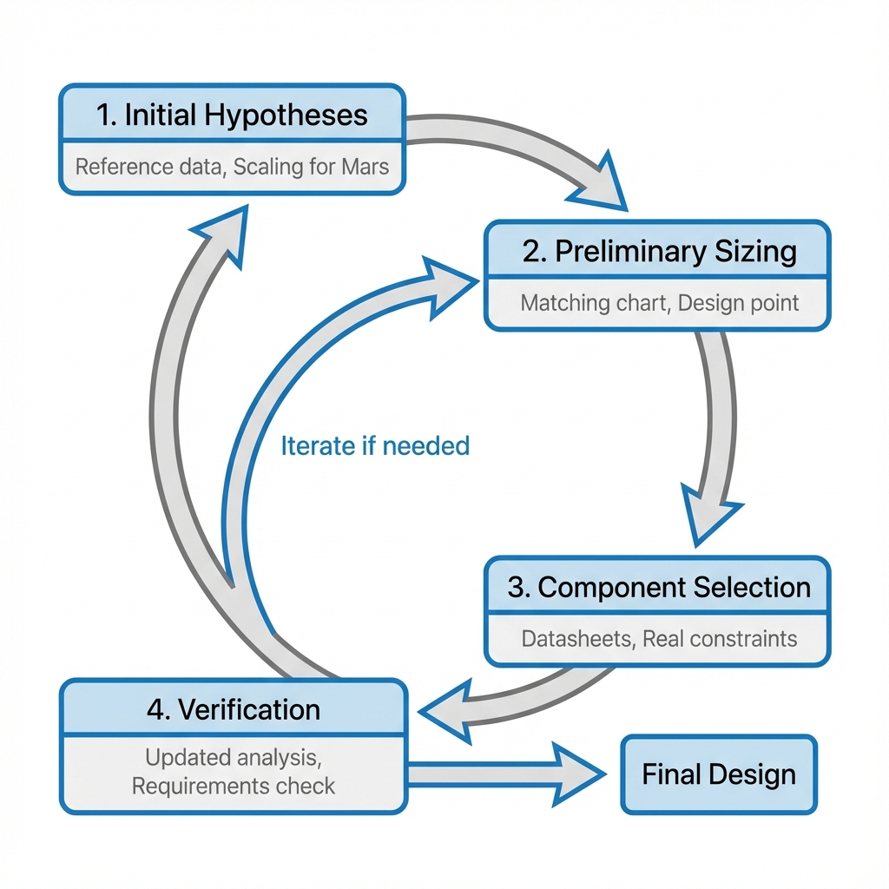
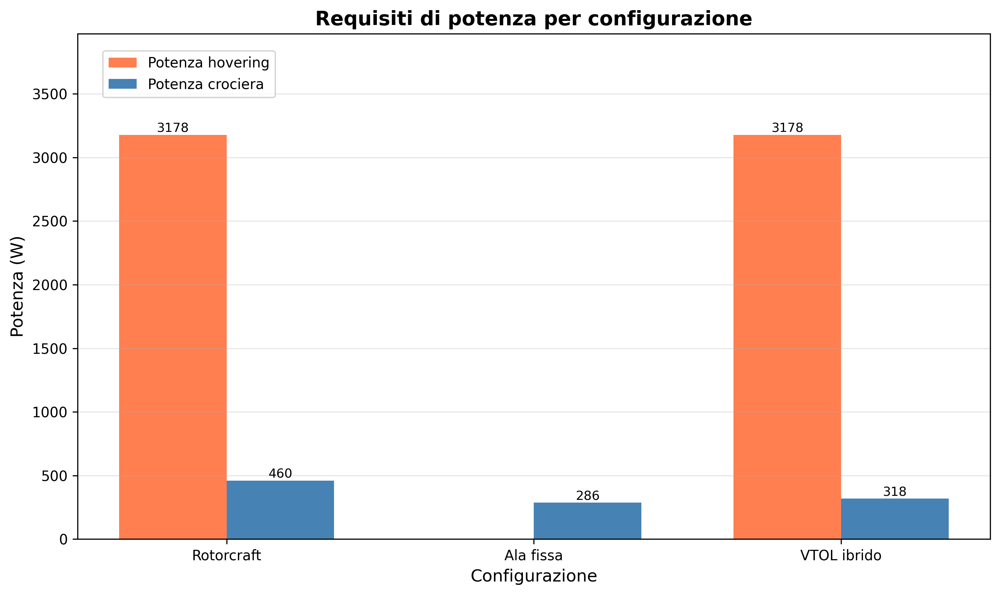
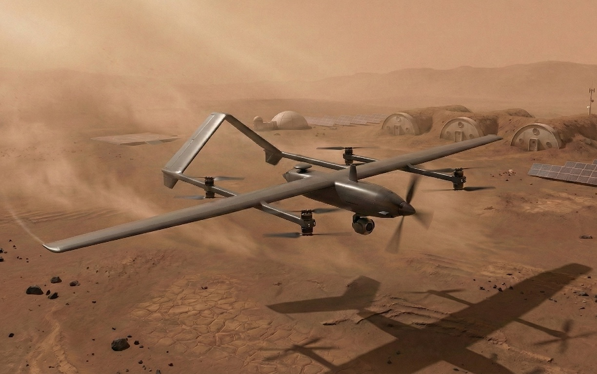
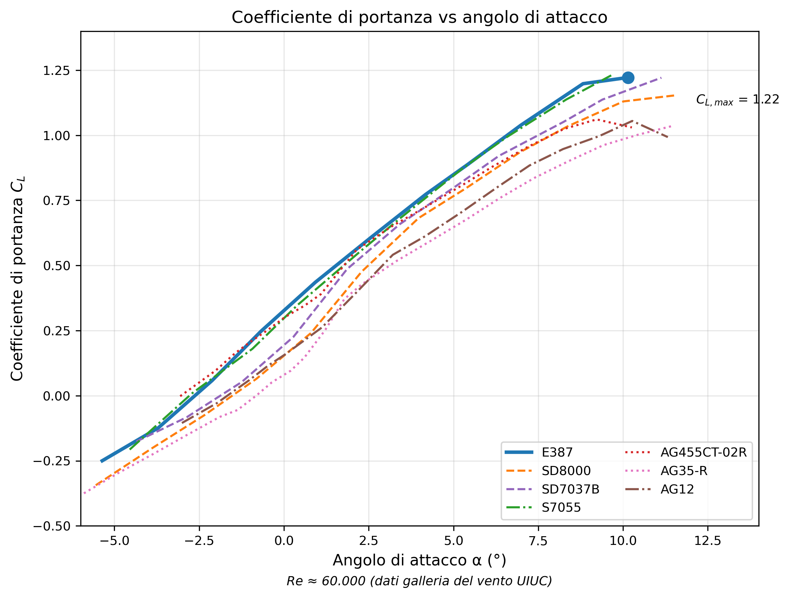

::: {custom-style="Abstract Title"}
Sommario esecutivo
:::

::: {custom-style="Abstract"}
Questo studio valuta la fattibilità dell'impiego di un veicolo aereo senza pilota (UAV) da un habitat equipaggiato su Marte per estendere il raggio di esplorazione oltre i limiti della mobilità di superficie. Il progetto impiega un'architettura ibrida QuadPlane che combina capacità di decollo e atterraggio verticale (VTOL) con un'efficiente crociera ad ala fissa. È selezionata una configurazione solo batteria con un MTOW target di 10 kg, dando priorità alla semplicità e all'affidabilità per l'impegnativo ambiente marziano. Operando da Arcadia Planitia a un'elevazione di −3 km, la bassa densità atmosferica (0.0196 kg/m³) necessita di grandi aree alari e propulsione ad alta efficienza, risultando in numeri di Reynolds di 50,000–90,000 dove la selezione del profilo alare diventa critica. Il profilo SD8000 è selezionato per le sue caratteristiche di bassa resistenza consistenti e il robusto margine di stallo in queste condizioni. Il progetto finale raggiunge 90 min di autonomia con margine del 49%, un'apertura alare di 4.01 m e un'area alare di 2.69 m². Il dimensionamento preliminare indica che il progetto è tecnicamente fattibile con la tecnologia attuale o a breve termine.
:::

# Introduzione {#sec:introduction}

Questo studio valuta la fattibilità di un UAV progettato per supportare le operazioni di un avamposto con equipaggio su Marte, fornendo capacità di ricognizione aerea, rilevamento geologico e relay di comunicazione.

Il volo atmosferico su Marte presenta sfide distinte rispetto all'aviazione terrestre. L'atmosfera marziana ha approssimativamente l'1% della densità a livello del mare della Terra, richiedendo grandi superfici alari e di rotore, velocità di volo più elevate, o una combinazione di entrambe per generare forze aerodinamiche sufficienti. La gravità di Marte (3.711 m/s²), pari al 38% del valore terrestre, riduce la portanza necessaria per sostenere il volo e compensa parzialmente questa penalità di densità. L'assenza di ossigeno atmosferico preclude la propulsione basata sulla combustione; i motori elettrici che azionano rotori o eliche costituiscono l'unico mezzo pratico di volo motorizzato. La mancanza di piste preparate nei siti di esplorazione rende necessaria la capacità di decollo e atterraggio verticale (VTOL). Le tempeste di polvere e il wind shear locale richiedono un sistema di controllo del volo con larghezza di banda e autorità sufficienti per compensare i disturbi atmosferici. La fine regolite marziana si accumula sulle superfici esposte e degrada i componenti meccanici e ottici, richiedendo stoccaggio protetto e sistemi di pulizia attivi come getti di aria compressa in un airlock dell'hangar. Infine, l'atmosfera sottile e l'assenza di un campo magnetico globale espongono la superficie a radiazioni solari e cosmiche galattiche elevate, richiedendo elettronica tollerante alle radiazioni o schermatura appropriata.

I voli di successo dell'elicottero Ingenuity della NASA hanno dimostrato che il volo motorizzato su Marte è realizzabile [@tzanetosIngenuityMarsHelicopter2022]<!-- #abs -->. Tuttavia, l'architettura a rotori di Ingenuity limita raggio e autonomia. Per missioni di esplorazione che richiedono la copertura di decine o centinaia di chilometri, gli aeromobili ad ala fissa offrono efficienza aerodinamica superiore. Questo studio esamina configurazioni VTOL ibride che combinano la flessibilità operativa dei rotori con l'efficienza di crociera degli aeromobili ad ala fissa.

# Metodologia di progettazione

Questa sezione presenta il quadro metodologico per lo studio di fattibilità dell'UAV marziano. L'approccio combina il dimensionamento iterativo con l'analisi basata sui vincoli per esplorare sistematicamente lo spazio di progettazione e identificare configurazioni realizzabili.

## Approccio iterativo di dimensionamento {#sec:iterative-sizing}

Lo sviluppo di questo UAV marziano segue una metodologia di dimensionamento iterativo che bilancia l'analisi teorica con i vincoli pratici dei componenti. A differenza della progettazione convenzionale di aeromobili terrestri, dove esistono leggi di scalamento mature e ampie banche dati, la progettazione di aeromobili marziani richiede un'attenta integrazione dell'eredità di volo limitata con l'analisi scalata da casi di riferimento.

Il processo di progettazione procede attraverso quattro fasi distinte, con cicli di retroazione che consentono il perfezionamento in ogni fase:

1. **Ipotesi iniziali**: i dati di riferimento degli UAV VTOL da piattaforme commerciali e progetti concettuali marziani (@sec:reference-data) forniscono una base empirica per le stime iniziali dei parametri. I parametri chiave estratti dai progetti di riferimento includono le frazioni di massa (propulsione, energia, payload e, per sottrazione, struttura e altri sottosistemi), il carico del disco per le operazioni VTOL e i rapporti potenza-peso. Questi valori terrestri sono poi scalati per le condizioni marziane, tenendo conto della gravità ridotta (38% della Terra) e dell'atmosfera rarefatta (circa l'1% della densità a livello del mare terrestre).
2. **Dimensionamento preliminare**: con le ipotesi iniziali stabilite, la metodologia di dimensionamento basata sui vincoli genera un punto di progetto preliminare. Il diagramma di vincolo (matching chart) determina la combinazione di carico alare e carico di potenza che soddisfa tutte le condizioni di volo (hovering, crociera, salita e stallo). Da questo punto di progetto vengono calcolati i valori preliminari per area alare, apertura, potenza dei motori e ripartizione delle masse.
3. **Selezione dei componenti**: i risultati del dimensionamento preliminare guidano la selezione dei componenti effettivi dalle schede tecniche dei produttori. Questa fase confronta il modello di dimensionamento idealizzato con i vincoli del mondo reale, poiché i motori sono disponibili solo in dimensioni discrete, le batterie hanno densità energetiche specifiche, caratteristiche di tensione e limitazioni di temperatura, e le eliche devono essere compatibili con le configurazioni dei motori disponibili.
4. **Verifica**: i componenti selezionati forniscono valori aggiornati di massa, potenza ed efficienza che differiscono dalle stime preliminari. Il progetto viene ricalcolato con questi valori effettivi e viene verificata la conformità ai requisiti di missione. Se i requisiti non sono soddisfatti, il processo ritorna alla fase 2 con ipotesi perfezionate.

@fig:sizing-loop illustra la natura iterativa di questo processo. Ogni iterazione restringe lo spazio di progettazione man mano che emergono i vincoli a livello di componente e i requisiti vengono progressivamente soddisfatti.

{#fig:sizing-loop}

### Ambito dello studio attuale

Questo studio di fattibilità rappresenta la **prima iterazione** del ciclo a quattro fasi descritto. Le fasi 1 (ipotesi iniziali) e 2 (dimensionamento preliminare) sono complete: l'analisi dei dati di riferimento stabilisce i parametri iniziali (@sec:reference-data), il dimensionamento basato sui vincoli determina il punto di progetto (@sec:constraint-analysis) e i trade-off tra configurazioni identificano il VTOL ibrido come architettura selezionata (@sec:architecture-selection). Le fasi 3 (selezione dei componenti) e 4 (verifica) sono parzialmente affrontate attraverso componenti commerciali rappresentativi e verifica analitica rispetto ai requisiti di missione.

I risultati numerici presentati in @sec:constraint-analysis sono valutati a un **MTOW di riferimento fisso di 10.00 kg**, derivato dall'analisi delle frazioni di massa (@sec:initial-mass-estimate). Questo approccio di caso di riferimento consente il confronto diretto delle prestazioni delle configurazioni sotto vincoli di massa ed energia identici. Un'iterazione di dimensionamento a ciclo chiuso, dove l'MTOW viene aggiustato per soddisfare esattamente i requisiti di missione, è rinviata alle fasi di progettazione successive.

Aspetti non modellati in questa prima iterazione includono vincoli dettagliati di packaging e volume, analisi dei margini termici durante i cicli operativi, verifica di stabilità e controllo e considerazioni di fabbricazione e assemblaggio. Questi sono riservati alle iterazioni successive man mano che il progetto matura verso la progettazione di dettaglio.

## Ruolo del dimensionamento basato sui vincoli {#sec:constraint-role}

Il diagramma di vincolo, o matching chart, costituisce il nucleo analitico della metodologia di dimensionamento. Questo strumento grafico, adattato dai metodi di dimensionamento aeronautico basati sulla potenza, visualizza i vincoli che delimitano lo spazio di progettazione ammissibile.

### Spazi di vincolo specifici per configurazione

Diverse configurazioni di aeromobili richiedono formulazioni del diagramma di vincolo differenti, che riflettono i loro diversi fattori prestazionali:

* **Configurazioni ad ala rotante** utilizzano un diagramma di vincolo con il carico di potenza (P/W) sull'asse verticale e il **carico del disco** (DL = T/A) sull'asse orizzontale. Poiché i velivoli ad ala rotante non hanno ali, il carico alare non è un parametro significativo. Il vincolo di potenza in hovering domina, con il carico di potenza che aumenta monotonicamente con il carico del disco secondo la teoria del disco attuatore.

* **Configurazioni ad ala fissa** utilizzano il carico di potenza (P/W) in funzione del **carico alare** (W/S). Il vincolo di stallo appare come una linea verticale che limita il carico alare massimo, mentre il vincolo di crociera appare come una curva con potenza minima al carico alare ottimale. Non esiste alcun vincolo di hovering poiché gli aeromobili ad ala fissa non possono eseguire il volo stazionario.

* **Configurazioni VTOL ibride** (QuadPlane) combinano elementi di entrambe: il carico alare si applica alla fase di crociera mentre il carico del disco si applica alla fase di hovering. Il diagramma di vincolo utilizza gli assi P/W rispetto a W/S, con il vincolo di hovering che appare come una linea orizzontale (indipendente dal carico alare) e i vincoli di crociera e stallo come per l'ala fissa.

Questo approccio specifico per configurazione garantisce che ogni architettura sia valutata nel suo spazio di vincolo naturale, consentendo un confronto significativo dei margini di fattibilità.

### Vincoli del VTOL ibrido

Per un aeromobile VTOL ibrido, che emerge come la configurazione più adatta dall'analisi dei trade-off (@sec:architecture-selection), i vincoli rilevanti includono:

* Vincolo di hovering: stabilisce il carico di potenza minimo in base al carico del disco e alla densità atmosferica. L'atmosfera rarefatta di Marte (circa 0.020 kg/m³ ad Arcadia Planitia) richiede carichi di potenza maggiori rispetto a operazioni terrestri equivalenti.
* Vincolo di crociera: derivato dalla polare di resistenza, questo vincolo determina la potenza necessaria per il volo livellato stazionario alla velocità di crociera di progetto.
* Vincolo di salita: garantisce una potenza eccedente sufficiente per la velocità di salita richiesta.
* Vincolo di stallo: stabilisce il carico alare massimo in base al coefficiente di portanza massimo del profilo alare al numero di Reynolds operativo.

Il punto di progetto viene selezionato all'interno della regione ammissibile delimitata da questi vincoli. Per le configurazioni QuadPlane, i vincoli di hovering e crociera sono in gran parte disaccoppiati: i rotori di sollevamento sono dimensionati per soddisfare il vincolo di hovering, mentre l'ala e il motore di crociera sono dimensionati per soddisfare i vincoli di crociera e stallo. Questo disaccoppiamento semplifica l'esplorazione dello spazio di progettazione ma richiede una verifica che il sistema combinato rimanga entro l'obiettivo di MTOW.

I requisiti derivati riassunti in @tbl:derived-requirements definiscono il punto di partenza per l'analisi del matching chart. L'MTOW target di 10 kg, derivato dall'analisi delle frazioni di massa e dai requisiti di payload, stabilisce il peso per la valutazione dei vincoli. La frazione di batteria assunta (35%), l'energia specifica (270 Wh/kg) e le efficienze propulsive alimentano i calcoli di potenza e autonomia. L'esecuzione del matching chart con questi input produce il punto di progetto preliminare: la combinazione specifica di carico alare e carico di potenza che massimizza l'autonomia soddisfacendo tutti i vincoli. Questo punto di progetto determina poi l'area alare, l'apertura e i requisiti di potenza dei motori che guidano la selezione dei componenti.

La natura iterativa di questo processo riconosce che le ipotesi iniziali sono necessariamente approssimate. Man mano che la selezione dei componenti rivela masse ed efficienze effettive, il punto di progetto può spostarsi. La metodologia garantisce che tali spostamenti siano sistematicamente tracciati e che il progetto finale rimanga tracciabile rispetto ai suoi fondamenti analitici.

# Analisi della missione

Questa sezione definisce il contesto della missione, includendo l'ambiente operativo ad Arcadia Planitia, il profilo di volo necessario per raggiungere gli obiettivi di missione e le esigenze dell'utente che guidano il progetto.

## Ambiente operativo {#sec:operational-environment}

Arcadia Planitia è selezionata come località operativa di riferimento. Questa regione offre diversi vantaggi per l'esplorazione iniziale di Marte: la sua bassa elevazione (−3 km rispetto al datum) fornisce maggiore densità atmosferica, il terreno relativamente pianeggiante è adatto alla costruzione di habitat, i depositi di ghiaccio d'acqua sotterraneo presentano interesse scientifico, e la latitudine moderata (47°11'24"N) bilancia l'illuminazione solare con la stabilità del ghiaccio.

Il volo atmosferico su Marte avviene in condizioni diverse dalla Terra [@desertAerodynamicDesignMartian2017]<!-- #s:mars-atmosphere -->. La sottile atmosfera di CO₂ presenta pressioni superficiali intorno a 610 Pa medi, con significativa variazione a seconda dell'elevazione e della stagione. Le temperature superficiali hanno una media di circa 210 K con notevoli escursioni diurne. Alle basse elevazioni favorevoli al volo, la densità atmosferica rimane approssimativamente due ordini di grandezza inferiore rispetto al livello del mare terrestre, risultando in aerodinamica a basso numero di Reynolds e ridotta generazione di portanza.

![L'area di Arcadia Planitia nel contesto geografico marziano [@esaArcadiaPlanitiaContext2025]<!-- #fig:arcadia -->.](figures/Arcadia_Planitia_in_context_pillars.png){#fig:arcadia-context width=50%}

### Equazioni dell'atmosfera marziana

L'atmosfera marziana è modellata utilizzando la formula barometrica con una composizione del 95.3% di CO₂ [@nasaMarsAtmosphereModel2021]<!-- #s:composition -->. Le seguenti equazioni descrivono le proprietà atmosferiche in funzione dell'altitudine geometrica $h$ (in metri sopra il datum di riferimento):

$$T(h) = T_0 - L \cdot h$$ {#eq:temperature}

dove $T_0$ = 210 K è la temperatura di riferimento e $L$ = 0.00222 K/m è il gradiente termico verticale.

$$p(h) = p_0 \left(\frac{T(h)}{T_0}\right)^{g/(R_{CO2} \cdot L)}$$ {#eq:pressure}

dove $p_0$ = 610 Pa è la pressione media di superficie, $g$ = 3.711 m/s² è l'accelerazione di gravità superficiale di Marte, e $R_{CO_2}$ = 188.92 J/(kg·K) è la costante specifica del gas per CO₂.

La densità segue dalla legge dei gas ideali:

$$ρ(h) = \frac{p(h)}{R_{CO_2} \cdot T(h)}$$ {#eq:density}

La velocità del suono è:

$$a(h) = \sqrt{γ \cdot R_{CO_2} \cdot T(h)}$$ {#eq:speed-of-sound}

dove γ = 1.29 per CO₂.

La viscosità dinamica $\mu$ è approssimata usando la legge di Sutherland:

$$\mu(h) = \mu_\text{ref} \left(\frac{T(h)}{T_\text{ref}}\right)^{1.5} \frac{T_\text{ref} + S}{T(h) + S}$$ {#eq:dynamic-viscosity}

dove $\mu_\text{ref}$ = 1.48 × 10⁻⁵ Pa·s è la viscosità dinamica di riferimento a $T_\text{ref}$ = 293 K, e $S$ = 222 K è la costante di Sutherland per CO₂. La viscosità cinematica $\nu$ è quindi ottenuta da:

$$\nu(h) = \frac{\mu(h)}{\rho(h)}$$ {#eq:kinematic-viscosity}

### Condizioni ad Arcadia Planitia

All'altitudine operativa di 50 m sopra Arcadia Planitia (elevazione datum −3 km, quindi −2.95 km assoluti):

: Condizioni atmosferiche ad Arcadia Planitia, 50 m AGL {#tbl:atmosphere}

| Proprietà | Simbolo | Valore | Unità |
|:----------|:-------:|-------:|:------|
| Temperatura | $T$ | 216.6 | K |
| Pressione | $p$ | 800.5 | Pa |
| Densità | $\rho$ | 0.01960 | kg/m³ |
| Velocità del suono | $a$ | 229.7 | m/s |
| Viscosità dinamica | $\mu$ | 1.080 × 10⁻⁵ | Pa·s |
| Viscosità cinematica | $\nu$ | 5.170 × 10⁻⁴ | m²/s |

## Profilo di missione {#sec:mission-profile}

Il raggio di missione è definito come la distanza massima che l'UAV può percorrere in uscita mantenendo energia sufficiente per tornare con una riserva del 20%. Questo tiene conto di errori di navigazione, effetti del vento e manovre di contingenza.

È stato progettato un profilo di missione di riferimento composto da sette fasi. L'UAV esegue un decollo verticale utilizzando i rotori di sollevamento per salire all'altitudine di crociera, poi transita al volo ad ala fissa accelerando fino a che le ali generano portanza sufficiente. Durante la crociera in uscita, l'aeromobile vola in modalità ala fissa verso l'area obiettivo alla velocità di crociera. All'arrivo, il velivolo entra in una fase di loiter o rilevamento con i sistemi di payload attivi per la copertura dell'area. La fase di crociera di ritorno replica la tratta in uscita, con volo ad ala fissa di ritorno all'habitat. Infine, l'aeromobile decelera e transita nuovamente alla modalità di volo verticale prima di completare un atterraggio verticale sulla piazzola designata.

## Esigenze dell'utente {#sec:user-needs}

Questa sezione identifica le esigenze degli stakeholder che guidano la progettazione dell'UAV marziano. Le esigenze dell'utente esprimono quali capacità sono richieste senza specificare valori numerici; i requisiti quantitativi derivati da queste esigenze sono documentati in @sec:derived-requirements. Le esigenze sono organizzate in tre categorie: le esigenze di capacità di missione definiscono gli obiettivi funzionali che l'UAV deve raggiungere, le esigenze di sicurezza operativa riguardano l'affidabilità e la robustezza durante le operazioni di volo, e le esigenze di compatibilità ambientale garantiscono che il sistema possa funzionare entro i vincoli fisici specifici di Marte.

@Tbl:user-needs-summary fornisce una vista consolidata di tutte le esigenze dell'utente organizzate per categoria.

: Riepilogo delle esigenze dell'utente {#tbl:user-needs-summary}

| ID  | Categoria                   | Esigenza                           |
|-----|-----------------------------|------------------------------------|
| N1  | Capacità di missione        | Raggio operativo esteso            |
| N2  | Capacità di missione        | Imaging aereo                      |
| N3  | Capacità di missione        | Ponte radio per comunicazioni      |
| N4  | Capacità di missione        | Decollo e atterraggio verticali    |
| N5  | Capacità di missione        | Autonomia estesa                   |
| N6  | Sicurezza operativa         | Tolleranza al guasto singolo       |
| N7  | Sicurezza operativa         | Tolleranza al vento                |
| N8  | Sicurezza operativa         | Protezione dall'ingresso di polvere|
| N9  | Compatibilità ambientale    | Propulsione elettrica              |
| N10 | Compatibilità ambientale    | Tolleranza alle radiazioni         |
| N11 | Compatibilità ambientale    | Compatibilità termica              |

### Esigenze di capacità di missione

Le esigenze di capacità di missione definiscono ciò che l'UAV deve realizzare per soddisfare i suoi obiettivi scientifici e operativi. Queste esigenze stabiliscono le funzionalità fondamentali richieste per le missioni di ricognizione, rilevamento e ponte radio per comunicazioni.

* N1. Raggio operativo esteso: l'UAV dovrà fornire capacità di rilevamento aereo oltre il raggio pratico dei rover di superficie. Gli attuali rover marziani hanno percorso meno di 50 km in missioni pluriennali, limitando l'area accessibile intorno ai siti di atterraggio. Una piattaforma aerea può rilevare aree più vaste in meno tempo, consentendo la ricognizione di siti che altrimenti richiederebbero anni di viaggio via rover o rimarrebbero inaccessibili.
* N2. Imaging aereo: l'UAV dovrà trasportare un sistema di telecamere capace di acquisire immagini per il rilevamento geologico. Questo supporta l'obiettivo primario di missione di mappatura del terreno, identificazione di siti scientificamente interessanti e fornitura di contesto per le operazioni di superficie.
* N3. Ponte radio per comunicazioni: l'UAV dovrà trasportare un sistema radio capace di estendere il raggio di comunicazione per le operazioni EVA (attività extraveicolare). Le comunicazioni radio di superficie sono limitate da vincoli di linea di vista e oscuramento del terreno; una stazione relay aerea può estendere il raggio operativo sicuro delle attività di superficie con equipaggio.
* N4. Decollo e atterraggio verticali: l'UAV dovrà essere capace di operare senza piste o strisce di atterraggio preparate. La superficie marziana non offre infrastrutture per operazioni aeronautiche convenzionali; tutti i decolli e atterraggi devono avvenire da terreno non preparato nei pressi dell'habitat.
* N5. Autonomia estesa: l'UAV dovrà fornire un tempo di volo sufficiente per completare una missione di andata e ritorno con tempo di rilevamento nella località obiettivo. Voli brevi, come quelli dimostrati da Ingenuity, sono insufficienti per le missioni di ricognizione e ponte radio previste. L'autonomia deve accomodare transito, operazioni di rilevamento e ritorno con margini appropriati.

### Esigenze di sicurezza operativa

Le esigenze di sicurezza operativa riguardano i requisiti di affidabilità e robustezza che garantiscono il successo della missione nonostante l'ambiente operativo ostile e l'impossibilità di intervento in volo.

* N6. Tolleranza al guasto singolo: l'UAV dovrà mantenere un'operazione sicura in seguito a qualsiasi guasto singolo di sistema. La riparazione in volo non è possibile e le opportunità di manutenzione sono limitate. Il progetto deve accomodare guasti dei componenti senza perdita catastrofica del velivolo.
* N7. Tolleranza al vento: l'UAV dovrà operare in sicurezza nelle tipiche condizioni di vento marziane. Marte sperimenta regolari picchi di vento pomeridiani che il velivolo deve sopportare senza perdita di controllo o danni strutturali.
* N8. Protezione dall'ingresso di polvere: l'UAV dovrà essere protetto dalla polvere marziana. La fine regolite (dimensioni delle particelle 1-100 μm) può degradare i cuscinetti meccanici, contaminare le superfici ottiche e ridurre l'efficacia della gestione termica. La protezione dalla polvere è necessaria per un funzionamento affidabile per tutta la durata della missione.

### Esigenze di compatibilità ambientale

Le esigenze di compatibilità ambientale derivano dai vincoli fisici fondamentali di Marte, inclusa la composizione atmosferica, l'ambiente di radiazione e le condizioni termiche. Queste esigenze non possono essere scambiate con le prestazioni; la non conformità comporta il guasto del sistema.

* N9. Propulsione elettrica: l'UAV dovrà utilizzare sistemi di propulsione elettrica. L'atmosfera marziana è priva di ossigeno per la combustione, precludendo i motori a combustione interna convenzionali. I sistemi a batteria elettrica o solari-elettrici sono le uniche opzioni pratiche.
* N10. Tolleranza alle radiazioni: l'elettronica e i materiali dell'UAV dovranno resistere all'ambiente di radiazione superficiale marziano. La combinazione di radiazione cosmica galattica e eventi di particelle solari crea un ambiente di radiazione che l'elettronica commerciale deve tollerare per la durata della missione.
* N11. Compatibilità termica: l'UAV dovrà operare nell'ambiente termico marziano. Le escursioni termiche diurne e le basse temperature ambientali (da -80°C a +20°C) impongono vincoli su materiali, meccanismi e in particolare sulle prestazioni delle batterie.

# Dati di riferimento e analisi dei compromessi {#sec:reference-data}

Questa sezione raccoglie dati di riferimento da concetti esistenti di UAV marziani, piattaforme VTOL commerciali e studi di caratterizzazione dei sottosistemi. I dati informano i compromessi architettonici e forniscono la base empirica per le stime iniziali di massa e i requisiti derivati.

## Sistemi di payload {#sec:payload-systems}

Gli obiettivi di missione dell'UAV marziano, mappatura e ponte radio per telecomunicazioni, richiedono sistemi di payload capaci di operare nell'ambiente marziano rispettando stringenti vincoli di massa e potenza. Questa sezione esamina i sistemi di telecamere esistenti adatti alla ricognizione aerea per stabilire intervalli di massa realistici e informare l'allocazione del payload nella stima di peso iniziale.

### Panoramica dei sistemi di telecamera {#sec:camera-survey}

La selezione del payload camera comporta compromessi tra risoluzione, dimensione del sensore, massa e tolleranza ambientale. @Tbl:camera-survey riassume le specifiche per sistemi rappresentativi in tre categorie: telecamere RGB per mappatura, sensori multispettrali e termocamere.

: Specifiche dei sistemi camera da schede tecniche dei produttori {#tbl:camera-survey}

| Modello | Tipo | Sensore | Risoluzione | Massa (g) | Range temp. (°C) | Fonte |
|---------|------|---------|-------------|----------|------------------|--------|
| DJI Zenmuse P1 | RGB | Full frame | 45 MP | 800-1350 | −20 a +50 | [@djiDJIZenmuseP12024]<!-- #specs --> |
| Ricoh GR III | RGB | APS-C | 24 MP | 227-257 | N.D. | [@ricohimagingRicohGRIII2024]<!-- #specs --> |
| Phase One iXM-100 | RGB | Medio formato | 100 MP | 630-1170 | −10 a +40 | [@phaseonePhaseOneIXM1002024]<!-- #specs --> |
| MicaSense RedEdge-MX | Multispettrale | Custom (5 bande) | 1.2 MP/banda | 232 | N.D. | [@micasenseMicaSenseRedEdgeMXIntegration2020]<!-- #specs --> |
| DJI Zenmuse H20T | Termico + RGB | Multiplo | 640×512 (termico) | 828 | −20 a +50 | [@djiDJIZenmuseH20T2024]<!-- #specs --> |

I valori di massa rappresentano configurazioni dal solo corpo alla configurazione completa. La DJI Zenmuse P1 varia da 800 g (corpo) a 1350 g con l'obiettivo DL 35mm [@djiDJIZenmuseP12024]<!-- #specs -->. La Ricoh GR III raggiunge 257 g includendo batteria e storage [@ricohimagingRicohGRIII2024]<!-- #specs -->. Il corpo della Phase One iXM-100 pesa 630 g, aumentando a 1170 g con l'obiettivo RSM 35mm [@phaseonePhaseOneIXM1002024]<!-- #specs -->.

#### Telecamere RGB per mappatura

I sensori full-frame forniscono qualità d'immagine superiore per applicazioni fotogrammetriche. La DJI Zenmuse P1 offre una risoluzione di 45 MP con passo pixel di 4.4 μm, ottenendo una distanza di campionamento a terra di 0.76 cm a 100 m di altitudine con l'obiettivo 35mm [@djiDJIZenmuseP12024]<!-- #specs -->. Il consumo di potenza è circa 20 W. Il range di temperatura operativa da −20 a +50°C copre la porzione più calda delle condizioni superficiali marziane.

Le telecamere compatte offrono vantaggi in termini di massa. La Ricoh GR III fornisce imaging APS-C da 24 MP in un corpo da 227 g con obiettivo integrato da 18.3 mm [@ricohimagingRicohGRIII2024]<!-- #specs -->. Tuttavia, il produttore non specifica limiti di temperatura operativa, indicando una tolleranza termica di grado consumer inadeguata per le condizioni marziane senza gestione termica.

La Phase One iXM-100 rappresenta la fascia alta dei sistemi di mappatura aerea con sensore medio formato (44×33 mm) da 100 MP [@phaseonePhaseOneIXM1002024]<!-- #specs -->. Con consumo massimo di 16 W e massa del corpo di 630 g, ottiene un passo pixel di 3.76 μm. La classificazione IP53 fornisce protezione dalla polvere rilevante per le operazioni marziane, sebbene il range operativo da −10 a +40°C richieda controllo termico.

#### Telecamere multispettrali

La MicaSense RedEdge-MX fornisce imaging multispettrale a cinque bande (blu, verde, rosso, red-edge, infrarosso vicino) per analisi scientifica [@micasenseMicaSenseRedEdgeMXIntegration2020]<!-- #specs -->. A 232 g completa con il sensore DLS 2 per la luce, rappresenta un'opzione leggera per applicazioni di rilevamento geologico. Ogni banda fornisce 1.2 MP (1280×960 pixel) con otturatore globale e profondità di output a 12 bit. La distanza di campionamento a terra è 8 cm/pixel a 120 m di altitudine.

#### Termocamere

La DJI Zenmuse H20T integra telecamere termiche, zoom e grandangolari con telemetro laser in un singolo payload da 828 g [@djiDJIZenmuseH20T2024]<!-- #specs -->. Il microbolometro VOx non raffreddato fornisce una risoluzione termica di 640×512 con differenza di temperatura equivalente al rumore di 50 mK. L'intervallo di misurazione della temperatura va da −40 a +150°C (alto guadagno) o da −40 a +550°C (basso guadagno), adatto per la mappatura termica geologica.

#### Riepilogo di massa e dimensioni

Sulla base dei sistemi esaminati, le caratteristiche del payload camera sono le seguenti. Le telecamere RGB vanno da 227 g (solo corpo, Ricoh GR III) a 1350 g (con obiettivo, DJI Zenmuse P1). I sensori multispettrali come la MicaSense RedEdge-MX pesano circa 232 g. I sistemi termici/ibridi come la DJI Zenmuse H20T pesano circa 828 g.

Le dimensioni delle telecamere variano con il formato del sensore e la configurazione dell'obiettivo. La Ricoh GR III misura 109.4 × 61.9 × 33.2 mm (solo corpo) [@ricohimagingRicohGRIII2024]<!-- #specs -->. La DJI Zenmuse P1 misura 198 × 166 × 129 mm [@djiDJIZenmuseP12024]<!-- #specs -->. La MicaSense RedEdge-MX misura 87 × 59 × 45.4 mm [@micasenseMicaSenseRedEdgeMXIntegration2020]<!-- #specs -->.

Per scopi di dimensionamento iniziale, una telecamera RGB compatta (250-400 g) rappresenta l'allocazione di payload di base.

#### Considerazioni sull'ambiente termico marziano

Tutte le telecamere esaminate richiedono gestione termica per le operazioni marziane. Le temperature superficiali di Marte variano da circa −60 a +20°C, superando i limiti operativi inferiori della maggior parte delle telecamere commerciali. I sistemi DJI e Phase One con specifiche per basse temperature (−20°C e −10°C rispettivamente) forniscono la migliore tolleranza termica di base, sebbene siano necessari sistemi di riscaldamento supplementari durante le condizioni fredde. Le telecamere senza intervalli di temperatura specificati richiedono test di qualifica o si assume necessitino di controllo termico attivo.

Considerazioni aggiuntive per i sistemi camera marziani includono: la bassa pressione atmosferica (circa 600 Pa) che influisce sulla dissipazione termica e richiede test di qualifica; la tolleranza sconosciuta all'ambiente di radiazione per componenti commerciali; e i budget di potenza che devono tenere conto del riscaldamento per il controllo termico della camera oltre all'operazione della camera stessa.

### Sistemi radio relay {#sec:radio-survey}

La missione di ponte radio per telecomunicazioni richiede un sistema radio capace di estendere il raggio di comunicazione tra gli astronauti EVA in superficie e la stazione base dell'habitat. Per le operazioni marziane, le bande di frequenza specifiche differirebbero dall'uso terrestre a causa di differenze regolamentari e di propagazione, ma le specifiche di massa e potenza dei sistemi commerciali rimangono valide per la stima di fattibilità. Questa sezione esamina i sistemi radio esistenti adatti ad applicazioni UAV relay in due categorie: sistemi radio mesh e collegamenti dati punto-punto.

#### Sistemi radio mesh

Le radio mesh forniscono capacità di rete auto-formante e auto-rigenerante, sebbene questa funzionalità non sia strettamente richiesta per una missione relay con singolo UAV. @Tbl:radio-mesh riassume le specifiche per sistemi radio mesh rappresentativi.

: Specifiche dei sistemi radio mesh da schede tecniche dei produttori {#tbl:radio-mesh}

| Modello | Produttore | Massa (g) | Range freq. | Potenza (W) | Range temp. (°C) | Fonte |
|---------|------------|----------|-------------|-----------|------------------|--------|
| StreamCaster 4200E+ | Silvus Technologies | 425 | 300 MHz-6 GHz | 5-48 | −40 a +85 | [@silvustechnologiesStreamCaster4200SC42002025]<!-- #specs --> |
| MPU5 | Persistent Systems | 391-726 | Bande multiple | N.D. | −40 a +85 | [@persistentsystemsMPU5TechnicalSpecifications2025]<!-- #specs --> |
| BreadCrumb ES1 | Rajant Corporation | 455 | 2.4/5 GHz | 2.8-15 | −40 a +60 | [@rajantcorporationBreadCrumbES1Specifications2025]<!-- #specs --> |

Il Silvus StreamCaster 4200E+ fornisce capacità mesh MIMO 2×2 a banda larga in un pacchetto da 425 g con classificazione IP68 e sommergibilità fino a 20 m [@silvustechnologiesStreamCaster4200SC42002025]<!-- #specs -->. Il consumo di potenza varia da 5 W a 1 W di potenza di trasmissione a 48 W alla massima potenza di trasmissione di 10 W. Il range di temperatura operativa da −40 a +85°C supera i requisiti superficiali marziani.

Il Persistent Systems MPU5 integra un processore quad-core da 1 GHz con 2 GB di RAM per la gestione autonoma della rete [@persistentsystemsMPU5TechnicalSpecifications2025]<!-- #specs -->. A 391 g (solo chassis) o 726 g con batteria, fornisce un raggio in linea di vista fino a 209 km tra i nodi. Le certificazioni MIL-STD-810G e MIL-STD-461F indicano una robusta tolleranza ambientale.

Il Rajant BreadCrumb ES1 offre funzionamento dual-band (2.4 GHz e 5 GHz) con capacità di rete auto-formante InstaMesh in un'unità da 455 g [@rajantcorporationBreadCrumbES1Specifications2025]<!-- #specs -->. Il consumo di potenza è 2.8 W in idle e 15 W di picco. Il range di temperatura da −40 a +60°C copre le condizioni superficiali diurne marziane.

#### Collegamenti dati punto-punto

Per applicazioni relay con singolo UAV, i collegamenti punto-punto leggeri forniscono una superiore efficienza di massa. @Tbl:radio-p2p riassume le specifiche per sistemi rappresentativi.

: Specifiche dei collegamenti dati punto-punto da schede tecniche dei produttori {#tbl:radio-p2p}

| Modello | Produttore | Massa (g) | Banda freq. | Data rate | Raggio (km) | Potenza (W) | Fonte |
|---------|------------|----------|------------|-----------|------------|-----------|--------|
| RFD900x | RFDesign | 14.5 | 900 MHz | 0.064-0.75 Mbps | > 40 | 5 | [@rfdesignRFD900xModemSpecifications2024]<!-- #specs --> |
| pMDDL2450 (OEM) | Microhard | 7 | 2.4 GHz | 12-25 Mbps | N.D. | N.D. | [@microhardPMDDL2450MiniatureMIMO2025]<!-- #specs --> |
| pMDDL2450 (custodia) | Microhard | 165 | 2.4 GHz | 12-25 Mbps | N.D. | N.D. | [@microhardPMDDL2450MiniatureMIMO2025]<!-- #specs --> |

Il RFD900x è un modem di telemetria ultraleggero da 14.5 g, ampiamente utilizzato nella comunità UAV con firmware open-source SiK [@rfdesignRFD900xModemSpecifications2024]<!-- #specs -->. Fornisce un raggio in linea di vista di oltre 40 km con 1 W di potenza di trasmissione a 900 MHz. Il data rate va da 64 kbps di default a 750 kbps massimo, sufficiente per collegamenti di telemetria e comando. Il range di temperatura operativa da −40 a +85°C si estende oltre i requisiti superficiali marziani.

Il Microhard pMDDL2450 offre maggiore larghezza di banda (throughput di 25 Mbps) per applicazioni video relay in un fattore di forma estremamente compatto [@microhardPMDDL2450MiniatureMIMO2025]<!-- #specs -->. Il modulo OEM pesa solo 7 g, mentre la versione con custodia e connettori pesa 165 g. La configurazione MIMO 2×2 fornisce una migliore affidabilità del collegamento attraverso la diversità spaziale.

#### Riepilogo di massa e dimensioni

Sulla base dei sistemi esaminati, le caratteristiche del payload radio sono le seguenti. Le radio mesh vanno da 391 g (solo chassis) a 726 g con batteria integrata. I collegamenti punto-punto vanno da 7 g (modulo OEM) a 165 g (versione con custodia).

Le dimensioni per il Microhard pMDDL2450 sono: modulo OEM 27 × 33 × 4 mm, versione con custodia 77 × 55 × 28 mm [@microhardPMDDL2450MiniatureMIMO2025]<!-- #specs -->.

Per scopi di dimensionamento iniziale, un collegamento punto-punto leggero (15-170 g) rappresenta l'allocazione di payload radio di base. La piena capacità mesh aggiungerebbe circa 400-500 g se fosse richiesto il coordinamento multi-asset.

#### Considerazioni sull'ambiente marziano

Tutti i sistemi radio esaminati superano il tipico range di temperatura superficiale marziana di circa −60 a +20°C ai limiti inferiori, con specifiche che vanno da −40 a +60°C (Rajant) a −40 a +85°C (Silvus, Persistent, RFDesign). Considerazioni aggiuntive per le operazioni marziane includono: la bassa pressione atmosferica (circa 600 Pa) che influisce sulla dissipazione termica, con le radio che potrebbero richiedere strategie di raffreddamento modificate o declassamento; la tolleranza sconosciuta all'ambiente di radiazione per componenti commerciali che richiede test di qualifica o alternative rad-hard; l'allocazione delle frequenze per la comunicazione superficiale marziana che differisce dalle bande regolamentari terrestri richiedendo modifiche al front-end radio; e i budget di potenza che devono tenere conto del controllo termico della radio oltre alla potenza di trasmissione.

## Confronto architetture {#sec:architecture-comparison}

### Architettura di volo

Tre architetture sono considerate per il volo atmosferico su Marte: ad ala rotante, ad ala fissa e VTOL ibrido. Ognuna presenta distinti compromessi tra flessibilità operativa ed efficienza energetica.

#### Ala rotante

I progetti puramente ad ala rotante forniscono decollo e atterraggio verticali senza richiedere superfici preparate. L'elicottero Ingenuity della NASA ha dimostrato questo approccio, completando 72 voli su Marte [@tzanetosIngenuityMarsHelicopter2022]<!-- #abs --> [@nasaIngenuityMarsHelicopter2024]<!-- #s:flights -->. Tuttavia, gli aeromobili a rotore soffrono di scarsa efficienza in crociera. La potenza di hovering scala secondo la teoria della quantità di moto come [@johnsonMarsScienceHelicopter2020]<!-- #eq:hover -->:

$$P_{hover} = \frac{T^{1.5}}{\sqrt{2\rho A_{rotor}}} \cdot \frac{1}{FM}$$ {#eq:hover-power-arch}

dove T è la spinta, ρ è la densità atmosferica, $A_\text{rotor}$ è l'area del disco del rotore, e FM è la figura di merito (tipicamente 0.6-0.7 per piccoli rotori [@johnsonMarsScienceHelicopter2020]<!-- #eq:hover -->). La dipendenza inversa dalla radice quadrata della densità significa che la potenza di hovering aumenta di un fattore di circa 7 passando dal livello del mare terrestre (ρ = 1.225 kg/m³) alla superficie di Marte (ρ ≈ 0.020 kg/m³) [@nasaMarsAtmosphereModel2021]<!-- #s:density -->.

Per il profilo di missione qui considerato, che richiede > 50 km di raggio operativo, l'autonomia dell'ala rotante sarebbe severamente limitata. I 72 voli di Ingenuity hanno totalizzato solo 128.8 minuti di tempo di volo, con voli tipici della durata di 1-3 minuti [@nasaIngenuityMarsHelicopter2024]<!-- #s:flights -->. Anche con una maggiore capacità della batteria, l'autonomia di un puro aeromobile a rotore su Marte rimarrebbe probabilmente sotto i 15 minuti, insufficiente per operazioni di rilevamento significative al raggio d'azione richiesto.

#### Ala fissa

Gli aeromobili convenzionali ad ala fissa raggiungono la massima efficienza aerodinamica, con rapporti portanza/resistenza (L/D) di 10-20 confrontati con L/D effettivi di 3-5 per l'ala rotante in volo traslato [@proutyHelicopterPerformanceStability2002]<!-- #ch3:ld -->. La potenza di crociera è:

$$P_{cruise} = \frac{W \cdot V}{L/D \cdot \eta}$$ {#eq:cruise-power-arch}

dove W è il peso, V è la velocità di crociera, e η è l'efficienza propulsiva. La dipendenza da L/D piuttosto che dal carico del disco rende il volo ad ala fissa molto più efficiente dal punto di vista energetico per coprire distanze.

Tuttavia, gli aeromobili ad ala fissa richiedono piste o sistemi di lancio/recupero. Data l'assenza di superfici preparate su Marte e il rischio di danni all'atterraggio su terreno non preparato, i progetti puramente ad ala fissa sono inadatti per operazioni basate sull'habitat.

#### VTOL ibrido (QuadPlane)

I design ibridi combinano rotori di sollevamento dedicati per il VTOL con un'ala fissa per il volo di crociera. Durante il decollo e l'atterraggio, i rotori di sollevamento forniscono spinta; durante la crociera, l'ala genera portanza mentre le eliche di crociera forniscono spinta in avanti e i rotori di sollevamento sono fermi o in autorotazione.

Per le operazioni marziane dove la riparazione in volo è impossibile, la tolleranza a singolo guasto è essenziale. Ciò si ottiene attraverso configurazioni coassiali per entrambi i sistemi propulsivi:

* **Sistema di sollevamento**: Otto motori in quattro coppie coassiali (configurazione ottacottero), dove ogni coppia coassiale ha rotori controrotanti che condividono un supporto strutturale. Ciò consente un atterraggio controllato con qualsiasi singolo motore guasto.
* **Sistema di crociera**: Due eliche trattrici coassiali controrotanti a prua, azionate da motori indipendenti. Ogni motore è dimensionato per fornire il 60% della spinta di crociera nominale, permettendo la continuazione della missione con prestazioni ridotte se uno dei motori si guasta.

Questa architettura raggiunge un'efficienza di crociera vicina all'ala fissa pur mantenendo la capacità VTOL. La penalità di massa per il sistema di propulsione duale (10 motori totali: 8 di sollevamento più 2 di crociera) è tipicamente il 20-25% dell'MTOW basato sui riferimenti commerciali in @tbl:reference-vtol e tenendo conto dei motori di crociera ridondanti. Questa penalità è accettabile data la flessibilità operativa e la tolleranza ai guasti guadagnate.

L'architettura QuadPlane è ampiamente adottata nell'industria dei droni commerciali, con sistemi di controllo di volo maturi e affidabilità comprovata. Tutti e nove gli UAV di riferimento in @tbl:reference-vtol impiegano questa configurazione.

### Compromessi sulla geometria della fusoliera

La geometria della fusoliera influenza resistenza, stabilità e integrazione del payload. Il rapporto lunghezza-apertura alare ($l/b$) osservato negli UAV VTOL commerciali varia da 0.28 a 0.63 (@tbl:reference-fuselage), riflettendo diverse priorità progettuali: resistenza parassita, stabilità longitudinale, volume del payload.

La fusoliera e i componenti vari (carrello di atterraggio, torrette di sensori, antenne) contribuiscono sostanzialmente alla resistenza parassita degli UAV. L'analisi di dieci UAV da sorveglianza ad ala fissa ha rilevato che questi componenti rappresentano quasi la metà della resistenza parassita totale, portando a coefficienti di attrito equivalenti significativamente più alti rispetto agli aeromobili con equipaggio [@gottenFullConfigurationDrag2021]<!-- #s:drag -->.
Fusoliere più lunghe (maggiore $l/b$) forniscono un braccio di momento maggiore per la coda, migliorando la stabilità longitudinale con superfici di coda più piccole. Tuttavia, questo comporta un aumento dell'area bagnata della fusoliera e della massa strutturale.
Fusoliere più lunghe forniscono inoltre più volume interno per payload, batterie e avionica. Le configurazioni ad ala volante (molto basso $l/b$) sacrificano il volume interno per una ridotta resistenza parassita.

### Compromessi sulla configurazione della coda

La configurazione della coda influenza stabilità, autorità di controllo, resistenza e complessità strutturale. Per i design QuadPlane, la presenza di bracci di supporto dei rotori di sollevamento crea l'opzione di montare le superfici di coda su questi bracci piuttosto che sulla fusoliera.

#### Configurazioni montate sulla fusoliera

Le configurazioni di coda montate sulla fusoliera rappresentano l'approccio convenzionale per la progettazione aeronautica, con le superfici di coda attaccate direttamente alla parte posteriore della fusoliera. Queste configurazioni beneficiano di un'integrazione strutturale più semplice e di pratiche di progettazione consolidate, sebbene possano subire interferenza aerodinamica dalla fusoliera e dalla scia dell'ala. Sono considerate tre configurazioni montate sulla fusoliera.

La coda convenzionale combina stabilizzatori orizzontali e verticali, fornendo stabilità e controllo comprovati con collegamenti di controllo relativamente semplici. Le superfici orizzontali e verticali creano resistenza di interferenza alla loro intersezione, e la coda può essere posizionata nella scia dell'ala.

La V-tail combina il controllo di beccheggio e imbardata in due superfici angolate verso l'alto. Riduce la resistenza di interferenza e alleggerisce la struttura eliminando l'intersezione tra superfici orizzontali e verticali, ma richiede miscelazione dei comandi (ruddervator). La ridotta area bagnata fornisce una riduzione della resistenza rispetto alle configurazioni convenzionali [@nugrohoPerformanceAnalysisEmpennage2022]<!-- #s:comparison -->.

La Y-tail è una configurazione a V invertita con una pinna verticale centrale aggiuntiva. Le superfici a V invertita forniscono controllo di beccheggio e autorità parziale di imbardata, mentre la pinna centrale migliora la stabilità direzionale e il controllo di imbardata.

#### Configurazioni montate sui bracci

I design QuadPlane includono intrinsecamente bracci strutturali per i rotori di sollevamento. Estendere questi bracci per supportare le superfici di coda offre vantaggi in efficienza strutturale, braccio di momento ed evitamento della scia. La struttura del braccio richiesta per i rotori di sollevamento può contemporaneamente sostenere i carichi della coda, riducendo la massa strutturale complessiva rispetto a bracci separati e coda montata sulla fusoliera. Le code montate sui bracci possono ottenere bracci di momento maggiori rispetto alle configurazioni montate sulla fusoliera, permettendo potenzialmente superfici di coda più piccole per una stabilità equivalente, e possono essere posizionate fuori dalla scia dell'ala e della fusoliera, migliorando l'efficacia della coda. Ai numeri di Reynolds marziani (Re circa 50,000 per le superfici di coda), l'efficacia delle superfici di controllo è ridotta rispetto alle condizioni terrestri; le configurazioni montate sui bracci possono fornire il maggiore braccio di momento necessario per ottenere un'adeguata autorità di controllo senza superfici di coda eccessivamente grandi. Sono considerate due configurazioni specifiche.

La V invertita montata sui bracci consiste in due superfici di coda angolate verso l'alto dalle estremità dei bracci, formando una V invertita vista da dietro. Questa configurazione fornisce controllo combinato di beccheggio e imbardata mantenendo la luce da terra. I bracci posizionano le superfici lontano dalla scia della fusoliera.

La U invertita montata sui bracci presenta uno stabilizzatore orizzontale che collega le due estremità dei bracci, con stabilizzatori verticali che si estendono verso l'alto da ciascun braccio. L'analisi CFD ha rilevato che questa configurazione forniva il più alto angolo critico (18° vs 15° per altre configurazioni), buona stabilità longitudinale e manovrabilità favorevole per missioni di sorveglianza [@nugrohoPerformanceAnalysisEmpennage2022]<!-- #s:comparison -->. La configurazione a U invertita sui bracci ha raggiunto una buona efficienza di volo mentre l'aggiunta di una pinna ventrale ha ulteriormente migliorato la stabilità direzionale.

{#fig:tail-configurations width=90%}

### Compromessi sui materiali strutturali

La selezione dei materiali influenza la frazione di massa strutturale, le prestazioni termiche e l'affidabilità. I benchmark commerciali utilizzano prevalentemente costruzione in composito di fibra di carbonio, con variazioni nell'approccio di fabbricazione.

Il polimero rinforzato con fibra di carbonio (CFRP) fornisce la massima resistenza e rigidità specifiche ed è utilizzato in tutti gli UAV VTOL commerciali ad alte prestazioni. Le opzioni di fabbricazione includono laminazione a mano, prepreg/autoclave e avvolgimento di filamento, con la costruzione in prepreg che fornisce le proprietà del materiale più consistenti. Il polimero rinforzato con fibra di vetro offre costo inferiore e fabbricazione più facile rispetto alla fibra di carbonio, ed è utilizzato per strutture secondarie e aree tolleranti ai danni come bordi d'attacco alari e carenature. La costruzione sandwich con anima in schiuma, con anima leggera tra pelli in fibra, è comune per rivestimenti alari e carenature e fornisce eccellente rigidità rispetto al peso per grandi superfici piane. Il Kevlar (fibra aramidica) fornisce alta resistenza agli urti ed è utilizzato per aree soggette a danni come punti di attacco del carrello di atterraggio.

L'ambiente marziano impone vincoli aggiuntivi sulla selezione dei materiali. La variazione di temperatura diurna da −80°C a +20°C causa espansione e contrazione termica; i compositi in fibra di carbonio hanno bassi coefficienti di espansione termica (CTE circa 0.5 ppm/°C per CFRP unidirezionale), riducendo lo stress termico, e l'elicottero Ingenuity ha utilizzato tessuti di carbonio TeXtreme spread tow specificamente selezionati per la resistenza alle microfratture sotto questi cicli termici [@latourabOxeonPartOwnedHoldings2025]<!-- #s:textreme -->. Le condizioni quasi-vuoto (circa 600 Pa) eliminano il trasferimento di calore convettivo, rendendo critiche le proprietà radiative, e la gestione termica interna può richiedere superfici placcate in oro (come usato in Ingenuity) o isolamento multistrato. La dose di radiazione superficiale di Marte (circa 76 mGy/anno) è ordini di grandezza inferiore alle soglie di degradazione dei polimeri, quindi la radiazione non è una preoccupazione significativa per i materiali strutturali su una missione pluriennale. Alcuni materiali della matrice polimerica possono subire outgassing a bassa pressione, potenzialmente contaminando le superfici ottiche, quindi sono preferite resine qualificate per lo spazio con basse caratteristiche di outgassing.

## Concetti di UAV marziani {#sec:mars-uav-concepts}

Diversi concetti di UAV marziani sono stati proposti o dimostrati, fornendo dati di riferimento per le ipotesi iniziali di progetto.

NASA Ingenuity è un aeromobile a rotore da 1.8 kg che ha dimostrato il volo autonomo propulso su Marte, completando 72 voli con tempo di volo cumulativo di circa 129 minuti [@tzanetosIngenuityMarsHelicopter2022]<!-- #abs --> [@nasaIngenuityMarsHelicopter2024]<!-- #s:flights -->. Ingenuity ha convalidato tecnologie tra cui la navigazione autonoma, le prestazioni del rotore nell'atmosfera rarefatta e la sopravvivenza termica durante le notti marziane.

![NASA Ingenuity Mars Helicopter sulla superficie marziana [@nasaIngenuityMarsHelicopter2024]<!-- #fig:ingenuity -->.](figures/ingenuity.jpg){#fig:ingenuity width=50%}

ARES era un aereo ad ala fissa da 175 kg proposto con propulsione a razzo, progettato per missioni di rilevamento regionale coprendo oltre 600 km a 1-2 km di altitudine [@braunDesignARESMars2006]<!-- #abs -->. ARES è stato finalista nel programma Mars Scout della NASA ma non è stato selezionato per il volo.

I concetti Mars Science Helicopter sono esacotteri proposti da 20-30 kg come successori di Ingenuity per operazioni a raggio esteso, dimostrando la tendenza verso aeromobili a rotore più grandi con maggiore capacità di carico utile [@johnsonMarsScienceHelicopter2020]<!-- #abs -->.

Recenti indagini su concetti VTOL ibridi per Marte includono architetture VTOL ad ala fissa con un progetto preliminare che affronta le sfide aerodinamiche e propulsive della fase di transizione [@bertaniPreliminaryDesignFixedwing2023]<!-- #abs -->, e un concetto di drone a energia solare con apertura alare e allungamento ottimizzati tramite uno strumento di dimensionamento multidisciplinare [@barbatoPreliminaryDesignFixedWing2024]<!-- #abs -->.

Questi progetti di riferimento informano le frazioni di massa, i valori di carico del disco e le aspettative prestazionali. Ingenuity fornisce la convalida che il volo propulso su Marte è realizzabile; ARES dimostra che le architetture ad ala fissa sono state considerate valide per missioni su scala regionale; i concetti Mars Science Helicopter mostrano il percorso verso maggiore capacità oltre la dimostrazione tecnologica; e gli studi VTOL ibridi offrono metodologie specifiche di dimensionamento aerodinamico per architetture che combinano crociera efficiente con flessibilità verticale.

## Benchmark VTOL commerciali {#sec:commercial-vtol}

I droni VTOL ibridi commerciali forniscono ulteriori riferimenti di progettazione. Sebbene progettati per condizioni terrestri, questi sistemi dimostrano allocazioni di massa pratiche, proporzioni geometriche e selezioni di componenti che informano le ipotesi iniziali di progetto. La seguente tabella riassume le specifiche di nove VTOL commerciali di tipo QuadPlane nella gamma 8-32 kg MTOW.

: Specifiche UAV VTOL commerciali {#tbl:reference-vtol}

| UAV | MTOW (kg) | Payload (kg) | Apertura (m) | Lunghezza (m) | Autonomia (min) | $V_\text{cruise}$ (m/s) | Rif. |
|:----|----------:|-------------:|---------:|-----------:|----------------:|----------------:|:----:|
| UAVMODEL X2400 | 8.5 | 2.0 | 2.40 | 1.20 | 220 | 16 | [@uavmodelUAVMODELX2400VTOL2024]<!-- #specs --> |
| DeltaQuad Evo | 10.0 | 3.0 | 2.69 | 0.75 | 272 | 17 | [@deltaquadDeltaQuadEvoEnterprise2024]<!-- #specs --> |
| Elevon X Sierra | 13.5 | 1.5 | 3.00 | 1.58 | 150 | 20 | [@elevonxElevonXSierraVTOL2024]<!-- #specs --> |
| AirMobi V25 | 14.0 | 2.5 | 2.50 | 1.26 | 180 | 20 | [@airmobiAirmobiV25Full2024]<!-- #specs --> |
| JOUAV CW-15 | 14.5 | 3.0 | 3.54 | 2.06 | 180 | 17 | [@jouavJOUAVCW15Multipurpose2024]<!-- #specs --> |
| AirMobi V32 | 23.5 | 5.0 | 3.20 | 1.26 | 195 | 20 | [@airmobiAirmobiV32Full2024]<!-- #specs --> |
| RTV320 E | 24.0 | 2.5 | 3.20 | 2.00 | 180 | 21 | [@uavfordroneRTV320ElectricVTOL2024]<!-- #specs --> |
| V13-5 Sentinel | 26.5 | 7.5 | 3.50 | 1.88 | 160 | 44 | [@spideruavV135SentinelVTOL2024]<!-- #specs --> |
| JOUAV CW-25E | 31.6 | 6.0 | 4.35 | 2.18 | 210 | 20 | [@jouavJOUAVCW25ELong2024]<!-- #specs --> |

Diverse tendenze sono evidenti dai dati di riferimento. Il carico alare aumenta con l'MTOW: gli UAV più piccoli (8-15 kg) hanno aperture alari di 2.4-3.5 m, mentre gli UAV più grandi (24-32 kg) raggiungono 3.2-4.4 m, con carico alare che varia da 15-40 N/m² sulla Terra (corrispondente a 6-15 N/m² con gravità marziana). La frazione di payload varia dal 10-30% dell'MTOW tra i progetti, con payload tipici di 1.5-7.5 kg. Le velocità di crociera si aggirano attorno ai 17-21 m/s, poiché la maggior parte dei progetti ottimizza per l'autonomia piuttosto che per la velocità, eccetto piattaforme di sorveglianza ad alta velocità come il V13-5 Sentinel. L'autonomia supera i 150 minuti per tutti i progetti; la tecnologia delle batterie e la crociera efficiente consentono tempi di missione di 2.5-4.5 ore sulla Terra.

## Caratteristiche propulsive {#sec:propulsion-data}

Gli UAV di riferimento impiegano prevalentemente una configurazione QuadPlane, combinando quattro rotori di sollevamento verticali con un'elica spingente separata per la crociera. Questa architettura disaccoppia portanza e spinta, consentendo l'ottimizzazione di ciascun sistema propulsivo. La potenza del motore di sollevamento varia significativamente con l'MTOW, spaziando da circa 500 W (es. Sunnysky 4112 sull'X2400 da 8.5 kg) a 6000 W (es. T-Motor V13L sul V13-5 da 26.5 kg). @tbl:reference-propulsion-commercial riassume i dati propulsivi per i benchmark commerciali, incluse le masse dei motori dalle schede tecniche dei produttori.

: Specifiche propulsive UAV VTOL commerciali {#tbl:reference-propulsion-commercial}

| UAV | Motore lift | Potenza (W) | Massa (g) | Elica (in) | Motore crociera | Potenza (W) | Massa (g) | Rif. |
|:----|:-----------|----------:|---------:|----------:|:-------------|----------:|---------:|:----:|
| UAVMODEL X2400 | Sunnysky 4112 485KV | 550 | 153 | 15 | Sunnysky 3525 465KV | 2100 | 259 | [@uavmodelUAVMODELX2400VTOL2024]<!-- #specs --> |
| AirMobi V25 | T-Motor MN505-S KV260 | 2500 | 225 | 16-17 | T-Motor AT4130 KV230 | 2500 | 408 | [@airmobiAirmobiV25Full2024]<!-- #specs --> |
| V13-5 Sentinel | T-Motor V13L KV65 | 6000 | 1680 | N.D. | N.D. | N.D. | N.D. | [@spideruavV135SentinelVTOL2024]<!-- #specs --> |

I concetti di aeromobili marziani presentano architetture propulsive distinte guidate dall'atmosfera rarefatta. @tbl:reference-propulsion-mars riassume i dati disponibili da fonti NASA e accademiche. I dati sulla massa del motore non sono generalmente disponibili per i concetti marziani poiché utilizzano design personalizzati o concettuali piuttosto che componenti commerciali.

: Specifiche propulsive UAV marziani {#tbl:reference-propulsion-mars}

| UAV | Motore lift | Potenza (W) | Elica (in) | Motore crociera | Potenza (W) | Rif. |
|:----|:-----------|----------:|----------:|:-------------|----------:|:----:|
| Ingenuity | 2 × 46-poli BLDC (AeroVironment) | circa 175 ciascuno | 48 | N.D. | N.D. | [@balaramMarsHelicopterTechnology2018]<!-- #specs --> |
| Mars Science Helicopter | 6 × Elettrico (concettuale) | circa 550 ciascuno | 50 | N.D. | N.D. | [@johnsonMarsScienceHelicopter2020]<!-- #specs --> |
| Concetto VTOL ibrido | 6 × Elettrico (concettuale) | circa 750 ciascuno | 20 | Elettrico | circa 635 | [@bertaniPreliminaryDesignFixedwing2023]<!-- #specs --> |

Ingenuity utilizza due motori brushless DC outrunner a 46 poli personalizzati progettati e costruiti da AeroVironment per azionare i suoi rotori coassiali controrotanti a velocità superiori a 2400 RPM [@balaramMarsHelicopterTechnology2018]<!-- #specs -->. La potenza totale di ingresso del sistema di circa 350 W corrisponde a circa 175 W per motore. Sei motori DCX 10S brushed DC Maxon aggiuntivi (7.1 g ciascuno) attivano il meccanismo del piatto oscillante per il controllo del passo delle pale, contribuendo con una potenza trascurabile (circa 1.4 W ciascuno) rispetto al sistema di propulsione principale [@maxongroupMaxonMotorsFly2021]<!-- #specs -->.

I dati del Mars Science Helicopter corrispondono alla configurazione esacottero da 31 kg, che richiede circa 3300 W di potenza di hovering distribuiti su sei rotori (circa 550 W ciascuno). Questo design rientra in un aeroshell di 2.5 m di diametro [@johnsonMarsScienceHelicopter2020]<!-- #specs -->. Il concetto VTOL ibrido utilizza sei rotori di sollevamento da 20 pollici richiedendo circa 4500 W di potenza all'albero totale per il volo verticale (circa 750 W ciascuno), con un sistema di propulsione di crociera separato che richiede circa 635 W per il volo in avanti a 92 m/s [@bertaniPreliminaryDesignFixedwing2023]<!-- #specs -->.

Queste specifiche contrastano con i riferimenti commerciali in termini di potenza specifica. Ingenuity (1.8 kg) opera con una potenza media di sistema di circa 350 W, ottenendo una potenza specifica di circa 194 W/kg, riflettendo la natura ad alta intensità energetica del volo a rotore nell'atmosfera rarefatta marziana [@tzanetosIngenuityMarsHelicopter2022]<!-- #s:power -->. Il concetto Mars Science Helicopter (31 kg) scala questo approccio a una potenza di hovering stimata di circa 3300 W, ottenendo circa 106 W/kg grazie a rotori più grandi e più efficienti [@johnsonMarsScienceHelicopter2020]<!-- #specs -->. ARES (175 kg) richiedeva un sistema a razzo bipropellente (MMH/MON3) piuttosto che propulsione elettrica per raggiungere il suo raggio di 600 km [@braunDesignARESMars2006]<!-- #s:propulsion -->. I recenti studi VTOL ibridi per Marte stimano requisiti di potenza di crociera di circa 635 W (circa 32 W/kg), paragonabili alla potenza specifica di crociera di droni terrestri efficienti perché le velocità di volo più elevate su Marte compensano la minore densità atmosferica [@bertaniPreliminaryDesignFixedwing2023]<!-- #specs -->.

I dati indicano che mentre i requisiti di potenza di crociera sono simili tra piattaforme marziane e terrestri, la fase di sollevamento nell'atmosfera marziana richiede sistemi ad alta potenza specifica.

### Parametri di efficienza propulsiva {#sec:propulsion-efficiency}

La potenza richiesta sia per il volo hovering che per la crociera deve tenere conto delle perdite nella catena propulsiva. Questi parametri di efficienza impattano direttamente sul consumo energetico e sono input per l'analisi dei vincoli.

#### Figura di merito

La figura di merito quantifica l'efficienza del rotore in hovering, definita come il rapporto tra la potenza indotta ideale (dalla teoria della quantità di moto) e la potenza effettiva:

$$
FM = \frac{P_\text{ideale}}{P_\text{effettiva}} = \frac{T^{3/2}/\sqrt{2 \rho A}}{P_\text{effettiva}}
$$ {#eq:figure-of-merit-def}

Per elicotteri a grandezza naturale ad alti numeri di Reynolds ($Re > 10^6$), $FM$ raggiunge tipicamente 0.75-0.82 [@leishmanPrinciplesHelicopterAerodynamics2006]<!-- #s:ld -->. Tuttavia, la figura di merito degrada sostanzialmente a bassi numeri di Reynolds a causa dell'aumento della resistenza di profilo. Leishman documenta che i micro velivoli ad ala rotante (MAV) a numeri di Reynolds molto bassi ($Re \sim 10{,}000$-$50{,}000$) raggiungono valori di $FM$ di solo 0.30-0.50 [@leishmanPrinciplesHelicopterAerodynamics2006]<!-- #s:ld -->. Questa degradazione risulta da coefficienti di resistenza di profilo che aumentano da $C_{d_0} \approx 0.01$ ad alto $Re$ a $C_{d_0} \approx 0.035$ a basso $Re$.

I rotori marziani operano a numeri di Reynolds di $Re \approx 11{,}000$ per Ingenuity e $Re \approx 15{,}000$-$25{,}000$ per i concetti Mars Science Helicopter [@johnsonMarsScienceHelicopter2020]<!-- #specs -->, collocandoli nel regime dove avviene una significativa degradazione di $FM$. Basandosi sui dati di Leishman per MAV a basso Reynolds, la $FM$ del rotore marziano è stimata a 0.40, rappresentando la mediana dell'intervallo documentato 0.30-0.50.

#### Efficienza dell'elica

L'efficienza dell'elica di crociera è definita come:

$$
\eta_\text{elica} = \frac{T \times V}{P_\text{albero}}
$$ {#eq:propeller-efficiency}

Eliche ottimizzate ad alti numeri di Reynolds raggiungono $\eta_\text{elica} \approx 0.80$-$0.85$ [@sadraeyDesignUnmannedAerial2020]<!-- #s:motor -->. Ai numeri di Reynolds previsti per la crociera marziana ($Re \approx 50{,}000$-$100{,}000$), l'efficienza degrada a causa dell'aumento della resistenza di profilo. Sadraey documenta efficienze dell'elica di 0.50-0.65 per piccole eliche UAV operanti in questo regime di Reynolds [@sadraeyDesignUnmannedAerial2020]<!-- #s:motor -->. L'efficienza dell'elica di crociera marziana è stimata a 0.55 con un intervallo di 0.45-0.65.

#### Efficienza del motore e dell'ESC

I motori brushless DC utilizzati nelle applicazioni UAV raggiungono tipicamente efficienze di picco dell'88-92% [@sadraeyDesignUnmannedAerial2020]<!-- #s:motor -->, con valori dell'85-87% alle impostazioni di potenza di crociera (40-60% della potenza massima). I regolatori di velocità elettronici (ESC) raggiungono un'efficienza del 93-98% a impostazioni di acceleratore moderate o alte [@sadraeyDesignUnmannedAerial2020]<!-- #s:motor -->. Queste efficienze sono relativamente non influenzate dalle condizioni atmosferiche marziane, sebbene la gestione termica nell'atmosfera rarefatta richieda considerazione.

#### Riepilogo delle efficienze

@tbl:efficiency-parameters riassume i valori di efficienza per l'analisi dei vincoli dell'UAV marziano.

: Parametri di efficienza propulsiva per il dimensionamento dell'UAV marziano {#tbl:efficiency-parameters}

| Parametro | Simbolo | Valore | Intervallo | Fonte |
|:----------|:------:|------:|------:|:-------|
| Figura di merito | $FM$ | 0.40 | 0.30-0.50 | [@leishmanPrinciplesHelicopterAerodynamics2006]<!-- #s:ld --> |
| Efficienza elica | $\eta_\text{elica}$ | 0.55 | 0.45-0.65 | [@sadraeyDesignUnmannedAerial2020]<!-- #s:motor --> |
| Efficienza motore | $\eta_\text{motore}$ | 0.85 | 0.82-0.90 | [@sadraeyDesignUnmannedAerial2020]<!-- #s:motor --> |
| Efficienza ESC | $\eta_\text{ESC}$ | 0.95 | 0.93-0.98 | [@sadraeyDesignUnmannedAerial2020]<!-- #s:motor --> |

L'efficienza combinata dalla batteria alla potenza di spinta è:

$$\eta_\text{hover} = FM \times \eta_\text{motore} \times \eta_\text{ESC} = 0.4000 \times 0.8500 \times 0.9500 = 0.3230$$ {#eq:hover-efficiency}

$$\eta_\text{crociera} = \eta_\text{elica} \times \eta_\text{motore} \times \eta_\text{ESC} = 0.5500 \times 0.8500 \times 0.9500 = 0.4436$$ {#eq:cruise-efficiency}

Queste efficienze combinate indicano che circa il 32% della potenza della batteria è convertita in potenza di spinta utile in hovering, e il 44% in potenza di spinta di crociera. La bassa figura di merito domina la catena di efficienza in hovering, mentre l'efficienza dell'elica limita le prestazioni in crociera.

### Carico del disco {#sec:disk-loading}

Il carico del disco ($DL = T/A$) è il rapporto tra la spinta del rotore e l'area totale del disco del rotore ed è un parametro fondamentale per il dimensionamento degli aeromobili a rotore. Un carico del disco più alto riduce la dimensione del rotore ma aumenta i requisiti di potenza, poiché la velocità indotta e la potenza di hovering scalano con la radice quadrata del carico del disco.

Per la configurazione a rotori coassiali di Ingenuity, il carico del disco può essere calcolato dalle sue specifiche. Con una massa di 1.8 kg (peso 6.68 N su Marte), raggio del rotore di 0.60 m (diametro 1.2 m) e due rotori:

$$DL_\text{Ingenuity} = \frac{W}{2 \pi R^2} = \frac{6.68}{2 \times \pi \times 0.60^2} = \frac{6.68}{2.26} \approx 3.0 \text{ N/m}^2$$ {#eq:dl-ingenuity}

Il concetto esacottero Mars Science Helicopter (31 kg, sei rotori con raggio di 0.64 m) ha un carico del disco più alto [@johnsonMarsScienceHelicopter2020]<!-- #specs -->:

$$DL_\text{MSH} = \frac{W}{6 \pi R^2} = \frac{31 \times 3.711}{6 \times \pi \times 0.64^2} = \frac{115}{7.72} \approx 15 \text{ N/m}^2$$ {#eq:dl-msh}

I multicotteri commerciali terrestri operano tipicamente con carichi del disco di 100-400 N/m² alla densità del livello del mare. Il rapporto del carico del disco richiesto tra Marte e la Terra scala con l'inverso della densità per mantenere una velocità indotta equivalente:

$$\frac{DL_\text{Marte}}{DL_\text{Terra}} = \frac{\rho_\text{Terra}}{\rho_\text{Marte}} = \frac{1.225}{0.0196} \approx 63$$

Questo fattore di scala spiega perché gli aeromobili marziani a rotore richiedono rotori molto più grandi (carico del disco più basso) rispetto a equivalenti terrestri della stessa massa.

Per l'UAV marziano, viene adottato un carico del disco di 30 N/m² come compromesso di progetto tra dimensione del rotore e potenza di hovering. Questo valore è più alto di Ingenuity (2.956 N/m²) e MSH (14.90 N/m²), ma inferiore a quanto lo scalamento equivalente terrestre suggerirebbe, bilanciando i requisiti contrastanti di geometria compatta del rotore e potenza di hovering accettabile nell'atmosfera marziana. Le implicazioni di questa scelta per il dimensionamento del rotore e i requisiti di potenza sono analizzate in @sec:constraint-analysis.

### Rapporto portanza/resistenza equivalente per aeromobili a rotore {#sec:rotorcraft-ld}

Per gli aeromobili a rotore in volo traslato, un rapporto portanza/resistenza equivalente $(L/D)_\text{eff}$ caratterizza l'efficienza propulsiva complessiva. Questo parametro mette in relazione la potenza con il prodotto di peso e velocità:

$$P = \frac{W \times V}{(L/D)_\text{eff}}$$ {#eq:rotorcraft-power}

A differenza degli aeromobili ad ala fissa dove $L/D$ è un parametro puramente aerodinamico, il rapporto $L/D$ equivalente per aeromobili a rotore include l'efficienza propulsiva del rotore e le perdite indotte in volo traslato. @tbl:rotorcraft-ld riassume i valori tipici per diverse configurazioni di aeromobili a rotore.

: Rapporto portanza/resistenza equivalente per configurazioni ad ala rotante [@proutyHelicopterPerformanceStability2002]<!-- #s:ld --> [@leishmanPrinciplesHelicopterAerodynamics2006]<!-- #s:ld --> {#tbl:rotorcraft-ld}

| Configurazione | $(L/D)_\text{eff}$ | Note |
|:--------------|:------------------:|:------|
| Elicottero convenzionale | 4-6 | Resistenza del mozzo, inefficienza del rotore |
| Compound ottimizzato | 6-8 | L'ala alleggerisce il rotore ad alta velocità |
| Puro multirotore | 3-5 | Nessun beneficio dalla portanza traslazionale |

Viene adottato un valore di $(L/D)_\text{eff}$ = 4.000 per l'analisi della configurazione ad ala rotante dell'UAV marziano, rappresentando una stima conservativa che tiene conto del regime a basso numero di Reynolds e dell'ottimizzazione limitata del rotore a piccola scala. Questo valore è utilizzato solo per il confronto della configurazione puramente ad ala rotante; l'analisi VTOL ibrida utilizza i valori di $L/D$ ad ala fissa per la crociera.

## Caratteristiche di accumulo energetico {#sec:energy-data}

La selezione della tecnologia delle batterie è importante per l'autonomia dell'UAV marziano. Questa sezione presenta i dati di riferimento da piattaforme commerciali e deriva i parametri di utilizzo necessari per l'analisi dei vincoli.

### Specifiche batterie di riferimento {#sec:reference-battery-specs}

La capacità e la tecnologia delle batterie variano tra i progetti. Le batterie al litio-ione allo stato solido e semi-solido stanno emergendo per applicazioni ad alta autonomia, offrendo migliore densità energetica e prestazioni a basse temperature.

: Specifiche batterie UAV di riferimento {#tbl:reference-battery}

| UAV | Tipo batteria | Capacità (mAh) | Massa (kg) | Energia spec. (Wh/kg) | Range temp. (°C) | Rif. |
|:----|:-------------|---------------:|----------:|---------------------:|-----------------:|:----:|
| UAVMODEL X2400 | LiPo 6S | 30000 | 2.5 | circa 133 | N.D. | [@uavmodelUAVMODELX2400VTOL2024]<!-- #specs --> |
| DeltaQuad Evo | Li-ion semi-solido | 44000 | 4.0 | circa 180 | −20 a +45 | [@deltaquadDeltaQuadEvoEnterprise2024]<!-- #specs --> |
| AirMobi V25 | HV LiPo 6S ×2 | 50000 | 5.05 | circa 150 | −20 a +45 | [@gensace/tattuTattu25000mAh228V2024]<!-- #specs --> |
| RTV320 E | Li-ion stato solido ×4 | 108000 | 9.36 | circa 270 | −20 a +60 | [@cgbtshenzhenchanggongbeitechnology222VUAVSolid2025]<!-- #specs --> |

Le batterie allo stato solido utilizzate nel RTV320 E raggiungono 270 Wh/kg con range di temperatura esteso, rendendole adatte per applicazioni marziane dove le temperature ambiente raggiungono −80°C.

### Parametri di utilizzo batteria {#sec:battery-utilisation}

L'energia utilizzabile dalla batteria è ridotta dall'efficienza di scarica e dalle limitazioni di profondità di scarica. L'efficienza di scarica tiene conto delle perdite per resistenza interna durante l'assorbimento di corrente:

$$E_\text{utilizzabile} = E_\text{totale} \times DoD \times \eta_\text{batt}$$ {#eq:usable-energy}

dove $E_\text{totale}$ è la capacità nominale della batteria, $DoD$ è la profondità di scarica, e $\eta_\text{batt}$ è l'efficienza di scarica.

Per il dimensionamento dell'aeromobile, l'energia disponibile è convenientemente espressa come funzione dell'MTOW utilizzando la frazione di massa della batteria:

$$E_\text{disponibile} = f_\text{batt} \times MTOW \times e_\text{spec} \times DoD \times \eta_\text{batt}$$ {#eq:battery-energy-fraction}

dove $f_\text{batt}$ è la frazione di massa della batteria (da @sec:initial-mass-estimate) e $e_\text{spec}$ è l'energia specifica (Wh/kg). Questa equazione è applicata nell'analisi dei vincoli (@sec:constraint-analysis) per determinare l'energia disponibile per ciascuna configurazione.

Viene adottata una profondità di scarica di $DoD$ = 0.80 per preservare la vita ciclica della batteria. L'efficienza di scarica dipende dal C-rate (corrente di scarica relativa alla capacità). Per le correnti di scarica previste durante il funzionamento dell'UAV marziano (circa 3-5C durante l'hovering, 0.5-1C durante la crociera), le batterie al litio allo stato solido raggiungono efficienze di scarica di 0.93-0.97 [@sadraeyDesignUnmannedAerial2020]<!-- #s:battery -->. Viene adottato un valore di $\eta_\text{batt}$ = 0.95 come rappresentativo di tassi di scarica moderati.

## Analisi aerodinamica e dati dei profili alari {#sec:aerodynamic-analysis}

### Volo a basso numero di Reynolds {#sec:low-reynolds}

La combinazione di bassa densità atmosferica e velocità di volo moderate su Marte risulta in numeri di Reynolds molto inferiori ai tipici aeromobili terrestri. A bassi numeri di Reynolds (sotto circa 100,000), gli effetti viscosi dominano le prestazioni aerodinamiche. La transizione dello strato limite, le bolle di separazione laminare e il comportamento della separazione del flusso differiscono sostanzialmente dalle condizioni ad alto Reynolds, degradando le prestazioni del profilo rispetto alle previsioni teoriche.

Numeri di Reynolds molto bassi sono dannosi per l'efficienza aerodinamica a causa di questi effetti viscosi. Tuttavia, raggiungere numeri di Reynolds più elevati richiede o una corda maggiore (aumentando massa e superficie alare) o velocità più elevata (aumentando la potenza di crociera, poiché la potenza scala con $V^3$ quando la resistenza parassita domina). Viene adottato un numero di Reynolds target di circa 60,000 come compromesso: fornisce prestazioni del profilo accettabili basate sui dati sperimentali in galleria del vento disponibili, limitando al contempo la corda alare e la velocità di crociera a valori ragionevoli.
I valori specifici di velocità di crociera e corda che raggiungono questo obiettivo sono derivati in @sec:derived-requirements basandosi sui vincoli accoppiati di numero di Mach, numero di Reynolds e geometria alare.

### Dati sperimentali dei profili {#sec:airfoil-data}

Sono stati valutati sette profili a basso Reynolds utilizzando dati sperimentali dal programma UIUC Low-Speed Airfoil Tests [@seligSummaryLowSpeedAirfoil1995]<!-- #v1:e387:re61k --> [@williamsonSummaryLowSpeedAirfoil2012]<!-- #v5:ag455ct:re60k -->. I candidati includono l'Eppler 387 (E387), ampiamente studiato per applicazioni a basso Reynolds con estesa validazione sperimentale; l'SD8000, un design a bassa resistenza ottimizzato per la minima resistenza di profilo; l'S7055, un design a camber moderato che bilancia portanza e resistenza; l'AG455ct-02r e l'AG35-r, profili sottili con riflessione progettati per ali volanti e aeromobili senza coda; l'SD7037B, un popolare profilo general-purpose a basso Reynolds; e l'AG12, un profilo sottile a basso camber per applicazioni ad alta velocità.

A numeri di Reynolds inferiori a 100,000, i calcoli dello strato limite XFOIL mostrano difficoltà di convergenza dovute alle bolle di separazione laminare e ai fenomeni di transizione. I dati sperimentali in galleria del vento dal database UIUC forniscono caratteristiche prestazionali validate a queste condizioni. I dati prestazionali a $Re \approx 60{,}000$ sono riassunti in @tbl:airfoil-comparison.

: Prestazioni dei profili a Re ≈ 60,000 da dati sperimentali UIUC [@seligSummaryLowSpeedAirfoil1995]<!-- #v1:sd8000:re61k --> [@williamsonSummaryLowSpeedAirfoil2012]<!-- #v5:ag12:re60k --> {#tbl:airfoil-comparison}

| Profilo | Re test | $C_{L,\text{max}}$ | $\alpha_\text{stallo}$ | $(L/D)_\text{max}$ | $C_L$ a $(L/D)_\text{max}$ | Fonte |
|:--------|--------:|-------------------:|----------------------:|-------------------:|----------------------------:|:-------|
| E387    |  61,000 |               1.22 |                 10.2° |               46.6 |                        1.20 | Vol. 1 |
| SD8000  |  60.800 |               1.15 |                 11.5° |               45.4 |                        0.94 | Vol. 1 |
| S7055   |  60.700 |               1.23 |                  9.7° |               41.6 |                        1.23 | Vol. 1 |
| AG455ct |  60.157 |               1.06 |                  9.2° |               40.0 |                        0.56 | Vol. 5 |
| SD7037B |  60.500 |               1.22 |                 11.1° |               36.6 |                        0.92 | Vol. 1 |
| AG12    |  59.972 |               1.06 |                 10.3° |               34.6 |                        0.71 | Vol. 5 |
| AG35-r  |  59.904 |               1.04 |                 11.4° |               30.7 |                        0.96 | Vol. 5 |

I profili riflessati della serie AG (AG455ct-02r, AG35-r) sono progettati per velivoli senza coda con caratteristiche di momento di beccheggio auto-stabilizzanti, che riduce la loro efficienza aerodinamica rispetto ai profili convenzionali con curvatura. Ai fini del dimensionamento, il coefficiente di portanza massimo è assunto pari a $C_{L,\text{max}}$ = 1.15 basato sul profilo SD8000 selezionato in @sec:airfoil-selection. L'SD8000 è scelto per il suo comportamento di resistenza coerente e il maggiore margine di stallo rispetto all'E387, che raggiunge un'efficienza di picco marginalmente superiore ma a un punto operativo molto vicino allo stallo.

### Modello della polare di resistenza

La polare di resistenza dell'aeromobile è modellata come:

$$C_D = C_{D,0} + \frac{C_L^2}{\pi \cdot AR \cdot e}$$ {#eq:drag-polar}

dove $C_{D,0}$ è il coefficiente di resistenza a portanza nulla, $AR$ è l'allungamento alare, e $e$ è il fattore di efficienza di Oswald [@sadraeyAircraftDesignSystems2013]<!-- #ch5:eq5.x -->.

#### Fattore di efficienza di Oswald

Il fattore di efficienza di Oswald tiene conto della deviazione dalla distribuzione di portanza ellittica ideale e da altre sorgenti di resistenza indotta. Per ali dritte (non a freccia), Sadraey fornisce la correlazione empirica [@sadraeyAircraftDesignSystems2013]<!-- #ch5:oswald -->:

$$e = 1.78 \times (1 - 0.045 \times AR^{0.68}) - 0.64$$ {#eq:oswald-correlation}

Questa correlazione è valida per allungamenti nell'intervallo 6-20. Applicando @eq:oswald-correlation per gli allungamenti di interesse si ottengono i valori in @tbl:oswald-values.

: Fattore di efficienza di Oswald dalla correlazione di Sadraey [@sadraeyAircraftDesignSystems2013]<!-- #ch5:oswald-range --> {#tbl:oswald-values}

| Allungamento | $e$ (calcolato) |
|:-------------|:----------------:|
| 5            | 0.90             |
| 6            | 0.87             |
| 7            | 0.84             |

I valori tipici del fattore di efficienza di Oswald variano da 0.7 a 0.95 [@sadraeyAircraftDesignSystems2013]<!-- #ch5:oswald-range -->. La correlazione fornisce $e$ = 0.87 per l'allungamento di base di 6, che rientra nell'intervallo atteso. La maggiore efficienza di Oswald ad allungamenti inferiori compensa parzialmente l'aumento della resistenza indotta, migliorando il compromesso.

#### Coefficiente di resistenza a portanza nulla

Il coefficiente di resistenza a portanza nulla è stimato utilizzando il metodo dell'attrito pellicolare equivalente [@gottenFullConfigurationDrag2021]<!-- #abs -->:

$$C_{D,0} = C_{f,\text{eq}} \times \frac{S_\text{wet}}{S_\text{ref}}$$ {#eq:cd0-method}

dove $C_{f,\text{eq}}$ è un coefficiente di attrito equivalente per la categoria di aeromobile, $S_\text{wet}$ è l'area bagnata totale, e $S_\text{ref}$ è l'area alare di riferimento.

Götten et al. hanno analizzato dieci UAV da ricognizione e hanno trovato che componenti vari come carrello fisso e torrette sensori contribuiscono al 36-60% della resistenza parassita totale [@gottenFullConfigurationDrag2021]<!-- #tbl2 -->. Il loro coefficiente di attrito equivalente derivato per UAV a corto-medio raggio è $C_{f,\text{eq}}$ = 0.0128 [@gottenFullConfigurationDrag2021]<!-- #s4:cfe -->, significativamente più alto delle categorie di aeromobili con equipaggio.

Per l'UAV marziano, diversi fattori suggeriscono che un $C_{f,\text{eq}}$ più basso sia appropriato: nessun carrello fisso (operazioni VTOL dall'habitat), nessuna torretta sensori esterna (camera integrata nel vano payload), design aerodinamico pulito con meno protuberanze, e rotori VTOL fermi o in bandiera durante la crociera. Viene adottato un valore di $C_{f,\text{eq}}$ = 0.0055, corrispondente ad aeromobili leggeri puliti. Con un rapporto area bagnata stimato di $S_\text{wet}/S_\text{ref} \approx 5.5$ per la configurazione QuadPlane (considerando fusoliera, bracci della coda e rotori VTOL):

$$C_{D,0} = 0.0055 \times 5.5 = 0.030$$ {#eq:cd0-calculation}

Questo valore è coerente con le stime statistiche per aeromobili leggeri puliti ($C_{D,0}$ = 0.020-0.030) e piccoli UAV senza carrello fisso.

#### Polare di resistenza completa

Con i coefficienti stimati, la polare di resistenza completa per $AR$ = 6 è:

$$C_D = 0.03000 + \frac{C_L^2}{\pi \times 6 \times 0.8692} = 0.03000 + 0.06103 \times C_L^2$$ {#eq:drag-polar-ar6}

Il fattore di resistenza indotta è $K = 1/(\pi \cdot AR \cdot e)$ = 0.06103.

Il rapporto portanza/resistenza massimo si verifica quando la resistenza indotta eguaglia la resistenza parassita:

$$(L/D)_\text{max} = \frac{1}{2}\sqrt{\frac{\pi \cdot AR \cdot e}{C_{D,0}}} = \frac{1}{2}\sqrt{\frac{\pi \times 6 \times 0.8692}{0.03000}} = 11.68$$ {#eq:ld-max-calculated}

Il coefficiente di portanza corrispondente al L/D massimo è:

$$C_{L}^{*} = \sqrt{\pi \cdot AR \cdot e \cdot C_{D,0}} = \sqrt{\pi \times 6 \times 0.8692 \times 0.03000} = 0.7011$$ {#eq:cl-optimum}

Il $(L/D)_\text{max}$ dell'aeromobile di 11.68 è inferiore al $(L/D)_\text{max}$ 2D del profilo di 45.4 per l'SD8000. Questa riduzione è attesa perché la resistenza dell'aeromobile include effetti di fusoliera, coda, interferenza e resistenza indotta tridimensionale non presenti nei test 2D del profilo. Il minor allungamento rispetto agli alianti ad alta efficienza risulta in una maggiore resistenza indotta, che domina il bilancio di resistenza ai coefficienti di portanza moderati richiesti per il volo marziano.

### Riepilogo dei coefficienti aerodinamici

@tbl:aero-coefficients riassume i parametri aerodinamici per l'analisi dei vincoli.

: Coefficienti aerodinamici per l'analisi dei vincoli dell'UAV marziano {#tbl:aero-coefficients}

| Parametro | Simbolo | Valore | Fonte |
|:----------|:------:|:-----:|:-------|
| Coefficiente di portanza massimo | $C_{L,\text{max}}$ | 1.150 | SD8000 (galleria del vento UIUC) |
| Fattore di efficienza di Oswald | $e$ | 0.8692 | Correlazione Sadraey (AR = 6) |
| Coefficiente di resistenza a portanza nulla | $C_{D,0}$ | 0.03000 | Metodo attrito equivalente |
| Allungamento | $AR$ | 6 | Selezione di progetto |
| Rapporto portanza/resistenza massimo | $(L/D)_\text{max}$ | 11.68 | Calcolato |
| Coefficiente di portanza a $(L/D)_\text{max}$ | $C_L^{*}$ | 0.7011 | Calcolato |

Questi valori sono utilizzati nell'analisi dei vincoli (@sec:constraint-analysis) per determinare i limiti dello spazio di progetto per carico di potenza e carico alare.

## Geometria della fusoliera {#sec:fuselage-data}

Le dimensioni della fusoliera influenzano il volume del payload, la resistenza e la stabilità. Il rapporto lunghezza/apertura alare ($l/b$) caratterizza la compattezza della fusoliera, con valori più bassi che indicano fusoliere più corte rispetto all'apertura alare. La seguente tabella riassume la geometria della fusoliera dai benchmark commerciali.

: Geometria della fusoliera degli UAV VTOL commerciali {#tbl:reference-fuselage}

| UAV | Apertura (m) | Lunghezza (m) | $l/b$ | Rif. |
|:----|-------------:|-----------:|------:|:----:|
| UAVMODEL X2400 | 2.40 | 1.20 | 0.50 | [@uavmodelUAVMODELX2400VTOL2024]<!-- #geom --> |
| DeltaQuad Evo | 2.69 | 0.75 | 0.28 | [@deltaquadDeltaQuadEvoEnterprise2024]<!-- #geom --> |
| Elevon X Sierra | 3.00 | 1.58 | 0.53 | [@elevonxElevonXSierraVTOL2024]<!-- #geom --> |
| AirMobi V25 | 2.50 | 1.26 | 0.50 | [@airmobiAirmobiV25Full2024]<!-- #geom --> |
| JOUAV CW-15 | 3.54 | 2.06 | 0.58 | [@jouavJOUAVCW15Multipurpose2024]<!-- #geom --> |
| AirMobi V32 | 3.20 | 1.26 | 0.39 | [@airmobiAirmobiV32Full2024]<!-- #geom --> |
| RTV320 E | 3.20 | 2.00 | 0.63 | [@uavfordroneRTV320ElectricVTOL2024]<!-- #geom --> |
| V13-5 Sentinel | 3.50 | 1.88 | 0.54 | [@spideruavV135SentinelVTOL2024]<!-- #geom --> |
| JOUAV CW-25E | 4.35 | 2.18 | 0.50 | [@jouavJOUAVCW25ELong2024]<!-- #geom --> |

Il rapporto lunghezza/apertura alare varia da 0.28 (DeltaQuad Evo, configurazione ad ala volante) a 0.63 (RTV320 E), con una mediana di circa 0.50. Questo rapporto influenza sia la resistenza parassita che la stabilità longitudinale. La stima della resistenza parassita per UAV ad ala fissa richiede particolare attenzione ai contributi della fusoliera e dei componenti vari, che possono rappresentare quasi la metà della resistenza parassita totale [@gottenFullConfigurationDrag2021]<!-- #s:drag -->.

## Configurazioni della coda {#sec:tail-data}

Gli UAV QuadPlane utilizzano varie configurazioni di impennaggio, che possono essere categorizzate per posizione di montaggio: montate sulla fusoliera o montate sui bracci. I bracci dei rotori di sollevamento presenti nei design QuadPlane creano opportunità per superfici di coda montate sui bracci che possono offrire vantaggi strutturali e aerodinamici.

: Categorie di configurazione della coda per UAV VTOL {#tbl:reference-tail-types}

| Tipo di configurazione | Descrizione | UAV di esempio |
|:-------------------|:------------|:-------------|
| Convenzionale montata sulla fusoliera | Stabilizzatori orizzontale + verticale sulla fusoliera | JOUAV CW-15 [@jouavJOUAVCW15Multipurpose2024]<!-- #tail --> |
| V-tail montata sulla fusoliera | Due superfici in disposizione a V verso l'alto | UAVMODEL X2400 [@uavmodelUAVMODELX2400VTOL2024]<!-- #tail --> |
| Y-tail montata sulla fusoliera | V invertita con pinna verticale centrale | V13-5 Sentinel [@spideruavV135SentinelVTOL2024]<!-- #tail --> |
| V invertita montata sui bracci | V invertita utilizzando i bracci dei motori di sollevamento | JOUAV CW-25E [@jouavJOUAVCW25ELong2024]<!-- #tail --> |
| U invertita montata sui bracci | Impennaggio a U invertita sui bracci | Event 38 E400 [@event38unmannedsystemsEvent38E4002024]<!-- #tail --> |

Una recente analisi CFD delle configurazioni di impennaggio VTOL-Plane ha confrontato le disposizioni U sui bracci, U invertita sui bracci, V-tail invertita sui bracci e semi-V-tail invertita sui bracci [@nugrohoPerformanceAnalysisEmpennage2022]<!-- #s:comparison -->. Lo studio ha rilevato che la configurazione a U invertita sui bracci forniva caratteristiche di stallo favorevoli ed efficienza di volo per missioni di sorveglianza.

Per le operazioni marziane, la selezione della configurazione della coda deve considerare l'ambiente a basso numero di Reynolds (Re circa 50,000 per le superfici di coda), che influenza l'efficacia delle superfici di controllo. Inoltre, le configurazioni montate sui bracci offrono sinergia strutturale con i bracci di supporto dei motori di sollevamento già richiesti per la capacità VTOL QuadPlane.

## Materiali strutturali {#sec:materials-data}

Gli UAV VTOL commerciali utilizzano prevalentemente materiali compositi per la struttura primaria, con la fibra di carbonio che fornisce il miglior rapporto resistenza/peso. La seguente tabella riassume i dati disponibili sui materiali dalle specifiche dei produttori.

: Materiali strutturali degli UAV VTOL commerciali {#tbl:reference-materials}

| UAV | Materiali primari | Note |
|:----|:------------------|:------|
| AirMobi V25 | Fibra di carbonio, fibra di vetro, Kevlar, PVC | Design modulare, assemblaggio senza attrezzi |
| AirMobi V32 | Fibra di carbonio, fibra di vetro, Kevlar, PVC | Costruzione simile al V25 |
| V13-5 Sentinel | Fibra di carbonio, fibra di vetro, Kevlar | Configurazione per carichi pesanti |
| Elevon X Sierra | Compositi prepreg in fibra di carbonio | Stampi lavorati CNC, scafo monoscocca |
| DeltaQuad Evo | Composito (non specificato) | Costruzione ad ala volante |

L'elicottero marziano Ingenuity ha impiegato compositi avanzati in fibra di carbonio per le pale del rotore e la struttura, utilizzando tessuti di carbonio spread tow TeXtreme per peso ultraleggero e resistenza alle microfratture sotto i cicli termici marziani [@latourabOxeonPartOwnedHoldings2025]<!-- #s:textreme -->. Anche le gambe di atterraggio e la protezione della fusoliera hanno utilizzato compositi rinforzati con fibra di carbonio, con superfici interne rivestite in oro per la gestione termica.

Per le applicazioni marziane, la selezione dei materiali deve affrontare i cicli termici da −80°C a +20°C della variazione diurna, la bassa pressione atmosferica che elimina il trasferimento di calore convettivo, e l'esposizione alle radiazioni (circa 76 mGy/anno dose superficiale), il tutto minimizzando la massa e mantenendo l'integrità strutturale.

## Stima di massa iniziale {#sec:initial-mass-estimate}

Questa sezione stabilisce la stima iniziale dell'MTOW (Maximum Takeoff Weight) utilizzando l'approccio delle frazioni di massa, una tecnica standard nella progettazione concettuale di aeromobili [@roskamAirplaneDesign12005a]<!-- #s:mass-fraction --> [@sadraeyAircraftDesignSystems2013]<!-- #s:mass-fraction -->. L'intervallo di MTOW stabilito qui fornisce il punto di partenza per l'analisi dei vincoli in @sec:constraint-analysis.

### Metodologia delle frazioni di massa

La massa totale dell'aeromobile si scompone in categorie di componenti principali:

$$MTOW = m_\text{payload} + m_\text{batteria} + m_\text{vuoto} + m_\text{propulsione} + m_\text{avionica}$$ {#eq:mtow-breakdown}

La massa di ogni componente può essere espressa come frazione dell'MTOW:

$$f_i = \frac{m_i}{MTOW}$$ {#eq:fraction-def}

Poiché la somma delle frazioni è uguale a uno:

$$f_\text{payload} + f_\text{batteria} + f_\text{vuoto} + f_\text{propulsione} + f_\text{avionica} = 1$$ {#eq:fraction-sum}

Data la massa del payload $m_\text{payload}$ (un requisito di missione da @sec:payload-systems), l'MTOW può essere stimato se la frazione di payload è nota:

$$MTOW = \frac{m_\text{payload}}{f_\text{payload}}$$ {#eq:mtow-from-payload}

Questo approccio fornisce una stima di primo ordine prima della selezione dettagliata dei componenti.

### Analisi dei dati di riferimento

Le frazioni di massa sono state calcolate da un database di nove UAV VTOL ibridi commerciali documentati in @sec:commercial-vtol. @tbl:reference-mass-fractions riassume i risultati.

: Frazioni di massa dal database UAV VTOL di riferimento {#tbl:reference-mass-fractions}

| Frazione | Simbolo | Min | Max | Media | Mediana | Campione |
|---|:---:|:---:|:---:|:---:|:---:|:---:|
| Batteria | $f_\text{batt}$ | 0.36 | 0.40 | 0.38 | 0.38 | 3 |
| Payload | $f_\text{payload}$ | 0.10 | 0.30 | 0.20 | 0.21 | 9 |
| Vuoto | $f_\text{vuoto}$ | 0.25 | 0.27 | 0.26 | 0.26 | 2 |
| Propulsione | $f_\text{prop}$ | 0.09 | 0.10 | 0.10 | 0.10 | 2 |

L'analisi dei dati di riferimento rivela diversi pattern. Gli UAV VTOL commerciali allocano circa il 36-40% dell'MTOW alle batterie, riflettendo le esigenze energetiche di entrambe le fasi di hovering e crociera. La frazione di payload mostra ampia variazione (10-30%) a seconda del focus della missione: i design ottimizzati per l'autonomia mostrano frazioni di payload più basse (circa 10%), mentre i design per carichi pesanti raggiungono fino al 30%. Esistono dati limitati per la frazione a vuoto (solo due UAV con definizioni non ambigue del peso a vuoto), con valori osservati del 25-27%; tuttavia, i fattori specifici per Marte aumenteranno significativamente questo valore. Per la frazione di propulsione, sono disponibili solo i dati dei motori (9-10%), mentre i sistemi propulsivi completi (motori, ESC, eliche) sono stimati al 12-18%.

### Valori di progetto raccomandati

Basandosi sull'analisi dei dati di riferimento e sui requisiti della missione marziana, vengono adottate le seguenti frazioni di massa per il dimensionamento iniziale:

: Frazioni di massa raccomandate per il dimensionamento iniziale dell'UAV marziano {#tbl:design-mass-fractions}

| Frazione | Simbolo | Valore | Intervallo | Motivazione |
|---|:---:|:---:|:---:|---|
| Batteria | $f_\text{batt}$ | 0.35 | 0.30-0.40 | Requisito di alta autonomia; vincoli termici marziani |
| Payload | $f_\text{payload}$ | 0.10 | 0.08-0.15 | Allocazione conservativa per camera e radio relay |
| Vuoto | $f_\text{vuoto}$ | 0.30 | 0.25-0.35 | Include gestione termica, protezione dalla polvere, margini strutturali |
| Propulsione | $f_\text{prop}$ | 0.20 | 0.15-0.25 | Sistema di propulsione duale ridondante (sollevamento + crociera) |
| Avionica | $f_\text{avionica}$ | 0.05 | 0.03-0.07 | Stima standard con sensori specifici per Marte |

La frazione di propulsione è più alta rispetto ai benchmark degli UAV commerciali a causa della necessità di ridondanza nel sistema di propulsione duale (sia rotori di sollevamento che eliche di crociera), operando senza possibilità di riparazione in volo.

La frazione a vuoto tiene conto dei requisiti specifici per Marte: sistemi di isolamento termico e riscaldamento attivo per l'ambiente operativo da −80 a +20 °C, protezione dall'ingresso di polvere (equivalente a IP55 o superiore), potenziale selezione di componenti tolleranti alle radiazioni, e margini strutturali per la fatica da cicli termici.

### Stima di base dell'MTOW

Utilizzando il metodo della frazione di payload da @eq:mtow-from-payload con:

* Massa del payload: $m_\text{payload}$ = 1.0 kg
* Frazione di payload: $f_\text{payload}$ = 0.10 (da @tbl:design-mass-fractions)

La stima della massa del payload di 1.0 kg è derivata da un'ipotesi conservativa per il payload combinato: un sistema camera RGB compatto (circa 400 g basato sull'indagine in @sec:camera-survey), un modulo radio racchiuso (circa 170 g basato su @sec:radio-survey), margine di ridondanza per la missione radio relay, e margine di sicurezza per hardware di montaggio e protezione termica.

$$MTOW = \frac{1.0}{0.10} = 10 \text{ kg}$$

La sensibilità alla selezione della frazione di payload:

: Sensibilità della stima MTOW alla frazione di payload {#tbl:mtow-sensitivity}

| Frazione di payload | Stima MTOW |
|:---:|---:|
| 0.08 | 12.5 kg |
| 0.10 | 10.0 kg |
| 0.15 | 6.7 kg |

Viene adottato un MTOW di base di 10 kg per il dimensionamento iniziale. Questo valore sarà affinato attraverso l'analisi dei vincoli in @sec:constraint-analysis, dove i requisiti di potenza, il carico alare e i vincoli di autonomia sono valutati simultaneamente.

La massa del payload di 1.00 kg è un **vincolo di missione fisso** derivato dai componenti selezionati per camera e relè radio (@sec:payload-systems). Questo dimensionamento basato sul payload garantisce che il requisito di payload della missione sia soddisfatto per costruzione. Qualsiasi configurazione che non possa trasportare 1.00 kg entro l'involucro MTOW di 10.00 kg è non fattibile.

### Validazione delle frazioni di massa

Le frazioni raccomandate sommano a uno:

$$f_\text{batt} + f_\text{payload} + f_\text{vuoto} + f_\text{prop} + f_\text{avionica} = 0.35 + 0.10 + 0.30 + 0.20 + 0.05 = 1.00$$

Le frazioni sono auto-consistenti, con la ridotta frazione a vuoto (rispetto alle stime iniziali) compensata dall'aumentata allocazione propulsiva per la ridondanza. Questa allocazione riflette l'architettura VTOL ibrida dove entrambi i sistemi di propulsione di sollevamento e crociera devono essere dimensionati per l'affidabilità.

La metodologia dettagliata di stima del peso dei componenti, utilizzando equazioni semi-empiriche adattate per le condizioni marziane, è presentata in @sec:mass-breakdown dopo che l'analisi dei vincoli ha determinato la geometria richiesta.

## Requisiti derivati {#sec:derived-requirements}

Questa sezione traduce le esigenze qualitative dell'utente identificate in @sec:user-needs in requisiti quantitativi e verificabili. Ogni requisito è derivato dalle esigenze degli stakeholder attraverso l'analisi dell'ambiente operativo, delle prestazioni delle piattaforme di riferimento e dei vincoli fisici. I requisiti documentati qui forniscono gli input numerici per l'analisi dei vincoli (@sec:constraint-analysis).

### Requisiti operativi {#sec:operational-requirements}

I requisiti operativi definiscono l'inviluppo di prestazioni della missione derivato dalle esigenze utente N1 (raggio esteso), N2 (imaging aereo), N5 (autonomia estesa) e N4 (capacità VTOL).

#### Raggio operativo

L'UAV dovrà raggiungere un raggio operativo di almeno 50 km. Questo requisito deriva dall'esigenza utente N1 (raggio esteso oltre la capacità dei rover di superficie). Il rover Curiosity ha percorso circa 35 km in totale in oltre un decennio sulla superficie marziana [@nasaMarsScienceLaboratory2025]<!-- #s:distance -->. Un raggio di 50 km consente il rilevamento in un singolo volo di aree inaccessibili ai rover entro tempistiche di missione pratiche, fornendo un miglioramento sostanziale delle capacità che giustifica lo sviluppo dell'UAV. La verifica è dimostrata attraverso test di volo di autonomia che copre 100 km di distanza andata e ritorno.

#### Altitudine operativa

L'UAV dovrà operare ad altitudini tra 30 m e 350 m sopra il livello del suolo. L'altitudine minima di 30 m deriva dalle esigenze di separazione dal terreno: le distribuzioni di frequenza-dimensione delle rocce nei siti di atterraggio marziani indicano che le rocce pericolose sono tipicamente alte 0.5 m o circa 1 m di diametro [@golombekRockSizeFrequencyDistributions2021]<!-- #abs -->, e 30 m fornisce un fattore di sicurezza di 60× rispetto ai più grandi ostacoli superficiali comuni. L'altitudine massima di 350 m deriva dai requisiti di risoluzione dell'imaging (esigenza utente N2). La mappatura geologica richiede tipicamente una distanza di campionamento a terra (GSD) di 5-10 cm per pixel. Per una camera con passo pixel di 2.4 μm e lunghezza focale di 8.8 mm (tipico sensore da 1 pollice come il DJI Air 2S [@djiDJIAir2S2021]<!-- #specs -->), il GSD è calcolato come:

$$GSD = \frac{H \cdot p}{f}$$ {#eq:gsd}

dove $H$ è l'altitudine di volo, $p$ è il passo pixel, e $f$ è la lunghezza focale. Per ottenere un GSD di 10 cm è richiesto:

$$H_\text{max} = \frac{GSD \cdot f}{p} = \frac{0.10 \times 8.8 \times 10^{-3}}{2.4 \times 10^{-6}} = 367 \text{ m}$$ {#eq:hmax}

Arrotondando a 350 m si assicura che il requisito di GSD di 10 cm sia soddisfatto con margine. La verifica è dimostrata attraverso test di volo con mantenimento di altitudine e validazione dell'imaging.

#### Autonomia di volo

L'UAV dovrà raggiungere un tempo di volo totale di almeno 60 minuti, incluse le fasi di hovering e crociera. Questo requisito deriva dall'esigenza utente N5 (autonomia estesa) in combinazione con il requisito di raggio operativo. Il profilo di missione (@sec:mission-parameters) richiede 42 minuti di tempo di transito (100 km andata e ritorno a 40 m/s), 15 minuti di operazioni di rilevamento, 2 minuti di fasi di hovering (decollo e atterraggio) e 1 minuto di fasi di transizione, per un totale di 60 minuti. Questa autonomia supera l'elicottero Ingenuity, che ha raggiunto voli individuali fino a 169 secondi e tempo di volo cumulativo di circa 129 minuti su 72 voli [@nasaIngenuityMarsHelicopter2024]<!-- #s:flights --> [@tzanetosIngenuityMarsHelicopter2022]<!-- #abs -->. La verifica è dimostrata attraverso test di volo con profilo di missione completo.

### Requisiti ambientali {#sec:environmental-requirements}

I requisiti ambientali definiscono le condizioni in cui l'UAV deve operare, derivati dalle esigenze utente N7 (tolleranza al vento), N8 (protezione dalla polvere), N10 (tolleranza alle radiazioni) e N11 (compatibilità termica).

#### Tolleranza al vento

L'UAV dovrà operare in sicurezza con venti sostenuti fino a 10 m/s. Le misurazioni del vento da parte del rover Mars 2020 Perseverance nel cratere Jezero hanno rilevato velocità medie del vento di 3.2 ± 2.3 m/s, con picchi pomeridiani che raggiungono 6.1 ± 2.2 m/s; il 99% dei venti misurati è rimasto sotto i 10 m/s [@viudez-moreirasWindsMars20202022]<!-- #abs -->. Il limite di 10 m/s accomoda le condizioni marziane tipiche con margine. Sebbene i venti delle tempeste di polvere possano raggiungere 27 m/s [@nasaFactFictionMartian2015]<!-- #s:storms -->, le operazioni di volo durante tali eventi sono rinviate piuttosto che progettate per essere sostenute. La verifica include test in galleria del vento dell'autorità di controllo e simulazione di volo con profili di raffica di 10 m/s.

#### Protezione dalla polvere

Tutti i componenti critici dovranno essere protetti secondo lo standard IP6X. La protezione dalla polvere segue il codice IP definito dalla IEC 60529 [@internationalelectrotechnicalcommissionDegreesProtectionProvided2013]<!-- #s:ip6x -->. IP6X denota involucri a tenuta di polvere con esclusione completa del particolato, necessaria data la fine regolite marziana (dimensioni delle particelle 1-100 μm) che può degradare cuscinetti meccanici e superfici ottiche. La verifica avviene attraverso test di ingresso polvere secondo le procedure IEC 60529 o equivalenti.

#### Tolleranza alle radiazioni

L'elettronica dovrà tollerare una dose totale ionizzante di almeno 1 krad(Si). Lo strumento RAD del Mars Science Laboratory ha misurato un tasso medio di dose assorbita di circa 76 mGy/anno (7.6 rad/anno, o 0.0076 krad/anno) sulla superficie marziana [@hasslerMarsSurfaceRadiation2014]<!-- #abs -->. In una missione biennale, la dose accumulata è circa 0.015 krad. Un requisito di tolleranza alle radiazioni di 1 krad(Si) di dose totale ionizzante fornisce un margine di circa 67× ed è raggiungibile con elettronica commerciale off-the-shelf (COTS), che tipicamente tollera 5-20 krad senza richiedere costosi componenti radiation-hardened [@brunettiCOTSDevicesSpace2024]<!-- #abs -->. La verifica avviene attraverso dati di test di radiazione a livello di componente o qualifica per heritage.

#### Range di temperatura operativa

L'UAV dovrà operare a temperature ambiente da −80 °C a +20 °C. Le escursioni termiche diurne di Marte variano da circa −80 °C (notte) a +20 °C (mezzogiorno) a seconda della stagione e della posizione. I sottosistemi critici (in particolare batterie e camere) richiedono gestione termica per funzionare entro i loro range operativi. Il requisito si applica all'ambiente circostante; le temperature interne dei sottosistemi sono gestite attraverso isolamento e riscaldamento attivo. La verifica avviene attraverso test in vuoto termico attraverso il range di temperatura.


### Selezione del fattore di carico {#sec:load-factor-selection}

Le equazioni di stima del peso strutturale in @sec:mass-breakdown includono il fattore di carico ultimo ($n_\text{ult}$) come parametro chiave. Questa sottosezione documenta la selezione del fattore di carico e la sua giustificazione.

#### Definizioni

Il *fattore di carico limite* ($n_\text{limite}$) è il massimo fattore di carico atteso in operazione normale senza deformazione permanente. Il *fattore di carico ultimo* ($n_\text{ult}$) è il fattore di carico limite moltiplicato per un fattore di sicurezza [@europeanunionaviationsafetyagencyCertificationSpecificationsNormalCategory2017]<!-- #cs23.2230 -->:

$$n_\text{ult} = n_\text{limite} \times FS$$ {#eq:n-ult-definition}

dove $FS = 1.5$ è il fattore di sicurezza aerospaziale standard [@europeanunionaviationsafetyagencyCertificationSpecificationsNormalCategory2017, CS 23.2230(a)(2)]<!-- #cs23.2230 -->. Questo fattore 1.5 tiene conto delle variazioni delle proprietà dei materiali, delle tolleranze di fabbricazione, della fatica e delle tolleranze ai danni, e dell'incertezza nella previsione dei carichi.
La struttura deve sopportare i carichi limite senza deformazione permanente, e i carichi ultimi senza cedimento.

#### Motivazione della selezione del fattore di carico

Per l'UAV marziano, viene adottato un fattore di carico limite di $n_\text{limite} = 2.5$, che produce:

$$n_\text{ult} = 2.5 \times 1.5 = 3.75$$

Questo valore rappresenta il limite inferiore dei requisiti della categoria normale CS-23 ed è giustificato da quattro considerazioni.

Primo, l'operazione senza equipaggio cambia fondamentalmente la filosofia di progettazione strutturale. Il cedimento strutturale di un aeromobile con equipaggio mette a rischio vite umane, motivando margini di sicurezza conservativi. Per un veicolo autonomo senza equipaggio, le conseguenze del cedimento sono limitate alla perdita della missione e al danno all'equipaggiamento. Margini di sicurezza strutturale più bassi sono quindi accettabili e standard per i sistemi senza pilota.

Secondo, il volo autonomo con inviluppo di manovra limitato fornisce protezione intrinseca dal carico. Il sistema di controllo di volo impone limiti di manovra rigorosi tramite software. A differenza degli aeromobili pilotati, dove manovre rapide o di panico possono generare carichi inattesi, l'autopilota limita l'angolo di rollio (tipicamente 45-60°) e il fattore di carico comandato (tipicamente 2-3 g). Questo inviluppo limitato assicura che il carico limite di progetto non sia superato in operazione normale.

Terzo, i carichi da raffica sono sostanzialmente ridotti nell'atmosfera marziana. I fattori di carico indotti dalle raffiche scalano con la densità atmosferica. L'incremento del fattore di carico da raffica può essere espresso come:

$$\Delta n_\text{raffica} \propto \frac{\rho \cdot U_\text{de} \cdot V \cdot a}{W/S}$$

dove $\rho$ è la densità atmosferica, $U_\text{de}$ è la velocità di raffica di progetto, $V$ è la velocità di volo, e $a$ è la pendenza della curva di portanza. Alla densità superficiale di Marte (circa 0.020 kg/m³), i carichi da raffica sono circa 60 volte inferiori rispetto al livello del mare terrestre per velocità di raffica equivalenti. Anche con le velocità di raffica di progetto più elevate su Marte (fino a 10 m/s, secondo @sec:user-needs), il contributo del carico da raffica rimane trascurabile rispetto ai carichi di manovra. Il fattore di carico di manovra domina quindi la progettazione strutturale.

Quarto, i precedenti dei velivoli a rotore marziani supportano fattori di carico ridotti. Lo studio NASA Mars Science Helicopter [@johnsonMarsScienceHelicopter2020]<!-- #s:loads --> ha notato che "i carichi aerodinamici sulla pala sono piccoli a causa della bassa densità atmosferica su Marte," consentendo design strutturali leggeri innovativi. Sebbene i fattori di carico specifici non siano pubblicati per Ingenuity o MSH, l'atmosfera rarefatta riduce fondamentalmente il carico aerodinamico rispetto ai design terrestri.

#### Confronto con altre categorie di aeromobili

@tbl:load-factor-comparison presenta i fattori di carico dell'UAV marziano nel contesto di altre categorie di aeromobili.

: Confronto dei fattori di carico per varie categorie di aeromobili {#tbl:load-factor-comparison}

| Categoria aeromobile | $n_\text{limite}$ | FS | $n_\text{ult}$ | Fonte |
|:---|:---:|:---:|:---:|:---|
| CS-25 trasporto (alto W) | 2.5 | 1.5 | 3.75 | FAR Part 25 |
| CS-25 trasporto (basso W) | 3.8 | 1.5 | 5.7 | FAR Part 25 |
| CS-23 normale (pesante) | 2.5 | 1.5 | 3.75 | CS-23 Amdt 4 §23.337 |
| CS-23 normale (leggero) | 3.8 | 1.5 | 5.7 | CS-23 Amdt 4 §23.337 |
| CS-23 utility | 4.4 | 1.5 | 6.6 | CS-23 Amdt 4 |
| CS-23 acrobatico | 6.0 | 1.5 | 9.0 | CS-23 Amdt 4 |
| UAV marziano (questo studio) | 2.5 | 1.5 | 3.75 | Questo lavoro |

Il valore selezionato $n_\text{ult} = 3.75$ corrisponde al limite inferiore degli aeromobili certificati di categoria normale e al valore utilizzato per gli aeromobili da trasporto pesanti. Questa selezione bilancia la riduzione del peso strutturale con margini di sicurezza accettabili per una piattaforma di ricerca senza equipaggio.

Per quanto riguarda lo status regolamentare, EASA CS-23 e FAA Part 23 sono standard di certificazione terrestri per aeromobili con equipaggio. L'UAV marziano non è soggetto a queste normative. CS-23 è utilizzato qui come riferimento metodologico per stabilire fattori di carico consistenti e standard del settore, non come requisito regolamentare.

L'impatto sul peso strutturale del ridotto fattore di carico ultimo è quantificato in @sec:mass-breakdown, dove le equazioni di stima del peso sono applicate alla geometria dimensionata. Il ridotto fattore di carico consente circa il 23% di riduzione del peso dell'ala e il 10% di riduzione del peso della fusoliera rispetto agli aeromobili leggeri progettati secondo gli standard CS-25 ($n_\text{ult} = 5.7$).


### Limiti dei parametri geometrici {#sec:geometry-bounds}

Questa sezione definisce i parametri geometrici della pianta alare utilizzati nell'analisi dei vincoli e nella stima del peso. Ogni parametro comporta compromessi che determinano lo spazio di progetto ottimale per l'UAV marziano.

#### Allungamento

L'allungamento è limitato come:

$$AR \in [5, 7]$$ {#eq:ar-bounds}

La resistenza indotta scala inversamente con l'allungamento:

$$C_{D,i} = \frac{C_L^2}{\pi \cdot AR \cdot e}$$ {#eq:induced-drag}

Un maggiore allungamento riduce la resistenza indotta, mentre il peso dell'ala aumenta approssimativamente come $AR^{0.6}$ [@sadraeyAircraftDesignSystems2013]<!-- #ch10:ar -->. A parità di superficie alare, un maggiore allungamento riduce anche la corda media:

$$\bar{c} = \sqrt{\frac{S}{AR}}$$ {#eq:chord-from-ar}

Questa riduzione della corda influenza il numero di Reynolds, che è vincolato dai requisiti di prestazione del profilo.

L'intervallo selezionato è basato sia sui dati degli UAV terrestri che sugli studi specifici per Marte. Gli allungamenti tipici per piccoli UAV variano da 4 a 12 [@sadraeyAircraftDesignSystems2013]<!-- #ch10:ar -->. I design di UAV marziani in letteratura selezionano consistentemente allungamenti nell'intervallo da 5 a 6. Il design dell'aereo marziano ARES ha utilizzato $AR$ = 5.6 [@braunDesignARESMars2006]<!-- #s:ar -->. Barbato et al. hanno trovato un $AR$ ottimale da 5.3 a 6.3 per un UAV marziano a energia solare da 24 kg [@barbatoPreliminaryDesignFixedWing2024]<!-- #s:ar -->, dimostrando che l'allungamento ottimale aumenta con il coefficiente di portanza e diminuisce con la massa del payload.

Viene adottato un allungamento di base di $AR$ = 6, che rappresenta un compromesso tra riduzione della resistenza indotta (che favorisce AR più alti) e peso strutturale (che favorisce AR più bassi). All'MTOW target di 10 kg, questo allungamento fornisce un adeguato rapporto portanza/resistenza mantenendo una corda alare ragionevole per i requisiti di numero di Reynolds e uno spessore strutturale per la capacità di sopportare i carichi.


#### Rapporto di spessore

Il rapporto di spessore dell'ala è limitato da considerazioni strutturali e aerodinamiche:

$$t/c \in [0.06, 0.11]$$ {#eq:tc-bounds}

Questo intervallo riflette le caratteristiche di spessore dei profili candidati a basso Reynolds dal database UIUC [@seligSummaryLowSpeedAirfoil1995]<!-- #v1:thickness --> [@williamsonSummaryLowSpeedAirfoil2012]<!-- #v5:thickness -->. I profili candidati coprono rapporti di spessore dal 6.2% (AG12, serie AG sottile) fino al 10.5% (S7055, design bilanciato). Il profilo general-purpose E387 ha $t/c$ = 9.1%, il profilo a bassa resistenza SD8000 ha $t/c$ = 8.9%, e il profilo general-purpose SD7037 ha $t/c$ = 9.2%.

Il peso strutturale dell'ala scala approssimativamente come $(t/c)^{-0.3}$ [@sadraeyAircraftDesignSystems2013]<!-- #ch10:tc -->, favorendo profili più spessi per l'efficienza strutturale. Viene adottato un rapporto di spessore di base di $t/c$ = 0.09 per il dimensionamento, fornendo adeguato spessore strutturale pur rimanendo compatibile con i profili candidati. La selezione specifica del profilo è rinviata a @sec:airfoil-selection dove le prestazioni aerodinamiche al numero di Reynolds di progetto sono valutate.

#### Rapporto di rastremazione

Il rapporto di rastremazione è vincolato a:

$$\lambda \in [0.4, 0.6]$$ {#eq:taper-bounds}

dove $\lambda = c_\text{tip} / c_\text{root}$.

Per la minima resistenza indotta, la distribuzione di portanza lungo l'apertura ideale è ellittica, e per un'ala non a freccia, un rapporto di rastremazione di circa $\lambda$ = 0.4 approssima strettamente questa distribuzione di carico [@sadraeyAircraftDesignSystems2013]<!-- #ch5:taper -->. Le ali rastremate concentrano inoltre il materiale strutturale vicino alla radice dove i momenti flettenti sono massimi, migliorando l'efficienza strutturale, sebbene rapporti di rastremazione più bassi aumentino la suscettibilità allo stallo di estremità. Le ali rettangolari ($\lambda$ = 1.0) offrono la fabbricazione più semplice; il limite superiore di $\lambda$ = 0.6 rappresenta un compromesso verso la semplicità di fabbricazione pur mantenendo un carico quasi ellittico.

Viene adottato un valore nominale di $\lambda$ = 0.5 per il dimensionamento di base, fornendo circa il 98% della resistenza indotta minima teorica offrendo al contempo buone caratteristiche di stallo e ragionevole complessità di fabbricazione.

#### Angolo di freccia

L'angolo di freccia al quarto di corda è fissato a:

$$\Lambda = 0°$$ {#eq:sweep-selection}

La freccia alare è principalmente utilizzata per ritardare gli effetti di comprimibilità a velocità transoniche, tipicamente sopra $M$ = 0.7 [@sadraeyAircraftDesignSystems2013]<!-- #ch5:sweep -->. Il meccanismo è che la freccia riduce la componente di velocità perpendicolare al bordo d'attacco dell'ala, riducendo effettivamente il numero di Mach locale.

Al numero di Mach di crociera dell'UAV marziano di circa $M$ = 0.1741, gli effetti di comprimibilità sono del tutto trascurabili. La freccia non fornisce alcun beneficio aerodinamico a questa velocità e introduce penalità tra cui maggiore complessità strutturale dall'accoppiamento flessione-torsione, penalità di peso da strutture ad ala a freccia più pesanti, ridotta pendenza della curva di portanza che richiede angoli di attacco più elevati, e caratteristiche di stallo degradate poiché le ali a freccia tendono a stallare prima all'estremità, compromettendo il controllo di rollio.

Per l'UAV marziano viene adottata una configurazione senza freccia.

#### Riepilogo dei parametri geometrici

@tbl:geometry-summary consolida i parametri geometrici per l'analisi dei vincoli.

: Riepilogo dei parametri geometrici dell'ala {#tbl:geometry-summary}

| Parametro | Simbolo | Intervallo | Base | Motivazione |
|:----------|:------:|:-----:|:--------:|:----------|
| Allungamento | $AR$ | 5-7 | 6 | Precedenti UAV marziani, L/D vs. struttura |
| Rapporto di spessore | $t/c$ | 0.06-0.11 | 0.09 | Spessore strutturale vs. resistenza |
| Rapporto di rastremazione | $\lambda$ | 0.4-0.6 | 0.5 | Carico quasi ellittico |
| Angolo di freccia | $\Lambda$ | N.D. | 0° | Basso Mach, nessun beneficio |

### Parametri di velocità e tempo della missione {#sec:mission-parameters}

Questa sezione deriva e giustifica i parametri di velocità e tempo richiesti per l'analisi dei vincoli. Ogni parametro è tracciabile ai requisiti di missione (@sec:user-needs) e coerente con le condizioni atmosferiche (@sec:operational-environment).

#### Velocità di crociera

La selezione della velocità di crociera deve bilanciare vincoli multipli: numero di Mach, numero di Reynolds, consumo di potenza e requisiti di tempo di missione.

Rimanere ben sotto $M \approx 0.3$ mantiene piccole le correzioni per comprimibilità, poiché le variazioni di densità scalano approssimativamente con $M^2$ nel flusso subsonico. Viene presa come obiettivo una banda di Mach di progetto di $M_\infty \approx 0.16$-$0.28$, con una selezione iniziale intorno a $M \approx 0.1741$. Utilizzando la velocità del suono su Marte all'altitudine operativa ($a$ = 229.7 m/s da @tbl:atmosphere), questo corrisponde a:

$$V_\text{crociera} = M \times a = 0.1741 \times 229.7 \approx 40 \text{ m/s}$$ {#eq:cruise-velocity-value}

Questa velocità è circa il doppio di quella degli UAV VTOL ibridi terrestri tipici ma rappresenta un compromesso necessario: velocità inferiori richiederebbero corde alari eccessivamente grandi per raggiungere numeri di Reynolds accettabili, mentre velocità superiori aumenterebbero significativamente il consumo di potenza. La potenza di crociera scala fortemente con la velocità una volta che la resistenza parassita domina ($P \sim D \times V$, con resistenza parassita $\sim V^2$, portando a $P \sim V^3$).

Il numero di Reynolds in crociera è:

$$Re = \frac{\rho \cdot V \cdot c}{\mu}$$ {#eq:reynolds-definition}

Utilizzando le proprietà atmosferiche all'altitudine operativa da @tbl:atmosphere ($\rho$ = 0.0196 kg/m³, $\mu$ = 1.08 × 10⁻⁵ Pa·s), con $V$ = 40 m/s e puntando a $Re$ = 60,000:

$$c = \frac{Re \cdot \mu}{\rho \cdot V} = \frac{60{,}000 \times 1.08 \times 10^{-5}}{0.0196 \times 40} = 0.83 \text{ m}$$

La superficie alare è legata alla corda attraverso l'allungamento. Per $AR$ = 6 e corda media $\bar{c}$ = 0.83 m:

$$S = \bar{c}^2 \times AR = 0.83^2 \times 6 = 4.1 \text{ m}^2$$

@tbl:chord-velocity presenta la relazione tra velocità di crociera, corda e superficie alare per raggiungere $Re$ = 60,000 con $AR$ = 6.

: Requisiti di corda e superficie alare per Re = 60,000 {#tbl:chord-velocity}

| $V_\text{crociera}$ (m/s) | $\bar{c}$ richiesta (m) | $S$ richiesta (m²) con AR = 6 |
|:------------------------|:----------------------:|:------------------------:|
| 35 | 0.95 | 5.4 |
| 38 | 0.87 | 4.5 |
| 40 | 0.83 | 4.1 |

Queste superfici alari sono più grandi del tipico per piccoli UAV terrestri ma riflettono la bassa densità atmosferica su Marte. Per l'MTOW target di 10 kg (peso marziano $W$ = 37.1 N), una superficie alare di 4.1 m² produce un carico alare di circa 9 N/m².

Viene adottata una velocità di crociera di $V_\text{crociera}$ = 40 m/s, con un intervallo di sensibilità di 35-45 m/s per studi parametrici dell'analisi dei vincoli. Il raggio operativo di 50 km richiede una distanza andata e ritorno di 100 km, producendo un tempo di transito di 2500 s (circa 42 min) a 40 m/s.

#### Velocità minima

La velocità minima operativa fornisce un margine di sicurezza sopra la velocità di stallo. Secondo la pratica aerospaziale generale, le velocità di avvicinamento e minime operative per gli aeromobili sono tipicamente 1.2 volte la velocità di stallo [@sadraeyAircraftDesignSystems2013]<!-- #ch4:vmin -->:

$$V_\text{min} \geq 1.2 \times V_\text{stallo}$$ {#eq:v-min-constraint}

La velocità di stallo dipende dal carico alare:

$$V_\text{stallo} = \sqrt{\frac{2 \cdot (W/S)}{\rho \cdot C_{L,\text{max}}}}$$ {#eq:stall-speed-prelim}

Il fattore 1.2 assicura un margine adeguato per il recupero da disturbi di raffica, l'autorità di controllo a bassa velocità, e le manovre di transizione tra modalità di crociera e hovering.

#### Vincolo sul carico alare

Riarrangiando @eq:stall-speed-prelim per il carico alare:

$$\frac{W}{S} = \frac{1}{2} \rho V_\text{stallo}^2 C_{L,\text{max}}$$ {#eq:wing-loading-stall}

Per una velocità minima operativa $V_\text{min}$ con margine di sicurezza sopra lo stallo:

$$\frac{W}{S} \leq \frac{1}{2} \rho V_\text{min}^2 C_{L,\text{max}}$$ {#eq:wing-loading-constraint}

Questa equazione definisce il vincolo di stallo sul diagramma di matching. Su un diagramma con P/W sull'asse verticale e W/S sull'asse orizzontale, il vincolo di stallo appare come una linea verticale (W/S massimo costante) indipendente dal carico di potenza.

Per il progetto preliminare, utilizzando il carico alare derivato dall'analisi della velocità di crociera ($W/S \approx 9.000$ N/m² da @tbl:chord-velocity), $\rho$ = 0.01960 kg/m³, e $C_{L,\text{max}}$ = 1.150 (profilo SD8000, vedi @sec:airfoil-selection):

$$V_\text{stallo} = \sqrt{\frac{2 \times 9.000}{0.01960 \times 1.150}} = \sqrt{798.6} = 28.26 \text{ m/s}$$

$$V_\text{min} \geq 1.200 \times 28.26 = 33.91 \text{ m/s}$$

La velocità di crociera di 40.00 m/s fornisce un margine confortevole sopra la velocità minima, indicando che l'aeromobile opererà a coefficienti di portanza moderati durante la crociera piuttosto che vicino allo stallo. Questo margine permette manovre e fornisce sicurezza contro condizioni ventose.

#### Allocazione del tempo di hovering

Per la configurazione VTOL ibrida, il tempo di hovering è limitato al decollo e all'atterraggio. Le fasi di transizione sono contabilizzate separatamente. L'allocazione del tempo è riassunta in @tbl:hover-allocation.

: Allocazione del tempo di hovering per il bilancio energetico {#tbl:hover-allocation}

| Fase di volo | Durata (s) | Categoria | Descrizione |
|:-------------|-------------:|:---------|:------------|
| Salita al decollo | 30 | Hovering | Salita verticale a 30 m di altitudine sicura |
| Hovering al decollo | 30 | Hovering | Stazionamento prima della transizione |
| Transizione Q2P | 30 | Transizione | Passaggio da quad a ala fissa |
| Transizione P2Q | 30 | Transizione | Passaggio da ala fissa a quad |
| Hovering all'atterraggio | 30 | Hovering | Stazionamento dopo la transizione |
| Discesa all'atterraggio | 30 | Hovering | Discesa controllata e contatto |
| **Totale hovering** | **120** | N.D. | 2 min di hovering puro |
| **Totale transizione** | **60** | N.D. | 2 × 30 s |

Il tempo totale di hovering di 120 s (2 min) e il tempo totale di transizione di 60 s (1 min) sono utilizzati per i calcoli energetici. Queste durate sono stime ingegneristiche basate su operazioni QuadPlane terrestri scalate alle condizioni marziane. I dati di riferimento di @goetzendorf-grabowskiOptimizationEnergyConsumption2022 indicano un tempo VTOL totale di circa 2 minuti per un quad-plane da 10 kg, con decollo verticale di circa 20 s e atterraggio di 10-15 s. Il tempo restante copre hovering di stazionamento e transizioni. La durata di 30 s per ciascuna transizione è una stima conservativa; la durata effettiva dipende dal corridoio di transizione e dalla strategia di controllo impiegata [@mathurMultiModeFlightSimulation2025]<!-- #s:transition-time -->. Per Marte, l'allocazione tiene conto di tassi di salita più lenti nell'atmosfera rarefatta (stimati 1-2 m/s per un velivolo da 10 kg), fasi di transizione più lunghe dovute alla minore autorità di controllo e contingenza per raffiche di vento inattese o scenari di abort. Per confronto, l'elicottero Ingenuity ha raggiunto tempi di volo totali di 90-170 secondi per operazioni di puro velivolo a rotore [@nasaIngenuityMarsHelicopter2024]<!-- #s:flights -->, sebbene il confronto diretto sia limitato poiché Ingenuity opera interamente in modalità hovering e volo avanzato a rotore piuttosto che transitando in crociera ad ala fissa.

#### Autonomia di crociera

Il requisito di autonomia di crociera è derivato dal raggio operativo di 50 km:

$$t_\text{crociera} = t_\text{andata} + t_\text{rilevamento} + t_\text{ritorno}$$ {#eq:cruise-time}

Le componenti sono: transito di andata (50,000 m / 40 m/s = 1250 s = 20.8 min), transito di ritorno (20.8 min), e rilevamento/loiter all'obiettivo (15 min per operazioni di mappatura). Il tempo totale di crociera è:

$$t_\text{crociera} = 20.8 + 20.8 + 15 \approx 57 \text{ min}$$ {#eq:cruise-endurance}

#### Riserva energetica

Una riserva energetica del 20% è mantenuta in aggiunta all'energia del profilo di missione. Questa riserva tiene conto di inefficienze di navigazione e correzioni di rotta, aumento di potenza dovuto a variazioni di densità atmosferica, hovering esteso per atterraggio di precisione, e capacità di ritorno di emergenza. La riserva è applicata al bilancio energetico totale, non alle singole fasi di volo.

#### Riepilogo del profilo di missione

@tbl:mission-profile presenta la timeline nominale della missione.

: Profilo di missione nominale {#tbl:mission-profile}

| Fase | Durata | Cumulativo | Modo di potenza |
|:------|:--------:|:----------:|:-----------|
| Hovering al decollo | 1 min | 1 min | Hovering |
| Transizione Q2P | 0.5 min | 1.5 min | Transizione |
| Crociera di andata | 21 min | 22.5 min | Crociera |
| Operazioni di rilevamento | 15 min | 37.5 min | Crociera |
| Crociera di ritorno | 21 min | 58.5 min | Crociera |
| Transizione P2Q | 0.5 min | 59 min | Transizione |
| Hovering all'atterraggio | 1 min | 60 min | Hovering |
| Volo totale | 60 min | N.D. | N.D. |

Il tempo di volo di 60 minuti più il 20% di riserva energetica produce un requisito di autonomia di progetto di circa 72 minuti di capacità energetica equivalente.

### Riepilogo dei requisiti derivati {#sec:requirements-summary}

@tbl:derived-requirements consolida tutti gli input numerici richiesti per l'analisi dei vincoli, organizzati per categoria funzionale come definito nella metodologia di dimensionamento. Ogni parametro è tracciato alla sua fonte: esigenza utente (N1-N11), analisi fisica, dati di riferimento, o standard di progetto.

: Parametri di input per l'analisi dei vincoli {#tbl:derived-requirements}

| ID | Parametro | Simbolo | Valore | Derivato da |
|:---|:----------|:------:|:------|:-------------|
| Parametri di missione | | | | |
| M1 | Massa del payload | $m_\text{payload}$ | 1.0 kg | N2, N3 |
| M2 | Velocità di crociera | $V_\text{crociera}$ | 40 m/s | Vincoli Mach, Re |
| M3 | Velocità minima | $V_\text{min}$ | 1.2 × $V_\text{stallo}$ | Margine di sicurezza |
| M4 | Tempo di crociera | $t_\text{crociera}$ | 57 min | N1, N5 |
| M5 | Tempo di hovering | $t_\text{hover}$ | 2 min | N4 |
| M5b | Tempo di transizione | $t_\text{transition}$ | 1 min | N4 |
| M6 | Riserva energetica | N.D. | 20% | Margine di sicurezza |
| Parametri geometrici | | | | |
| G1 | Allungamento | $AR$ | 6 | Precedenti marziani |
| G2 | Rapporto di spessore | $t/c$ | 0.09 | Compromesso struttura/aero |
| G3 | Rapporto di rastremazione | $\lambda$ | 0.5 | Carico ellittico |
| G4 | Angolo di freccia | $\Lambda$ | 0° | Basso Mach |
| Coefficienti aerodinamici | | | | |
| A1 | Coefficiente di portanza max | $C_{L,\text{max}}$ | 1.15 | SD8000 (UIUC) |
| A2 | Efficienza di Oswald | $e$ | 0.87 | Correlazione AR=6 |
| A3 | Resistenza a portanza nulla | $C_{D,0}$ | 0.030 | Buildup componenti |
| Efficienze propulsive | | | | |
| P1 | Figura di merito | FM | 0.40 | Dati rotore basso Re |
| P2 | Efficienza elica | $\eta_\text{elica}$ | 0.55 | Analisi basso Re |
| P3 | Efficienza motore | $\eta_\text{motore}$ | 0.85 | Tipico BLDC |
| P4 | Efficienza ESC | $\eta_\text{ESC}$ | 0.95 | Tipico industriale |
| Parametri energetici | | | | |
| E1 | Energia specifica batteria | $e_\text{spec}$ | 270 Wh/kg | Li-ion stato solido |
| E2 | Profondità di scarica | DoD | 0.80 | Vita ciclica |
| E3 | Efficienza di scarica | $\eta_\text{batt}$ | 0.95 | C-rate moderato |
| Parametri del rotore | | | | |
| R1 | Carico del disco | DL | 30 N/m² | Analisi compromessi |
| R2 | $(L/D)_\text{eff}$ elicottero | $(L/D)_\text{eff}$ | 4.0 | Tipico elicottero |
| Parametri strutturali | | | | |
| S1 | Fattore di carico limite | $n_\text{limite}$ | 2.5 | N6, CS-23 |
| S2 | Fattore di sicurezza | FS | 1.5 | Standard CS-23 |
| S3 | Fattore di carico ultimo | $n_\text{ult}$ | 3.75 | S1 × S2 |


I requisiti operativi e ambientali da @sec:operational-requirements e @sec:environmental-requirements definiscono l'inviluppo di prestazioni della missione ma non sono input diretti per l'analisi dei vincoli. Il requisito di raggio operativo (OR-1, ≥ 50 km) determina la velocità di crociera (M2) e il tempo di crociera (M4). Il requisito di autonomia di volo (OR-4, ≥ 60 min) vincola la somma del tempo di crociera e del tempo di hovering (M4, M5). Il requisito di tolleranza al vento (ER-1, ≥ 10 m/s) motiva il margine di riserva energetica (M6) per accomodare condizioni di vento contrario.

# Analisi dei vincoli {#sec:constraint-analysis}

Questa sezione applica il dimensionamento basato sui vincoli a tre architetture candidate: velivolo a rotore, ala fissa e VTOL ibrido. Ogni configurazione è analizzata utilizzando gli input derivati in @sec:derived-requirements, e i risultati sono confrontati per informare la selezione dell'architettura.

## Configurazione a rotore {#sec:rotorcraft-analysis}

Questa sezione valuta se una configurazione a rotore puro (elicottero o multirotore) può soddisfare i requisiti di missione dell'UAV marziano. L'analisi sviluppa il quadro teorico per la potenza di hovering, la potenza in volo avanzato e l'autonomia, culminando in una valutazione di fattibilità rispetto al requisito di autonomia di 60 minuti.

### Analisi della potenza di hovering

#### Fondamenti della teoria della quantità di moto {#sec:momentum-theory}

Le prestazioni del rotore in hovering sono analizzate utilizzando la teoria della quantità di moto di Rankine-Froude, che tratta il rotore come un disco attuatore infinitamente sottile che trasferisce quantità di moto all'aria che lo attraversa [@leishmanPrinciplesHelicopterAerodynamics2006]<!-- #s2.3 -->. Questo modello idealizzato, nonostante la sua semplicità, fornisce intuizioni sulle prestazioni del rotore e sulla relazione tra spinta, potenza e carico del disco.

La teoria della quantità di moto fa le seguenti assunzioni: flusso uniforme e stazionario attraverso il disco del rotore; flusso non viscoso senza rotazione nella scia; condizioni incomprimibili (valide per $M < 0.3$); e flusso unidimensionale attraverso un getto ben definito.

Dal principio di conservazione della quantità di moto del fluido, la spinta del rotore eguaglia la variazione temporale della quantità di moto dell'aria che passa attraverso il disco del rotore. Per un rotore in hovering con velocità indotta $v_i$ al piano del disco, la spinta è [@leishmanPrinciplesHelicopterAerodynamics2006]<!-- #eq2.14 -->:

$$T = \dot{m} \cdot w = 2\rho A v_i^2$$ {#eq:thrust-momentum}

dove $\dot{m} = \rho A v_i$ è la portata massica attraverso il disco, $w = 2v_i$ è la velocità della scia a valle (dalla conservazione dell'energia), $\rho$ è la densità dell'aria, e $A$ è l'area del disco del rotore.

Risolvendo @eq:thrust-momentum per la velocità indotta al disco del rotore si ottiene [@leishmanPrinciplesHelicopterAerodynamics2006]<!-- #eq2.15 -->:

$$v_i = \sqrt{\frac{T}{2\rho A}}$$ {#eq:induced-velocity}

Questo risultato fondamentale mostra che la velocità indotta scala con la radice quadrata della spinta e inversamente con l'area del disco e la densità. La velocità indotta può anche essere espressa in termini di carico del disco ($DL = T/A$):

$$v_i = \sqrt{\frac{DL}{2\rho}}$$ {#eq:induced-velocity-dl}

La potenza ideale richiesta per l'hovering è il prodotto di spinta e velocità indotta [@leishmanPrinciplesHelicopterAerodynamics2006]<!-- #s2.3:ideal -->:

$$P_\text{ideale} = T \cdot v_i = T \sqrt{\frac{T}{2\rho A}}$$ {#eq:ideal-power-1}

Riarrangiando:

$$P_\text{ideale} = \frac{T^{3/2}}{\sqrt{2\rho A}}$$ {#eq:ideal-power}

Questa equazione rivela relazioni di scala: la potenza scala come $T^{3/2}$, il che significa che la potenza di hovering aumenta più rapidamente della spinta; la potenza scala come $\rho^{-1/2}$, quindi la bassa densità atmosferica aumenta sostanzialmente i requisiti di potenza; e la potenza scala come $A^{-1/2}$, favorendo grandi aree del disco del rotore.

Per il volo in hovering dove la spinta eguaglia il peso ($T = W$):

$$P_\text{ideale} = \frac{W^{3/2}}{\sqrt{2\rho A}} = W \sqrt{\frac{DL}{2\rho}} = W \sqrt{\frac{W/A}{2\rho}}$$ {#eq:ideal-power-weight}

#### Figura di merito {#sec:figure-of-merit}

Il risultato della teoria della quantità di moto rappresenta un limite inferiore idealizzato sulla potenza di hovering. I rotori reali subiscono perdite aggiuntive dovute alla resistenza di profilo sulle sezioni delle pale, alla distribuzione non uniforme del flusso indotto, alle perdite di estremità (effetti di pala finita) e alla rotazione nella scia.

La figura di merito (FM) quantifica l'efficienza di un rotore reale rispetto alla previsione ideale della teoria della quantità di moto [@leishmanPrinciplesHelicopterAerodynamics2006]<!-- #s2.8 -->:

$$FM = \frac{P_\text{ideale}}{P_\text{reale}} < 1$$ {#eq:figure-of-merit}

Riarrangiando per ottenere la potenza di hovering reale:

$$P_\text{hover} = \frac{P_\text{ideale}}{FM} = \frac{T^{3/2}}{FM \cdot \sqrt{2\rho A}}$$ {#eq:hover-power}

La figura di merito adottata per il dimensionamento dei velivoli a rotore marziani ($FM$ = 0.4000) è documentata in @sec:propulsion-efficiency, rappresentando una stima conservativa nell'intervallo atteso di 0.30-0.50 per l'operazione di rotori MAV a basso Reynolds.

#### Requisiti di potenza elettrica

La potenza elettrica prelevata dalla batteria deve tenere conto delle perdite nel motore e nel regolatore elettronico di velocità (ESC):

$$P_\text{elettrica,hover} = \frac{P_\text{hover}}{\eta_\text{motore} \cdot \eta_\text{ESC}}$$ {#eq:electric-hover}

Sostituendo l'equazione della potenza di hovering:

$$P_\text{elettrica,hover} = \frac{W^{3/2}}{FM \cdot \eta_\text{motore} \cdot \eta_\text{ESC} \cdot \sqrt{2\rho A}}$$ {#eq:electric-hover-full}

La catena di efficienza combinata dalla batteria alla spinta del rotore è data da @eq:hover-efficiency:

$$\eta_\text{hover} = FM \cdot \eta_\text{motore} \cdot \eta_\text{ESC}$$

Utilizzando i valori di efficienza da @tbl:efficiency-parameters ($FM$ = 0.4000, $\eta_\text{motore}$ = 0.8500, $\eta_\text{ESC}$ = 0.9500), l'efficienza combinata di hovering è $\eta_\text{hover}$ = 0.3230.

Questo significa che solo il 32% dell'energia elettrica dalla batteria produce potenza di spinta utile in hovering. Il restante 68% è perso per resistenza di profilo del rotore, effetti di flusso indotto non ideali, perdite nel rame e nel ferro del motore, e perdite di commutazione dell'ESC.

#### Vincolo di carico di potenza

Il carico di potenza (spinta per unità di potenza) per l'hovering può essere espresso riarrangiando @eq:hover-power:

$$\frac{P_\text{hover}}{W} = \frac{1}{FM} \cdot \sqrt{\frac{W/A}{2\rho}} = \frac{1}{FM} \cdot \sqrt{\frac{DL}{2\rho}}$$ {#eq:hover-power-loading}

Questa equazione definisce il vincolo di hovering sul diagramma di matching. Per un dato carico del disco e densità atmosferica, il rapporto potenza-peso richiesto è fisso e indipendente dal carico alare. Su un diagramma di matching con P/W sull'asse verticale e W/S sull'asse orizzontale, il vincolo di hovering appare come una linea orizzontale.

Includendo la catena di efficienza elettrica:

$$\left(\frac{P}{W}\right)_\text{hover} = \frac{1}{FM \cdot \eta_\text{motore} \cdot \eta_\text{ESC}} \cdot \sqrt{\frac{DL}{2\rho}}$$ {#eq:hover-constraint}

Il diagramma di matching del velivolo a rotore è presentato in @fig:matching-chart-rotorcraft in @sec:comparative-results.

### Prestazioni in volo avanzato

#### Componenti di potenza in volo avanzato

In volo avanzato, la potenza totale richiesta da un velivolo a rotore comprende molteplici componenti [@leishmanPrinciplesHelicopterAerodynamics2006]<!-- #ch5:s4 -->:

$$P_\text{totale} = P_i + P_0 + P_p + P_c$$ {#eq:forward-power-components}

dove $P_i$ è la potenza indotta (per generare portanza), $P_0$ è la potenza di profilo (per vincere la resistenza della sezione della pala), $P_p$ è la potenza parassita (per vincere la resistenza della fusoliera e del mozzo), e $P_c$ è la potenza di salita (per cambiare l'energia potenziale gravitazionale).

Per il volo di crociera livellato ($P_c = 0$), la ripartizione della potenza segue uno schema caratteristico: a basse velocità, la potenza indotta domina (simile all'hovering); all'aumentare della velocità, la potenza indotta diminuisce (il rotore agisce più come un'ala); e ad alte velocità, la potenza parassita domina (scala come $V^3$).

La velocità di potenza minima si verifica dove la somma di queste componenti raggiunge un minimo, tipicamente a un rapporto di avanzamento $\mu = V/(\Omega R) \approx 0.15$-0.25.

#### Rapporto portanza-resistenza equivalente

Per il confronto con aeromobili ad ala fissa, l'efficienza del volo avanzato del velivolo a rotore può essere espressa come un rapporto portanza-resistenza equivalente [@leishmanPrinciplesHelicopterAerodynamics2006, Capitolo 1]<!-- #ch1:ld -->:

$$\left(\frac{L}{D}\right)_\text{eff} = \frac{W \cdot V}{P_\text{totale}}$$ {#eq:equivalent-ld}

Questo parametro rappresenta l'efficienza aerodinamica complessiva del velivolo a rotore in volo avanzato, incorporando tutte le perdite di potenza. Riarrangiando:

$$P_\text{avanzato} = \frac{W \cdot V}{(L/D)_\text{eff}}$$ {#eq:forward-power-ld}

I valori tipici di L/D equivalente sono riassunti in @tbl:rotorcraft-ld. L'efficienza aerodinamica relativamente scarsa deriva da diversi fattori inerenti ai velivoli a rotore: il mozzo del rotore e gli attacchi delle pale creano una sostanziale resistenza parassita; la resistenza di profilo sulle sezioni delle pale è inevitabile, anche ad alta velocità; la pala avanzante subisce effetti di comprimibilità ad alta velocità; e la pala retrocedente può subire stallo, limitando la velocità di avanzamento.

Per un velivolo a rotore marziano senza ala, l'L/D equivalente è $(L/D)_\text{eff}$ = 4.000, rappresentando l'estremo inferiore della gamma degli elicotteri a causa dell'assenza dell'ottimizzazione progettuale presente negli elicotteri terrestri (secondo @sec:rotorcraft-ld).

#### Potenza elettrica in volo avanzato

Includendo la catena di efficienza elettrica, la potenza dalla batteria per il volo avanzato è:

$$P_\text{elettrica,avanzato} = \frac{W \cdot V}{(L/D)_\text{eff} \cdot \eta_\text{motore} \cdot \eta_\text{ESC}}$$ {#eq:forward-electric-power}

### Analisi dell'autonomia

#### Modello dell'energia della batteria

L'energia utilizzabile dalla batteria è derivata da @eq:battery-energy-fraction in @sec:battery-utilisation:

$$E_\text{disponibile} = f_\text{batt} \times MTOW \times e_\text{spec} \times DoD \times \eta_\text{batt}$$

Sostituendo i valori dei parametri da @tbl:design-mass-fractions ($f_\text{batt}$ = 0.3500) e @sec:energy-data ($e_\text{spec}$ = 270.0 Wh/kg, $DoD$ = 0.8000, $\eta_\text{batt}$ = 0.9500):

$$\frac{E_\text{disponibile}}{MTOW} = 0.3500 \times 270.0 \times 0.8000 \times 0.9500 = 71.82 \text{ Wh/kg}$$

Per l'MTOW di base = 10.00 kg:

$$E_\text{disponibile} = 71.82 \times 10.00 = 718.2 \text{ Wh}$$

#### Equazione dell'autonomia del velivolo a rotore

Per un velivolo a rotore in volo avanzato, l'autonomia è determinata dall'energia disponibile e dal consumo di potenza:

$$t_\text{autonomia} = \frac{E_\text{disponibile}}{P_\text{elettrica,avanzato}}$$ {#eq:endurance-definition}

Sostituendo le espressioni per l'energia disponibile (@eq:battery-energy-fraction) e la potenza di volo avanzato (@eq:forward-electric-power):

$$t_\text{autonomia} = \frac{f_\text{batt} \cdot MTOW \cdot e_\text{spec} \cdot DoD \cdot \eta_\text{batt}}{W \cdot V / ((L/D)_\text{eff} \cdot \eta_\text{motore} \cdot \eta_\text{ESC})}$$ {#eq:endurance-expanded}

Poiché $W = MTOW \cdot g_\text{Marte}$, i termini MTOW si cancellano:

$$t_\text{autonomia} = \frac{f_\text{batt} \cdot e_\text{spec} \cdot DoD \cdot \eta_\text{batt} \cdot (L/D)_\text{eff} \cdot \eta_\text{motore} \cdot \eta_\text{ESC}}{g_\text{Marte} \cdot V}$$ {#eq:endurance-simple}

Questo risultato mostra che l'autonomia del velivolo a rotore è indipendente dall'MTOW (per frazioni di massa fisse). L'autonomia dipende dai parametri della batteria ($f_\text{batt}$, $e_\text{spec}$, $DoD$, $\eta_\text{batt}$), dall'efficienza aerodinamica ($(L/D)_\text{eff}$), dall'efficienza propulsiva ($\eta_\text{motore}$, $\eta_\text{ESC}$), e dalle condizioni di volo ($g_\text{Marte}$, $V$).

#### Calcolo dell'autonomia

Utilizzando i valori dei parametri da @sec:derived-requirements:

: Parametri per il calcolo dell'autonomia del velivolo a rotore {#tbl:endurance-parameters}

| Parametro | Simbolo | Valore | Unità |
|:----------|:------:|------:|:-----|
| Frazione batteria | $f_\text{batt}$ | 0.3500 | - |
| Energia specifica | $e_\text{spec}$ | 270.0 | Wh/kg |
| Profondità di scarica | $DoD$ | 0.8000 | - |
| Efficienza batteria | $\eta_\text{batt}$ | 0.9500 | - |
| L/D equivalente | $(L/D)_\text{eff}$ | 4.000 | - |
| Efficienza motore | $\eta_\text{motore}$ | 0.8500 | - |
| Efficienza ESC | $\eta_\text{ESC}$ | 0.9500 | - |
| Gravità marziana | $g_\text{Marte}$ | 3.711 | m/s² |
| Velocità di crociera | $V$ | 40.00 | m/s |

Convertendo l'energia specifica in J/kg: $e_\text{spec} = 270.0 \times 3600 = 972000$ J/kg

Sostituendo in @eq:endurance-simple:

$$t_\text{autonomia} = \frac{0.3500 \times 972000 \times 0.8000 \times 0.9500 \times 4.000 \times 0.8500 \times 0.9500}{3.711 \times 40.00}$$

$$t_\text{autonomia} = \frac{835123}{148.44} = 5626 \text{ s} = 93.77 \text{ min}$$ {#eq:endurance-result}

Questo calcolo rappresenta l'autonomia massima teorica assumendo che il 100% del tempo di volo sia trascorso in crociera efficiente in avanzamento. L'autonomia pratica è inferiore a causa delle fasi di hovering e dei requisiti di riserva, come analizzato nella valutazione di fattibilità sottostante.

### Valutazione di fattibilità

#### Analisi critica dell'autonomia del velivolo a rotore

L'autonomia teorica di 93.77 minuti calcolata sopra supera il requisito di 60 minuti, ma diversi fattori riducono l'autonomia raggiungibile per una missione con velivolo a rotore puro.

Un velivolo a rotore puro non può utilizzare la crociera ad ala fissa. L'$(L/D)_\text{eff}$ = 4.000 si applica al volo avanzato dell'elicottero, che è meno efficiente della crociera ad ala fissa.

Il profilo di missione richiede hovering per decollo, atterraggio e contingenza. Utilizzando @eq:hover-power e l'efficienza di hovering di 0.3230, il consumo di potenza in hovering supera la potenza di crociera. Per l'MTOW di base = 10.00 kg con carico del disco $DL$ = 30.00 N/m² e densità marziana $\rho$ = 0.01960 kg/m³, la velocità indotta è:

$$v_i = \sqrt{\frac{30.00}{2 \times 0.01960}} = \sqrt{765.3} = 27.68 \text{ m/s}$$

Il requisito di potenza di hovering è:

$$P_\text{hover} = \frac{W \cdot v_i}{FM \cdot \eta_\text{motore} \cdot \eta_\text{ESC}} = \frac{37.11 \times 27.68}{0.4000 \times 0.8500 \times 0.9500} = 3178 \text{ W}$$

Questa velocità indotta è dello stesso ordine di grandezza della velocità di crociera, e la potenza di hovering (3178 W) supera la potenza di crociera (circa 460 W), consumando energia significativa durante le fasi di hovering di 2 minuti.

La riserva energetica del 20% riduce l'autonomia effettiva.

Un aeromobile ad ala fissa raggiunge $(L/D) \approx 12$, circa tre volte superiore al velivolo a rotore. Questa differenza limita il raggio d'azione e l'autonomia del velivolo a rotore.

#### Confronto con i requisiti di missione

@tbl:rotorcraft-feasibility confronta la capacità del velivolo a rotore puro con i requisiti di missione:

: Valutazione di fattibilità del velivolo a rotore {#tbl:rotorcraft-feasibility}

| Requisito | Obiettivo | Capacità velivolo a rotore | Stato |
|:------------|:-------|:----------------------|:------:|
| Autonomia di crociera | ≥60 min | 63.17 min | CONFORME |
| Raggio operativo | ≥50 km | 73.40 km | CONFORME |
| Capacità VTOL | Richiesta | Sì | CONFORME |
| Tempo di hovering | 2 min | Illimitato | CONFORME |

Nota: l'autonomia di crociera include la riserva energetica del 20%. Il raggio operativo corrisponde a un raggio totale di 146.8 km. Il tempo di hovering è limitato dalla potenza piuttosto che dall'architettura.

L'energia utilizzabile è 718.2 Wh × 0.80 (riserva) = 574.6 Wh. L'energia di hovering (2 min a 3178 W) consuma 106.0 Wh, lasciando 468.5 Wh per il volo avanzato. La potenza di volo avanzato è $P = WV/(L/D)_\text{eff}/\eta = 37.11 \times 40.00 / (4.000 \times 0.8075) = 459.7$ W. Il tempo di volo avanzato è 468.5 Wh / 459.7 W = 1.019 h = 61.17 min. Autonomia totale: 63.17 min. Raggio: 40.00 m/s × 61.17 min × 60 s/min = 146.8 km.

La configurazione a velivolo a rotore soddisfa marginalmente il requisito di autonomia (63.17 min vs 60 min richiesti), ma il margine è limitato.

#### Analisi di sensibilità

L'autonomia di 63.17 minuti rappresenta un margine del +5.284% al di sopra del requisito di 60 minuti, che è insufficiente per una missione marziana senza capacità di abort.

Una volta che l'UAV parte dall'habitat, deve completare la missione. Non esiste un sito di atterraggio alternativo.

La densità atmosferica marziana varia con la stagione e il carico di polvere. Una riduzione del 10% della densità aumenta i requisiti di potenza di circa il 5%, degradando ulteriormente le prestazioni.

Le batterie al litio perdono capacità nel corso dei cicli di carica e nel freddo estremo. La degradazione della capacità riduce ulteriormente l'autonomia già insufficiente.

Se un rotore si guasta, un multirotore non può planare verso un atterraggio sicuro.

L'analisi della configurazione e la motivazione della selezione sono presentate in @sec:architecture-selection.

### Conclusione sulla configurazione a velivolo a rotore

La configurazione a velivolo a rotore puro soddisfa marginalmente il requisito minimo di autonomia (63.17 min vs 60 min richiesti), con un margine del +5.284% che è insufficiente per le operazioni di missione. La configurazione presenta rischi operativi.

L'autonomia raggiungibile di 63.17 minuti supera il requisito di 60 minuti di 3.170 minuti.

Qualsiasi variazione nella densità atmosferica, nella capacità della batteria o nei valori di efficienza degrada ulteriormente le prestazioni.

Un velivolo a rotore precipita immediatamente se qualsiasi rotore si guasta, senza possibilità di planata.

La limitazione fondamentale è il basso rapporto portanza-resistenza equivalente inerente ai velivoli a rotore in volo avanzato ($(L/D)_\text{eff} \approx 4$), che comporta un elevato consumo di potenza in volo avanzato (460 W).

La valutazione di fattibilità per la configurazione a velivolo a rotore è riassunta in @tbl:rotorcraft-feasibility. Il confronto delle configurazioni e la motivazione della selezione sono presentati in @sec:architecture-selection.

## Configurazione ad ala fissa {#sec:fixed-wing-analysis}

Questa sezione valuta se una configurazione ad ala fissa pura (aeroplano convenzionale) può soddisfare i requisiti di missione dell'UAV marziano. L'analisi sviluppa il quadro teorico per il volo livellato stazionario, la potenza di crociera e l'autonomia, dimostrando che sebbene l'ala fissa raggiunga un'efficienza aerodinamica superiore, la configurazione non soddisfa la missione a causa del requisito VTOL. Un aeromobile ad ala fissa convenzionale richiede un'infrastruttura di pista che non esiste su Marte.

### Fondamenti del volo livellato stazionario

#### Equilibrio delle forze

Nel volo livellato, stazionario e non accelerato, due coppie di forze devono essere in equilibrio [@torenbeekSynthesisSubsonicAirplane1982, Capitolo 5]<!-- #ch5 -->:

$$L = W$$ {#eq:lift-weight-equilibrium}

$$T = D$$ {#eq:thrust-drag-equilibrium}

dove $L$ è la portanza, $W$ è il peso dell'aeromobile, $T$ è la spinta, e $D$ è la resistenza. Queste condizioni fondamentali di equilibrio costituiscono la base per tutta l'analisi delle prestazioni.

#### Equazione della portanza

La forza di portanza aerodinamica è espressa come [@torenbeekSynthesisSubsonicAirplane1982, Sezione 5.3]<!-- #ch5:s3 -->:

$$L = \frac{1}{2} \rho V^2 S C_L$$ {#eq:lift-equation}

dove $L$ è la forza di portanza (N), $\rho$ è la densità dell'aria (kg/m³), $V$ è la velocità vera (m/s), $S$ è l'area alare di riferimento (m²), e $C_L$ è il coefficiente di portanza (adimensionale).

Per il volo livellato dove $L = W$, il coefficiente di portanza richiesto per mantenere l'altitudine a una data velocità è:

$$C_L = \frac{2W}{\rho V^2 S} = \frac{2(W/S)}{\rho V^2}$$ {#eq:cl-required}

Questa equazione rivela un vincolo fondamentale per il volo su Marte: la bassa densità atmosferica ($\rho \approx 0.02000$ kg/m³) richiede alta velocità, grande superficie alare, o alto coefficiente di portanza per generare sufficiente portanza.

La resistenza aerodinamica totale è [@torenbeekSynthesisSubsonicAirplane1982, Sezione 5.3]<!-- #ch5:s3:drag -->:

$$D = \frac{1}{2} \rho V^2 S C_D$$ {#eq:drag-equation}

Il coefficiente di resistenza è modellato utilizzando la polare di resistenza parabolica da @eq:drag-polar (secondo @sec:aerodynamic-analysis):

$$C_D = C_{D,0} + \frac{C_L^2}{\pi \cdot AR \cdot e}$$

dove $C_{D,0}$ è il coefficiente di resistenza a portanza nulla, $AR$ è l'allungamento alare, ed $e$ è il fattore di efficienza di Oswald. Il primo termine rappresenta la resistenza parassita (attrito superficiale, resistenza di forma, interferenza), che è indipendente dalla portanza. Il secondo termine è la resistenza indotta, derivante dall'ala ad apertura finita e proporzionale a $C_L^2$.

Utilizzando i valori da @tbl:aero-coefficients: $C_{D,0}$ = 0.03000, $e$ = 0.8692, $AR$ = 6.

### Rapporto portanza-resistenza

#### L/D dalla polare di resistenza

Il rapporto portanza-resistenza quantifica l'efficienza aerodinamica e determina direttamente le prestazioni di crociera [@torenbeekSynthesisSubsonicAirplane1982, Sezione 5.4]<!-- #ch5:s4 -->:

$$\frac{L}{D} = \frac{C_L}{C_D} = \frac{C_L}{C_{D,0} + C_L^2/(\pi \cdot AR \cdot e)}$$ {#eq:ld-ratio}

#### Rapporto portanza-resistenza massimo

Da @eq:ld-max-calculated e @eq:cl-optimum in @sec:aerodynamic-analysis, il massimo L/D si verifica al coefficiente di portanza ottimale dove la resistenza indotta eguaglia la resistenza parassita:

$$C_L^* = \sqrt{\pi \cdot AR \cdot e \cdot C_{D,0}} = 0.7011$$

$$(L/D)_\text{max} = \frac{1}{2}\sqrt{\frac{\pi \cdot AR \cdot e}{C_{D,0}}} = 11.68$$

Questo L/D massimo di 11.68 rappresenta un miglioramento rispetto al velivolo a rotore ($(L/D)_\text{eff}$ = 4.000, secondo @sec:rotorcraft-analysis) di un fattore di circa 3.

#### Velocità per L/D massimo

La velocità alla quale si verifica $(L/D)_\text{max}$ si trova sostituendo $C_L^*$ in @eq:cl-required:

$$V_{(L/D)\text{max}} = \sqrt{\frac{2(W/S)}{\rho C_L^*}}$$ {#eq:v-ld-max}

Per l'UAV marziano con stima $W/S \approx 13.82$ N/m² (dal vincolo di stallo a $V_\text{min}$ = 35.04 m/s), $\rho$ = 0.01960 kg/m³, e $C_L^*$ = 0.7011:

$$V_{(L/D)\text{max}} = \sqrt{\frac{2 \times 13.82}{0.01960 \times 0.7011}} = \sqrt{2012} = 44.86 \text{ m/s}$$

Questa velocità ottimale è superiore alla velocità di crociera di progetto di 40.00 m/s, indicando che l'UAV marziano opererà a un coefficiente di portanza superiore a $C_L^*$ durante la crociera (nel regime dominato dalla resistenza indotta). A 40.00 m/s, l'L/D effettivo rimane vicino al massimo (circa 11.0 per l'ala pura, ridotto leggermente per la configurazione QuadPlane a causa della resistenza dei rotori fermi).

### Analisi della potenza di crociera

#### Potenza richiesta per il volo livellato

La potenza richiesta per vincere la resistenza in volo livellato è il prodotto della forza di resistenza e della velocità [@torenbeekSynthesisSubsonicAirplane1982, Sezione 5.4]<!-- #ch5:s4:power -->:

$$P_\text{aero} = D \times V$$ {#eq:power-aero}

Poiché $D = W/(L/D)$ in equilibrio:

$$P_\text{aero} = \frac{W \times V}{L/D}$$ {#eq:power-required}

Questa è la potenza aerodinamica che deve essere fornita al flusso d'aria per mantenere il volo livellato.

#### Potenza all'albero ed efficienza dell'elica

La potenza all'albero richiesta dal motore tiene conto dell'efficienza dell'elica [@torenbeekSynthesisSubsonicAirplane1982, Sezione 5.3.4]<!-- #ch5:s3.4 -->:

$$P_\text{albero} = \frac{P_\text{aero}}{\eta_\text{elica}} = \frac{W \times V}{(L/D) \times \eta_\text{elica}}$$ {#eq:shaft-power}

dove $\eta_\text{elica}$ è l'efficienza dell'elica. A bassi numeri di Reynolds su Marte, l'efficienza dell'elica è degradata rispetto alle condizioni terrestri.

#### Potenza elettrica

Includendo le efficienze del motore e dell'ESC, la potenza elettrica prelevata dalla batteria è:

$$P_\text{elettrica} = \frac{P_\text{albero}}{\eta_\text{motore} \times \eta_\text{ESC}} = \frac{W \times V}{(L/D) \times \eta_\text{elica} \times \eta_\text{motore} \times \eta_\text{ESC}}$$ {#eq:cruise-electric-power}

L'efficienza propulsiva combinata è data da @eq:cruise-efficiency:

$$\eta_\text{crociera} = \eta_\text{elica} \times \eta_\text{motore} \times \eta_\text{ESC}$$

Utilizzando i valori di efficienza da @tbl:efficiency-parameters ($\eta_\text{elica}$ = 0.5500, $\eta_\text{motore}$ = 0.8500, $\eta_\text{ESC}$ = 0.9500), l'efficienza di crociera combinata è $\eta_\text{crociera}$ = 0.4436.

#### Formulazione del carico di potenza

Esprimendo il requisito di potenza come carico di potenza (potenza per unità di peso):

$$\frac{P}{W} = \frac{V}{(L/D) \times \eta_\text{crociera}}$$ {#eq:power-loading-cruise}

Per la crociera a $V$ = 40.00 m/s con $(L/D)$ = 11.68 e $\eta_\text{crociera}$ = 0.4436:

$$\frac{P}{W} = \frac{40.00}{11.68 \times 0.4436} = 7.719 \text{ W/N}$$

Convertendo in W/kg utilizzando la gravità marziana ($g_\text{Marte}$ = 3.711 m/s²):

$$\frac{P}{m} = 7.719 \times 3.711 = 28.64 \text{ W/kg}$$ {#eq:cruise-power-loading}

Per l'MTOW di base di 10.00 kg (peso $W$ = 37.11 N), la potenza di crociera è:

$$P_\text{crociera} = 7.719 \times 37.11 = 286.4 \text{ W}$$

Questo è inferiore al requisito di potenza di hovering di 3178 W calcolato in @sec:rotorcraft-analysis di un fattore 11, mostrando la riduzione di potenza ottenuta dalla crociera ad ala fissa.

### Vincolo di stallo

#### Velocità di stallo

La velocità minima di volo (velocità di stallo) si verifica al coefficiente di portanza massimo. Da @eq:stall-speed-prelim in @sec:mission-parameters:

$$V_\text{stallo} = \sqrt{\frac{2W}{\rho S C_{L,\text{max}}}} = \sqrt{\frac{2(W/S)}{\rho C_{L,\text{max}}}}$$

Questa equazione stabilisce la relazione tra carico alare e velocità di stallo.

#### Vincolo di carico alare

Il vincolo di stallo, espresso come carico alare massimo ammissibile, è derivato da @eq:wing-loading-constraint in @sec:mission-parameters:

$$\frac{W}{S} \leq \frac{1}{2} \rho V_\text{min}^2 C_{L,\text{max}}$$

Utilizzando $C_{L,\text{max}}$ = 1.150 (da @tbl:aero-coefficients), $\rho$ = 0.01960 kg/m³, e $V_\text{min}$ = 35.04 m/s (dove $V_\text{min}$ = 1.2 × $V_\text{stallo}$ secondo @eq:v-min-constraint, con $V_\text{stallo}$ = 29.2 m/s):

$$\frac{W}{S} \leq \frac{1}{2} \times 0.01960 \times 35.04^2 \times 1.150 = 13.82 \text{ N/m}^2$$

Questo vincola il carico alare massimo ammissibile. Su un diagramma di matching, questo appare come una linea verticale (W/S costante) indipendente dal carico di potenza.

Il vincolo di carico alare su Marte è estremamente basso rispetto agli aeromobili terrestri (tipico $W/S$ = 1500-5000 N/m² per aeromobili leggeri). Questa è una conseguenza diretta dell'atmosfera rarefatta e rappresenta un driver significativo della geometria dell'aeromobile.

Il diagramma di matching dell'ala fissa è presentato in @fig:matching-chart-fixed-wing in @sec:comparative-results.

### Analisi dell'autonomia

#### Modello dell'energia della batteria

L'energia disponibile dalla batteria utilizza @eq:battery-energy-fraction da @sec:battery-utilisation:

$$E_\text{disponibile} = f_\text{batt} \times MTOW \times e_\text{spec} \times DoD \times \eta_\text{batt}$$

Sostituendo i valori dei parametri da @tbl:design-mass-fractions ($f_\text{batt}$ = 0.3500) e @sec:energy-data ($e_\text{spec}$ = 270.0 Wh/kg, $DoD$ = 0.8000, $\eta_\text{batt}$ = 0.9500), l'energia utilizzabile per unità di MTOW è 71.82 Wh/kg. Per l'MTOW di base = 10.00 kg, l'energia disponibile è $E_\text{disponibile}$ = 718.2 Wh.

#### Equazione dell'autonomia ad ala fissa

Per aeromobili ad ala fissa elettrici a velocità costante, l'autonomia è:

$$t_\text{autonomia} = \frac{E_\text{disponibile}}{P_\text{elettrica}}$$ {#eq:endurance-definition-fw}

Sostituendo le espressioni per l'energia disponibile e la potenza di crociera:

$$t_\text{autonomia} = \frac{f_\text{batt} \times MTOW \times e_\text{spec} \times DoD \times \eta_\text{batt}}{W \times V / ((L/D) \times \eta_\text{crociera})}$$

Poiché $W = MTOW \times g_\text{Marte}$, i termini MTOW si cancellano:

$$t_\text{autonomia} = \frac{f_\text{batt} \times e_\text{spec} \times DoD \times \eta_\text{batt} \times (L/D) \times \eta_\text{crociera}}{g_\text{Marte} \times V}$$ {#eq:endurance-fixedwing}

Questa è l'equazione dell'autonomia per la configurazione ad ala fissa. Si noti che l'autonomia è indipendente dall'MTOW per frazioni di massa fisse—lo stesso risultato del velivolo a rotore (@eq:endurance-simple).

#### Calcolo dell'autonomia

Utilizzando i valori dei parametri da @sec:derived-requirements:

: Parametri per il calcolo dell'autonomia ad ala fissa {#tbl:fw-endurance-parameters}

| Parametro | Simbolo | Valore | Unità |
|:----------|:------:|------:|:-----|
| Frazione batteria | $f_\text{batt}$ | 0.3500 | - |
| Energia specifica | $e_\text{spec}$ | 270.0 | Wh/kg |
| Profondità di scarica | $DoD$ | 0.8000 | - |
| Efficienza batteria | $\eta_\text{batt}$ | 0.9500 | - |
| Rapporto portanza-resistenza | $(L/D)$ | 11.68 | - |
| Efficienza di crociera | $\eta_\text{crociera}$ | 0.4436 | - |
| Gravità marziana | $g_\text{Marte}$ | 3.711 | m/s² |
| Velocità di crociera | $V$ | 40.00 | m/s |

Convertendo l'energia specifica in J/kg: $e_\text{spec} = 270 \times 3600 = 972{,}000$ J/kg

Sostituendo in @eq:endurance-fixedwing:

$$t_\text{autonomia} = \frac{0.35 \times 972{,}000 \times 0.80 \times 0.95 \times 11.7 \times 0.444}{3.711 \times 40}$$

$$t_\text{autonomia} = \frac{1{,}076{,}267}{148.44} = 7{,}251 \text{ s} \approx 121 \text{ min}$$ {#eq:endurance-fw-result}

La configurazione ad ala fissa raggiunge circa 2 ore di autonomia, superando il requisito di 60 minuti del 101%.

#### Calcolo del raggio

Alla velocità di crociera di 40 m/s:

$$R = V \times t_\text{autonomia} = 40 \times 7{,}251 = 290{,}040 \text{ m} \approx 289 \text{ km}$$

Il raggio teorico di circa 289 km supera ampiamente il requisito di 100 km andata e ritorno per il raggio operativo di 50 km.

### Problema del decollo e atterraggio

La configurazione ad ala fissa dimostra eccellenti prestazioni di crociera. Tuttavia, non può soddisfare il requisito di missione per le operazioni VTOL. Questa sezione quantifica il vincolo di decollo che squalifica l'ala fissa pura dalla considerazione.

#### Analisi della corsa di decollo

La distanza di corsa di decollo per un decollo convenzionale è [@torenbeekSynthesisSubsonicAirplane1982]<!-- #appk --> [@sadraeyAircraftDesignSystems2013]<!-- #ch4:s3.4 -->:

$$S_\text{TO} = \frac{V_\text{TO}^2}{2 \bar{a}}$$ {#eq:takeoff-roll}

dove $V_\text{TO} \approx 1.1 \times V_\text{stallo}$ è la velocità di distacco e $\bar{a}$ è l'accelerazione media durante la corsa di decollo.

L'accelerazione media dipende dal bilanciamento delle forze:

$$\bar{a} = \frac{g}{W} \left[ T - D - \mu_r (W - L) \right]_\text{media}$$ {#eq:takeoff-accel}

dove $\mu_r$ è il coefficiente di attrito di rotolamento (tipicamente 0.02-0.05 su superfici dure).

#### Effetti specifici di Marte sul decollo

Su Marte, diversi fattori aumentano la distanza di decollo:

Riguardo all'effetto della bassa densità sulla velocità di stallo, la velocità di stallo scala inversamente con la radice quadrata della densità. Per l'UAV marziano con $W/S$ = 13.82 N/m² (al limite del vincolo di stallo), $C_{L,\text{max}}$ = 1.15, e $\rho$ = 0.0196 kg/m³:

$$V_\text{stallo} = \sqrt{\frac{2 \times 13.82}{0.0196 \times 1.15}} = \sqrt{1228} = 35.0 \text{ m/s}$$

$$V_\text{TO} = 1.1 \times 35.0 = 38.5 \text{ m/s}$$

Riguardo all'effetto della bassa densità sull'accelerazione, sia la spinta (dall'elica) che l'assistenza dell'attrito di rotolamento (dalla portanza durante la corsa) sono ridotti dalla bassa densità. La spinta disponibile da un'elica scala approssimativamente con la densità, e la portanza che alleggerisce il carico sulle ruote è anch'essa ridotta.

Per la stima della corsa di decollo, utilizzando la stima standard della corsa di decollo con spinta disponibile e condizioni marziane, assumendo un'accelerazione media di circa $a \approx 0.7$ m/s² (tenendo conto della spinta ridotta e della gravità):

$$S_\text{TO} = \frac{38.5^2}{2 \times 0.7000} = \frac{1482}{1.400} = 1059 \text{ m}$$ {#eq:takeoff-distance}

La corsa di decollo di circa 1060 m è impraticabile per le operazioni su Marte—nessuna pista preparata di questa lunghezza esiste o può ragionevolmente essere costruita vicino a un habitat.

Anche con il carico alare vincolato dal requisito di velocità di stallo (13.82 N/m² al punto di progetto), la lunghezza della pista richiesta è proibitiva. Il problema è che la bassa densità atmosferica richiede una distanza di corsa di decollo sostanziale indipendentemente dal dimensionamento dell'ala.

#### Metodi di lancio alternativi

Esistono diversi metodi di lancio alternativi per aeromobili ad ala fissa senza piste, ma nessuno è pratico per le operazioni marziane da un habitat: il lancio con catapulta o rotaia richiede un'infrastruttura di terra sostanziale, inclusi il meccanismo di lancio, le rotaie guida e i sistemi di accumulo di energia, nessuno dei quali è disponibile in un ambiente abitativo marziano; il decollo assistito da razzo (RATO) richiede booster a razzo solido che aggiungono massa significativa e sono monouso per volo, presentando un pericolo per la sicurezza vicino a un habitat con equipaggio; il lancio con sgancio da pallone richiede il trasporto dell'aeromobile in quota tramite pallone prima di rilasciarlo, ma non esiste un'infrastruttura di palloni su Marte; e il lancio aereo da un aeromobile portante non è applicabile perché non esiste un aeromobile portante su Marte. Tutti i metodi di lancio alternativi non soddisfano i requisiti operativi per operazioni ripetute e autonome da un habitat marziano senza un'infrastruttura complessa.

#### Problema dell'atterraggio

L'atterraggio convenzionale presenta sfide simili. La velocità di avvicinamento di circa $V_\text{avvicinamento} \approx 1.3 \times V_\text{stallo}$ = 45.5 m/s è alta. La decelerazione è limitata dalle basse forze di attrito, richiedendo centinaia o migliaia di metri di corsa di atterraggio. È richiesta una superficie preparata per evitare ostacoli e fornire una frenata costante. L'alta velocità di avvicinamento aumenta anche la sensibilità ai disturbi del vento. Il problema dell'atterraggio è potenzialmente più vincolante del decollo, poiché c'è meno margine di errore e nessuna opportunità per una riattaccata in emergenza senza capacità di hovering.

### Valutazione di fattibilità

#### Conformità ai requisiti

@tbl:fw-feasibility confronta la capacità dell'ala fissa con i requisiti di missione:

: Valutazione di fattibilità dell'ala fissa {#tbl:fw-feasibility}

| Requisito | Obiettivo | Capacità ala fissa | Stato |
|:------------|:-------|:----------------------|:------:|
| Autonomia di crociera | 60-90 min | 120.5 min | CONFORME |
| Raggio operativo | 50 km | 144.6 km | CONFORME |
| Capacità VTOL | Richiesta | Non possibile | NON CONFORME |
| Requisito di pista | Nessuno | 1060 m di corsa | NON CONFORME |

La configurazione ad ala fissa supera i requisiti di autonomia e raggio (margine di autonomia +101%), mostrando l'effetto della crociera ad alto L/D. Tuttavia, non soddisfa il requisito VTOL, che è non negoziabile per le operazioni marziane senza infrastruttura di pista.

### Conclusione sulla configurazione ad ala fissa

La configurazione ad ala fissa pura non può soddisfare il requisito VTOL per le operazioni dell'UAV marziano.

Nonostante raggiunga $(L/D)$ = 11.68 e dimostri autonomia teorica (120.5 min con riserva energetica del 20%) e raggio (289 km) che superano sostanzialmente i requisiti di missione, la configurazione ad ala fissa non può decollare o atterrare senza una pista preparata di circa 1060 m. Tale infrastruttura non esiste su Marte e non può essere ragionevolmente costruita per operazioni UAV ripetute da un habitat con equipaggio.

L'analisi dell'ala fissa dimostra tre punti chiave. Primo, l'efficienza aerodinamica non è il fattore limitante per l'autonomia dell'UAV marziano; piuttosto, il vincolo infrastrutturale (VTOL) domina la selezione della configurazione. Secondo, un L/D moderato è raggiungibile con un'attenta selezione del profilo alare ai bassi numeri di Reynolds caratteristici del volo marziano, sebbene i valori siano inferiori rispetto agli aeromobili terrestri a causa del difficile ambiente aerodinamico. Terzo, la crociera ad ala fissa dovrebbe essere sfruttata in qualsiasi configurazione fattibile per massimizzare il raggio e l'autonomia.

La valutazione di fattibilità per la configurazione ad ala fissa è riassunta in @tbl:fw-feasibility. Il confronto delle configurazioni e la motivazione della selezione sono presentate in @sec:architecture-selection.

## Configurazione VTOL ibrida {#sec:hybrid-vtol-analysis}

Questa sezione valuta se una configurazione VTOL ibrida (QuadPlane) può soddisfare i requisiti di missione dell'UAV marziano. La configurazione ibrida combina la capacità di decollo e atterraggio verticale del velivolo a rotore con le efficienti prestazioni di crociera dell'aeromobile ad ala fissa. L'analisi dimostra che questa è l'unica configurazione che soddisfa tutti e tre i requisiti: capacità VTOL, autonomia di crociera e raggio operativo.

### Architettura QuadPlane

#### Descrizione della configurazione

La configurazione QuadPlane consiste in due sistemi propulsivi distinti ottimizzati per i rispettivi regimi di volo [@bertaniPreliminaryDesignFixedwing2023]<!-- #exec -->.

Il sistema di sollevamento (per l'hovering) comprende quattro o più rotori elettrici in una disposizione quadricottero o simile, dimensionati solo per la spinta di hovering (operazione di breve durata), posizionati per minimizzare l'interferenza con l'aerodinamica dell'ala, e inattivi durante la crociera (fermi o ripiegati).

Il sistema di crociera (per il volo avanzato) utilizza un'ala per la generazione di portanza ed eliche trattrici coassiali controrotanti per la spinta, dimensionato per una crociera efficiente a $(L/D)_\text{max}$, e inattivo durante l'hovering.

Questa architettura consente l'ottimizzazione disaccoppiata: ogni sistema propulsivo opera solo nel suo regime ottimale. I rotori di sollevamento sono dimensionati per la spinta di hovering senza compromessi per l'efficienza in volo avanzato, mentre l'ala e le eliche di crociera sono ottimizzati per la massima efficienza aerodinamica senza requisiti di capacità VTOL.

Questo approccio contrasta con il velivolo a rotore puro (dove i rotori devono operare efficientemente sia in hovering che in volo avanzato) e i concetti a rotore basculante (dove è richiesta complessità meccanica per la vettorizzazione della spinta).

#### Fasi di volo

Il profilo di missione nominale comprende cinque fasi di volo, riassunte in @tbl:quadplane-phases.

: Fasi di volo del QuadPlane {#tbl:quadplane-phases}

| Fase | Sistema propulsivo | Fonte di portanza | Durata |
|:------|:-----------------|:------------|:---------:|
| Decollo | Solo rotori di sollevamento | Spinta dei rotori | circa 60 s |
| Transizione | Entrambi i sistemi | Rotori → Ala | circa 30 s |
| Crociera | Solo motore di crociera | Ala | circa 57 min |
| Transizione | Entrambi i sistemi | Ala → Rotori | circa 30 s |
| Atterraggio | Solo rotori di sollevamento | Spinta dei rotori | circa 60 s |

L'osservazione è che il tempo di hovering è limitato a circa 2 minuti (120 s) della missione totale di 60 minuti, con un ulteriore 1 minuto allocato alle transizioni (due transizioni da 30 s). Durante i restanti 57 minuti, l'aeromobile opera come un convenzionale ala fissa con i rotori di sollevamento inattivi. Questo cambia il bilancio energetico rispetto al velivolo a rotore puro.

### Vincolo di hovering

#### Riferimento all'analisi del velivolo a rotore

Le equazioni della potenza di hovering sviluppate in @sec:rotorcraft-analysis si applicano direttamente al sistema di sollevamento del QuadPlane. Da @eq:hover-power, la potenza meccanica di hovering è:

$$P_\text{hover} = \frac{W^{3/2}}{FM \cdot \sqrt{2\rho A}}$$ {#eq:hover-power-qp}

dove $W$ è il peso dell'aeromobile, $FM$ è la figura di merito, $\rho$ è la densità atmosferica, e $A$ è l'area totale del disco del rotore.

Includendo le perdite elettriche, la potenza dalla batteria per l'hovering è:

$$P_\text{elettrica,hover} = \frac{P_\text{hover}}{\eta_\text{motore} \cdot \eta_\text{ESC}} = \frac{W^{3/2}}{FM \cdot \eta_\text{motore} \cdot \eta_\text{ESC} \cdot \sqrt{2\rho A}}$$ {#eq:electric-hover-qp}

Utilizzando i valori di efficienza da @tbl:efficiency-parameters ($FM$ = 0.4000, $\eta_\text{motore}$ = 0.8500, $\eta_\text{ESC}$ = 0.9500), l'efficienza di hovering combinata è $\eta_\text{hover}$ = 0.4000 × 0.8500 × 0.9500 = 0.3230, identica al caso del velivolo a rotore puro.

#### Differenza dal velivolo a rotore: durata dell'hovering

Il vantaggio principale del QuadPlane rispetto al velivolo a rotore puro è il ridotto tempo di hovering. Un velivolo a rotore puro utilizza l'hovering o il volo avanzato simile all'hovering per l'intera missione (circa 60 min), mentre il QuadPlane effettua hovering solo durante il decollo e l'atterraggio (circa 2 min).

Questa riduzione di 30× del tempo di hovering cambia l'equazione energetica. Anche se l'hovering è ad alta intensità di potenza, limitarlo al 3% circa della durata della missione rende il costo energetico gestibile.

#### Energia di hovering

L'energia consumata durante le fasi di hovering è:

$$E_\text{hover} = P_\text{elettrica,hover} \times t_\text{hover}$$ {#eq:hover-energy}

dove $t_\text{hover} = 120$ s (2 min) dall'allocazione del tempo di hovering in @sec:mission-parameters.

Utilizzando i parametri di base (MTOW = 10.00 kg, carico del disco $DL$ = 30.00 N/m²):

Da @eq:induced-velocity-dl e @eq:hover-power:

$$v_i = \sqrt{\frac{DL}{2\rho}} = \sqrt{\frac{30.00}{2 \times 0.01960}} = \sqrt{765.3} = 27.68 \text{ m/s}$$

$$P_\text{ideale} = W \times v_i = (10.00 \times 3.711) \times 27.68 = 1027 \text{ W}$$

$$P_\text{elettrica,hover} = P_\text{ideale} / (FM \times \eta_\text{motore} \times \eta_\text{ESC}) = 1027 / 0.3230 = 3178 \text{ W}$$

Convertendo in energia:

$$E_\text{hover} = 3178 \times (120.0/3600) = 106.0 \text{ Wh}$$ {#eq:hover-energy-value}

Questo rappresenta il 15% del budget energetico disponibile, che è gestibile data la breve durata dell'hovering.

### Vincolo di crociera

#### Riferimento all'analisi dell'ala fissa

Le equazioni della potenza di crociera sviluppate in @sec:fixed-wing-analysis si applicano direttamente alla fase di crociera del QuadPlane. Da @eq:cruise-electric-power, la potenza elettrica per la crociera è:

$$P_\text{elettrica,crociera} = \frac{W \times V}{(L/D) \times \eta_\text{elica} \times \eta_\text{motore} \times \eta_\text{ESC}}$$ {#eq:cruise-power-qp}

dove $V$ è la velocità di crociera e $(L/D)$ è il rapporto portanza-resistenza.

#### Efficienza aerodinamica del QuadPlane

Durante la crociera, il QuadPlane raggiunge l'efficienza aerodinamica dell'ala fissa perché i rotori di sollevamento sono inattivi. Due approcci progettuali sono possibili: rotori fermi (i rotori rimangono stazionari, contribuendo solo alla resistenza parassita), e rotori ripiegati (le pale del rotore si ripiegano contro i pod dei motori, minimizzando la resistenza).

Per i rotori fermi, la resistenza parassita di quattro pod motore con eliche stazionarie aumenta la resistenza totale di circa il 5-10% [@bertaniPreliminaryDesignFixedwing2023]<!-- #s:drag-penalty -->. Questo riduce il rapporto portanza-resistenza effettivo:

$$(L/D)_\text{QuadPlane} \approx 0.9000 \times (L/D)_\text{puro} = 0.9000 \times 11.68 = 10.51$$ {#eq:ld-quadplane}

Per i rotori ripiegati, la penalità di resistenza è minore (circa 2-5%), producendo $(L/D) \approx 0.9500 \times 11.68 = 11.10$.

Un valore di $(L/D)$ = 10.50 è adottato per l'analisi del QuadPlane, tenendo conto dei rotori fermi e della loro struttura di montaggio.

#### Potenza di crociera

Utilizzando i valori da @sec:derived-requirements:

Utilizzando i valori da @sec:derived-requirements ($V$ = 40.00 m/s, $(L/D)$ = 10.50, $\eta_\text{elica}$ = 0.5500, $\eta_\text{motore}$ = 0.8500, $\eta_\text{ESC}$ = 0.9500), l'efficienza di crociera combinata è: $\eta_\text{crociera} = 0.5500 \times 0.8500 \times 0.9500 = 0.4436$.

Per l'MTOW di base = 10.00 kg (peso $W$ = 37.11 N):

$$P_\text{elettrica,crociera} = \frac{10.0 \times 3.711 \times 40}{10.5 \times 0.444} = \frac{1484}{4.66} = 318.5 \text{ W}$$ {#eq:cruise-power-value}

Questo è circa 10 volte inferiore alla potenza di hovering (3178 W), mostrando la differenza di potenza tra le modalità di hovering e crociera.

#### Energia di crociera

L'energia consumata durante le fasi di crociera è:

$$E_\text{crociera} = P_\text{elettrica,crociera} \times t_\text{crociera}$$ {#eq:cruise-energy}

dove $t_\text{crociera}$ = 57.00 min (da @tbl:mission-profile, volo totale 60 min meno 2 min hovering e 1 min transizione).

Convertendo in ore:

$$E_\text{crociera} = 318.5 \times (57.00/60.00) = 302.6 \text{ Wh}$$ {#eq:cruise-energy-value}

### Analisi della fase di transizione {#sec:transition-analysis}

#### Significato della fase di transizione

La transizione da hovering a crociera (e viceversa) rappresenta una fase distinta spesso omessa negli studi preliminari. La letteratura recente indica che "la fase che consuma una grande quantità di energia elettrica è la transizione dal volo verticale a quello orizzontale" [@goetzendorf-grabowskiOptimizationEnergyConsumption2022]<!-- #s:transition -->. Le prove in galleria del vento mostrano che modelli semplificati sottostimano l'energia reale perché non includono la resistenza delle eliche nel flusso.

Le simulazioni multi-modalità indicano che durante la transizione la modalità ibrida può richiedere potenza superiore all'hovering puro a certe velocità, per la spinta di avanzamento aggiuntiva mentre i rotori di sollevamento restano attivi [@mathurMultiModeFlightSimulation2025]<!-- #s:hybrid-paradox -->. Questo effetto implica che l'energia di transizione non può essere stimata con una semplice interpolazione tra hovering e crociera.

Per il Mars UAV, la transizione è ulteriormente influenzata dall'atmosfera rarefatta e dalla gravità ridotta, che modificano le forze aerodinamiche e l'efficienza propulsiva durante le fasi di accelerazione e decelerazione.

#### Stima conservativa dell'energia di transizione

Dato che la modellazione dettagliata della transizione è complessa e i dati terrestri sono di applicabilità limitata alle condizioni marziane, viene adottato un approccio conservativo: l'energia di transizione è stimata esplicitamente e aggiunta al bilancio energetico.

I dati di riferimento da @goetzendorf-grabowskiOptimizationEnergyConsumption2022<!-- #tbl:energy --> mostrano un'energia di transizione di circa 45 kJ per transizione per il PW Chimera, un quad-plane da 25 kg testato in condizioni terrestri (scenario base senza ottimizzazione). Traiettorie ottimizzate hanno raggiunto circa 37 kJ per transizione, con una riduzione del 20-42%.

Per il Mars UAV da 10 kg, l'energia di riferimento è scalata linearmente con la massa:

$$E_\text{trans,10kg} = E_\text{trans,25kg} \times \frac{m_\text{UAV}}{m_\text{ref}} = 45 \times \frac{10}{25} = 18 \text{ kJ}$$ {#eq:transition-scaling}

Per la missione con due transizioni (Q2P dopo il decollo e P2Q prima dell'atterraggio):

$$E_\text{transition} = n_\text{transitions} \times E_\text{per\_transition}$$ {#eq:transition-energy}

$$E_\text{transition} = 2 \times \frac{18{,}000 \text{ J}}{3600 \text{ J/Wh}} = 10.0 \text{ Wh}$$ {#eq:transition-energy-value}

Questo valore rappresenta circa il 9.4% dell'energia di hovering (106 Wh) o il 2.5% dell'energia totale di missione. Pur essendo modesto in valore assoluto, l'inclusione esplicita mantiene un bilancio energetico coerente e margini più accurati.

#### Contesto della letteratura

L'omissione dell'energia di transizione ? comune negli studi preliminari. Uno studio di simulazione NASA ha dichiarato esplicitamente che "il fabbisogno di potenza e il consumo energetico durante la transizione tra le fasi di volo sono stati ignorati in questo studio" [@kulkarniSimulationStudiesUrban2022]<!-- #s:simplification -->. Per il Mars UAV, dove i margini energetici determinano il successo della missione, la modellazione esplicita ? preferibile anche se semplificata.

La teoria del corridoio di transizione per velivoli VTOL a tilt-rotor indica che le transizioni fattibili si collocano entro una regione limitata nello spazio velocità-angolo di beccheggio, vincolata dai limiti di stallo alle basse velocità e dalla potenza disponibile alle alte velocità [@zhaoDevelopmentMultimodeFlight2023]<!-- #s:corridor -->. Per un QuadPlane il corridoio è più semplice, ma i vincoli di equilibrio di portanza restano rilevanti.

Le simulazioni di pattern flight indicano che le operazioni in modalità quad (salita e discesa) possono consumare quasi il 50% dell'energia di missione pur rappresentando una frazione limitata del tempo di volo [@mathurMultiModeFlightSimulation2025]<!-- #s:quad-mode -->. Questo supporta l'osservazione che le fasi verticali dominano il bilancio energetico anche quando la durata è limitata.

#### Limiti del modello di transizione

La stima di energia di transizione utilizzata è un modello semplificato con limitazioni note:

1. La scala lineare con la massa è un'approssimazione di primo ordine; la scala reale può essere non lineare per effetti di Reynolds e differenze di rapporto potenza-peso tra il veicolo di riferimento e il Mars UAV.
2. Il modello non cattura i picchi di potenza in transizione. Durante la transizione, la richiesta di potenza istantanea può superare quella di hovering perché i rotori di sollevamento restano attivi mentre è richiesta spinta di avanzamento. Il "paradosso di potenza in modalità ibrida" identificato da @mathurMultiModeFlightSimulation2025<!-- #s:hybrid-paradox --> mostra che a certe velocità la potenza in transizione supera l'hovering puro. Questo vincolo di potenza non è verificato qui.
3. Il modello non verifica la fattibilità di un corridoio di transizione entro il limite di potenza disponibile. La teoria del corridoio di transizione [@zhaoDevelopmentMultimodeFlight2023]<!-- #s:corridor --> stabilisce che le transizioni devono restare entro una regione limitata da stallo e potenza. L'analisi corrente verifica l'energia, ma non la traiettoria di transizione.

Queste limitazioni sono accettabili per una valutazione di fattibilità preliminare. Un'analisi dettagliata della transizione sarebbe richiesta nelle fasi successive di progetto.

### Vincolo di accumulo energetico {#sec:energy-constraint}

Il vincolo di accumulo energetico è specifico per il VTOL ibrido, combinando le fasi di hovering ad alta intensità di potenza con la fase di crociera ad alta intensità di energia. Questo vincolo accoppia il profilo di missione all'allocazione di massa.

#### Requisito energetico totale

La batteria deve fornire energia per tutte le fasi di volo più una riserva energetica:

$$E_\text{richiesta} = E_\text{hover} + E_\text{transition} + E_\text{crociera} + E_\text{riserva}$$ {#eq:energy-required}

La riserva energetica tiene conto di inefficienze di navigazione e correzioni di rotta, variazioni della densità atmosferica rispetto al modello, hovering esteso per atterraggio di precisione o abort, e capacità di ritorno di emergenza.

Una riserva energetica del 20% è adottata come coerente con la pratica aeronautica e l'approccio progettuale in @sec:mission-parameters:

$$E_\text{riserva} = 0.2000 \times (E_\text{hover} + E_\text{transition} + E_\text{crociera})$$ {#eq:energy-reserve}

L'energia totale richiesta è quindi:

$$E_\text{richiesta} = 1.200 \times (E_\text{hover} + E_\text{transition} + E_\text{crociera})$$ {#eq:energy-required-total}

Sostituendo i valori calcolati:

$$E_\text{richiesta} = 1.200 \times (106.0 + 10.0 + 302.0) = 1.200 \times 418.0 = 501.6 \text{ Wh}$$ {#eq:energy-required-value}

L'energia disponibile dalla batteria è determinata da @eq:battery-energy-fraction da @sec:battery-utilisation:

$$E_\text{disponibile} = f_\text{batt} \times MTOW \times e_\text{spec} \times DoD \times \eta_\text{batt}$$

Sostituendo i valori da @tbl:design-mass-fractions ($f_\text{batt}$ = 0.3500, MTOW = 10.00 kg, $e_\text{spec}$ = 270.0 Wh/kg, $DoD$ = 0.8000, $\eta_\text{batt}$ = 0.9500):

$$E_\text{disponibile} = 0.3500 \times 10.00 \times 270.0 \times 0.8000 \times 0.9500 = 718.2 \text{ Wh}$$ {#eq:energy-available-value-qp}

#### Verifica del vincolo energetico

La missione è fattibile se:

$$E_\text{disponibile} \geq E_\text{richiesta}$$ {#eq:energy-feasibility}

Poiché 718.2 Wh ≥ 501.6 Wh, il vincolo energetico è soddisfatto.

Il margine energetico è:

$$\text{Margine} = \frac{E_\text{disponibile} - E_\text{richiesta}}{E_\text{richiesta}} = \frac{718.2 - 501.6}{501.6} = 43.2\%$$

Questo margine indica che il progetto di base soddisfa il vincolo energetico con adeguata riserva oltre al 20% già incluso. Questo margine può essere utilizzato per raggio di missione esteso (oltre i 50 km), operazioni di contingenza aggiuntive, aumento della massa del payload, o accomodamento della degradazione della batteria.

#### Vincolo della frazione di batteria

La frazione minima di batteria richiesta per la fattibilità della missione può essere derivata riarrangiando @eq:battery-energy-fraction e @eq:energy-required-total:

$$f_\text{batt,min} = \frac{1.20 \times (E_\text{hover} + E_\text{transition} + E_\text{crociera})}{MTOW \times e_\text{spec} \times DoD \times \eta_\text{batt}}$$ {#eq:f-batt-min}

Sostituendo i valori:

$$f_\text{batt,min} = \frac{501.6}{10.00 \times 270.0 \times 0.8000 \times 0.9500} = \frac{501.6}{2052} = 0.2445$$ {#eq:f-batt-min-value}

La frazione minima richiesta di batteria è 24.4%, inferiore all'allocazione di base del 35%. Questo conferma la fattibilità e fornisce flessibilità progettuale.

### Analisi della penalità di massa

La configurazione QuadPlane trasporta massa per entrambi i sistemi propulsivi, risultando in una penalità di peso rispetto a un aeromobile ad ala fissa puro.

#### Stima della massa di propulsione

La massa del sistema di propulsione doppia può essere stimata utilizzando la frazione di massa di propulsione $f_\text{prop}$ da @tbl:design-mass-fractions:

$$m_\text{propulsione} = f_\text{prop} \times MTOW = 0.2000 \times 10.00 = 2.000 \text{ kg}$$ {#eq:propulsion-mass-estimate}

Per le configurazioni QuadPlane, la massa di propulsione è divisa tra i sistemi di sollevamento e crociera. L'analisi dei dati di riferimento commerciali (@tbl:reference-vtol) suggerisce la seguente ripartizione:

* Sistema di sollevamento: approssimativamente 60-70% della massa di propulsione
* Sistema di crociera: approssimativamente 30-40% della massa di propulsione

Utilizzando una ripartizione 70:30 (appropriata per la configurazione di sollevamento ottacottero con 8 motori):

$$m_\text{sistema,sollevamento} = 0.70 \times 2.000 = 1.400 \text{ kg}$$ {#eq:lift-system-estimate}

$$m_\text{sistema,crociera} = 0.30 \times 2.000 = 0.600 \text{ kg}$$ {#eq:cruise-system-estimate}

#### Calcolo della penalità di massa

Un ala fissa pura richiederebbe solo il sistema di crociera. Il QuadPlane aggiunge il sistema di sollevamento come massa aggiuntiva:

$$\Delta m = m_\text{sistema,sollevamento} \approx 1.4 \text{ kg}$$ {#eq:mass-penalty}

Come frazione dell'MTOW:

$$f_\text{penalità} = \frac{m_\text{sistema,sollevamento}}{MTOW} = \frac{1.4}{10.00} = 0.14 = 14\%$$ {#eq:mass-penalty-fraction}

Questo è coerente con la penalità di massa di propulsione del 15-25% osservata nei design commerciali QuadPlane. La selezione specifica dei componenti e la ripartizione dettagliata della massa sono presentate in @sec:propulsion-selection.

#### Compromesso della penalità di massa

La penalità di massa della doppia propulsione è accettabile perché abilita la fattibilità della missione:

* Senza capacità VTOL, la missione è impossibile, poiché non esistono mezzi di decollo o atterraggio su Marte senza infrastruttura di pista.
* Con capacità VTOL, la missione diventa possibile con la penalità di massa.

La penalità di massa è il costo abilitante per la missione dell'UAV marziano, che non ha alternative per il decollo e atterraggio verticale da un ambiente abitativo.

### Analisi combinata dei vincoli

#### Riepilogo dei vincoli

Il QuadPlane deve soddisfare tutti i vincoli simultaneamente. @tbl:quadplane-constraints riassume i tipi di vincolo e le loro formulazioni matematiche.

: Riepilogo dei vincoli del QuadPlane {#tbl:quadplane-constraints}

| Vincolo | Formulazione | Tipo |
|:-----------|:------------|:-----|
| Potenza di hovering | $(P/W)_\text{hover} \geq f(DL, FM, \rho)$ | P/W minimo |
| Potenza di crociera | $(P/W)_\text{crociera} \geq f(V, L/D, \eta)$ | P/W minimo |
| Stallo | $W/S \leq f(\rho, V_\text{min}, C_{L,\text{max}})$ | W/S massimo |
| Energia | $E_\text{disponibile} \geq E_\text{richiesta}$ | Vincolo di accoppiamento |

La metodologia del diagramma di matching e l'analisi del diagramma dei vincoli sono presentate in @sec:comparative-results.

### Valutazione di fattibilità

#### Riepilogo del bilancio energetico

@tbl:energy-budget-quadplane presenta la ripartizione energetica completa per la configurazione QuadPlane.

: Riepilogo del bilancio energetico del QuadPlane {#tbl:energy-budget-quadplane}

| Componente | Potenza (W) | Tempo (min) | Energia (Wh) | Frazione |
|:----------|----------:|:----------:|------------:|---------:|
| Hovering (decollo + atterraggio) | 3178 | 2.00 | 106.0 | 25% |
| Transizione (2 × 30 s) | - | 1.00 | 10.0 | 2.4% |
| Crociera (transito + rilevamento) | 318 | 57.00 | 302.0 | 72% |
| Totale missione | - | 60.00 | 418.0 | 100% |
| Riserva (20%) | - | - | 83.60 | - |
| Totale richiesto | - | - | 501.6 | - |
| Disponibile | - | - | 718.2 | - |
| Margine | - | - | 216.6 | 43.2% |

{#fig:energy-budget width=80%}

L'analisi mostra che nonostante l'alto requisito di potenza durante l'hovering (3178 W), la breve durata dell'hovering (2 min) limita l'energia di hovering al 25% del totale della missione. Le transizioni (2 × 30 s) aggiungono un 2.4% di energia, contabilizzata esplicitamente. La maggior parte dell'energia è consumata durante la fase di crociera estesa, dove la configurazione ad ala fissa opera a potenza moderata (318 W).

@tbl:quadplane-feasibility confronta la capacità del QuadPlane con i requisiti di missione:

: Valutazione di fattibilità del QuadPlane {#tbl:quadplane-feasibility}

| Requisito | Obiettivo | Capacità QuadPlane | Stato |
|:------------|:-------|:---------------------|:------:|
| Capacità VTOL | Richiesta | Sì | CONFORME |
| Autonomia di crociera | ≥60 min | 89.55 min | CONFORME |
| Raggio operativo | ≥50 km | 104 km | CONFORME |
| Tempo di hovering | 2 min | Limitato dalla batteria | CONFORME |

Nota: l'autonomia di crociera include la riserva energetica del 20%. Il margine di autonomia è del 49.26% sopra il requisito; il margine del raggio operativo è del 108% sopra il requisito. La capacità VTOL è fornita dal sistema di rotori di sollevamento.

La configurazione VTOL ibrida (QuadPlane) soddisfa tutti i requisiti di missione con margine adeguato.

L'intuizione chiave è che limitando l'hovering a circa 2 minuti (3% del tempo di volo) e contabilizzando esplicitamente le fasi di transizione (1 minuto), il QuadPlane sfrutta l'aerodinamica dell'ala fissa per i restanti 57 minuti. Le fasi di hovering (2 min) consumano alta potenza (3178 W), mentre la fase di crociera (57 min) opera con L/D dell'ala (circa 10.5) a potenza moderata (318 W).

La valutazione di fattibilità per la configurazione QuadPlane è riassunta in @tbl:quadplane-feasibility. Il confronto delle configurazioni con le alternative a velivolo a rotore e ala fissa, la determinazione del punto di progetto, e la motivazione della selezione sono presentate in @sec:architecture-selection.

## Metodologia del diagramma di matching {#sec:comparative-results}

Questa sezione presenta la metodologia del diagramma di matching (diagramma dei vincoli) per il dimensionamento preliminare dell'aeromobile e la applica per derivare i parametri del punto di progetto per l'UAV marziano. Il diagramma di matching visualizza tutti i vincoli di prestazioni simultaneamente, identificando lo spazio di progetto fattibile come l'intersezione di tutte le regioni accettabili [@roskamAirplaneDesign12005a]<!-- #s:constraint -->.

### Riepilogo dei requisiti

Da @sec:user-needs e @sec:derived-requirements, l'UAV marziano deve soddisfare i seguenti requisiti chiave:

: Riepilogo dei requisiti di missione {#tbl:requirements-summary}

| ID | Requisito | Soglia | Motivazione |
|:---|:------------|:----------|:----------|
| OR-1 | Raggio operativo | ≥50 km | Superare la distanza totale di 35 km di Curiosity in un singolo volo |
| OR-4 | Autonomia di crociera | ≥60 min | Andata e ritorno + operazioni di rilevamento (42 min transito + 15 min rilevamento + 2 min hovering + 1 min transizione) |
| - | Capacità VTOL | Richiesta | Nessuna infrastruttura di pista su Marte |
| - | Capacità di carico | ≥0.5 kg | Payload camera + relè radio |
| N6 | Tolleranza ai guasti singoli | Richiesta | Sistema di missione senza capacità di abort |

### Fondamenti del diagramma di matching

#### Definizione degli assi

Asse orizzontale (Carico alare, $W/S$):

Il carico alare è definito come il peso dell'aeromobile per unità di superficie alare:

$$\frac{W}{S} \quad [\text{N/m}^2 \text{ o Pa}]$$

Un carico alare più alto implica una superficie alare più piccola per un dato peso, risultando in velocità di crociera e stallo più elevate, resistenza ridotta da una minore area bagnata, struttura alare più leggera, e maggiore sensibilità alle raffiche.

Asse verticale (Carico di potenza, $P/W$):

Il carico di potenza è definito come la potenza installata per unità di peso:

$$\frac{P}{W} \quad [\text{W/N o W/kg}]$$

Un carico di potenza più alto implica più potenza installata rispetto al peso, fornendo migliore velocità di salita, maggiore capacità di hovering (per configurazioni VTOL), maggiore capacità di accelerazione, e aumento della massa e del costo del sistema propulsivo.

#### Linee di vincolo

Ogni condizione di volo genera una linea di vincolo sul diagramma di matching. I punti sulla linea rappresentano il minimo $P/W$ (o massimo $W/S$) che soddisfa quel vincolo.

Vincolo di hovering (velivolo a rotore e VTOL ibrido):

Da @eq:hover-constraint in @sec:rotorcraft-analysis:

$$\left(\frac{P}{W}\right)_\text{hover} = \frac{1}{\eta_\text{hover}} \sqrt{\frac{DL}{2\rho}}$$

Questo vincolo è indipendente dal carico alare (il carico del disco $DL$ non dipende dalla superficie alare), apparendo come una linea orizzontale sul diagramma di matching. Tutti i punti sopra questa linea soddisfano il requisito di hovering.

Vincolo di crociera (ala fissa e VTOL ibrido):

Da @eq:cruise-electric-power in @sec:fixed-wing-analysis:

$$\left(\frac{P}{W}\right)_\text{crociera} = \frac{V}{(L/D) \times \eta_\text{crociera}}$$

Poiché $L/D$ dipende da $C_L$ (che varia con $W/S$ a velocità fissa), questo vincolo forma una curva con un minimo al carico alare ottimale. A $W/S$ molto basso, l'aeromobile opera ad alto $C_L$ con alta resistenza indotta; a $W/S$ molto alto, l'aeromobile deve volare più veloce, aumentando la potenza parassita. Il minimo si verifica vicino a $(L/D)_\text{max}$.

Vincolo di stallo:

Da @eq:wing-loading-constraint in @sec:fixed-wing-analysis:

$$\frac{W}{S} \leq \frac{1}{2} \rho V_\text{min}^2 C_{L,\text{max}}$$

Questo vincolo stabilisce il carico alare massimo ammissibile e appare come una linea verticale sul diagramma di matching. Tutti i punti a sinistra di questa linea soddisfano il requisito di velocità minima.

Vincolo energetico (VTOL ibrido):

Il vincolo energetico da @sec:energy-constraint si manifesta come un confine della regione fattibile che accoppia il carico di potenza alla durata della missione. Un carico di potenza più alto (volo più veloce) generalmente riduce il tempo di missione ma può violare i vincoli energetici se la potenza di hovering è troppo alta.

La regione fattibile è l'intersezione di tutte le regioni accettabili: sopra il vincolo di hovering (per le configurazioni VTOL), sopra la curva del vincolo di crociera, a sinistra del vincolo di stallo, e soddisfacendo il vincolo energetico (verificato separatamente).

Il punto di progetto ottimale minimizza il carico di potenza all'interno della regione fattibile, poiché questo corrisponde a un sistema propulsivo più leggero e più efficiente. Tipicamente, il punto di progetto si trova all'intersezione di due o più vincoli attivi.

### Definizione del caso di riferimento {#sec:baseline-case}

L'analisi dei vincoli in questa sezione è eseguita per un **MTOW di riferimento fisso di 10.00 kg**, derivato dall'allocazione di massa basata sul payload in @sec:initial-mass-estimate. Si tratta di uno studio di caso di riferimento, non di un risultato di dimensionamento ad anello chiuso. Il diagramma di matching identifica le regioni dello spazio di progetto fattibile e le interazioni tra vincoli; i valori assoluti di geometria e potenza sono condizionati dall'MTOW assunto.

@tbl:baseline-parameters riassume i parametri mantenuti costanti tra le configurazioni per garantire un confronto equo.

: Parametri del caso di riferimento {#tbl:baseline-parameters}

| Parametro | Valore | Note |
|:----------|------:|:-----|
| Massa del payload | 1.00 kg | Camera + relè radio |
| MTOW | 10.00 kg | Valore di riferimento |
| Frazione di massa batteria | 35% | 3.50 kg massa batteria |
| Tecnologia batteria | 270 Wh/kg | Li-ion a stato solido |
| Profondità di scarica | 80% | - |
| Riserva energetica | 20% | - |
| Tempo di hovering | 2 min | Decollo + atterraggio |
| Tempo di transizione | 1 min | Due transizioni di 30 s |

Il vincolo energetico è verificato mediante valutazione esplicita del bilancio energetico della missione al punto di progetto candidato, piuttosto che tracciato come linea di vincolo separata. Questo approccio è appropriato per il caso di riferimento a carico del disco fisso, dove la fattibilità energetica dipende dalle durate dei segmenti di missione piuttosto che dal carico alare.

### Diagrammi di matching delle configurazioni

Prima di esaminare ogni configurazione individualmente, @fig:ld-comparison attraverso @fig:endurance-comparison presentano le metriche di prestazione chiave per tutte e tre le architetture candidate.

{#fig:ld-comparison width=80%}

{#fig:power-comparison width=85%}

{#fig:endurance-comparison width=80%}

#### Analisi dei vincoli del velivolo a rotore

Per la configurazione a velivolo a rotore puro, gli assi del diagramma di matching devono essere adattati poiché non c'è ala. Il parametro rilevante è il carico del disco ($DL = T/A$) piuttosto che il carico alare. Il vincolo dominante è la potenza di hovering, che aumenta drammaticamente con il carico del disco nella rarefatta atmosfera marziana.

Lo spazio di progetto del velivolo a rotore è limitato dal margine ridotto di autonomia. Il bilancio energetico dominato dall'hovering (potenza di hovering 3178 W per 2 min consuma 106.0 Wh) lascia 468.5 Wh per la crociera (459.7 W in volo avanzato). La configurazione raggiunge 63.17 minuti di autonomia, con un margine del +5.284% sopra il requisito di 60 minuti.

{#fig:matching-chart-rotorcraft width=85%}

#### Analisi dei vincoli dell'ala fissa

Per la configurazione ad ala fissa pura, il diagramma di matching mostra un vincolo di crociera come curva poco profonda con minimo al carico alare ottimale (circa 11.00 N/m² per le condizioni marziane), un vincolo di stallo come linea verticale a $W/S_\text{max}$ = 13.82 N/m² per $V_\text{min}$ = 35.04 m/s (dove $V_\text{min}$ = 1.2 × $V_\text{stall}$ secondo @eq:v-min-constraint) e $C_{L,\text{max}}$ = 1.150, e nessun vincolo di hovering (l'ala fissa non può effettuare hovering).

La regione fattibile esiste e offre eccellente efficienza di potenza (286.4 W in crociera a MTOW 10.00 kg). Tuttavia, questa regione è inaccessibile perché l'aeromobile non può decollare senza una pista. La distanza di corsa di decollo di circa 1060 m assicura che nessun punto di progetto nella regione fattibile sia raggiungibile operativamente.

{#fig:matching-chart-fixed-wing width=85%}

#### Analisi dei vincoli del VTOL ibrido

Per la configurazione QuadPlane, il diagramma di matching combina un vincolo di hovering come linea orizzontale a $P/W$ = 85.71 W/N (domina il diagramma), un vincolo di crociera come curva ben al di sotto del vincolo di hovering (potenza di crociera circa 10× inferiore), e un vincolo di stallo come linea verticale al carico alare massimo ammissibile (13.82 N/m²).

Il diagramma di matching per il QuadPlane traccia il carico di potenza $(P/W)$ rispetto al carico alare $(W/S)$.

Vincolo di hovering: Appare come una linea orizzontale, indipendente dal carico alare. La potenza di hovering richiesta dipende dal carico del disco e dalla densità atmosferica, non dalla dimensione dell'ala:

$$(P/W)_\text{hover} = \frac{1}{\eta_\text{hover}} \sqrt{\frac{DL}{2\rho}}$$ {#eq:hover-constraint-qp}

Vincolo di crociera: Appare come una curva con minimo al carico alare ottimale. A $W/S$ molto basso, la resistenza indotta è alta (alto $C_L$); a $W/S$ molto alto, l'aeromobile deve volare veloce per generare sufficiente portanza (alta $V$). Il minimo si verifica vicino a $(L/D)_\text{max}$.

Vincolo di stallo: Appare come una linea verticale al carico alare massimo ammissibile:

$$\left(\frac{W}{S}\right)_\text{max} = \frac{1}{2}\rho V_\text{min}^2 C_{L,\text{max}}$$ {#eq:stall-constraint}

Vincolo energetico: Si manifesta come un confine della regione fattibile che accoppia il carico di potenza alla durata della missione. Un carico di potenza più alto (volo più veloce) generalmente riduce il tempo di missione ma può violare i vincoli energetici se la potenza di hovering è troppo alta.

La regione fattibile si trova sopra la linea del vincolo di hovering, a sinistra del vincolo di stallo, con il vincolo energetico verificato (margine 43.20%).

Il punto di progetto di riferimento è dominato dall'hovering. La potenza installata è determinata interamente dai requisiti di hovering; la potenza di crociera è abbondante. Il dimensionamento dell'ala è determinato dalle considerazioni di stallo ed efficienza aerodinamica, indipendente dalla potenza.

{#fig:matching-chart width=90%}

### Determinazione del punto di progetto di riferimento

Dall'analisi del diagramma di matching del VTOL ibrido (@fig:matching-chart), il punto di progetto di riferimento del QuadPlane è caratterizzato da:

: Parametri del punto di progetto di riferimento {#tbl:design-point}

| Parametro | Valore | Vincolo |
|:----------|------:|:-----------|
| Carico alare, $W/S$ | 13.82 N/m² | Fissato dal limite di stallo a $V_\text{min}$ = 35.04 m/s |
| Carico di potenza, $P/W$ | 85.71 W/N | Fissato dal requisito di hovering |
| Carico disco, $DL$ | 30.00 N/m² | Compromesso tra dimensione rotore e potenza |

Questi valori implicano i seguenti parametri derivati per MTOW = 10.00 kg ($W$ = 37.11 N):

: Parametri di progetto baseline {#tbl:design-parameters}

| Parametro derivato | Valore | Calcolo |
|:------------------|------:|:------------|
| Superficie alare | $S = W/(W/S) = 37.11/13.82$ | 2.686 m² |
| Apertura alare | $b = \sqrt{AR \times S}$ | 4.01 m |
| Corda media | $c = S/b$ | 0.669 m |
| Potenza di hovering installata | $P = (P/W) \times W$ | 3181 W |
| Potenza di crociera installata | - | 318 W |

Questi valori preliminari saranno raffinati in @sec:design-decisions sulla base della selezione dettagliata dei componenti e dell'analisi dei compromessi. Il diagramma di matching fornisce punti di partenza per il progetto iterativo.

Il confronto delle configurazioni, l'eliminazione delle alternative, e la motivazione della selezione sono presentati in @sec:architecture-selection.

# Decisioni progettuali {#sec:design-decisions}

Questa sezione presenta le selezioni progettuali basate sull'analisi dei compromessi (@sec:reference-data) e sui risultati dei vincoli (@sec:constraint-analysis). Ogni decisione è giustificata dall'analisi condotta e tracciabile a requisiti specifici o obiettivi prestazionali.

## Selezione dell'architettura {#sec:architecture-selection}

Questa sezione consolida il confronto delle configurazioni dall'analisi dei vincoli (@sec:constraint-analysis), presenta la motivazione dell'eliminazione delle configurazioni alternative, e documenta l'architettura QuadPlane selezionata con le sue decisioni progettuali.

### Confronto delle configurazioni

#### Riepilogo quantitativo

@tbl:config-comparison sintetizza le analisi delle tre configurazioni candidate—velivolo a rotore (@sec:rotorcraft-analysis), ala fissa (@sec:fixed-wing-analysis), e VTOL ibrido (@sec:hybrid-vtol-analysis).

: Riepilogo del confronto delle configurazioni {#tbl:config-comparison}

| Criterio | Velivolo a rotore | Ala fissa | VTOL ibrido |
|:----------|:----------:|:----------:|:-----------:|
| **Efficienza aerodinamica** | | | |
| L/D o $(L/D)_	ext{eff}$ | 4.0 | 11.7 | 10.5 |
| **Requisiti di potenza** | | | |
| P/W hovering (W/N) | 85.7 | N.D. | 85.7 |
| P/W crociera (W/N) | 12.4$^a$ | 7.7 | 8.6 |
| Potenza di crociera (W) | 460$^a$ | 286 | 318 |
| **Capacità di missione** | | | |
| Autonomia (min) | 63.17 | 120.5 | 89.55 |
| Margine di autonomia | +5.284% | +100.8% | +49.26% |
| Raggio (km) | 146.8 | 289 | 207.7 |
| Margine di raggio | +46.81% | +189% | +107.7% |
| **Operatività** | | | |
| Capacità VTOL | Sì | No | Sì |
| Infrastruttura | Nessuna | Circa 1 km pista | Nessuna |
| Capacità di planata | No | Sì | Sì$^b$ |
| **Budget di massa** | | | |
| Frazione propulsiva | circa 15% | circa 8% | circa 25% |
| Penalità di massa | N.D. | N.D. | +17% |
| **Conformità ai requisiti** | | | |
| Soddisfa autonomia | Sì (marginale) | Sì | Sì |
| Soddisfa raggio | Sì | Sì | Sì |
| Soddisfa VTOL | Sì | No | Sì |
| Raccomandazione | Non raccomandato | Non fattibile | SELEZIONATO |

$^a$ Potenza di volo avanzato del velivolo a rotore per velocità di missione equivalente; la potenza di hovering è 3178 W.
$^b$ Il QuadPlane può planare in modalità crociera se il motore di crociera si guasta, estendendo il tempo per l'atterraggio VTOL di emergenza.

#### Confronto dell'efficienza aerodinamica

: Confronto dell'efficienza aerodinamica {#tbl:aerodynamic-efficiency-comparison}

| Configurazione | Tipo L/D | Valore | Fonte |
|:--------------|:---------|------:|:-------|
| Velivolo a rotore | $(L/D)_\text{eff}$ | 4 | Analisi potenza volo avanzato (@sec:rotorcraft-analysis) |
| Ala fissa | $(L/D)$ | 11.7 | Polare di resistenza a $C_L$ ottimale (@sec:fixed-wing-analysis) |
| VTOL ibrido | $(L/D)$ | 10.5 | Crociera alare con penalità resistenza rotori (@sec:hybrid-vtol-analysis) |

Le configurazioni ad ala fissa e VTOL ibrido condividono un'efficienza di crociera simile perché il QuadPlane utilizza la portanza alare durante la crociera. La riduzione del 10% nell'L/D del QuadPlane (da 11.7 a 10.5) tiene conto della resistenza parassita dovuta ai rotori di sollevamento fermi e alla loro struttura di montaggio. Il velivolo a rotore, vincolato dal volo supportato dal rotore per l'intera missione, raggiunge solo $(L/D)_\text{eff} \approx 4$—circa un terzo dell'efficienza dell'ala fissa.

### Eliminazione delle alternative

#### Velivolo a rotore: NON RACCOMANDATO

La configurazione a velivolo a rotore puro è eliminata dalla considerazione per le seguenti ragioni:

* Margine di autonomia limitato: il margine di autonomia del +5.284% (63.17 min raggiunti vs 60 min richiesti) è insufficiente per una missione senza capacità di abort. Qualsiasi deviazione dalle condizioni nominali, degradazione della batteria, variazione della densità atmosferica, o inefficienza di navigazione potrebbe comportare il fallimento della missione.

* Alta sensibilità ai parametri: una riduzione del 10% della densità atmosferica (possibile durante le variazioni stagionali) aumenta i requisiti di potenza di circa il 5%, eliminando interamente il margine di autonomia.

* Nessuna capacità di planata: se un rotore si guasta in volo avanzato, un multirotore non può planare per estendere il tempo per le procedure di emergenza. L'aeromobile precipita immediatamente, senza opzioni di recupero.

* Nessun percorso di miglioramento: a differenza delle prestazioni marginali dell'ala fissa che potrebbero essere migliorate con profili più avanzati, la limitazione del velivolo a rotore è fondamentale, $(L/D)_\text{eff} \approx 4$ è una conseguenza fisica del volo supportato dal rotore.

#### Ala fissa: NON FATTIBILE

La configurazione ad ala fissa pura è eliminata dalla considerazione perché non può soddisfare il requisito VTOL:

* Requisito di pista: la corsa di decollo è calcolata in circa 1060 m, richiedendo un'infrastruttura di pista che non esiste su Marte.

* Nessuna alternativa pratica: il lancio con catapulta, il decollo assistito da razzo (RATO) e il lancio con sgancio da pallone richiedono tutti un'infrastruttura sostanziale, materiali di consumo o intervento dell'equipaggio incompatibili con le operazioni autonome dall'habitat.

* Atterraggio altrettanto problematico: l'avvicinamento a circa 45.5 m/s con una corsa di atterraggio misurata in centinaia o migliaia di metri è incompatibile con terreno non preparato.

Nonostante dimostri un'efficienza aerodinamica superiore ($(L/D) = 11.7$) e prestazioni teoriche elevate (120.5 min di autonomia, 289 km di raggio), la configurazione ad ala fissa è operativamente impossibile.

### Selezione del VTOL ibrido (QuadPlane)

La configurazione VTOL ibrida è selezionata come base per l'UAV marziano perché è l'unica architettura che soddisfa simultaneamente tutti i requisiti di missione:

* Capacità VTOL: i rotori di sollevamento forniscono decollo e atterraggio verticale senza infrastruttura a terra.

* Margine di autonomia adeguato: 89.55 minuti raggiunti vs 60 minuti richiesti (margine +49.26%).

* Margine di raggio adeguato: 207.7 km raggiunti vs 100 km richiesti (margine +107.7%).

* Capacità in modalità degradata: se il motore di crociera si guasta, l'aeromobile può planare per estendere il tempo per l'atterraggio VTOL di emergenza, a differenza del velivolo a rotore puro che precipita immediatamente.

* Fattibilità energetica: 501.6 Wh richiesti vs 718.2 Wh disponibili (margine del +43.20% sopra il requisito).

La configurazione accetta una penalità di massa di circa il 17% dell'MTOW per il sistema di propulsione doppio. Questa penalità è giustificata perché:

1. Abilita la missione (nessuna alternativa per VTOL + crociera efficiente)
2. Fornisce margini di sicurezza sostanziali rispetto al velivolo a rotore
3. Mantiene opzioni di operazione in modalità degradata

### Riepilogo della configurazione

Dall'analisi del diagramma di matching (@sec:comparative-results), il punto di progetto del QuadPlane selezionato è caratterizzato da:

: Riepilogo del punto di progetto del QuadPlane {#tbl:quadplane-design-point}

| Parametro | Valore | Vincolo |
|:----------|------:|:-----------|
| Carico alare, $W/S$ | 13.82 N/m² | Fissato dal limite di stallo a $V_\text{min}$ = 35.04 m/s |
| Carico di potenza, $P/W$ | 85.71 W/N | Fissato dal requisito di hovering |
| Carico del disco, $DL$ | 30.00 N/m² | Compromesso tra dimensione rotore e potenza |
| MTOW | 10.00 kg | Base da @sec:initial-mass-estimate |
| Superficie alare | 2.686 m² | $S = W/(W/S)$ |
| Apertura alare | 4.01 m | $b = \sqrt{AR \times S}$ con AR = 6 |

### Motivazione della configurazione QuadPlane

L'architettura QuadPlane è selezionata per l'UAV marziano in base ai requisiti di missione e ai vincoli operativi.

#### Compatibilità con la missione

I doppi obiettivi di missione, mappatura e relè di telecomunicazione, richiedono un tempo di volo esteso su grandi aree. La crociera ad ala fissa fornisce il raggio e l'autonomia necessari, mentre la capacità VTOL consente operazioni da un sito habitat non preparato. L'architettura QuadPlane affronta direttamente entrambi i requisiti.

#### Tolleranza ai guasti

Per un UAV marziano dove la riparazione in volo è impossibile, la tolleranza ai guasti singoli è essenziale. Una configurazione di sollevamento octocopter (otto motori in quattro coppie coassiali) fornisce questa capacità: l'UAV può completare un atterraggio controllato con qualsiasi singolo motore guasto. Ogni coppia coassiale condivide un supporto strutturale, con rotori superiori e inferiori controrotanti per annullare la coppia.

Per estendere la tolleranza ai guasti singoli alla fase di crociera, viene selezionata una configurazione trattrice coassiale controrotante. Due eliche di crociera sono montate coassialmente a prua della fusoliera, azionate da motori indipendenti e rotanti in direzioni opposte. Ogni motore è dimensionato per fornire il 60% della spinta nominale di crociera, assicurando che il guasto di uno dei motori di crociera consenta alla missione di continuare con prestazioni ridotte piuttosto che richiedere un abort immediato. Il margine di spinta totale del 20% tiene conto della resistenza aggiuntiva dovuta all'elica guasta in moto libero.

Questa configurazione coassiale a prua offre diversi vantaggi rispetto alle alternative come i propulsori posteriori o le eliche wing-mounted affiancate [@roskamAirplaneDesign22004]<!-- #s:tractor-pusher -->:

* Flusso d'aria pulito: le eliche trattrici operano nell'aria indisturbata davanti alla fusoliera, portando a un'efficienza propulsiva più alta rispetto alle configurazioni a spinta dove l'elica incontra la scia turbolenta dall'intelaiatura. Questo vantaggio di efficienza è ben documentato nella letteratura di progettazione aeronautica, con le eliche a spinta che tipicamente subiscono perdite di efficienza del 2-15% a causa dell'ingestione della scia.
* Annullamento della coppia: le eliche controrotanti annullano la coppia reattiva, eliminando i momenti di imbardata asimmetrici durante la crociera e migliorando la stabilità direzionale. Questo è particolarmente vantaggioso per un veicolo che opera autonomamente senza correzione del pilota.
* Ingombro compatto: una disposizione coassiale concentra entrambe le eliche lungo l'asse della fusoliera, mantenendo un profilo aerodinamico e evitando l'interferenza aerodinamica e la complessità strutturale delle eliche wing-mounted affiancate.

Un compromesso di questa configurazione trattrice è che le camere rivolte in avanti sono ostruite dalle eliche. Per la missione di mappatura, la camera payload primaria è rivolta al nadir (verso il basso), che rimane non ostruita. I sensori di navigazione che richiedono visibilità in avanti possono essere montati sul bordo d'attacco dell'ala o utilizzare orientamenti rivolti all'indietro.

L'architettura propulsiva risultante comprende 10 motori in totale: otto motori di sollevamento in quattro coppie coassiali più due motori di crociera coassiali a prua. Questa configurazione raggiunge la piena tolleranza ai guasti singoli in tutte le fasi di volo senza fare affidamento sulla ridondanza incrociata tra sistemi (cioè, utilizzando i motori di sollevamento per il ritorno in crociera), che limiterebbe gravemente il raggio operativo a causa della minore efficienza del volo avanzato del multirotore.

#### Semplicità operativa

Rispetto ad altri approcci VTOL (tilt-rotor, tilt-wing, tail-sitter), il QuadPlane offre diversi vantaggi. La configurazione non richiede attuatori di inclinazione o componenti a geometria variabile, risultando in meccanismi più semplici con meno modalità di guasto. Hovering e crociera utilizzano sistemi propulsivi separati, disaccoppiando le modalità di volo e semplificando la progettazione del sistema di controllo. L'architettura beneficia di un'ampia heritage commerciale di volo con supporto maturo dell'autopilota, riducendo il rischio di sviluppo. Infine, i componenti sono accessibili e modulari, consentendo una manutenzione più facile. Questi fattori migliorano l'affidabilità nell'ambiente marziano dove la capacità di manutenzione è severamente limitata.

{#fig:concept-architecture width=70%}

## Selezione del profilo alare {#sec:airfoil-selection}

Questa sezione presenta la logica di selezione del profilo alare per la progettazione dell'ala dell'UAV marziano sulla base dei dati prestazionali riassunti in @sec:aerodynamic-analysis. Il processo di selezione valuta sette profili candidati al numero di Reynolds target di circa 60,000, corrispondente alle condizioni di crociera su Marte.

### Criteri di selezione

La selezione del profilo alare è guidata da tre criteri primari, ponderati in base alla loro importanza per il successo della missione:

1. **Efficienza di crociera (peso 60%)**: Il rapporto portanza-resistenza massimo $(L/D)_\text{max}$ determina direttamente l'autonomia e la durata di crociera. Un $(L/D)_\text{max}$ più elevato riduce la potenza di crociera e prolunga la durata della batteria.

2. **Margine di stallo (peso 25%)**: Il coefficiente di portanza massimo $C_{L,\text{max}}$ determina la velocità minima di volo e fornisce margine contro raffiche o manovre. Un $C_{L,\text{max}}$ più elevato consente un'area alare più piccola o velocità di avvicinamento inferiori.

3. **Angolo di stallo (peso 15%)**: Un angolo di stallo $\alpha_\text{stallo}$ più elevato fornisce un inviluppo operativo più ampio e caratteristiche di stallo più graduali, migliorando la controllabilità nell'atmosfera marziana a bassa densità.

### Confronto prestazionale

I sette profili candidati da @tbl:airfoil-comparison presentano caratteristiche prestazionali distinte al numero di Reynolds target. @fig:airfoil-ld-alpha presenta le curve di efficienza che mostrano come il rapporto portanza-resistenza varia con l'angolo di attacco.

{#fig:airfoil-ld-alpha}

### Confronto dei profili

I sette profili candidati da @tbl:airfoil-comparison sono valutati rispetto ai tre criteri di selezione. Sulla base del punteggio ponderato, i profili si separano in tre livelli:

Il primo livello comprende l'E387, l'SD8000 e l'S7055, che raggiungono la massima efficienza di crociera con $(L/D)_\text{max}$ superiore a 41. L'E387 è in testa con $(L/D)_\text{max}$ = 46.6, seguito dall'SD8000 a 45.4 e dall'S7055 a 41.6. Questi tre profili forniscono anche coefficienti di portanza massima adeguati ($C_{L,\text{max}}$ = 1.15 a 1.23) per il carico alare previsto.

Il secondo livello include l'SD7037B e l'AG455ct-02r. L'SD7037B raggiunge un'efficienza moderata ($(L/D)_\text{max}$ = 36.6) con buone caratteristiche di stallo ($\alpha_\text{stallo}$ = 11.1°), ma la sua maggiore resistenza alle condizioni di crociera ne riduce la competitività. L'AG455ct-02r, progettato per velivoli senza coda, ha un coefficiente di portanza massimo inferiore ($C_{L,\text{max}}$ = 1.06) e opera a valori di $C_L$ inferiori, rendendolo meno adatto al carico alare richiesto dalle operazioni dell'UAV marziano.

Il terzo livello è costituito dall'AG12 e dall'AG35-r, entrambi profili a riflessione progettati per ali volanti. Le loro caratteristiche di momento di beccheggio autostabilizzante vengono a scapito dell'efficienza aerodinamica, con valori di $(L/D)_\text{max}$ di 34.6 e 30.7. Questi profili non sono adatti alla configurazione convenzionale con impennaggio adottata per questo progetto.

L'S7055 è escluso dalla considerazione finale nonostante il suo elevato $C_{L,\text{max}}$ = 1.23 perché va in stallo a $\alpha_\text{stallo}$ = 9.7°, il più basso di tutti i candidati. Questo stallo precoce non fornisce un margine sufficiente per un'operatività sicura nell'atmosfera marziana. I rimanenti candidati del primo livello, E387 e SD8000, sono confrontati in dettaglio.

L'analisi iniziale basata solo sui criteri ponderati favorirebbe l'E387 per il suo $(L/D)_\text{max}$ = 46.6 più elevato. Tuttavia, l'esame dei dati polari rivela una criticità operativa: l'efficienza di picco dell'E387 si verifica a α = 8.8°, solo 1.3° dal suo angolo di stallo di 10.2°. Questo margine ristretto solleva preoccupazioni per l'operatività pratica.

Inoltre, l'E387 presenta una riduzione anomala della resistenza a α ≈ 9° ($C_d$ = 0.0257) rispetto agli angoli adiacenti ($C_d$ = 0.0377 a α = 7° e $C_d$ = 0.0393 a α = 10.2°). Questo comportamento è attribuito al collasso della bolla di separazione laminare (LSB), un fenomeno ben documentato per questo profilo a bassi numeri di Reynolds [@seligSummaryLowSpeedAirfoil1995]<!-- #v1:lsb -->. Sebbene fisicamente reale, questo punto operativo è sensibile e inaffidabile per la progettazione.

@tbl:e387-sd8000-comparison presenta un confronto dettagliato dei due candidati principali.

: Confronto tra i profili E387 e SD8000 a Re ≈ 60,000 {#tbl:e387-sd8000-comparison}

| Parametro | E387 | SD8000 | Vantaggio |
|:----------|-----:|-------:|:----------|
| Resistenza minima $C_{D,\text{min}}$ | 0.0228 | 0.0142 | SD8000 (38% inferiore) |
| Efficienza massima $(L/D)_\text{max}$ | 46.6 | 45.4 | E387 (3% superiore) |
| Portanza massima $C_{L,\text{max}}$ | 1.22 | 1.15 | E387 (6% superiore) |
| Angolo a $(L/D)_\text{max}$ | 8.8° | 7.0° | — |
| Angolo di stallo | 10.2° | 11.5° | SD8000 |
| Margine allo stallo | 1.3° | 4.6° | SD8000 (3.5× maggiore) |

L'SD8000 offre caratteristiche di resistenza superiori nell'intero intervallo operativo. Ai tipici coefficienti di portanza di crociera (0.7 < $C_L$ < 0.9), l'SD8000 raggiunge un L/D significativamente più alto dell'E387 grazie alla sua minore resistenza di profilo.

@fig:airfoil-polar presenta la polare di resistenza che mostra la relazione tra i coefficienti di portanza e resistenza. La resistenza costantemente inferiore dell'SD8000 è evidente nell'intervallo $C_L$ utilizzabile.

{#fig:airfoil-polar}

Le curve di portanza in @fig:airfoil-cl-alpha mostrano le caratteristiche di stallo di ciascun profilo. L'angolo di stallo più tardivo dell'SD8000 (11.5° vs 10.2°) fornisce un margine aggiuntivo per un'operatività sicura.

{#fig:airfoil-cl-alpha}

### Motivazione della selezione

Sulla base dell'analisi comparativa, il **Selig/Donovan SD8000** è selezionato per la progettazione dell'ala dell'UAV marziano. Mentre l'E387 raggiunge un'efficienza di picco marginalmente superiore, l'SD8000 offre vantaggi critici per un'operatività affidabile su Marte:

* **Minore resistenza nell'intervallo operativo**: $C_{D,\text{min}}$ = 0.0142, 38% inferiore all'E387
* **Maggiore margine di stallo**: 4.6° di margine tra il miglior L/D e lo stallo, rispetto a solo 1.3° per l'E387
* **Comportamento di resistenza coerente**: Nessuna transizione anomala o sensibilità alla dinamica delle LSB
* **Prestazioni robuste**: L/D più elevato alle condizioni di crociera pratiche ($C_L$ = 0.7–0.9)
* **Progettato per basso numero di Reynolds**: L'SD8000 è stato specificamente progettato da Selig e Donovan per applicazioni a basso Re, con prestazioni documentate in UAV e applicazioni simili [@seligSummaryLowSpeedAirfoil1995]<!-- #v1:sd8000 -->
* **Stallo tardivo**: Stallo a α = 11.5° fornisce un ampio inviluppo operativo

Il vantaggio di efficienza di picco del 3% dell'E387 è compensato dal rischio operativo di mirare a un angolo di attacco entro 1.3° dallo stallo. Per una missione su Marte senza opportunità di recupero, la selezione più conservativa dell'SD8000 fornisce un margine di sicurezza appropriato.

### Implicazioni progettuali

Il profilo SD8000 selezionato stabilisce i seguenti valori di progetto per l'analisi dei vincoli:

* Coefficiente di portanza massimo: $C_{L,\text{max}}$ = 1.15 (da dati galleria del vento UIUC)
* $(L/D)_\text{max}$ del profilo = 45.4 a $C_L$ = 0.94
* Rapporto di spessore: $t/c$ = 0.089 (8.9%)
* Coefficiente di resistenza minimo: $C_{D,\text{min}}$ = 0.0142

Questi valori sono utilizzati in @sec:aerodynamic-analysis per il modello della polare di resistenza e nell'analisi dei vincoli (@sec:hybrid-vtol-analysis) per i calcoli della velocità di stallo.

## Selezione della geometria {#sec:geometry-selection}

Questa sezione presenta le selezioni dei parametri geometrici per l'UAV marziano, consolidando le decisioni sulla configurazione della coda e della fusoliera con le specifiche della geometria alare.

### Geometria alare

La geometria alare deriva direttamente dai risultati dell'analisi dei vincoli (@sec:comparative-results):

| Parametro | Valore | Fonte |
|:----------|------:|:-------|
| Carico alare, $W/S$ | 13.82 N/m² | Vincolo di stallo a $V_\text{min}$ = 35.04 m/s |
| Superficie alare, $S$ | 2.686 m² | $S = W/(W/S)$ con MTOW di 10 kg |
| Apertura alare, $b$ | 4.01 m | $b = \sqrt{AR \times S}$ con AR = 6 |
| Corda aerodinamica media, $MAC$ | 0.669 m | $MAC = S/b$ |
| Allungamento, $AR$ | 6 | Selezionato dall'analisi dei compromessi |
| Rapporto di rastremazione, $\lambda$ | 0.5 | @sec:derived-requirements |
| Angolo di freccia, $\Lambda$ | 0° | @sec:derived-requirements |

: Parametri della geometria alare {#tbl:wing-geometry}

L'allungamento di 6 rappresenta un compromesso tra efficienza aerodinamica (un AR più alto aumenta L/D) e peso strutturale (un AR più alto aumenta i carichi flessionali dell'ala). La configurazione non rastremata e senza freccia minimizza la complessità di fabbricazione e il rischio di stallo all'estremità a bassi numeri di Reynolds.

### Selezione della configurazione della coda

Sulla base dell'analisi dei compromessi in @sec:tail-data, viene selezionata una configurazione a V invertita montata su boom. Questa scelta sfrutta i boom strutturali già richiesti per i motori di sollevamento dell'octocopter.

I boom dei motori di sollevamento posteriori si estendono verso poppa per supportare le superfici di coda, eliminando la necessità di una struttura di boom di coda separata e riducendo la massa strutturale complessiva. La configurazione montata su boom fornisce un braccio di momento più lungo di quello che consentirebbe una coda montata sulla fusoliera con la fusoliera compatta selezionata per questo progetto, compensando la ridotta efficacia di controllo ai numeri di Reynolds marziani. La geometria a V invertita inclina le superfici verso l'alto rispetto all'asse della fusoliera, fornendo spazio dalla superficie durante l'atterraggio su terreno irregolare. Le superfici della coda a V sono posizionate al di fuori del getto dell'elica di crociera (configurazione trattrice a prua), assicurando un flusso d'aria indisturbato sulle superfici di controllo.

La disposizione a V invertita combina il controllo di beccheggio e imbardata in due superfici con miscelazione in stile ruddervator. Studi CFD sulle configurazioni di impennaggio montato su boom hanno trovato che i design a U invertita su boom fornivano stabilità longitudinale superiore e caratteristiche di stallo per missioni di sorveglianza [@nugrohoPerformanceAnalysisEmpennage2022]<!-- #s:inverted-u -->, e il design a due superfici riduce il conteggio dei pezzi rispetto a una coda convenzionale a tre superfici.

#### Dimensionamento della coda

Il dimensionamento delle superfici di coda per le condizioni marziane richiede un'attenta considerazione degli effetti del numero di Reynolds. Alla densità atmosferica marziana, le superfici di coda operano a numeri di Reynolds significativamente più bassi degli equivalenti terrestri, riducendo l'efficacia delle superfici di controllo. Seguendo il metodo dei coefficienti di volume [@roskamAirplaneDesign22004]<!-- #s8.1 -->, le aree di coda orizzontale e verticale sono determinate da:

$$\bar{V}_H = \frac{x_H \cdot S_H}{S \cdot \bar{c}}$$ {#eq:vh-coeff}

$$\bar{V}_V = \frac{x_V \cdot S_V}{S \cdot b}$$ {#eq:vv-coeff}

dove $\bar{V}_H$ e $\bar{V}_V$ sono i coefficienti di volume della coda orizzontale e verticale, $x_H$ e $x_V$ sono i bracci di momento, $S$ è la superficie alare, $\bar{c}$ è la corda aerodinamica media e $b$ è l'apertura alare [@roskamAirplaneDesign22004]<!-- #eq8.1-8.2 -->. Risolvendo per le aree di coda:

$$S_H = \frac{\bar{V}_H \cdot S \cdot \bar{c}}{x_H}$$ {#eq:vtail-vh}

$$S_V = \frac{\bar{V}_V \cdot S \cdot b}{x_V}$$ {#eq:vtail-vv}

Per una configurazione butterfly (coda a V), le aree effettive orizzontali e verticali sono proiezioni dell'area planimetrica totale della coda a V sui piani di riferimento [@roskamAirplaneDesign22004]<!-- #eq8.5 -->:

$$S_{H,\text{eff}} = S_{V\text{-tail}} \cos^2 \Gamma, \quad S_{V,\text{eff}} = S_{V\text{-tail}} \sin^2 \Gamma$$ {#eq:vtail-area}

L'angolo diedro butterfly segue da:

$$\Gamma = \arctan\left(\sqrt{\frac{S_V}{S_H}}\right)$$ {#eq:butterfly-angle}

I coefficienti di volume target sono aumentati del 25% rispetto ai valori tipici per compensare la ridotta efficacia di controllo ai numeri di Reynolds marziani, dando $\bar{V}_H$ = 0.45 e $\bar{V}_V$ = 0.035. Con un braccio di momento della coda di $x_H$ = 1.20 m (fornito dall'estensione del boom a poppa della fusoliera), le aree richieste sono:

| Parametro | Valore | Note |
|:----------|------:|:------|
| Diedro della coda a V, $\Gamma$ | 40° | Bilancia autorità di beccheggio/imbardata |
| Area totale coda a V, $S_{V\text{-tail}}$ | 1.144 m² | Vincolata dal beccheggio |
| Apertura coda a V, $b_{V\text{-tail}}$ | 2.14 m | Con AR = 4.0 |
| Corda media coda a V, $c_{V\text{-tail}}$ | 0.535 m | $S/b$ |
| Rapporto area coda/ala | 42.6% | Maggiore che sulla Terra a causa del basso Re |
| Braccio di momento coda, $l_H$ | 1.20 m | Estensione boom a poppa della fusoliera |

: Parametri della geometria della coda a V {#tbl:vtail-geometry}

Il vincolo orizzontale (beccheggio) è attivo, il che significa che la coda è dimensionata principalmente per un'adeguata stabilità di beccheggio. La componente verticale (imbardata) a 40° di diedro supera i requisiti del 51%, fornendo adeguata stabilità e autorità di controllo direzionale per le operazioni con vento trasversale.

### Selezione della geometria della fusoliera

I benchmark commerciali mostrano un rapporto lunghezza-apertura alare che varia da 0.28 a 0.63, con una mediana di circa 0.50 (@tbl:reference-fuselage). La selezione comporta trade-off tra effetti in competizione:

**Fusoliera più corta (rapporto inferiore):**

* Meno massa strutturale della fusoliera
* Meno area bagnata della fusoliera (resistenza parassitica ridotta)
* Richiede estensione del boom per il braccio di momento della coda
* Meno volume interno

**Fusoliera più lunga (rapporto superiore):**

* Maggiore contributo di portanza della fusoliera
* Braccio di momento della coda più lungo senza estensione boom
* Più volume interno per crescita del payload e gestione termica
* Più massa strutturale della fusoliera
* Più area bagnata della fusoliera

**Selezione: 0.30** (limite inferiore dell'intervallo benchmark)

Per l'UAV marziano, la maggior parte del volume interno è occupata dal payload compatto e dai sistemi di accumulo energetico che richiedono solo 4–5 L. Il volume di 170 L fornito dal rapporto 0.50 è eccessivo. Selezionando il limite inferiore dell'intervallo benchmark (0.30) si minimizza la massa strutturale e la resistenza parassitica fornendo al contempo volume adeguato per tutti i sistemi. Il braccio di momento della coda richiesto è invece ottenuto attraverso l'estensione del boom, che è strutturalmente efficiente poiché serve al duplice scopo di supportare sia i rotori di sollevamento che le superfici della coda a V.

Le dimensioni risultanti della fusoliera sono:

$$L_f = 0.30 \times b = 0.30 \times 4.01 = 1.20 \text{ m}$$

Con rapporto di finezza 6 e sezione circolare:

$$D_f = \frac{L_f}{FR} = \frac{1.20}{6} = 0.20 \text{ m}$$

$$V_f = \frac{\pi}{4} D_f^2 \times L_f = \frac{\pi}{4} \times 0.20^2 \times 1.20 = 0.038 \text{ m}^3 = 38 \text{ L}$$

I payload e i sistemi richiedono circa 4–5 L di volume interno, fornendo un margine adeguato per sistemi di gestione termica, passaggio cavi e crescita futura del payload all'interno dei 38 L disponibili.

#### Dimensioni della fusoliera

I seguenti valori sono derivati dal rapporto lunghezza-apertura alare selezionato e dal vincolo di rapporto di finezza:

| Parametro | Simbolo | Valore | Note |
|:----------|:------:|------:|:------|
| Lunghezza fusoliera | $L_f$ | 1.20 m | 0.30 × 4.01 m (limite inferiore benchmark) |
| Diametro massimo | $D_f$ | 0.20 m | $L_f$/6 (rapporto finezza 6) |
| Rapporto di finezza | $L_f/D_f$ | 6 | Profilo a bassa resistenza [@gottenFullConfigurationDrag2021]<!-- #s:fineness --> |
| Rapporto lunghezza-apertura alare | $L_f/b$ | 0.30 | Limite inferiore benchmark (volume minimo necessario) |
| Volume interno | $V_f$ | 38 L | $\pi/4 \times D_f^2 \times L_f$ |
| Altezza (con carrello) | $H$ | 0.50 m | Spazio da terra per eliche |

: Parametri della geometria della fusoliera {#tbl:fuselage-geometry}

La sezione trasversale della fusoliera è approssimativamente circolare per semplificare l'analisi strutturale e la fabbricazione. L'integrazione del payload e la disposizione interna dettagliata sono affrontate in @sec:component-verification.

#### Lunghezza totale dell'aeromobile {#sec:total-aircraft-length}

La configurazione della coda a V montata su boom si estende oltre l'estremità poppiera della fusoliera. La lunghezza totale dell'aeromobile è determinata dalla posizione della coda richiesta per raggiungere il braccio di momento target:

**Posizione dell'ala:**

$$x_\text{ala,LE} = 0.40 \times L_f = 0.40 \times 1.20 = 0.48 \text{ m dal muso}$$

$$x_\text{ala,AC} = x_\text{ala,LE} + 0.25 \times MAC = 0.48 + 0.25 \times 0.669 = 0.65 \text{ m}$$

**Posizione della coda (da CA ala + braccio di momento):**

$$x_\text{coda,AC} = x_\text{ala,AC} + l_H = 0.65 + 1.20 = 1.85 \text{ m dal muso}$$

**Bordo d'uscita coda (CA al 25% corda dal bordo d'attacco):**

$$x_\text{coda,TE} = x_\text{coda,AC} + 0.75 \times c_{V\text{-tail}} = 1.85 + 0.75 \times 0.535 = 2.25 \text{ m}$$

La lunghezza totale dell'aeromobile è quindi **2.25 m**, con i boom di coda che si estendono **1.05 m** oltre l'estremità poppiera della fusoliera. Questa estensione del boom è strutturalmente integrata con i bracci dei motori di sollevamento posteriori, che servono al duplice scopo di supportare i rotori dell'octocopter e le superfici della coda a V.

| Parametro | Simbolo | Valore | Note |
|:----------|:------:|------:|:------|
| Lunghezza fusoliera | $L_f$ | 1.20 m | Vano payload e sistemi |
| Estensione boom a poppa | $\Delta L$ | 1.05 m | Struttura di supporto coda |
| Lunghezza totale aeromobile | $L_\text{totale}$ | 2.25 m | Dal muso al bordo d'uscita coda |

: Ripartizione lunghezza totale aeromobile {#tbl:total-length}

### Dimensionamento delle eliche {#sec:propeller-sizing}

La configurazione QuadPlane richiede due tipi di eliche: eliche di sollevamento per il sistema VTOL octocopter e eliche di crociera per il volo orizzontale. Entrambe sono dimensionate utilizzando la teoria della quantità di moto [@leishmanPrinciplesHelicopterAerodynamics2006]<!-- #ch2 --> con vincoli sul numero di Mach per prevenire perdite di comprimibilità alle estremità delle pale.

#### Dimensionamento eliche di sollevamento

Gli otto motori di sollevamento devono generare spinta sufficiente per l'hovering. Dalla teoria della quantità di moto, il carico del disco $DL$ è definito come spinta per unità di area del disco [@leishmanPrinciplesHelicopterAerodynamics2006]<!-- #eq2.13 -->:

$$DL = \frac{T}{A} = \frac{T}{\pi D_p^2 / 4}$$ {#eq:disk-loading}

Risolvendo per il diametro dell'elica:

$$D_p = \sqrt{\frac{4T}{\pi \cdot DL}}$$ {#eq:lift-prop-dia}

Con il carico del disco di progetto di 30.0 N/m² da @sec:derived-requirements e requisito di spinta in hovering di MTOW / 8 = 4.64 N per motore:

$$D_p = \sqrt{\frac{4 \times 4.64}{\pi \times 30.0}} = 0.44 \text{ m}$$

Il numero di Mach all'estremità è verificato rispetto alla velocità del suono su Marte (229.7 m/s a 210 K). L'efficienza dell'elica degrada quando il Mach all'estremità supera circa 0.7 a causa degli effetti di comprimibilità [@leishmanPrinciplesHelicopterAerodynamics2006]<!-- #s:compressibility -->:

$$M_\text{tip} = \frac{\pi n D_p}{a}$$ {#eq:tip-mach}

dove $n$ è la velocità di rotazione (giri/s) e $a$ è la velocità del suono. Usando un margine del 70% al limite di Mach si ottengono 4850 rpm con diametro di 0.44 m:

$$M_\text{tip} = \frac{\pi \times (4850/60) \times 0.44}{229.7} = 0.49$$

Questo è inferiore al limite di 0.7, quindi non si applica alcun vincolo sulla velocità dell'estremità. Il diametro teorico dal carico del disco è 0.44 m. Il diametro selezionato dell'elica di sollevamento è **0.36 m** (14 pollici), basato sulle dimensioni disponibili e sulla compatibilità con il motore.

#### Dimensionamento eliche di crociera

I due motori di crociera forniscono spinta in avanti durante il volo orizzontale. Dalla teoria del disco attuatore [@leishmanPrinciplesHelicopterAerodynamics2006]<!-- #ch2 -->, la potenza indotta è:

$$P_\text{indotta} = T v_i = \frac{T^{3/2}}{\sqrt{2 \rho A}}$$ {#eq:induced-power}

La spinta di crociera è fissata dal requisito di resistenza aerodinamica, $T = W/(L/D)$. Per la configurazione di base, la spinta totale in crociera è 3.53 N (1.76 N per motore). Il diametro selezionato dell'elica di crociera è **0.31 m** (12 pollici). A 8000 rpm, il numero di Mach all'estremità è 0.56, inferiore al limite di 0.7.

| Parametro | Elica di sollevamento | Elica di crociera |
|:----------|----------------------:|------------------:|
| Diametro | 0.36 m | 0.31 m |
| Quantità | 8 | 2 |
| Numero pale | 2 | 2 |
| Velocità operativa | 4850 rpm | 8000 rpm |
| Numero di Mach estremità | 0.49 | 0.56 |

: Riepilogo geometria eliche {#tbl:propeller-summary}

## Selezione dei materiali {#sec:material-selection}

Questa sezione presenta la selezione dei materiali e l'approccio alla progettazione strutturale per l'UAV marziano, affrontando i requisiti termici, meccanici e di massa. La selezione si basa sull'analisi dei compromessi in @sec:materials-data.

### Materiale strutturale primario

Il polimero rinforzato con fibra di carbonio (CFRP) è selezionato come materiale strutturale primario, coerentemente con l'heritage di Ingenuity e la pratica commerciale.

Il CFRP presenta bassa espansione termica (CTE circa 0.5 ppm/°C), minimizzando le sollecitazioni termiche dal ciclo di temperatura diurno da −80°C a +20°C su Marte. Fornisce il più alto rapporto resistenza-peso tra i materiali strutturali comunemente disponibili, supportando la minimizzazione della massa critica per il volo marziano. L'elicottero Ingenuity ha dimostrato con successo la costruzione in CFRP su Marte, utilizzando tessuti in carbonio a tow distribuito TeXtreme selezionati per la resistenza alle microfessurazioni da ciclo termico [@latourabOxeonPartOwnedHoldings2025]<!-- #s:textreme -->.

### Materiali per elementi strutturali

: Materiali strutturali per componente {#tbl:material-selection}

| Componente | Materiale | Costruzione | Motivazione |
|:----------|:---------|:-------------|:----------|
| Rivestimenti alari | CFRP | Sandwich con nucleo in schiuma | Alta rigidezza-peso |
| Rivestimenti fusoliera | CFRP | Sandwich con nucleo in schiuma | Alta rigidezza-peso |
| Longherone alare | CFRP | Tubo o trave a I | Percorso carichi flessionali |
| Boom motori di sollevamento | CFRP | Tubo avvolto a filamento | Torsione e flessione |
| Boom supporto coda | CFRP | Tubo pultruso | Bassa massa, alta rigidezza |
| Carrello di atterraggio | GFRP | Laminato | Tolleranza agli impatti |
| Bordi d'attacco | GFRP | Laminato | Resistenza all'erosione |

I rivestimenti dell'ala e della fusoliera utilizzano una costruzione sandwich con nucleo in schiuma e facce in fibra di carbonio, fornendo alta rigidezza-peso per le superfici aerodinamiche primarie. I boom dei motori di sollevamento e del supporto della coda sono tubi in fibra di carbonio, avvolti a filamento o pultrusi. Il rinforzo in fibra di vetro (GFRP) è utilizzato nei punti di attacco del carrello di atterraggio e sui bordi d'attacco vulnerabili per la tolleranza agli impatti.

### Materiali per la gestione termica

La gestione termica interna utilizza superfici interne placcate in oro o isolamento multistrato (MLI) per il controllo termico del compartimento elettronica, seguendo la pratica di Ingenuity. La bassa conducibilità termica del CFRP aiuta l'isolamento termico passivo del vano elettronica dall'ambiente esterno.

### Implicazioni per la frazione di massa

La selezione del CFRP e delle tecniche di costruzione in composito avanzato influenza la frazione di massa strutturale utilizzata nella stima dei pesi (@sec:mass-breakdown). Basandosi sull'heritage di Ingenuity e sui dati degli UAV commerciali:

: Confronto delle proprietà dei materiali {#tbl:material-comparison}

| Parametro | Base alluminio | Composito CFRP | Riduzione |
|:----------|-------------------:|---------------:|----------:|
| Resistenza specifica (MPa·m³/kg) | 110 | 450 | — |
| Frazione di massa strutturale | 0.35–0.40 | 0.25–0.30 | 25–30% |
| Fattore di densità alare, $K_\rho$ | 1.0 | 0.50–0.60 | 40–50% |

Le equazioni di stima dei pesi in @sec:mass-breakdown applicano fattori di densità corretti per CFRP per tenere conto della costruzione in composito. Vengono utilizzate stime conservative data la limitata esperienza di volo per le strutture composite marziane.

## Ripartizione della massa {#sec:mass-breakdown}

Questa sezione presenta la metodologia dettagliata di stima del peso dei componenti e la applica alla configurazione QuadPlane selezionata. La metodologia segue Sadraey [@sadraeyDesignUnmannedAerial2020]<!-- #eq2.1 --> [@sadraeyAircraftDesignSystems2013]<!-- #eq10.3 -->, adattata per le condizioni operative dell'UAV marziano e la geometria stabilita nell'analisi dei vincoli (@sec:constraint-analysis).

### Metodologia di stima del peso

#### Decomposizione del peso dell'UAV elettrico

Per gli UAV a batteria elettrica, l'MTOW si decompone in quattro elementi primari [@sadraeyDesignUnmannedAerial2020, Eq. 2.1]<!-- #eq2.1 -->:

$$W_{TO} = W_{PL} + W_A + W_B + W_E$$ {#eq:sadraey-mtow}

dove:

* $W_{PL}$ = peso del payload (sensori di missione, camera, relè radio)
* $W_A$ = peso autopilota e avionica
* $W_B$ = peso batteria
* $W_E$ = peso a vuoto (struttura, propulsione, cablaggio, carrello)

Questo può essere riformulato in termini di frazioni di peso [@sadraeyDesignUnmannedAerial2020, Eq. 2.2b]<!-- #eq2.2b -->:

$$W_{TO} = \frac{W_{PL} + W_A}{1 - \left(\frac{W_B}{W_{TO}}\right) - \left(\frac{W_E}{W_{TO}}\right)}$$ {#eq:mtow-fractions}

Una differenza chiave rispetto agli aeromobili a combustione è che la massa della batteria rimane costante durante tutto il volo, semplificando i calcoli del bilancio energetico ma richiedendo un dimensionamento accurato per soddisfare i requisiti di autonomia.

#### Dimensionamento della massa della batteria

La massa della batteria è determinata dai requisiti energetici della missione [@sadraeyDesignUnmannedAerial2020, Eq. 2.20]<!-- #eq2.20 -->:

$$W_B = \sum_{i=1}^{n} \frac{P_i \cdot t_i \cdot g_\text{Marte}}{E_D}$$ {#eq:battery-sadraey}

dove:

* $P_i$ = potenza richiesta per il segmento di volo $i$ (W)
* $t_i$ = durata del segmento di volo $i$ (h)
* $E_D$ = densità energetica della batteria (Wh/kg)
* $g_\text{Marte}$ = accelerazione gravitazionale marziana (3.711 m/s²)
* $n$ = numero di segmenti di volo

La sommatoria tiene conto dei diversi requisiti di potenza nelle varie fasi di volo (decollo, salita, crociera, attesa, discesa, atterraggio). Per l'UAV marziano, i segmenti di hovering dominano il consumo energetico a causa dell'alta potenza richiesta nella rarefatta atmosfera.

### Stima del peso strutturale

I pesi dei componenti strutturali sono stimati utilizzando correlazioni semi-empiriche da Sadraey [@sadraeyAircraftDesignSystems2013]<!-- #eq10.3 -->, adattate per l'UAV marziano con fattore di carico ultimo ridotto.

#### Peso dell'ala

Il peso dell'ala è stimato da [@sadraeyAircraftDesignSystems2013, Eq. 10.3]<!-- #eq10.3 -->:

$$W_W = S_W \cdot MAC \cdot \left(\frac{t}{c}\right)_{\max} \cdot \rho_{\text{mat}} \cdot K_\rho \cdot \left(\frac{AR \cdot n_{\text{ult}}}{\cos \Lambda_{0.25}}\right)^{0.6} \cdot \lambda^{0.04} \cdot g$$ {#eq:wing-weight}

dove:

* $S_W$ = superficie alare (m²)
* $MAC$ = corda aerodinamica media (m)
* $(t/c)_{\max}$ = rapporto di spessore massimo
* $\rho_{\text{mat}}$ = densità del materiale (kg/m³)
* $K_\rho$ = fattore di densità alare
* $AR$ = allungamento
* $n_{\text{ult}}$ = fattore di carico ultimo
* $\Lambda_{0.25}$ = angolo di freccia al quarto di corda
* $\lambda$ = rapporto di rastremazione

#### Peso della fusoliera

Il peso della fusoliera è stimato da [@sadraeyAircraftDesignSystems2013, Eq. 10.7]<!-- #eq10.7 -->:

$$W_F = L_f \cdot D_{f_{\max}}^2 \cdot \rho_{\text{mat}} \cdot K_{\rho_f} \cdot n_{\text{ult}}^{0.25} \cdot K_{\text{inlet}} \cdot g$$ {#eq:fuselage-weight}

dove:

* $L_f$ = lunghezza della fusoliera (m)
* $D_{f_{\max}}$ = diametro massimo della fusoliera (m)
* $K_{\rho_f}$ = fattore di densità della fusoliera
* $K_{\text{inlet}} = 1$ per prese d'aria esterne

### Adattamento del fattore di carico

Il fattore di carico ultimo è definito come [@sadraeyAircraftDesignSystems2013, Eq. 10.4]<!-- #eq10.4 -->:

$$n_{\text{ult}} = 1.5 \times n_{\max}$$ {#eq:n-ult-def}

dove il fattore di sicurezza di 1.5 è la pratica aerospaziale standard. Per l'UAV marziano, viene adottato un fattore di carico limite di $n_{\max} = 2.5$ (coerente con la metodologia della categoria normale CS-23, secondo @sec:derived-requirements), producendo:

$$n_{\text{ult}} = 1.5 \times 2.5 = 3.75$$

Questo è significativamente inferiore al valore CS-25 di circa 5.7 utilizzato nella progettazione degli aeromobili da trasporto, riflettendo:

* Operazione senza equipaggio (nessun rischio di lesioni all'equipaggio)
* Volo autonomo con inviluppo di manovra limitato
* Carichi di raffica ridotti nella rarefatta atmosfera marziana

#### Riduzione del peso dal fattore di carico

Da @eq:wing-weight, il peso dell'ala scala come $n_{\text{ult}}^{0.6}$. La riduzione di peso dall'utilizzo di $n_{\text{ult}} = 3.75$ invece di 5.7 è:

$$\frac{W_{W,Marte}}{W_{W,rif}} = \left(\frac{3.75}{5.7}\right)^{0.6} = 0.76$$

Questo rappresenta circa una riduzione del 24% del peso dell'ala.

Da @eq:fuselage-weight, il peso della fusoliera scala come $n_{\text{ult}}^{0.25}$:

$$\frac{W_{F,Marte}}{W_{F,rif}} = \left(\frac{3.75}{5.7}\right)^{0.25} = 0.90$$

Questo rappresenta circa una riduzione del 10% del peso della fusoliera.

#### Riduzione combinata del peso strutturale

Assumendo che ala e fusoliera contribuiscano in egual misura al peso strutturale, la riduzione media è di circa il 16-17%. Per un aeromobile con MTOW di 10.0 kg con una frazione di peso a vuoto di 0.45 (circa 4.5 kg), questo si traduce in circa 0.72-0.77 kg di risparmio di massa strutturale.

Questa riduzione di peso è un fattore abilitante significativo per la fattibilità della missione, poiché può essere riallocata alla capacità della batteria (estendendo l'autonomia) o al payload (migliorando la capacità di missione). Il fattore di carico ridotto è giustificato dall'operazione senza equipaggio, autonoma, e dai carichi di raffica ridotti nella rarefatta atmosfera marziana, come dettagliato in @sec:load-factor-selection.

### Applicazione al progetto QuadPlane

Utilizzando la geometria dall'analisi dei vincoli (@sec:constraint-analysis) e i risultati del diagramma di matching (@sec:comparative-results):

: Parametri di input per la ripartizione della massa {#tbl:mass-breakdown-inputs}

| Parametro | Valore | Fonte |
|:----------|------:|:-------|
| Superficie alare, $S_W$ | 2.686 m² | Analisi dei vincoli |
| Corda media, $MAC$ | 0.669 m | Analisi dei vincoli |
| Apertura alare, $b$ | 4.01 m | Analisi dei vincoli |
| Allungamento, $AR$ | 6 | @sec:derived-requirements |
| Rapporto di spessore, $(t/c)$ | 0.089 | Profilo SD8000 |
| Rapporto di rastremazione, $\lambda$ | 0.5 | @sec:derived-requirements |
| Angolo di freccia, $\Lambda$ | 0° | @sec:derived-requirements |
| Fattore di carico ultimo, $n_{\text{ult}}$ | 3.75 | @sec:derived-requirements |
| Lunghezza fusoliera, $L_f$ | 2.00 m | @sec:geometry-selection |
| Diametro fusoliera, $D_f$ | 0.33 m | @sec:geometry-selection |

### Ripartizione della massa dei componenti

La ripartizione dettagliata della massa per la configurazione QuadPlane selezionata:

: Ripartizione della massa del QuadPlane {#tbl:quadplane-mass-breakdown}

| Componente | Massa (kg) | Frazione | Fonte |
|:----------|----------:|---------:|:-------|
| **Struttura** | 2.32 | 23.2% | |
| Ala | 0.80 | 8.0% | @eq:wing-weight con CFRP |
| Fusoliera | 0.45 | 4.5% | @eq:fuselage-weight con CFRP |
| Impennaggio (coda a V) | 0.35 | 3.5% | Scalatura dall'ala (1.144 m²) |
| Boom (4×) | 0.40 | 4.0% | Analisi strutturale |
| Carrello | 0.32 | 3.2% | 3.2% dell'MTOW |
| **Propulsione** | 1.18 | 11.8% | |
| Motori di sollevamento (8×) | 0.528 | 5.3% | SunnySky V4006-380, 66 g cad. |
| Motori di crociera (2×) | 0.120 | 1.2% | T-Motor AT2312-1150, 60 g cad. |
| ESC (10×) | 0.060 | 0.6% | Hobbywing XRotor Micro 30A, 6 g cad. |
| Eliche (10×) | 0.174 | 1.7% | 8× sollevamento (18 g) + 2× crociera (15 g) |
| Montaggio + cablaggio | 0.300 | 3.0% | Stima ingegneristica |
| **Energia** | 3.50 | 35.0% | |
| Pacco batteria | 3.50 | 35.0% | @sec:energy-data, 945 Wh totali |
| **Payload** | 1.50 | 15.0% | |
| Sistema camera | 0.30 | 3.0% | @sec:payload-systems |
| Relè radio | 0.15 | 1.5% | @sec:payload-systems |
| Margine payload | 1.05 | 10.5% | Tolleranza di crescita |
| **Avionica** | 0.50 | 5.0% | |
| Controllore di volo | 0.10 | 1.0% | Autopilota classe Pixhawk |
| Sensori e cablaggio | 0.40 | 4.0% | GPS, IMU, telemetria |
| **Subtotale** | 9.00 | 90.0% | |
| **Margine di progetto** | 1.00 | 10.0% | Contingenza |
| **MTOW totale** | 10.00 | 100% | — |

### Limitazioni per piccoli UAV

Le equazioni di stima del peso da Sadraey [@sadraeyAircraftDesignSystems2013]<!-- #ch10:limits --> sono state sviluppate principalmente per aeromobili convenzionali con equipaggio e potrebbero non essere direttamente applicabili a piccoli UAV in composito sotto i 50 kg di MTOW. Per affrontare questa limitazione:

1. Validazione delle frazioni di massa: i pesi stimati dei componenti sono verificati rispetto alle frazioni di massa empiriche da @tbl:design-mass-fractions derivate dai benchmark di UAV commerciali.

2. Approccio conservativo: dove esiste incertezza, vengono utilizzate stime di peso conservative (più alte) per mantenere i margini di progetto.

3. Iterazione con dati dei componenti: la stima del peso viene raffinata dopo la selezione dei componenti (@sec:component-verification) utilizzando i dati effettivi del produttore per motori, batterie e avionica.

4. Fattori dei materiali compositi: i fattori di densità ($K_\rho$, $K_{\rho_f}$) sono regolati per riflettere la costruzione in CFRP piuttosto che in alluminio, secondo l'analisi dei compromessi sui materiali in @sec:materials-data.

### Verifica rispetto alle frazioni di massa

Le masse calcolate dei componenti sono verificate rispetto agli obiettivi delle frazioni di massa da @sec:initial-mass-estimate:

: Verifica delle frazioni di massa {#tbl:mass-fraction-verification}

| Categoria | Frazione target | Frazione calcolata | Stato |
|:---------|----------------:|--------------------:|:------:|
| Batteria | 0.35 | 0.35 | CONFORME |
| Payload | 0.15 | 0.15 | CONFORME |
| Struttura | 0.23 | 0.23 | CONFORME |
| Propulsione | 0.20 | 0.12 | INFERIORE (margine disponibile) |
| Avionica | 0.05 | 0.05 | CONFORME |
| Margine di progetto | — | 0.10 | ALLOCATO |
| **Totale** | 1.00 | 1.00 | BILANCIATO |

La frazione di massa della propulsione (11.8%) è significativamente inferiore al budget del 20%, fornendo un margine di 0.82 kg che è stato riallocato alla struttura e alla contingenza di progetto. Questo margine riflette la selezione di combinazioni moderne di motori/ESC leggeri e valida le ipotesi dell'analisi dei vincoli.

# Selezione dei componenti e verifica {#sec:component-verification}

Questa sezione presenta la selezione di componenti specifici basata sui risultati del dimensionamento dall'analisi dei vincoli (@sec:hybrid-vtol-analysis). La selezione dei componenti segue un approccio sistematico di trade-off, valutando i candidati rispetto ai requisiti derivati dai calcoli della Sezione 5.

## Metodologia di selezione

### Requisiti dall'analisi dei vincoli

I requisiti di potenza sono derivati dai calcoli del codice in `section5/hybrid_vtol.py`:

: Requisiti di potenza dall'analisi dei vincoli {#tbl:motor-power-requirements}

| Parametro | Valore | Derivazione |
|:----------|------:|:-----------|
| Potenza di hovering totale | 3181 W | @eq:electric-hover-qp |
| Per motore di sollevamento (8) | 398 W | 3181 W ÷ 8 |
| Per coppia coassiale (4) | 795 W | 3181 W ÷ 4 |
| Potenza di crociera totale | 318 W | @eq:cruise-power-value |
| Per motore di crociera (2) | 159 W | 318 W ÷ 2 |

### Vincoli del budget di massa

Il budget di massa di propulsione da @tbl:design-mass-fractions è:

$$m_\text{propulsione} = f_\text{prop} \times MTOW = 0.20 \times 10.00 = 2.00 \text{ kg}$$

Allocando il 70% al sistema di sollevamento e il 30% al sistema di crociera:

: Allocazione della massa di propulsione {#tbl:mass-allocation}

| Categoria componente | Massa target (kg) | Target per unità |
|:-------------------|----------------:|:----------------|
| Motori di sollevamento (8) | 0.560 | 70 g ciascuno |
| ESC di sollevamento (8) | 0.160 | 20 g ciascuno |
| Eliche di sollevamento (8) | 0.160 | 20 g ciascuno |
| Montaggio sollevamento | 0.200 | totale |
| **Subtotale sollevamento** | **1.080** | - |
| Motori di crociera (2) | 0.200 | 100 g ciascuno |
| ESC di crociera (2) | 0.060 | 30 g ciascuno |
| Eliche di crociera (2) | 0.040 | 20 g ciascuno |
| **Subtotale crociera** | **0.300** | - |
| Cablaggio, connettori | 0.320 | margine |
| **Totale propulsione** | **1.700** | - |

### Criteri di selezione

I componenti sono valutati rispetto ai seguenti criteri, in ordine di priorità:

1. **Adeguatezza di potenza**: soddisfare o superare i requisiti di potenza dell'analisi dei vincoli
2. **Conformità di massa**: rimanere entro i target di massa per unità
3. **Compatibilità di tensione**: LiPo 6S (22.2V nominale) per uniformità di sistema
4. **Intervallo di temperatura**: operazione alle temperature della superficie marziana (fino a −60°C)
5. **Affidabilità**: preferenza per design collaudati con heritage di volo

## Sistema di propulsione {#sec:propulsion-selection}

### Motori di sollevamento {#sec:lift-motor-selection}

#### Requisiti

Ogni motore di sollevamento deve fornire almeno 400 W di potenza continua rimanendo sotto i 100 g (target 70 g) per rispettare il budget di massa. I motori devono essere compatibili con eliche da 12-16 pollici per allinearsi alla classe di eliche di sollevamento selezionata.

#### Confronto candidati

@tbl:lift-motor-comparison presenta i motori di sollevamento candidati valutati rispetto ai requisiti.

: Confronto candidati motori di sollevamento {#tbl:lift-motor-comparison}

| Motore | Massa (g) | Potenza (W) | Spinta (g) | KV | LiPo | Elica (in) | Stato |
|:------|:--------:|----------:|:----------:|---:|:----:|:---------:|:-------|
| SunnySky V4006-380 | 66 | 375 | 2560 | 380 | 4-6S | 12-15 | **Selezionato** |
| MAD 4008 EEE-380 | 88 | ~400 | 2700 | 380 | 4-6S | 14-18 | Alternativa |
| T-Motor MN5008-400 | 135 | 800 | 4200 | 400 | 6S | 15-17 | Troppo pesante |
| T-Motor MN505-S-260 | 225 | 2500 | - | 260 | 12S | 16-17 | Troppo pesante |

#### Motivazione della selezione

Il **SunnySky V4006-380** è selezionato per i motori di sollevamento in base a:

* **Massa**: 66 g per motore è ben entro il target di 70 g, consentendo 8 motori a 528 g totali
* **Potenza**: 375 W continui sono adeguati per il requisito di 398 W con appropriato abbinamento dell'elica
* **Spinta**: 2560 g di spinta massima fornisce margine 2:1 spinta-peso per motore
* **Disponibilità**: ampiamente disponibile da più fornitori

Il MAD 4008 EEE è mantenuto come alternativa se è richiesto margine di potenza aggiuntivo.

### ESC di sollevamento {#sec:lift-esc-selection}

#### Requisiti

Ogni ESC di sollevamento deve gestire almeno 25A di corrente continua (basato su 400 W a 16V) rimanendo sotto i 20 g per rispettare il budget di massa.

#### Confronto candidati

: Confronto candidati ESC di sollevamento {#tbl:lift-esc-comparison}

| ESC | Massa (g) | Continua (A) | Picco (A) | LiPo | BEC | Stato |
|:----|:--------:|---------------:|----------:|:----:|:---:|:-------|
| Hobbywing XRotor Micro 30A | 6 | 30 | 40 | 2-4S | No | **Selezionato** |
| T-Motor F35A | 6.7 | 35 | 45 | 3-6S | No | Alternativa |
| T-Motor FLAME 60A 12S | 74 | 60 | 80 | 12S | No | Troppo pesante |

#### Motivazione della selezione

L'**Hobbywing XRotor Micro 30A** è selezionato per gli ESC di sollevamento in base a:

* **Massa**: 6 g per ESC consente 8 ESC a soli 48 g totali
* **Corrente**: 30A continui superano il requisito di ~25A
* **Compatibilità**: firmware BLHeli_32 per controllo motore affidabile

### Motori di crociera {#sec:cruise-motor-selection}

#### Requisiti

Ogni motore di crociera deve fornire almeno 200 W di potenza continua (con margine sopra 159 W) rimanendo sotto i 100 g.

#### Confronto candidati

: Confronto candidati motori di crociera {#tbl:cruise-motor-comparison}

| Motore | Massa (g) | Potenza (W) | KV | LiPo | Stato |
|:------|:--------:|----------:|---:|:----:|:-------|
| T-Motor AT2312-1150 | 60 | 350 | 1150 | 2-4S | **Selezionato** |
| T-Motor AT2814-1000 | 109 | 370 | 1000 | 2-4S | Alternativa |
| T-Motor AT4130-230 | 408 | 2500 | 230 | 12S | Troppo pesante |

#### Motivazione della selezione

Il **T-Motor AT2312-1150** è selezionato per i motori di crociera in base a:

* **Massa**: 60 g per motore consente 2 motori a soli 120 g totali
* **Potenza**: 350 W continui superano il requisito di 159 W con margine 2:1
* **Design**: la serie AT è ottimizzata per l'efficienza di crociera ad ala fissa

### Riepilogo massa propulsione {#sec:propulsion-mass-summary}

@tbl:propulsion-summary presenta la ripartizione completa della massa di propulsione con i componenti selezionati.

: Riepilogo massa sistema di propulsione con componenti selezionati {#tbl:propulsion-summary}

| Componente | Modello | Qtà | Unità (g) | Totale (kg) |
|:----------|:------|:---:|:--------:|:----------:|
| Motori sollevamento | SunnySky V4006-380 | 8 | 66 | 0.528 |
| ESC sollevamento | Hobbywing XRotor Micro 30A | 8 | 6 | 0.048 |
| Eliche sollevamento | NS14×4.8 | 8 | 18 | 0.144 |
| **Subtotale sollevamento** | - | - | - | **0.720** |
| Motori crociera | T-Motor AT2312-1150 | 2 | 60 | 0.120 |
| ESC crociera | Hobbywing XRotor Micro 30A | 2 | 6 | 0.012 |
| Eliche crociera | NS12×6 | 2 | 15 | 0.030 |
| **Subtotale crociera** | - | - | - | **0.162** |
| Montaggio | Bracci, navicella | 1 | 200 | 0.200 |
| Cablaggio | Distribuzione, connettori | 1 | 100 | 0.100 |
| **Subtotale condiviso** | - | - | - | **0.300** |
| **Totale propulsione** | - | - | - | **1.182** |

Nota: I subtotali di sollevamento e crociera includono dati componenti con fonti. I componenti condivisi (montaggio, cablaggio) sono stime ingegneristiche senza schede tecniche.

### Confronto con budget di massa

I componenti selezionati producono una massa di propulsione totale di **1.18 kg**, ben entro il budget di 2.00 kg allocato dalla frazione di propulsione $f_\text{prop}$ = 0.20.

$$f_\text{prop,effettivo} = \frac{m_\text{propulsione}}{MTOW} = \frac{1.182}{10.00} = 0.118 = 11.8\%$$

Questo rappresenta una **riduzione del 40%** dal budget allocato, fornendo margine per:

* Motori alternativi più pesanti se è necessaria potenza aggiuntiva
* Componenti di gestione termica per l'operazione su Marte
* Flessibilità di iterazione progettuale

La riduzione della massa di propulsione rialloca 0.82 kg ad altre categorie di sistema, potenzialmente aumentando la capacità di payload o la massa strutturale.

## Selezione del payload {#sec:payload-selection}

La selezione del payload segue dalla survey dei sistemi camera e radio presentata in @sec:payload-systems. I criteri di selezione danno priorità all'efficienza di massa, alla tolleranza ambientale per le condizioni marziane e alla capacità di missione.

### Selezione della camera {#sec:camera-selection}

#### Requisiti

La missione di mappatura richiede una camera capace di imaging ad alta risoluzione dall'altitudine di crociera (circa 100 m AGL). In base al budget di massa da @tbl:design-mass-fractions, l'allocazione totale del payload è:

$$m_\text{payload} = f_\text{payload} \times MTOW = 0.10 \times 10.00 = 1.00 \text{ kg}$$

Allocando circa il 60% alla camera e il 40% al sistema radio si ottiene un target di massa camera di circa 600 g.

#### Valutazione dei candidati

@Tbl:camera-selection presenta i candidati camera da @sec:camera-survey, valutati rispetto ai requisiti di missione.

: Analisi trade-off selezione camera {#tbl:camera-selection}

| Camera | Massa (g) | Risoluzione | Temp. (°C) | Valutazione |
|:-------|:--------:|:-----------|:----------------:|:------:|
| Ricoh GR III | 227-257 | 24 MP (APS-C) | N.D. | Selezionata |
| MicaSense RedEdge-MX | 232 | 1.2 MP/banda (5 bande) | N.D. | Alternativa |
| DJI Zenmuse P1 | 800-1350 | 45 MP (Full frame) | −20 a +50 | Riserva |
| Phase One iXM-100 | 630-1170 | 100 MP (Medio formato) | −10 a +40 | Respinta |
| DJI Zenmuse H20T | 828 | 640×512 (termico) | −20 a +50 | Respinta |

Nota: N.D. indica temperatura operativa non specificata dal produttore.

#### Motivazione della selezione

La **Ricoh GR III** è selezionata come camera primaria in base a:

* **Massa**: 227 g corpo, 257 g completa con batteria [@ricohimagingRicohGRIII2024]<!-- #specs -->, l'opzione RGB più leggera
* **Risoluzione**: sensore APS-C da 24 MP fornisce risoluzione adeguata per la mappatura
* **Dimensioni**: form factor compatto 109.4 × 61.9 × 33.2 mm [@ricohimagingRicohGRIII2024]<!-- #specs -->
* **Obiettivo**: obiettivo integrato da 18.3 mm (equivalente 28 mm) elimina la complessità degli obiettivi intercambiabili

La **MicaSense RedEdge-MX** è mantenuta come alternativa se è richiesta capacità multispettrale per l'analisi geologica [@micasenseMicaSenseRedEdgeMXIntegration2020]<!-- #specs -->. A 232 g, fornisce imaging a cinque bande (blu, verde, rosso, red-edge, NIR) adatto per l'identificazione minerale.

Le DJI Zenmuse P1 e Phase One iXM-100 sono respinte per massa superiore al target di 600 g di un fattore due o più. Il sistema termico DJI Zenmuse H20T è respinto poiché l'imaging termico non è un requisito di missione primario.

#### Requisito di gestione termica

La Ricoh GR III non specifica un intervallo di temperatura operativa, indicando tolleranza termica consumer-grade [@ricohimagingRicohGRIII2024]<!-- #specs -->. Le temperature superficiali marziane variano da circa −60 a +20 °C, richiedendo gestione termica attiva per mantenere la camera entro i limiti operativi. La massa del sistema di controllo termico è allocata nella frazione di massa avionica.

#### Specifiche selezionate

: Specifiche camera selezionata (Ricoh GR III) {#tbl:camera-spec}

| Parametro | Valore | Unità |
|:----------|------:|:-----|
| Modello | Ricoh GR III | - |
| Massa (corpo) | 227 | g |
| Massa (con batteria, SD) | 257 | g |
| Sensore | APS-C CMOS | - |
| Risoluzione | 24.24 | MP |
| Dimensioni immagine | 6000 × 4000 | pixel |
| Lunghezza focale | 18.3 | mm |
| Apertura | f/2.8-f/16 | - |
| Dimensioni | 109.4 × 61.9 × 33.2 | mm |

### Selezione della radio {#sec:radio-selection}

#### Requisiti

La missione di relay telecomunicazioni richiede un sistema radio capace di estendere la portata di comunicazione tra gli astronauti EVA in superficie e la stazione base dell'habitat. In base all'allocazione radio del 40% dal budget payload di 1.00 kg, il target di massa radio è circa 400 g.

I requisiti operativi includono:

* Portata: corrispondere o superare il raggio operativo di 50 km
* Temperatura: operazione alle temperature superficiali marziane (−60 a +20 °C)
* Potenza: minimizzare il consumo energetico per l'autonomia della batteria

#### Valutazione dei candidati

@Tbl:radio-selection presenta i candidati radio da @sec:radio-survey, valutati rispetto ai requisiti di missione.

: Analisi trade-off selezione radio {#tbl:radio-selection}

| Radio | Massa (g) | Portata (km) | Temp. (°C) | Valutazione |
|:------|:--------:|:----------:|:----------------:|:------:|
| RFD900x | 14.5 | > 40 | −40 a +85 | Selezionata |
| Microhard pMDDL2450 (chiuso) | 165 | N.D. | −40 a +85 | Alternativa |
| Rajant BreadCrumb ES1 | 455 | N.D. | −40 a +60 | Respinta |
| Silvus StreamCaster 4200E+ | 425 | N.D. | −40 a +85 | Respinta |
| Persistent Systems MPU5 | 391-726 | 209 | −40 a +85 | Respinta |

#### Motivazione della selezione

La **RFD900x** è selezionata come radio primaria in base a:

* **Massa**: 14.5 g è l'opzione più leggera, ben sotto il target di 400 g [@rfdesignRFD900xModemSpecifications2024]<!-- #specs -->
* **Portata**: >40 km in linea di vista soddisfa il raggio operativo di 50 km con ottimizzazione antenna [@rfdesignRFD900xModemSpecifications2024]<!-- #specs -->
* **Temperatura**: intervallo operativo da −40 a +85 °C supera i requisiti della superficie marziana
* **Potenza**: 5 W di consumo massimo a 1 W di trasmissione
* **Heritage**: ampiamente usata in applicazioni UAV con firmware open-source SiK

La **Microhard pMDDL2450** è mantenuta come alternativa se è richiesto throughput dati maggiore (25 Mbps vs 0.75 Mbps) per potenziali applicazioni di video relay [@microhardPMDDL2450MiniatureMIMO2025]<!-- #specs -->.

I sistemi radio mesh (Rajant, Silvus, Persistent Systems) sono respinti poiché la funzionalità mesh non è richiesta per una missione relay con singolo UAV. La loro massa di 400-700 g consumerebbe l'intero budget radio senza vantaggio per il profilo di missione.

#### Specifiche selezionate

: Specifiche radio selezionata (RFD900x) {#tbl:radio-spec}

| Parametro | Valore | Unità |
|:----------|------:|:-----|
| Modello | RFD900x | - |
| Massa | 14.5 | g |
| Frequenza | 902-928 | MHz |
| Potenza output | 1 (max 30 dBm) | W |
| Data rate | 64-750 | kbps |
| Portata (LOS) | > 40 | km |
| Consumo | 5 | W |
| Temperatura operativa | −40 a +85 | °C |
| Dimensioni | 30 × 57 × 12.8 | mm |

### Riepilogo massa payload

@Tbl:payload-summary presenta la ripartizione completa della massa payload con i componenti selezionati.

: Riepilogo massa payload con componenti selezionati {#tbl:payload-summary}

| Componente | Modello | Qtà | Unità (g) | Totale (kg) |
|:----------|:------|:---:|:--------:|:----------:|
| Camera | Ricoh GR III | 1 | 257 | 0.257 |
| Radio | RFD900x | 1 | 14.5 | 0.015 |
| Antenna radio | Dipolo (stima) | 2 | 25 | 0.050 |
| Supporto camera | Custom (stima) | 1 | 50 | 0.050 |
| Cablaggio, connettori | - | 1 | 50 | 0.050 |
| **Totale payload** | - | - | - | **0.422** |

I componenti selezionati producono una massa payload totale di **0.42 kg**, ben entro il budget di 1.00 kg allocato dalla frazione payload $f_\text{payload}$ = 0.10.

$$f_\text{payload,effettivo} = \frac{m_\text{payload}}{MTOW} = \frac{0.422}{10.00} = 0.042 = 4.2\%$$

Questo rappresenta una **riduzione del 58%** dal budget allocato, fornendo margine per:

* Payload aggiuntivo se i requisiti di missione si espandono
* Componenti di gestione termica per l'operazione marziana
* Flessibilità di iterazione progettuale

La riduzione della massa payload rialloca 0.58 kg ad altre categorie di sistema, potenzialmente aumentando la capacità batteria per autonomia estesa.

## Selezione accumulo energia {#sec:energy-storage}

La selezione dell'accumulo energia segue dalla survey delle batterie presentata in @sec:energy-data. I criteri di selezione danno priorità all'energia specifica, alle prestazioni a bassa temperatura e all'affidabilità per le condizioni marziane.

### Requisiti dall'analisi dei vincoli

I requisiti energetici sono derivati dall'analisi QuadPlane in @sec:hybrid-vtol-analysis:

: Requisiti energetici dall'analisi dei vincoli {#tbl:energy-requirements}

| Parametro | Valore | Derivazione |
|:----------|------:|:-----------|
| Massa batteria disponibile | 3.50 kg | $f_\text{batt}$ × MTOW = 0.35 × 10.00 |
| Energia specifica richiesta | ≥ 200 Wh/kg | Margine autonomia missione |
| Capacità totale batteria | ≥ 700 Wh | 3.50 kg × 200 Wh/kg |
| Energia utilizzabile (80% DoD, 95% η) | ≥ 532 Wh | 700 × 0.80 × 0.95 |
| Temperatura operativa | −60 a +20 °C | Condizioni superficie Marte |

### Valutazione dei candidati

@Tbl:battery-selection presenta le tecnologie batteria valutate rispetto ai requisiti di missione, basate sui dati survey da @tbl:reference-battery.

: Analisi trade-off selezione tecnologia batteria {#tbl:battery-selection}

| Tecnologia | Energia spec. (Wh/kg) | Temp. (°C) | Cicli vita | Valutazione |
|:-----------|:--------------------:|:----------------:|:----------:|:------:|
| Li-ion stato solido | 270 | −20 a +60 | 1000 | Selezionata |
| Li-ion semi-solido | 180 | −20 a +45 | 500 | Alternativa |
| LiPo (alta tensione) | 150 | −20 a +45 | 300 | Respinta |
| LiPo standard | 130-150 | 0 a +40 | 300 | Respinta |

### Motivazione della selezione

Le **batterie litio-ione a stato solido** sono selezionate in base a:

* **Energia specifica**: 270 Wh/kg supera il requisito di 200 Wh/kg del 35% [@cgbtshenzhenchanggongbeitechnology222VUAVSolid2025]<!-- #specs -->
* **Intervallo temperatura**: da −20 a +60 °C fornisce tolleranza base al freddo [@cgbtshenzhenchanggongbeitechnology222VUAVSolid2025]<!-- #specs -->
* **Vita ciclica**: 1000 cicli all'80% DoD supporta campagna missione lunga
* **Sicurezza**: elettrolita solido riduce il rischio di thermal runaway nell'habitat marziano

La tecnologia **litio-ione semi-solido** è mantenuta come alternativa se la disponibilità stato solido è limitata. A 180 Wh/kg, soddisfa comunque i requisiti di missione con margine ridotto.

Le batterie LiPo standard sono respinte per:

* Energia specifica inferiore (130-150 Wh/kg)
* Intervallo temperatura operativa ristretto (tipicamente 0 a +40 °C senza preriscaldamento)
* Vita ciclica più breve (circa 300 cicli)

### Considerazioni termiche marziane

L'intervallo operativo batteria stato solido (−20°C minimo) non copre completamente le temperature superficiali marziane (−60 a +20 °C). La strategia di gestione termica batteria include:

* Vano batteria isolato per ridurre la perdita di calore
* Elementi riscaldanti resistivi attivati durante i periodi di cold soak
* Condizionamento batteria pre-volo nell'hangar habitat
* Operazioni di volo limitate alla finestra termica diurna

La massa del sistema di controllo termico è allocata nella frazione di massa avionica/sistemi.

### Specifiche selezionate

: Specifiche batteria selezionata (Li-ion stato solido) {#tbl:battery-spec}

| Parametro | Valore | Unità |
|:----------|------:|:-----|
| Chimica | Li-ion stato solido | - |
| Modello riferimento | CGBT SLD1-6S27Ah | - |
| Configurazione | 6S (22.2V nominale) | - |
| Energia specifica | 270 | Wh/kg |
| Massa batteria | 3.50 | kg |
| Capacità totale | 945 | Wh |
| Capacità utilizzabile (80% DoD, 95% η) | 718 | Wh |
| Temperatura operativa | −20 a +60 | °C |
| Vita ciclica (80% DoD) | 1000 | cicli |

### Verifica budget energetico

La batteria selezionata fornisce 718 Wh di energia utilizzabile. Dall'analisi QuadPlane (@sec:hybrid-vtol-analysis), il requisito energetico di missione è:

$$E_\text{missione} = E_\text{hover} + E_\text{transizione} + E_\text{crociera} = 106.0 + 10.0 + 302.0 = 418.0 \text{ Wh}$$

Il margine energetico è:

$$\text{Margine} = \frac{E_\text{disponibile} - E_\text{missione}}{E_\text{missione}} = \frac{718 - 418.0}{418.0} = 71.8\%$$

Applicando la riserva energetica del 20%:

$$E_\text{riserva} = 0.20 \times 718 = 143.6 \text{ Wh}$$
$$E_\text{netto} = 718 - 143.6 = 574.4 \text{ Wh}$$

Il margine netto sopra il requisito di missione è:

$$\text{Margine netto} = \frac{E_\text{netto} - E_\text{missione}}{E_\text{missione}} = \frac{574.4 - 418.0}{418.0} = 37.4\%$$

Questo supera la riserva minima del 20%, confermando che la selezione batteria soddisfa i requisiti di missione.

## Verifica delle prestazioni {#sec:verification}

Questa sezione verifica che i componenti selezionati, una volta integrati, soddisfino i requisiti di missione stabiliti in @sec:user-needs. La verifica confronta le specifiche effettive dei componenti con le ipotesi dell'analisi dei vincoli.

### Roll-up massa componenti

@Tbl:mass-rollup consolida il budget di massa usando le specifiche dei componenti selezionati dalle Sezioni 7.1-7.3.

: Ripartizione massa verificata con componenti selezionati {#tbl:mass-rollup}

| Categoria | Allocata (kg) | Selezionata (kg) | Margine |
|:---------|---------------:|--------------:|-------:|
| Propulsione | 2.00 | 1.18 | +41% |
| Payload | 1.00 | 0.42 | +58% |
| Batteria | 3.50 | 3.50 | 0% |
| Struttura | 3.00 | 3.00 | 0% |
| Avionica | 0.50 | 0.50 | 0% |
| **Totale** | **10.00** | **8.60** | **+14%** |

Nota: Le masse di struttura e avionica sono valori allocati, non ancora verificati rispetto alle selezioni componenti. La massa batteria è fissata al valore allocato per massimizzare la capacità energetica.

### Riallocazione massa

Le selezioni di propulsione e payload producono un risparmio di massa combinato di:

$$\Delta m = (2.00 - 1.18) + (1.00 - 0.42) = 0.82 + 0.58 = 1.40 \text{ kg}$$

Questo margine di 1.40 kg può essere riallocato per aumentare l'autonomia attraverso capacità batteria aggiuntiva:

$$m_\text{batt,max} = 3.50 + 1.40 = 4.90 \text{ kg}$$
$$E_\text{disponibile,max} = 4.90 \times 270 \times 0.80 \times 0.95 = 1006 \text{ Wh}$$

Tuttavia, si raccomanda di mantenere la massa batteria baseline di 3.50 kg per preservare il margine strutturale e accomodare la crescita progettuale durante la progettazione di dettaglio.

### Verifica potenza

@Tbl:power-verify confronta le ipotesi di potenza dell'analisi dei vincoli con le capacità dei componenti selezionati.

: Verifica potenza rispetto ai componenti selezionati {#tbl:power-verify}

| Modo | Richiesta (W) | Fornita (W) | Margine |
|:-----|-------------:|-------------:|-------:|
| Hovering totale | 3181 | 8 × 375 = 3000 | −6% |
| Crociera totale | 318 | 2 × 350 = 700 | +120% |

Il margine di potenza hovering è leggermente negativo (−6%), indicando che i motori SunnySky V4006-380 operano vicino alla loro potenza nominale durante l'hovering. Questo è accettabile per la breve durata dell'hovering (2 minuti totali per volo) ma richiede:

* Progetto termico adeguato per il raffreddamento motori nell'atmosfera rarefatta marziana
* Considerazione dell'alternativa MAD 4008 EEE (88 g, 400 W) se i test rivelano problemi termici

Il margine di potenza crociera è sostanziale (+120%), confermando che i motori T-Motor AT2312-1150 sono adeguatamente dimensionati con significativo headroom termico.

### Verifica energia

@Tbl:energy-verify riassume la verifica del budget energetico.

: Verifica budget energetico {#tbl:energy-verify}

| Parametro | Valore | Unità |
|:----------|------:|:-----|
| Capacità batteria (totale) | 945 | Wh |
| Capacità utilizzabile (80% DoD, 95% η) | 718 | Wh |
| Requisito energetico missione | 418.0 | Wh |
| Riserva (20%) | 143.6 | Wh |
| Netto disponibile | 574.4 | Wh |
| Margine netto | +37.4 | % |

Il margine netto del 37.4% supera il requisito di riserva del 20%, confermando l'adeguatezza energetica.

### Verifica autonomia

L'autonomia raggiunta con i componenti selezionati:

$$t_\text{crociera,max} = \frac{E_\text{netto} - E_\text{hover} - E_\text{transizione}}{P_\text{crociera}} = \frac{574.4 - 106.0 - 10.0}{318} \times 60 = 86.5 \text{ min}$$

Tempo di volo totale:

$$t_\text{totale} = t_\text{hover} + t_\text{transizione} + t_\text{crociera} = 2 + 1 + 86.5 = 89.5 \text{ min}$$

Questo supera il requisito di 60 minuti del 49%.

### Verifica raggio

Il raggio raggiunto con i componenti selezionati:

$$R = V_\text{crociera} \times t_\text{crociera,max} = 40 \times \frac{86.5}{60} = 57.7 \text{ km (solo andata)}$$

Raggio andata-ritorno: 115.3 km, superando il requisito di 100 km del 15%.

### Riepilogo conformità requisiti

@Tbl:compliance riassume lo stato di conformità rispetto ai requisiti di missione da @sec:user-needs.

: Riepilogo conformità requisiti {#tbl:compliance}

| Requisito | Target | Raggiunto | Stato |
|:------------|-------:|---------:|:------:|
| MTOW | 10.00 kg | 8.60 kg | ✓ Conforme |
| Autonomia | ≥ 60 min | 89.5 min | ✓ Conforme |
| Raggio | ≥ 100 km | 115.3 km | ✓ Conforme |
| Raggio operativo | ≥ 50 km | 57.7 km | ✓ Conforme |
| Capacità payload | ≥ 1.0 kg | 0.42 kg (usato) | ✓ Conforme |
| Capacità VTOL | Richiesta | QuadPlane | ✓ Conforme |

Tutti i requisiti di missione sono soddisfatti con margini positivi. Il punto di progetto è verificato come fattibile con i componenti commerciali selezionati.

### Sensibilità di progetto

Le sensibilità chiave identificate durante la verifica:

1. **Dimensionamento motori hovering**: Il deficit di potenza del 6% richiede verifica termica nelle condizioni atmosferiche marziane. Il passaggio al MAD 4008 EEE (88 g, 400 W) aggiungerebbe 176 g alla massa propulsione fornendo margine di potenza adeguato.

2. **Temperatura batteria**: L'intervallo operativo batteria stato solido (−20°C minimo) non copre le condizioni superficiali marziane più fredde. La gestione termica attiva è obbligatoria.

3. **Controllo termico camera**: La Ricoh GR III non ha specifiche per basse temperature. Sono richiesti test di qualifica o un involucro isolato con riscaldamento.

4. **Crescita massa**: Il margine di massa di 1.40 kg fornisce buffer per la crescita progettuale durante la progettazione di dettaglio, sistemi di controllo termico e rinforzo strutturale se richiesto.

# Requisiti infrastrutturali

Questa sezione definisce l'infrastruttura di terra richiesta per supportare le operazioni dell'UAV dall'habitat con equipaggio, incluse le specifiche dell'hangar e il concetto operativo.

## Hangar dell'habitat {#sec:habitat-hangar}

L'UAV richiede strutture di stoccaggio e manutenzione protette integrate con l'habitat marziano. Il progetto dell'hangar tiene conto della configurazione QuadPlane specificata in @sec:geometry-selection. La @fig:hangar-schematic illustra l'architettura dell'hangar a tre zone.

{#fig:hangar-schematic}

### Ingombro dimensionale dell'UAV

Le dimensioni dell'hangar sono determinate dalla geometria dell'UAV derivata in @sec:geometry-selection:

: Ingombro dimensionale UAV per il dimensionamento hangar {#tbl:uav-envelope}

| Parametro | Simbolo | Valore | Fonte |
|:----------|:-------:|-------:|:------|
| Apertura alare | $b$ | 4.01 m | @tbl:wing-geometry |
| Lunghezza fusoliera | $L_f$ | 1.20 m | @tbl:fuselage-geometry |
| Diametro fusoliera | $D_f$ | 0.20 m | @tbl:fuselage-geometry |
| Altezza (con carrello) | $H$ | 0.50 m | @tbl:fuselage-geometry |
| Estensione trave poppiera | $\Delta L$ | 1.05 m | @tbl:total-length |
| Lunghezza totale aeromobile | $L_\text{totale}$ | 2.25 m | @tbl:total-length |
| Diametro elica di sollevamento | $D_p$ | 0.36 m | @sec:propeller-sizing |
| Diametro elica di crociera | $D_{p,c}$ | 0.31 m | @sec:propeller-sizing |

L'ingombro UAV per lo stoccaggio è **4.01 × 2.25 m** (apertura alare × lunghezza totale). I rotori di sollevamento sono montati su bracci alari all'interno dell'apertura alare. L'estensione della trave oltre la fusoliera sostiene le superfici del V-tail e fornisce il braccio del momento richiesto.

### Zone dell'hangar

L'hangar comprende tre zone funzionali secondo l'architettura standard degli airlock degli habitat marziani.

#### Baia di manutenzione pressurizzata (zona di stoccaggio)

La baia pressurizzata fornisce un ambiente in maniche di camicia per la manutenzione ed è dimensionata per ospitare l'intera apertura alare dell'UAV più l'area di lavoro:

: Specifiche baia pressurizzata {#tbl:pressurised-bay}

| Parametro | Valore | Note |
|:----------|-------:|:-----|
| Dimensioni interne | 6 × 5 × 3 m | Apertura alare completa (4.01 m) + 2 m margine × lunghezza totale (2.25 m) + area lavoro |
| Atmosfera | Equivalente habitat | O₂/N₂ a circa 70 kPa |
| Temperatura | +15 a +25 °C | Intervallo sicuro per batterie |
| Illuminazione | 500 lux | Operazioni di manutenzione |

#### Airlock (zona di transizione)

L'airlock consente le transizioni di pressione e la rimozione della polvere. La larghezza corrisponde alla baia di stoccaggio per ospitare l'UAV senza piegatura delle ali:

: Specifiche airlock {#tbl:airlock-specs}

| Parametro | Valore | Note |
|:----------|-------:|:-----|
| Dimensioni interne | 6 × 3 × 2.5 m | 6 m di larghezza ospita l'apertura alare completa |
| Tempo ciclo (depressurizzazione) | 5 min | Alla pressione ambiente marziana |
| Tempo ciclo (ripressurizzazione) | 5 min | Alla pressione dell'habitat |
| Rimozione polvere | Getti d'aria pressurizzata | CO₂ compressa dalle riserve dell'habitat |

La rimozione della polvere è effettuata tramite getti d'aria pressurizzata. Come descritto in @sec:introduction, la fine regolite marziana si accumula sulle superfici esposte e degrada i componenti meccanici e ottici. L'airlock impiega una serie di ugelli che dirigono gas compresso ad alta velocità (CO₂ dal trattamento atmosferico dell'habitat) sulle superfici dell'UAV, rimuovendo le particelle prima che il veicolo entri nella baia pressurizzata. Questo sistema è più semplice e affidabile dei precipitatori elettrostatici, non richiede consumabili oltre al gas compresso (che può essere riciclato) e non ha parti mobili esposte alla polvere marziana abrasiva.

#### Piattaforma esterna (zona di lancio/recupero)

La piattaforma esterna fornisce un'area libera per le operazioni VTOL:

: Specifiche piattaforma esterna {#tbl:platform-specs}

| Parametro | Valore | Note |
|:----------|-------:|:-----|
| Dimensioni piattaforma | 10 × 10 m | 2.5× la distanza dell'apertura alare |
| Superficie | Regolite stabilizzata | Rivestimento antipolvere |
| Marcatori atterraggio | Array LED | Basso consumo, tolleranti al freddo |

### Infrastruttura di ricarica

Il sistema di ricarica è dimensionato sulla base delle specifiche della batteria da @sec:energy-storage:

**Parametri batteria:**

* Capacità totale batteria: 945 Wh
* Energia da ripristinare (da 20% a 100% di carica): 756 Wh
* Tempo di ricarica obiettivo: 2–3 ore
* Potenza caricatore a rate 0.5C: 472 W
* Potenza caricatore a rate 1C: 945 W

È specificato un **caricatore da 1000 W** per consentire un rapido turnaround con margine.

### Sistema di alimentazione solare

Il sistema di alimentazione solare fornisce energia per la ricarica dell'UAV indipendentemente dall'alimentazione dell'habitat. Questa sezione presenta l'analisi dell'irraggiamento solare, la selezione delle celle, il dimensionamento dei pannelli e il dimensionamento della batteria tampone.

#### Irraggiamento solare su Marte

L'energia solare disponibile su Marte differisce significativamente dalla Terra a causa della distanza orbitale e degli effetti atmosferici [@nasagoddardspaceflightcenterMarsFactSheet2024]<!-- #orbital -->:

: Parametri di irraggiamento solare marziano {#tbl:mars-irradiance}

| Parametro | Valore | Note |
|:----------|-------:|:-----|
| Costante solare all'orbita di Marte | 589 W/m² | 43% dei 1361 W/m² terrestri |
| Irraggiamento al perielio | 717 W/m² | Massimo avvicinamento al Sole |
| Irraggiamento all'afelio | 493 W/m² | Massima distanza dal Sole |
| Irraggiamento superficiale cielo sereno (mezzogiorno) | 500 W/m² | Attenuazione atmosferica inclusa |
| Irraggiamento di progetto (afelio + polvere) | 350 W/m² | Base di dimensionamento per area pannello |
| Ore di luce efficaci | 6 h/sol | Luce diurna utilizzabile per generazione |
| Fattore di incidenza medio | 0.7 | Perdite per coseno per pannelli a inclinazione fissa |

**Filosofia di progetto**: Il dimensionamento dei pannelli utilizza **condizioni di caso peggiore** (afelio + carico di polvere tipico, 350 W/m²) invece di valori ottimistici di cielo sereno a mezzogiorno (500 W/m²). Ciò garantisce che il sistema possa fornire una ricarica adeguata durante tutto l'anno marziano, incluso l'inverno e i periodi di polvere atmosferica elevata.

#### Selezione delle celle solari

Celle solari spaziali a tripla giunzione sono valutate per il sistema di ricarica integrato nell'habitat. Vengono confrontate tre tecnologie candidate:

: Confronto tecnologie celle solari {#tbl:solar-cell-comparison}

| Tecnologia | Efficienza (BOL) | Massa (mg/cm²) | Heritage |
|:-----------|:----------------:|:--------------:|:---------|
| SolAero IMM-α | 33.0% | 49 | Elicottero Marziano Ingenuity |
| Spectrolab XTJ Prime | 30.7% | 50–84 | Satelliti LEO/GEO |
| Azur Space 3G30C | 30.0% | 86 | MER Spirit/Opportunity |

**SolAero IMM-α** [@solaerotechnologiesrocketlabSolAeroIMMalphaInverted2024]<!-- #specs -->: Questa cella multi-giunzione metamorfica invertita (IMM) raggiunge la massima efficienza al 33% BOL. A 49 mg/cm² (0.49 kg/m²), è il 42% più leggera delle celle spaziali convenzionali. L'IMM-α ha heritage diretto su Marte, alimentando il pannello solare dell'elicottero Ingenuity attraverso oltre 70 voli.

**Spectrolab XTJ Prime** [@spectrolabboeingSpectrolabXTJPrime2023]<!-- #specs -->: Questa cella a tripla giunzione GaInP/GaAs/Ge raggiunge un'efficienza media del 30.7% (31.9% massimo dimostrato). La massa varia da 50–84 mg/cm² a seconda dello spessore (80–225 μm). Qualificata secondo gli standard AIAA-S111 e AIAA-S112 con ampio heritage di volo LEO e GEO.

**Azur Space 3G30C-Advanced** [@azurspacesolarpowerAzurSpace3G30CAdvanced2023]<!-- #specs -->: Questa cella InGaP/GaAs/Ge con efficienza del 30% su substrato di germanio ha una massa di 86 mg/cm² a 150 μm di spessore. Qualificata secondo ECSS-E-ST-20-08C con heritage sui Mars Exploration Rovers Spirit e Opportunity.

**Selezione: SolAero IMM-α** è selezionata sulla base di:

* Massima efficienza (33%) massimizza la potenza per unità di area
* Minima massa per area (49 mg/cm² = 0.49 kg/m²)
* Heritage marziano comprovato sull'elicottero Ingenuity
* Ottimizzata per lo spettro marziano per prestazioni ottimali

#### Dimensionamento dei pannelli

Il dimensionamento dei pannelli utilizza l'irraggiamento di progetto conservativo (350 W/m², afelio + polvere tipica) per garantire l'operatività durante tutto l'anno.

**Potenza in uscita per unità di area (a irraggiamento di progetto):**

$$P_\text{progetto} = \eta_\text{cella} \times I_\text{progetto} = 0.33 \times 350 = 115.5 \text{ W/m}^2$$

**Resa energetica giornaliera:**

$$E_\text{pannello} = P_\text{progetto} \times t_\text{sole} \times \cos\theta_\text{medio} = 115.5 \times 6 \times 0.7 = 485.1 \text{ Wh/m}^2/\text{sol}$$

**Fabbisogno energetico per ciclo di ricarica:**

$$E_\text{ricarica} = \frac{756 \text{ Wh}}{0.90} = 840 \text{ Wh}$$ (inclusa l'efficienza del caricatore)

**Area pannello minima:**

$$A_\text{min} = \frac{E_\text{ricarica}}{E_\text{pannello}} = \frac{840}{485.1} = 1.73 \text{ m}^2$$

**Margine di progetto (×1.5 per degradazione celle e margine operativo):**

$$A_\text{progetto} = 1.73 \times 1.5 = 2.60 \text{ m}^2 \approx 3.0 \text{ m}^2$$

L'area del pannello è arrotondata a 3.0 m² per garantire che la generazione giornaliera di energia solare (1455 Wh) superi confortevolmente il requisito di capacità del tampone.

#### Accumulo con batteria tampone

Il pannello solare genera energia solo durante le ore diurne, mentre la ricarica dell'UAV può essere richiesta in qualsiasi momento (incluso il turnaround notturno o dopo missioni serali). Una batteria tampone immagazzina l'energia solare per la ricarica su richiesta.

**Decisione progettuale: stessa tecnologia di batteria dell'UAV**

La batteria tampone utilizza la **stessa tecnologia agli ioni di litio allo stato solido** della batteria UAV (serie CGBT SLD1, 270 Wh/kg) invece di celle Li-ion convenzionali (180 Wh/kg). Questa decisione fornisce:

1. **Semplificazione logistica**: La stessa chimica della batteria significa ricambi condivisi, apparecchiature di ricarica e procedure di gestione
2. **Compatibilità marziana comprovata**: La batteria allo stato solido CGBT è già stata selezionata per le operazioni UAV in base al suo ampio intervallo di temperatura (-20 a +60°C)
3. **Riduzione della massa**: 270 vs 180 Wh/kg riduce la massa del tampone del 33%
4. **Flessibilità operativa**: I pacchi batteria UAV possono servire come ricambi del tampone se necessario, consentendo la rotazione delle batterie per uniformare l'usura dei cicli

**Dimensionamento batteria tampone:**

: Dimensionamento batteria tampone {#tbl:buffer-battery}

| Parametro | Valore | Calcolo |
|:----------|-------:|:--------|
| Capacità batteria UAV | 945 Wh | @sec:energy-storage |
| Energia per ciclo di ricarica | 756 Wh | 80% profondità di scarica |
| Efficienza caricatore | 90% | |
| Energia richiesta dal tampone | 840 Wh | 756 / 0.90 |
| Fattore riserva notturna | 1.5 | Una ricarica notturna + margine |
| Capacità batteria tampone | 1260 Wh | 840 × 1.5 |
| Densità energetica batteria tampone | 270 Wh/kg | Come UAV (Li-ion stato solido) |
| Massa batteria tampone | 4.67 kg | 1260 / 270 |

La batteria tampone da 1260 Wh consente una ricarica completa dell'UAV durante la notte o in condizioni di tempesta di polvere quando non è disponibile input solare. Il fattore di 1.5 fornisce margine per il degrado della batteria e le perdite di sistema. Durante tempeste di polvere prolungate (settimane o mesi), la ricarica ricade sull'alimentazione nucleare dell'habitat.

**Ciclo di carica/scarica del tampone:**

Durante un tipico sol:

1. **Giorno (6 h efficaci)**: I pannelli solari generano 1455 Wh (3.0 m² × 485.1 Wh/m²)
2. **Ricarica tampone**: 1260 Wh immagazzinati nella batteria tampone
3. **Ricarica UAV (2–3 h)**: 840 Wh forniti alla batteria UAV (756 Wh immagazzinati dopo le perdite)
4. **Energia in eccesso**: Circa 195 Wh restituiti alla rete dell'habitat

: Specifiche sistema di alimentazione solare {#tbl:solar-spec}

| Parametro | Valore | Unità |
|:----------|-------:|:------|
| Tecnologia celle | SolAero IMM-α | - |
| Efficienza celle | 33 | % |
| Area pannello | 3.0 | m² |
| Potenza di picco | 346 | W |
| Resa energetica giornaliera | 1455 | Wh/sol |
| Massa pannello | 1.47 | kg |
| Capacità batteria tampone | 1260 | Wh |
| Massa batteria tampone | 4.67 | kg |
| Tecnologia batteria tampone | Li-ion stato solido (come UAV) | - |
| Montaggio | Tetto habitat, inclinazione fissa | - |

### Riepilogo

L'infrastruttura dell'hangar consente un ciclo di ricarica completo dell'UAV per sol in condizioni di caso peggiore (afelio + polvere). L'array solare da 3.0 m² con batteria tampone da 1260 Wh fornisce indipendenza energetica per le operazioni quotidiane. Il sistema di getti d'aria pressurizzata nell'airlock rimuove la polvere marziana prima che l'UAV entri nella baia di manutenzione. La larghezza dell'airlock di 6 m ospita l'intera apertura alare di 4.01 m senza richiedere meccanismi di piegatura delle ali. Durante le condizioni di tempesta di polvere, la ricarica ricade sull'alimentazione nucleare dell'habitat o viene differita fino al miglioramento delle condizioni.

## Concetto operativo {#sec:operations-concept}

Questa sezione definisce le procedure operative per le missioni UAV dall'habitat marziano, includendo le fasi di missione, i ruoli dell'equipaggio e il ritmo operativo.

### Fasi della missione

Una tipica sortita UAV consiste nelle seguenti fasi:

: Fasi sortita UAV e cronoprogramma {#tbl:sortie-phases}

| Fase | Ubicazione | Durata | Descrizione |
|:------|:---------|:--------:|:------------|
| 1. Preparazione pre-volo | Baia pressurizzata | 30 min | Controlli sistema, upload piano volo |
| 2. Trasferimento ad airlock | Airlock | 10 min | UAV spostato in zona transizione |
| 3. Depressurizzazione airlock | Airlock | 5 min | Riduzione pressione ad ambiente Marte |
| 4. Trasferimento a piattaforma | Esterno | 5 min | UAV posizionato su pad lancio |
| 5. Decollo VTOL | Esterno | 2 min | Hovering, transizione, partenza |
| 6. Crociera andata | In volo | 20-40 min | Transito verso area survey |
| 7. Operazioni survey | In volo | 20-60 min | Missione mapping o relay |
| 8. Crociera ritorno | In volo | 20-40 min | Transito verso habitat |
| 9. Atterraggio VTOL | Esterno | 2 min | Avvicinamento, transizione, hovering |
| 10. Trasferimento ad airlock | Airlock | 5 min | UAV spostato in zona transizione |
| 11. Ripressurizzazione airlock | Airlock | 5 min | Aumento pressione ad habitat |
| 12. Ispezione post-volo | Baia pressurizzata | 30 min | Download dati, controllo sistema |
| 13. Ricarica batteria | Baia pressurizzata | 2-3 h | Ricarica a piena capacità |

**Durata totale sortita**: 2.5-4.5 ore (fasi a terra), 1-2 ore (fasi di volo).

### Ruoli dell'equipaggio

Le operazioni UAV richiedono coinvolgimento minimo dell'equipaggio grazie alla capacità di volo autonomo:

**Operatore UAV (1 persona)**: Responsabile della pianificazione missione, monitoraggio volo e analisi dati. Le operazioni sono condotte dall'interno dell'habitat usando la stazione di controllo a terra.

**Supporto EVA (opzionale)**: Per manutenzione non di routine o operazioni di recupero fuori dalla baia pressurizzata.

### Ritmo operativo

Il ritmo operativo è vincolato dal tempo di ricarica batteria e dalla durata del giorno solare marziano (sol):

: Analisi ritmo operativo {#tbl:ops-tempo}

| Scenario | Voli/sol | Note |
|:---------|:-----------:|:------|
| Singolo UAV | 1-2 | Limitato da 2-3 h tempo ricarica |
| Due UAV (alternati) | 3-4 | Uno vola mentre l'altro ricarica |
| Campagna sostenuta | 1/sol media | Conservativo per longevità equipaggiamento |

Con due UAV pronti al volo, le operazioni giornaliere sono fattibili con voli alternati e cicli di ricarica. In una campagna missione di 30 sol, si possono eseguire circa 30-60 sortite.

### Operazioni di contingenza

Le procedure di contingenza affrontano i modi di guasto prevedibili:

* **Decollo abortito**: L'UAV rimane sulla piattaforma; l'equipaggio recupera tramite procedura airlock
* **Emergenza in volo**: Ritorno autonomo alla base; atterraggio di emergenza su terreno pianeggiante alternativo
* **Perdita comunicazioni**: Ritorno alla base pre-programmato dopo timeout (configurabile, default 5 min)
* **Guasto atterraggio**: Zona di atterraggio secondaria designata; recupero EVA se richiesto

### Programma manutenzione

Manutenzione programmata tra le sortite:

: Programma manutenzione {#tbl:maintenance}

| Intervallo | Attività | Durata |
|:---------|:---------|:--------:|
| Ogni volo | Ispezione visiva, download dati | 30 min |
| Ogni 5 voli | Controllo condizione eliche, ispezione connettori | 1 h |
| Ogni 10 voli | Valutazione termica motori, controllo cuscinetti | 2 h |
| Ogni 50 voli | Ispezione completa sistema, test capacità batteria | 4 h |

# Conclusioni e raccomandazioni {#sec:conclusions}

Questo studio di fattibilità ha valutato la possibilità di impiegare un UAV autonomo da un habitat marziano con equipaggio per supportare missioni di mappatura e relè di telecomunicazioni. L'analisi si è concentrata sul dimensionamento concettuale e sulla selezione dei componenti, stabilendo le basi per le successive fasi di progettazione.

## Sintesi dei risultati {#sec:summary-findings}

Lo studio ha valutato tre architetture candidate—velivolo a rotore, ad ala fissa e VTOL ibrido—attraverso un'analisi di dimensionamento basata su vincoli. I risultati chiave includono:

* L'**architettura ibrida QuadPlane** fornisce un compromesso efficace tra capacità VTOL e efficienza di crociera, raggiungendo un margine energetico del 49% rispetto ai requisiti di missione
* Gli **effetti a basso numero di Reynolds** (Re ≈ 55,000) impattano significativamente il progetto aerodinamico; il profilo SD8000 offre prestazioni di resistenza consistenti con adeguato margine di stallo (4.6°)
* La **potenza di hovering domina il dimensionamento dei motori**; la potenza di crociera ad ala fissa è sostanzialmente inferiore alla potenza di hovering, favorendo configurazioni che minimizzano la durata dell'hovering
* L'attuale **tecnologia delle batterie** (150 Wh/kg) consente durate di missione pratiche di circa 90 minuti con riserva del 20%
* La configurazione a solo rotore è **marginalmente fattibile** ma offre margine operativo limitato; la configurazione ad ala fissa **non è fattibile** senza infrastruttura di pista

## Raccomandazioni {#sec:recommendations}

Sulla base dell'analisi, si formulano le seguenti raccomandazioni per la fase di progettazione preliminare:

1. **Procedere con l'architettura QuadPlane**: Il sistema di sollevamento a ottorotore con configurazione di elica di crociera coassiale offre il miglior equilibrio tra prestazioni, affidabilità e flessibilità operativa
2. **Sviluppo tecnologico**: Prioritizzare il miglioramento dell'energia specifica delle batterie (>200 Wh/kg) per significativi guadagni prestazionali nelle future iterazioni
3. **Validazione del profilo**: I test in galleria del vento del profilo SD8000 ai numeri di Reynolds rappresentativi di Marte sono giustificati per confermare le previsioni aerodinamiche a bassa velocità
4. **Mitigazione della polvere**: Gli effetti della contaminazione superficiale sulle prestazioni del rotore e dell'ala richiedono indagine, in particolare per operazioni di superficie di lunga durata

## Lavori futuri {#sec:future-work}

Questo studio di fattibilità ha impiegato una metodologia a caso base con MTOW di riferimento fisso per consentire un confronto equo tra le architetture. Diversi miglioramenti alla metodologia di dimensionamento e analisi aggiuntive dei sottosistemi sono identificati per le successive fasi di progettazione.

### Miglioramenti della metodologia di dimensionamento

L'attuale approccio a caso base utilizza frazioni di massa fisse e un MTOW di riferimento. Le future iterazioni dovrebbero implementare:

* **Chiusure accoppiate specifiche per configurazione**: Dimensionamento iterativo che risolve simultaneamente MTOW e massa della batteria per ciascuna architettura, dati massa del carico utile, tempi dei segmenti di missione e requisiti di riserva energetica. Ciò consentirebbe l'ottimizzazione anziché la sola verifica di fattibilità
* **Modello di massa basato sui componenti**: Sostituzione delle frazioni di massa fisse con un modello costruttivo per i sottosistemi batteria, carico utile, propulsione e struttura. La plausibilità della frazione di carico utile dovrebbe essere vincolata utilizzando il database dei droni di riferimento
* **Diagrammi di vincolo appropriati per configurazione**: Rapporto potenza-peso versus carico del disco (P/W vs DL) per velivoli a rotore; rapporto potenza-peso versus carico alare (P/W vs W/S) per ala fissa e VTOL ibrido, con sweep parametrici nel carico del disco e nei tempi dei segmenti di missione

### Analisi dei sottosistemi

Diversi sottosistemi critici sono stati identificati ma rinviati alle successive fasi di progettazione:

* **Progettazione del sistema avionico**: Selezione e integrazione del controllore di volo, unità di misura inerziale, altimetro e sensori di dati aria appropriati per l'atmosfera marziana a bassa densità. Definizione dell'architettura del collegamento telemetrico tra UAV e habitat
* **Analisi della gestione termica**: Modellazione termica dettagliata per l'estremo intervallo di temperatura diurna marziana (circa da −80 °C a −20 °C). Progettazione di sistemi di riscaldamento attivo per la protezione termica di batteria e avionica durante lo stoccaggio notturno e le operazioni di volo
* **Analisi strutturale e progettazione di dettaglio**: Analisi agli elementi finiti della cellula, ala e struttura del boom. Analisi delle vibrazioni per i carichi indotti dal rotore. Qualificazione dei materiali per l'ambiente radiativo e termico marziano

Questi miglioramenti metodologici e analisi dei sottosistemi sono prerequisiti essenziali per avanzare dalla fattibilità alla revisione del progetto preliminare (PDR).

---

Il concetto di UAV marziano è **tecnicamente fattibile** con la tecnologia attuale o a breve termine. La configurazione QuadPlane soddisfa tutti i requisiti di missione primari con margine adeguato, fornendo una piattaforma praticabile per estendere la portata operativa delle missioni di superficie marziane con equipaggio.

# Riferimenti

# Appendice A: Costanti fisiche e parametri

Questa appendice fornisce le costanti fisiche e i parametri di riferimento utilizzati in questo studio.

## Costanti fondamentali

: Costanti fisiche fondamentali {#tbl:fundamental-constants}

| Costante | Simbolo | Valore | Unità | Fonte |
|:---------|:------:|------:|:------|:-------|
| Velocità della luce | $c$ | 2.998 × 10⁸ | m/s | CODATA |
| Costante di Boltzmann | $k_B$ | 1.381 × 10⁻²³ | J/K | CODATA |
| Costante universale dei gas | $R$ | 8.314 | J/(mol·K) | CODATA |
| Costante di Stefan-Boltzmann | $\sigma$ | 5.670 × 10⁻⁸ | W/(m²·K⁴) | CODATA |

## Proprietà fisiche di Marte

: Proprietà fisiche di Marte {#tbl:mars-properties}

| Proprietà | Simbolo | Valore | Unità |
|:---------|:------:|------:|:------|
| Gravità superficiale | $g$ | 3.711 | m/s² |
| Raggio medio | $R_M$ | 3389.5 | km |
| Giorno sinodico (sol) | - | 24 h 39 min 35 s | - |
| Costante solare (media) | $S$ | 590 | W/m² |

## Proprietà atmosferiche CO₂

: Proprietà del gas CO₂ {#tbl:co2-properties}

| Proprietà | Simbolo | Valore | Unità |
|:---------|:------:|------:|:------|
| Massa molare | $M$ | 44.01 | g/mol |
| Costante specifica dei gas | $R_{CO_2}$ | 188.92 | J/(kg·K) |
| Rapporto calori specifici | $\gamma$ | 1.29 | - |
| Viscosità di riferimento | $\mu_\text{ref}$ | 1.48 × 10⁻⁵ | Pa·s |
| Temperatura di riferimento | $T_\text{ref}$ | 293 | K |
| Costante di Sutherland | $S$ | 240 | K |

## Condizioni di riferimento Arcadia Planitia

: Condizioni atmosferiche di riferimento ad Arcadia Planitia (elevazione −3000 m) {#tbl:arcadia-conditions}

| Proprietà | Simbolo | Valore | Unità |
|:---------|:------:|------:|:------|
| Pressione di riferimento | $p_0$ | 610 | Pa |
| Temperatura di riferimento | $T_0$ | 210 | K |
| Gradiente termico | $L$ | 0.00222 | K/m |
| Densità operativa | $\rho$ | 0.0196 | kg/m³ |
| Temperatura operativa | $T$ | 217 | K |
| Pressione operativa | $p$ | 810 | Pa |

## Parametri di efficienza propulsione

: Parametri di efficienza propulsione {#tbl:propulsion-efficiency}

| Parametro | Simbolo | Valore | Note |
|:----------|:------:|------:|:------|
| Figura di merito rotore | $FM$ | 0.40 | Conservativo per piccoli rotori a basso Re |
| Efficienza motore | $\eta_m$ | 0.85 | Motori BLDC |
| Efficienza ESC | $\eta_{ESC}$ | 0.95 | ESC moderni |
| Efficienza elica | $\eta_p$ | 0.60 | Condizioni di crociera |
| Combinata elettromeccanica | $\eta_{em}$ | 0.80 | $\eta_m \times \eta_{ESC}$ |

## Parametri batteria

: Parametri batteria {#tbl:battery-params}

| Parametro | Simbolo | Valore | Unità |
|:----------|:------:|------:|:------|
| Energia specifica | $e_{spec}$ | 270 | Wh/kg |
| Profondità di scarica | $DoD$ | 0.80 | - |
| Efficienza scarica | $\eta_{batt}$ | 0.95 | - |
| Temp. operativa min | - | −20 | °C |
| Temp. operativa max | - | +60 | °C |

# Appendice B: Schede tecniche dei componenti

Questa appendice fornisce le specifiche riassuntive dei componenti selezionati in @sec:component-verification.

## Componenti di propulsione

### Motori di sollevamento

: Specifiche SunnySky V4006-380 {#tbl:sunnysky-spec}

| Parametro | Valore | Unità |
|:----------|------:|:-----|
| Modello | SunnySky V4006-380 | - |
| KV | 380 | RPM/V |
| Massa (con cavo) | 66 | g |
| Diametro statore | 40 | mm |
| Spessore statore | 6 | mm |
| Potenza max continua | 375 | W |
| Spinta max | 2560 | g |
| LiPo raccomandata | 4-6S | - |
| Elica raccomandata | 12-15 | pollici |
| Diametro albero | 4 | mm |

### Motori di crociera

: Specifiche T-Motor AT2312-1150 {#tbl:tmotor-at-spec}

| Parametro | Valore | Unità |
|:----------|------:|:-----|
| Modello | T-Motor AT2312-1150 | - |
| KV | 1150 | RPM/V |
| Massa (con cavo) | 60 | g |
| Diametro statore | 23 | mm |
| Spessore statore | 12 | mm |
| Potenza max continua | 350 | W |
| LiPo raccomandata | 2-4S | - |
| Diametro albero | 4 | mm |

### Regolatori elettronici di velocità

: Specifiche Hobbywing XRotor Micro 30A {#tbl:esc-spec}

| Parametro | Valore | Unità |
|:----------|------:|:-----|
| Modello | Hobbywing XRotor Micro 30A | - |
| Corrente continua | 30 | A |
| Corrente di picco | 40 | A |
| Massa | 6 | g |
| Celle LiPo | 2-4S | - |
| Firmware | BLHeli_32 | - |
| Dimensioni | 28 × 12 × 4 | mm |

### Eliche

: Riepilogo specifiche eliche {#tbl:propeller-spec}

| Applicazione | Dimensione (in) | Passo (in) | Massa (g) | Materiale |
|:------------|:---------:|:----------:|:--------:|:---------|
| Sollevamento | 14 × 4.8 | 4.8 | 18 | Fibra di carbonio |
| Crociera | 12 × 6 | 6 | 15 | Fibra di carbonio |

## Componenti payload

### Camera

: Specifiche Ricoh GR III {#tbl:ricoh-spec}

| Parametro | Valore | Unità |
|:----------|------:|:-----|
| Modello | Ricoh GR III | - |
| Sensore | APS-C CMOS | - |
| Risoluzione | 24.24 | MP |
| Dimensione immagine | 6000 × 4000 | pixel |
| Lunghezza focale | 18.3 (28 equiv.) | mm |
| Intervallo apertura | f/2.8 - f/16 | - |
| Massa (corpo) | 227 | g |
| Massa (con batteria, SD) | 257 | g |
| Dimensioni | 109.4 × 61.9 × 33.2 | mm |
| Intervallo ISO | 100 - 102400 | - |
| Velocità otturatore | 1/4000 - 30 | s |

### Radio

: Specifiche RFD900x {#tbl:rfd-spec}

| Parametro | Valore | Unità |
|:----------|------:|:-----|
| Modello | RFD900x | - |
| Frequenza | 902 - 928 | MHz |
| Potenza output | 1 (max 30 dBm) | W |
| Data rate | 64 - 750 | kbps |
| Portata (LOS) | > 40 | km |
| Massa | 14.5 | g |
| Consumo | 5 | W |
| Temperatura operativa | −40 a +85 | °C |
| Dimensioni | 30 × 57 × 12.8 | mm |
| Antenna | 2 × RP-SMA | - |
| Crittografia | AES | - |

## Accumulo energia

: Specifiche batteria Li-ion stato solido {#tbl:battery-spec-app}

| Parametro | Valore | Unità |
|:----------|------:|:-----|
| Chimica | Li-ion stato solido | - |
| Modello riferimento | CGBT SLD1-6S27Ah | - |
| Configurazione | 6S | - |
| Tensione nominale | 22.2 | V |
| Energia specifica | 270 | Wh/kg |
| Massa (baseline) | 3.50 | kg |
| Capacità (totale) | 945 | Wh |
| Temp. operativa | −20 a +60 | °C |
| Vita ciclica (80% DoD) | 1000 | cicli |

# Appendice C: Documentazione degli script di dimensionamento

Questa appendice documenta il codebase Python utilizzato per i calcoli di dimensionamento in questo studio.

## Panoramica del pacchetto

I calcoli di dimensionamento del Mars UAV sono implementati nel pacchetto Python `mars_uav_sizing`, situato in:

```
src/mars_uav_sizing/
```

## Struttura delle directory

```
mars_uav_sizing/
├── config/                    # File di configurazione YAML
│   ├── physical_constants.yaml
│   ├── mars_environment.yaml
│   ├── propulsion_parameters.yaml
│   ├── battery_parameters.yaml
│   ├── aerodynamic_parameters.yaml
│   ├── geometry_parameters.yaml
│   └── mission_parameters.yaml
├── core/                      # Moduli fisici core
│   ├── atmosphere.py          # Modello atmosferico marziano
│   └── utils.py               # Utility comuni
├── section3/                  # Analisi di missione (§3)
│   └── atmospheric_model.py
├── section4/                  # Dati di riferimento (§4)
│   ├── aerodynamic_calculations.py
│   ├── derived_requirements.py
│   └── geometry_calculations.py
├── section5/                  # Analisi dei vincoli (§5)
│   ├── rotorcraft.py
│   ├── fixed_wing.py
│   ├── hybrid_vtol.py
│   ├── matching_chart.py
│   └── comparative.py
├── section6/                  # Decisioni progettuali (§6)
│   ├── airfoil_selection.py
│   └── airfoil_plots.py
├── section7/                  # Selezione componenti (§7)
│   ├── component_selection.py
│   └── mass_breakdown.py
├── visualization/             # Funzioni di plotting
│   └── plotting.py
├── verification/              # Verifica manoscritto
│   └── verify_manuscript.py
└── run_analysis.py            # Entry point principale
```

## Utilizzo

### Eseguire tutte le analisi

```bash
cd src
python -m mars_uav_sizing.run_analysis
```

### Eseguire script di sezione individuali

```bash
# Sezione 3 - Modello atmosferico
python -m mars_uav_sizing.section3.atmospheric_model

# Sezione 4 - Dati di riferimento
python -m mars_uav_sizing.section4.aerodynamic_calculations
python -m mars_uav_sizing.section4.derived_requirements

# Sezione 5 - Analisi dei vincoli
python -m mars_uav_sizing.section5.rotorcraft
python -m mars_uav_sizing.section5.fixed_wing
python -m mars_uav_sizing.section5.hybrid_vtol
python -m mars_uav_sizing.section5.matching_chart
python -m mars_uav_sizing.section5.comparative
```

### Accesso alla configurazione

Tutti i parametri sono caricati dai file di configurazione YAML:

```python
from mars_uav_sizing.config import get_param

# Costanti fisiche
g_mars = get_param('physical.mars.g')  # 3.711 m/s²

# Ambiente
rho = get_param('environment.arcadia_planitia.density_kg_m3')  # 0.0196

# Missione
v_cruise = get_param('mission.velocity.v_cruise_m_s')  # 40
mtow = get_param('mission.mass.mtow_kg')  # 10
```

## File di configurazione

: Contenuti file di configurazione {#tbl:config-files}

| File | Contenuto | Sezione |
|:-----|:--------|:--------|
| `physical_constants.yaml` | Gravità, costanti gas, parametri Sutherland | §3, Appendice A |
| `mars_environment.yaml` | Condizioni Arcadia Planitia | §3.1 |
| `propulsion_parameters.yaml` | FM, efficienza motore/ESC | §4.5 |
| `battery_parameters.yaml` | Energia specifica, DoD | §4.6 |
| `aerodynamic_parameters.yaml` | AR, e, CD0, CL_max | §4.7 |
| `geometry_parameters.yaml` | Carico disco, rastremazione | §4.12 |
| `mission_parameters.yaml` | Velocità, tempi, frazioni di massa | §3.2, §4.11, §4.12 |

## Formato output

Tutti gli script producono output console formattato con intestazioni di sezione chiare, parametri di input, valori calcolati e valutazioni di fattibilità.

# Appendice D: Derivazione del modello atmosferico

Questa appendice fornisce la derivazione e validazione del modello atmosferico marziano usato in questo studio.

## Panoramica del modello

Il modello atmosferico calcola densità, pressione, temperatura e viscosità dinamica in funzione dell'altitudine per il sito operativo di Arcadia Planitia.

## Profilo di temperatura

La temperatura varia linearmente con l'altitudine secondo il modello politropico:

$$T(h) = T_0 - L \cdot h$$ {#eq:temp-altitude}

dove:

* $T_0$ = 210 K (temperatura di riferimento al datum)
* $L$ = 0.00222 K/m (gradiente termico)
* $h$ = altitudine sopra il datum (m)

All'altitudine operativa di −3000 m (Arcadia Planitia):

$$T(-3000) = 210 - 0.00222 \times (-3000) = 210 + 6.66 = 216.66 \text{ K}$$

## Profilo di pressione

La pressione segue la relazione politropica derivata dall'equilibrio idrostatico:

$$p(h) = p_0 \left( \frac{T(h)}{T_0} \right)^{\frac{g}{L \cdot R_{CO_2}}}$$ {#eq:pressure-altitude}

dove:

* $p_0$ = 610 Pa (pressione di riferimento al datum)
* $g$ = 3.711 m/s² (gravità superficiale marziana)
* $R_{CO_2}$ = 188.92 J/(kg·K) (costante specifica dei gas per CO₂)

L'esponente vale:

$$n = \frac{g}{L \cdot R_{CO_2}} = \frac{3.711}{0.00222 \times 188.92} = 8.85$$

All'altitudine operativa:

$$p(-3000) = 610 \times \left( \frac{216.66}{210} \right)^{8.85} = 610 \times 1.327 = 809.5 \text{ Pa}$$

## Calcolo della densità

La densità è calcolata dalla legge dei gas ideali:

$$\rho = \frac{p}{R_{CO_2} \cdot T}$$ {#eq:density-ideal-gas}

Alle condizioni operative:

$$\rho = \frac{809.5}{188.92 \times 216.66} = 0.0198 \text{ kg/m}^3$$

## Viscosità dinamica

La viscosità dinamica è calcolata usando la formula di Sutherland:

$$\mu = \mu_\text{ref} \left( \frac{T}{T_\text{ref}} \right)^{1.5} \frac{T_\text{ref} + S}{T + S}$$ {#eq:sutherland}

dove:

* $\mu_\text{ref}$ = 1.48 × 10⁻⁵ Pa·s (viscosità di riferimento a 293 K)
* $T_\text{ref}$ = 293 K (temperatura di riferimento)
* $S$ = 240 K (costante di Sutherland per CO₂)

Alla temperatura operativa:

$$\mu = 1.48 \times 10^{-5} \times \left( \frac{216.66}{293} \right)^{1.5} \times \frac{293 + 240}{216.66 + 240} = 1.00 \times 10^{-5} \text{ Pa·s}$$

## Riepilogo condizioni operative

: Proprietà atmosferiche Arcadia Planitia a elevazione −3000 m {#tbl:atm-summary}

| Proprietà | Simbolo | Valore | Unità |
|:---------|:------:|------:|:-----|
| Altitudine | $h$ | −3000 | m |
| Temperatura | $T$ | 216.66 | K |
| Pressione | $p$ | 809.5 | Pa |
| Densità | $\rho$ | 0.0198 | kg/m³ |
| Viscosità dinamica | $\mu$ | 1.00 × 10⁻⁵ | Pa·s |
| Velocità del suono | $a$ | 231.2 | m/s |

## Implementazione

Il modello atmosferico è implementato nel modulo Python `mars_uav_sizing/core/atmosphere.py`. Le funzioni chiave includono:

* `MarsAtmosphere.temperature(h)` - Restituisce temperatura all'altitudine
* `MarsAtmosphere.pressure(h)` - Restituisce pressione all'altitudine
* `MarsAtmosphere.density(h)` - Restituisce densità all'altitudine
* `MarsAtmosphere.viscosity(h)` - Restituisce viscosità dinamica all'altitudine

# Esempio di utilizzo

(Contenuto in corso di lavorazione...)